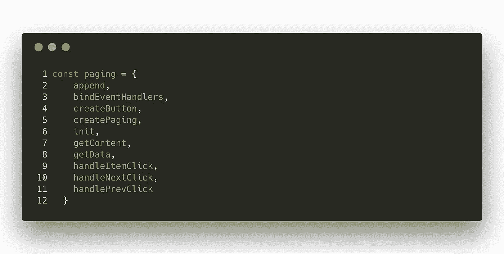

# 纯 JavaScript 的动态分页渲染🚀

> 原文：<https://javascript.plainenglish.io/dynamic-pagination-rendering-with-pure-javascript-b5fcbccd300d?source=collection_archive---------0----------------------->

我分享了我创建可排序动态数据表的经验。现在，我想分享另一个关于动态分页渲染的实验故事。


Credit: Unsplash [@markusspiske](https://unsplash.com/@markusspiske)

我必须在项目中构建一个分页模块。我检查了许多分页库，但是与产品团队的需求相比，这些分页库过于复杂。我决定自己构建它，使它更简单，更容易实现。事实上，这个小部件在每个月有超过 5000 万用户的生产环境中实现了许多不同的项目，它的工作非常棒🚀

让我列出我们从产品团队得到的需求:

*   我们有动态数量的元素
*   我们希望在每个小部件中动态显示它们。例如，当一个小部件在每页列出 10 个元素时，另一个小部件可以列出 15 个元素。
*   如果是在第一页或最后一页，应该禁用箭头导航按钮，如果用户点击活动页面，也不应该触发任何东西。
*   如果我们有超过 4 页后，关于规格计算如下所述，我们需要显示最新的一页，并显示一个三点按钮。以下是预览:


在分页的最后，它应该是这样的:


首先，让我们看看工作演示:

给这么多信息就够了。让我们把手弄脏:

首先，我的小组件应该有一个影响其呈现的状态。

```
const *pagingOptions* = {
  totalCount: 40,// **Total content count**
  itemPerPage : 5, // **How many items will be showed per page**
  initialPage: 1, **// Initial Page (We can set this parameter by detecting current page from query string)**
  get totalPage () { **// Calculating total page count**
     return Math.ceil(this.totalCount / this.itemPerPage) **// I'm using Math.ceil for ceiling** 
  },
  location: ".paging", **// It's the selector to render pagination component**
  url : "/api/contents/?id=5a5e47ec7152d929bc6d4280&p=" **// The url address which will be requested after each page changed.**
}
```

这是一个. net 框架 web 应用程序，这就是为什么我可以在 razor 内部初始化我的函数。

```
paging.init(*pagingOptions*);
```

我喜欢在编码时坚持单一责任原则，所以我想在深入细节之前列出我的功能:



也可以合并*手柄下一次点击*和*手柄前一次点击*功能，但正如我之前提到的，这只是一个概念验证。代码库内部可能有很多需要改进的地方。请不吝推荐更好的方法。

让我们深入细节。我使用 init 函数传递当前状态。这是每次页面改变时触发的函数，所以我在这个函数中请求内容部分


在我告诉你 createPaging 方法 **createButton 之前，我想提一个重要的方法。**该方法采用一些参数，并根据这些参数帮助我构建每个按钮:


最后，一个大的“脏”方法创建了分页。我说它脏，只是因为它有那么多条件。我检查了很多分页库，据我所知，几乎所有的分页库都有这种情况。我不想在这里显示全部代码，以免让你感到困惑，所以我为你的调试清楚地命名了变量。

感谢您花时间阅读到这一行。请随意分享您对代码库的想法。总有更好的改进方法。

木拉提