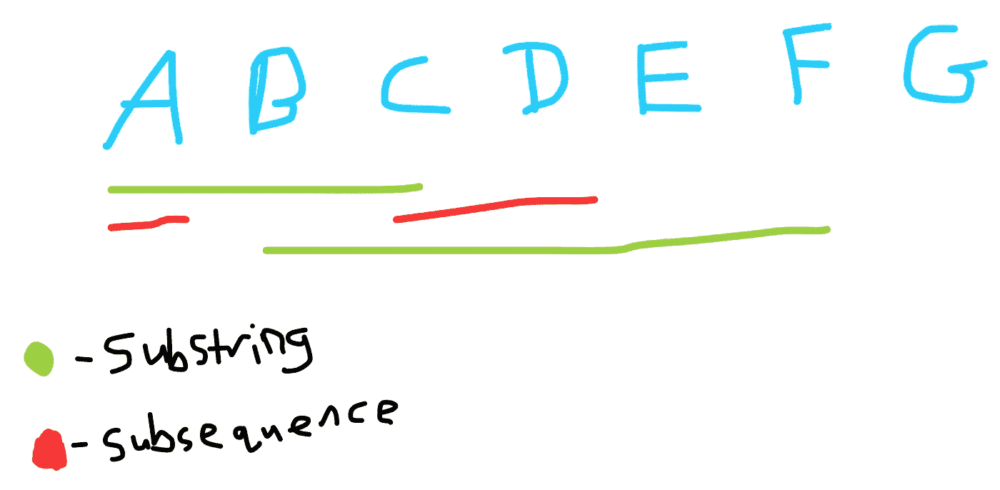
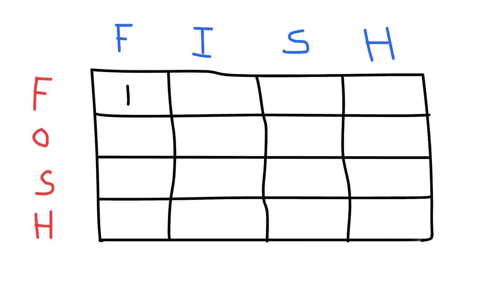
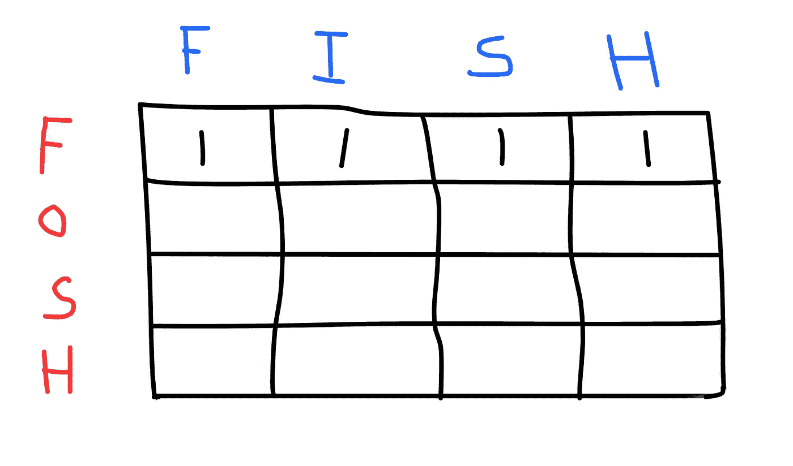
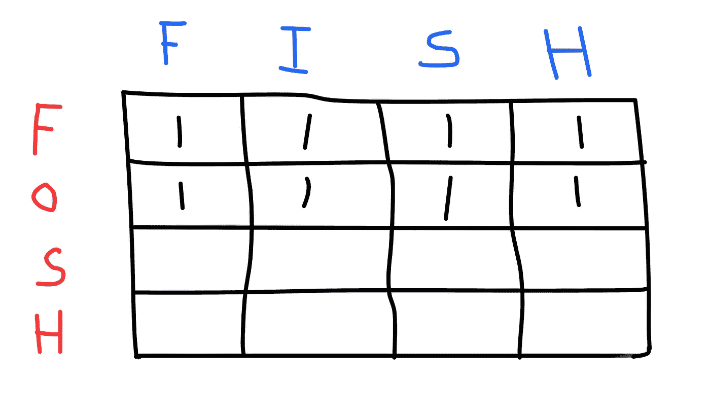
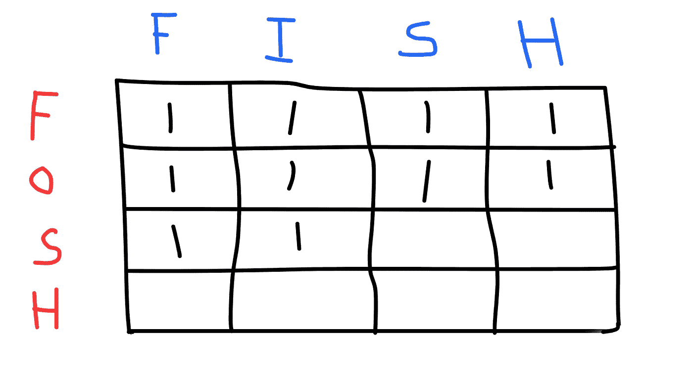
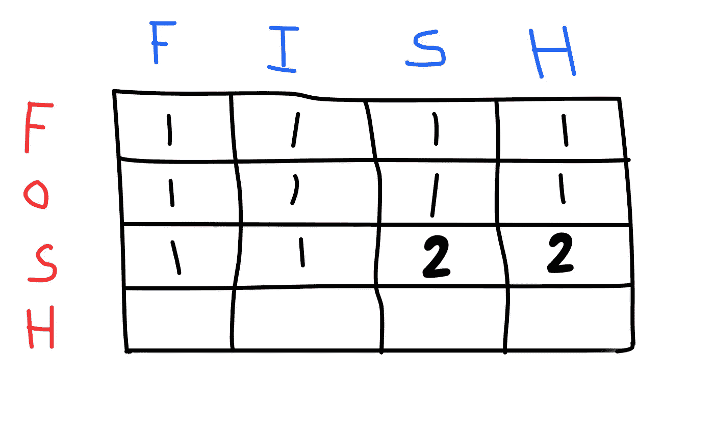
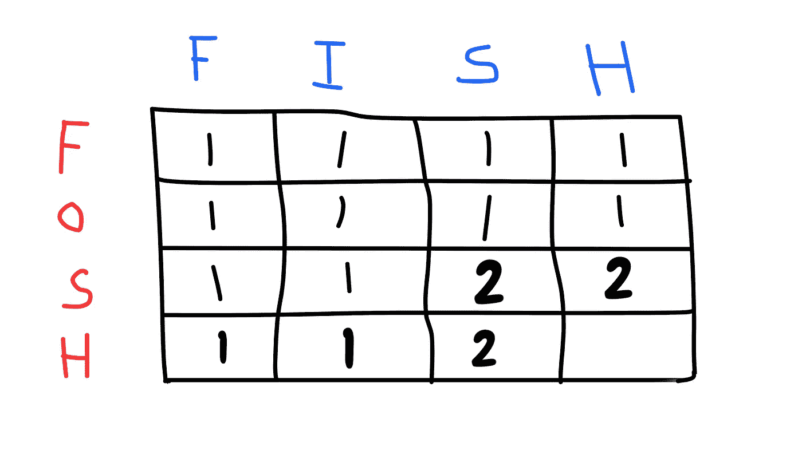
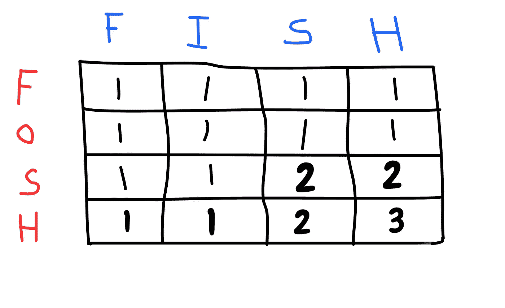
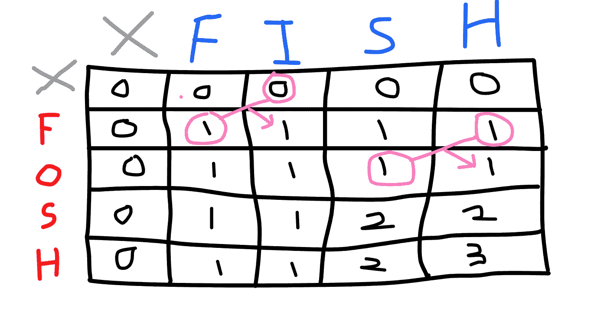
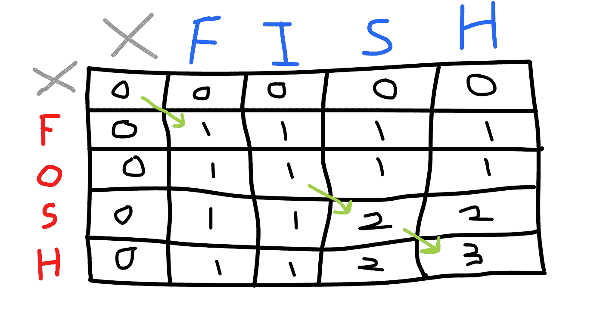

# 动态编程变得简单

> 原文：<https://javascript.plainenglish.io/dynamic-programming-made-simple-part-2-longest-common-subsequence-7059862431c5?source=collection_archive---------5----------------------->

在第 1 部分中，我们讨论了比较两个字符串时最长的公共子串是什么。概括地说，子串就是它所说的那样。给定一个字符串“ABCDEFG”，“ABC”被认为是子串吗？“BCDEF”怎么样？

“ABC”和“BCDEF”都是字符串“ABCDEFG”的子字符串，因为它们满足一个重要的属性:它们之间不能有**空格**。例如，“ACD”不是子字符串，因为您跳过了“B”。



Fig A. ‘ACD’ is a subsequence while ‘ABC’ is a substring.

那么，如果‘ACD’不是‘ABCDEFG’的子串，那么它是什么呢？嗯，准确的说法应该是一个**子序列**。子序列与子串的不同之处在于:

1.  可以有**间隔**(即‘ACD’是子序列，但不是子串，因为你跳过了字符‘B’)
2.  **顺序很重要**。在给定的字符串中，A - > B - > C - > … - > G。(即“BAD”不是子序列，因为它不满足顺序)

既然我们理解了子串和子序列之间的细微差别，我们可以继续了。

在动态编程中，有几个关键的注意事项:

1.  这个主要问题可以分解成几个子问题。每一个子问题都可以被解决，存储在某个地方，然后用于导出主问题的完整解决方案。
2.  它总是包含一个网格或表格(即数组的数组)。

我们来做一个简单的问题。给定字符串“鱼”和“FOSH”，找出最长的公共子序列。

直觉上，你可能已经得出答案是“FSH ”,但是你如何将这种直觉转化为计算机可以理解的代码呢？后退一步。你可能已经在脑子里把“鱼”的每个字符和“FOSH”的每个字符进行了比较，直到两个字符串中的所有字符都进行了比较。

您可能还存储了“鱼”和“FOSH”之间的常见字符列表，并随后计算了这两个字符串中常见字符的总数。

知道了这一点，让我们将直觉转化为代码。

首先，创建一个网格来存储我们的比较，并将所有内容初始化为零。在这里，我将空单元格的**隐含**为**零**。



Fig 1\. Create a table and compare each char from both strings.

在图 1 中，我们比较了“鱼”和“FOSH”中的第一个字符，即 f。由于该字符匹配，我们递增 1。



Fig 2\. Comparing the first character ‘F’ from ‘FOSH’ with ‘FISH’.

接下来，我们将“FOSH”中的第一个字符与“鱼”中的所有字符进行比较(即我们逐行比较)。你会注意到，即使“鱼”后面的字母——即“I”、“S”和“H”——与“FOSH”中的“F”不匹配，我们仍将其保留为 1(图 2)。

仔细想想，这是有道理的。问问自己‘F’和‘F’之间最长的公共字符串是什么，然后是‘F’和‘FI’，然后是‘F’和‘FIS’，最后是‘F’和‘鱼’？答案是 F，因此它的长度是 1。



Fig 3\. Comparing the second character in ‘FOSH’ with all the characters in ‘FISH’.

然后，我们将《FOSH》中的“O”与《鱼》中的所有角色进行了比较(图 3)。为什么我们在所有这些单元格中输入 1，即使‘O’与‘FISH’中的任何字符都不匹配？好吧，记住在动态编程中，我们使用之前比较的结果来进行当前的比较。

直观地说，在第二行，我们可以通过问自己“FO”和“F”之间最长的公共字符串是什么来逐步得到结果？“FO”和“FI”呢？“佛”和“FIS”怎么样？最后，“FO”和“FISH”？

答案是“FO”和“FISH”之间只有一个共同的字符，即“F”。请记住，当我们比较“F”和“FISH”时，我们使用了存储在前一行中的结果。



Fig 4\. Comparing ‘S’ in ‘FOSH’ with ‘FISH’

在这里，事情开始变得有趣。你会注意到“FOSH”中的“S”与“鱼”中的“S”相匹配，所以你加 1(图 5)。但是，在这里，您在先前已知的基础上增加 1。你知道，以前当你比较“FO”和“FISH”时，只有一个共同的字符是“F”。因此，在此基础上，当两个字符串之间存在另一个匹配时，您将加 1。(也就是说，现在“FOS”和“FISH”之间共有两个字符)。



Fig 5\. Comparing ‘S’ in and up to ‘FOS’ with ‘FISH’.



Fig 6\. Comparing ‘H’ in ‘FOSH’ with ‘FISH’.

在图 6 中，有两个要点需要注意。最后一行的前两个单元格(即“FOSH”中的“H”)是 1，而不是 2。举个例子，如果你比较“鱼”中的第一列“F”和“FOSH”中的所有字符，最长的公共字符串是“F”。如果你把《FOSH》中的所有人物进行比较，那么《鱼》中的第二列“我”也是如此。

在第三列中，当你比较“鱼”中的“S”和“FOSH”中的所有字符时，有两个字符在两个字符串中是共同的(即“F”和“S”)。您可以在代码中使用一个公式来检查以前的比较，并且每当两个字符串中有一个字符匹配时，计数就增加 1。该公式将在下面的代码中实现。



Fig 7\. Comparing ‘H’ in ‘FOSH’ with all the characters in ‘FISH’.

最后，在这里我们比较了最后一行“FOSH”中的“H”和“鱼”中的所有字符。最终答案在最后一个单元格**中，通常是**，但不总是如此。因此,“FOSH”和“鱼”之间的最长公共子序列是 3，这是有意义的，因为“FSH”是公共的，并且在两个字符串的序列中。

咻，这是一个很长的概念性概述。下面是 Javascript 代码。我敦促你在考虑解决方案之前先自己实施它。

```
const create2DMatrix = (A, B) => {
  const table = []; for (let i = 0; i <= A.length; i += 1) {
    table.push([]);
  } for (let j = 0; j <= A.length; j += 1) {
    for (let k = 0; k <= B.length; k += 1) {
       table[j].push(0);
    }
   }
  return table;
}// Basically creating an array of arrays. Given A = 'FISH' and B = 'FOSH':table = [   #  F  I  S  H
         # [0, 0, 0, 0, 0],
         F [0, 0, 0, 0, 0],
         O [0, 0, 0, 0, 0],
         S [0, 0, 0, 0, 0],
         H [0, 0, 0, 0, 0]
         ]
```

注意，我们创建了一个额外的行和列。这是**非常重要的**。如果不创建额外的行和列，您的代码将无法工作，尤其是 javascript。

接下来，让我们创建最长的公共子序列函数。

```
const longestCommonSubsequence = (A, B) => {
  const table = create2DMatrix(A, B);

  for (let i = 1; i < A.length+1; i += 1) {
    for (let j = 1; j < B.length+1; j += 1) {
      if (A[j-1] === B[i-1]) {
         table[i][j] = table[i-1][j-1] + 1;
      } else {
         table[i][j] = Math.max(table[i-1][j], table[i][j-1]);
      }
    }
  }
 return table;
}console.log(longestCommonSubsequence('FISH', FOSH'));// Output will be:table = [   #  F  I  S  H
         # [0, 0, 0, 0, 0],
         F [0, 1, 1, 1, 1],
         O [0, 1, 1, 1, 1],
         S [0, 1, 1, 2, 2],
         H [0, 1, 1, 2, 3]
         ]
```



Fig 8\. If the characters do not match, you compare the values from the cell above and the previous cell, take the maximum value and store it in the current cell.

从上面的代码中，您会注意到，如果字符不匹配，那么我们通过比较上面的单元格和前面的单元格来取最大值，而不是将其设置为零(图 8)。

注意:如果你想找到最长的公共子串，你必须检查是否有缺口。如果有差距，我们必须从零开始。相比之下，对于最长的公共子序列，我们不关心是否有缺口。这是有意义的，因为我们只希望两个字符串之间匹配的最大字符数达到该字符。



Fig 9\. If the characters do match, then you take the preceding diagonal and increment it by 1 and store it in the current cell.

在上图中，如果字符匹配，那么使用之前计算和存储的结果，并将其递增 1。如果我们不得不从头开始重新比较“FIS”和“福斯”,这就违背了拥有“表格”的目的。

# **总结**

总之，以下是我们在本文中讨论的要点:

1.  如果您可以将问题分解成子问题，或者如果您看到重复的计算，这可能意味着您可以使用动态编程。
2.  动态编程总是涉及到表格或网格。
3.  动态规划的最终答案通常在表格的最后一个单元格中找到，但并不总是如此。有一些边缘情况将在另一篇文章中讨论。
4.  时间复杂度是 O(N ),因为我们必须循环两次(即遍历字符串 1 中的所有字符和字符串 2 中的所有字符)。
5.  在这种情况下，空间复杂度是 O(N ),因为我们创建了和字符一样多的单个单元。
6.  总是在表中创建附加的行和列。

动态编程比较难，如果看完这篇文章没有完全理解，没关系。我也不得不努力，拼凑我能找到的所有文章和视频。

完全内化和理解 DP 的最好方法是在回到本文之前，先练习把它画出来并自己编码。阅读和重读对你没有帮助，因为它会欺骗你的大脑，让你以为你知道。

一旦你能轻松地向任何人——或者向一只橡皮鸭——解释，你就会知道你真正理解了。

## **简明英语笔记**

你知道我们有四种出版物吗？给他们一个关注来表达爱意:[**JavaScript in Plain English**](https://medium.com/javascript-in-plain-english)[**AI in Plain English**](https://medium.com/ai-in-plain-english)[**UX in Plain English**](https://medium.com/ux-in-plain-english)[**Python in Plain English**](https://medium.com/python-in-plain-english)**——谢谢，继续学习！**

**此外，我们总是有兴趣帮助推广好的内容。如果您有一篇文章想要提交给我们的任何出版物，请发送电子邮件至[**submissions @ plain English . io**](mailto:submissions@plainenglish.io)**，附上您的媒体用户名和您感兴趣的内容，我们将会回复您！****