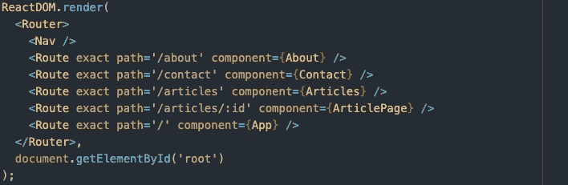
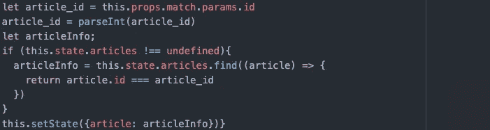

# 带 React 的动态路由

> 原文：<https://javascript.plainenglish.io/dynamic-routes-with-react-f9caa4c804f1?source=collection_archive---------9----------------------->

最近，我发现自己在构建需要一些全栈功能的大型网站。我需要为每个项目创建路线，而不是在单个路线中显示项目列表。

建立动态路由实际上非常简单。假设您已经启动了 react 应用程序并安装了路由器，这非常简单。假设我有一个装有文章的容器，容器中的每篇文章都有一个标题。我希望能够点击其中的一个标题，并进入该文章的页面。

像这样设置路由器。您会注意到，对于我们的 ArticlePage 组件，我们有一个路由，它的设置类似于/articles/:id ',其中 id 是我们单击的文章的 id。

在容器页面上，我们需要导入链接。

*从“react-router-dom”导入{ Link}*

我正在导入一堆显示的文章组件。这些并不显示所有的文章信息，只是足以引起兴趣，当组件的任何部分被点击时，它将重定向到该文章的页面。

*<Link to = { `/articles/$ { Article . id } ` } style = { { text decoration:' none '，color:" inherit " } }><Article = { Article } key = { Article . id }/></Link>*

请注意，添加一个样式属性纯粹是装饰性的，但对您的眼睛来说可能更容易。

通过用 Link 包装我的组件，我现在已经把整个组件变成了一个到它的文章页面的链接。

然后，在我的 ArticlePage 组件中，在 componentDidMount 函数中，在发出获取我的文章的 fetch 请求后，我使用 match prop 来查找我的文章，以便可以呈现它。如果你在这一步感到失落，要知道每条路线都有匹配道具，所以这是正常的。

关键线在这里:

*let article _ id = this . props . match . params . id*

从这里，您可以加载正确的组件，并拥有任意多的路径！