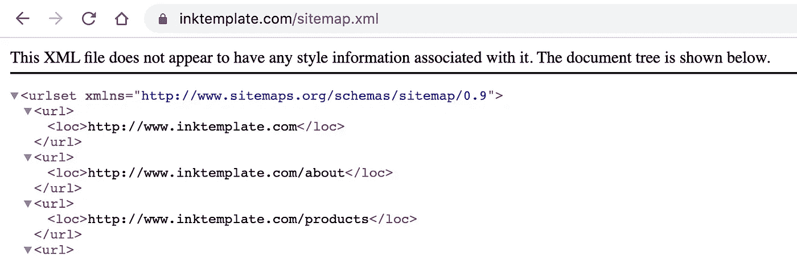
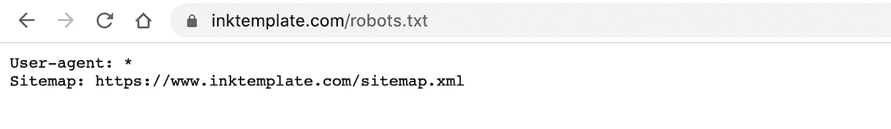
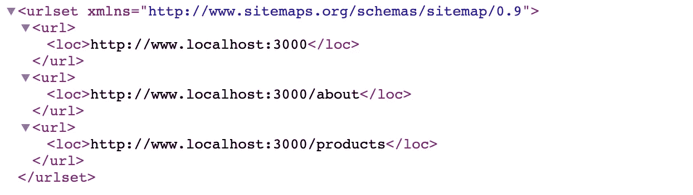
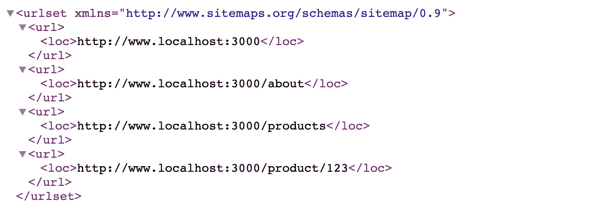
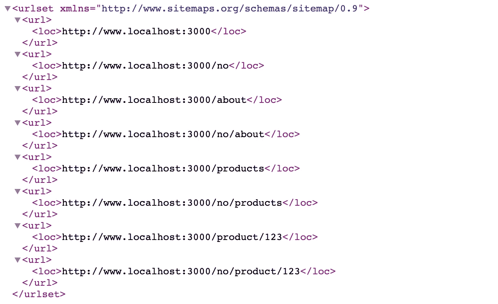

# Next.js 中的动态站点地图生成🗺

> 原文：<https://javascript.plainenglish.io/dynamic-sitemap-generation-in-next-js-7107ccdc6830?source=collection_archive---------1----------------------->

## 用 next.js 创建你自己的动态站点地图！

为了让你的网页被索引，让所有的网站都被谷歌发现，你也许应该提供一个指南针来帮助你——也被称为站点地图。网站地图是你的网页上所有你想让谷歌索引的路线的列表。让我们为你的 Next.js 应用做一个动态的站点地图，不需要任何插件或者库！

Photo by [Aron Visuals](https://unsplash.com/@aronvisuals?utm_source=medium&utm_medium=referral) on [Unsplash](https://unsplash.com?utm_source=medium&utm_medium=referral)

# 🗺什么是网站地图？

站点地图是一组被写成 XML 文件(`sitemap.xml`)的 URL。下图是我用 Next.js 编写的一个名为 [InkTemplate](http://www.inktemplate.com) 的页面中的一个站点地图的截图:

Example of **Sitemap.xml** from [InkTemplate](http://www.inktemplate.com)

最基本的站点地图只有一组链接(`<url>`)，但是除了位置(`<loc>`)，你还可以添加更多的信息，比如优先级(`<pri>`)、更改频率(`<changefreq>`)和最后修改日期(`<lastmod>`)。如果你想了解更多关于 sitemap XML 标准的内容，你可以在[文档](https://www.sitemaps.org/protocol.html)中找到更多。你可以指向 robots.txt 中的站点地图，这样爬虫和搜索引擎就可以找到它——通常，你可以在根位置(`yoursite.com/sitemap.xml`)找到`sitemap.xml`和`robots.txt`。

Example of robots.txt from [InkTemplate](http://www.inktemplate.com)

# 🗺用 next.js 创建你自己的站点地图

本质上，Next.js 有一个文件路由系统。如果你想把你的站点地图放在根目录(`yoursite.com/sitemap.xml`)，你可以简单地在`routes`文件夹中创建一个名为`sitemap.xml.jsx`的文件。让我们制作一个简单的站点地图，列出您的页面的所有路线:

Sitemap with routes — Image by Author

如果您有多个环境，`getInitialProps`将为您提供头文件，因此您可以获取`host`或其他您可能需要的相关信息。

## 💃动态路线

大多数页面都可能有一个动态的路径，就像不同的产品一样。假设您有一个名为`product/[id].jsx`的路线，为每个产品提供了它的地区路线。对于 id 为 **123** 的产品，URL 将是`yoursite.com/product/**123**`。您可能希望每个产品在 sitemap 中获得自己的 URL，因此您需要通过硬编码一个列表或从`getInitialProps`中的 API 获取一个列表来提供所有产品的列表。

Sitemap with dynamic routes — Image by Author

## 💬(i18n)语言路线

为了扩大你的读者群，用多种语言提供你的内容是明智的。为了让谷歌能够索引不同语言的所有页面，你应该在 slug 中有类似于`yoursite.com/<LANGUAGE>/product/123`的语言代码。对于所有产品和所有语言，将有一个独特的网址。如果你有英文(默认)和挪威语(否)的页面，你会有两个链接指向产品 123，如下:`yoursite.com/product/123`和`yoursite.com/**no**/product/123`。

Sitemap with language codes — Image by Author

# ⏩快速进带

好了，现在怎么办？你有一个网站地图，列出了你的网页的所有不同的路线。为了加快这个过程，你可以在谷歌搜索控制台告诉谷歌*“嗨，我有一张地图供你探索”*。在[谷歌搜索控制台](https://search.google.com/)你可以上传你的网站地图，谷歌会马上查看地图，开始索引你的页面。我还建议使用谷歌搜索控制台来跟踪关键词——它会让你知道人们在点击你的页面之前搜索了什么，并且可以让你跟踪你的搜索评级。

编码快乐！🎉

## **用简单英语写的 JavaScript**

喜欢这篇文章吗？如果是这样，通过 [**订阅获取更多类似内容解码，我们的 YouTube 频道**](https://www.youtube.com/channel/UCtipWUghju290NWcn8jhyAw) **！**