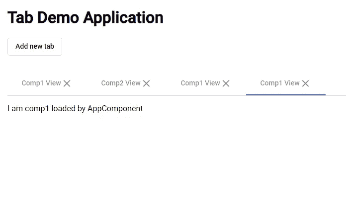

# 使用角度和角度材料的基于动态标签的应用

> 原文：<https://javascript.plainenglish.io/dynamic-tab-based-application-using-angular-material-9f9da7de5732?source=collection_archive---------0----------------------->


Photo by [Max Duzij](https://unsplash.com/@max_duz?utm_source=unsplash&utm_medium=referral&utm_content=creditCopyText) on [Unsplash](https://unsplash.com/s/photos/code?utm_source=unsplash&utm_medium=referral&utm_content=creditCopyText)

今天，我们将开发一个基于标签的应用程序，使用角和角材料。

**Angular Material** 是一个面向 Angular 开发者的 UI 组件库。Angular Material components 有助于构建有吸引力的、一致的和功能性的网页和 web 应用程序，同时遵守现代 web 设计原则，如浏览器便携性、设备独立性和优雅降级。它有助于创建更快、更漂亮、响应更快的网站。它的灵感来自谷歌的材料设计。

现在让我们从头开始构建应用程序。

# **使用角度命令生成一个基本的角度框架**

```
//Installs Angular CLI globally
**npm install -g @angular/cli**//Generates an angular "tab-demo-app" app 
**ng new tab-demo-app**//Directory changed to the new app generated
**cd tab-demo-app**//Installs Angular Material, the [Component Dev Kit (CDK)](https://material.angular.io/cdk/categories), [Angular Animations](https://angular.io/guide/animations) and will ask you some questions to determine which features to include.
**ng add @angular/material**
```

# **开发**

我们将从创建 TabService 开始，它将用于添加新选项卡、删除选项卡以及将选项卡数据传递给组件。

每当 tab 数组的长度发生变化时，这些信息就会通过 BehaviorSubject **tabSub 与组件共享。**主题 **tabSub** 将更改后的标签数组传递给订阅了该数组的组件。下面添加了相同的代码:

```
 **//tab.service.ts**import { Injectable } from "@angular/core";import { Tab } from "./tab.model";import { Comp1Component } from "./components/comp1.component";import { Comp2Component } from "./components/comp2.component";import { BehaviorSubject } from "rxjs"; @Injectable()export class TabService {public tabs: Tab[] = [new Tab(Comp1Component, "Comp1 View", { parent: "AppComponent" }),new Tab(Comp2Component, "Comp2 View", { parent: "AppComponent" })];public tabSub = new BehaviorSubject<Tab[]>(this.tabs);public removeTab(index: number) {this.tabs.splice(index, 1);if (this.tabs.length > 0) {this.tabs[this.tabs.length - 1].active = true;}this.tabSub.next(this.tabs);}public addTab(tab: Tab) {for (let i = 0; i < this.tabs.length; i++) {if (this.tabs[i].active === true) {this.tabs[i].active = false;}}tab.id = this.tabs.length + 1;tab.active = true;this.tabs.push(tab);this.tabSub.next(this.tabs);}}
```

接下来，让我们转移到 app.component.html。我在这里使用了有角度的材料标签。要使用材料选项卡元素，我们需要将 MatTabsModule 导入到 **AppModule。**在模板中，我们使用 **ngFor** 指令来迭代 tabs 数组，以生成多个选项卡。

selectedIndex(<mat-tab-group>的输入属性)属性被设置为 **selectedTab** 变量。设置了索引(selectedIndex 的值)的选项卡在浏览器中处于活动状态。</mat-tab-group>

**selectedTabChange** 是当活动选项卡改变时触发的事件。

```
 **//app.component.html**<div class="container-fluid"><h1>Tab Demo Application</h1><button mat-stroked-button (click)="addNewTab()">Add new tab</button><mat-tab-groupclass="main-tab-group mt-2"[selectedIndex]="selectedTab"(selectedTabChange)="tabChanged($event)"><mat-tab *ngFor="let tab of tabs; let tabIndex = index"><ng-template mat-tab-label>{{ tab.title }}<i class="material-icons" (click)="removeTab(tabIndex)">close</i></ng-template><div><app-tab-content [tab]="tab"></app-tab-content></div></mat-tab></mat-tab-group></div>
```

AppComponent 是为 TabService 中的选项卡订阅主题的组件。它有各种方法，像 **addTab()** ， **removeTab()** 这些方法进一步调用 TabService 方法来改变 tabs 数组。

```
 **  //app.component.ts**import { Component, OnInit } from "@angular/core";import { TabService } from "./tab.service";import { Tab } from "./tab.model";import { Comp1Component } from "./components/comp1.component";@Component({selector: "app-root",templateUrl: "./app.component.html",styleUrls: ["./app.component.css"]})export class AppComponent implements OnInit {tabs = new Array<Tab>();selectedTab: number;constructor(private tabService: TabService) {}ngOnInit() {this.tabService.tabSub.subscribe(tabs => {this.tabs = tabs;this.selectedTab = tabs.findIndex(tab => tab.active);});}tabChanged(event) {console.log("tab changed");}addNewTab() {this.tabService.addTab(new Tab(Comp1Component, "Comp1 View", { parent: "AppComponent" }));}removeTab(index: number): void {this.tabService.removeTab(index);}}
```

AppModule 是根模块，所有组件和指令都在其中声明。它进一步导入 MatTabsModule ,该模块向属于该 AppModule 的组件提供与标签相关的指令。

```
 **//app.module.ts**import { BrowserModule } from "@angular/platform-browser";import { NgModule } from "@angular/core";import { BrowserAnimationsModule } from "@angular/platform-browser/animations";import { MatTabsModule, MatButtonModule } from "@angular/material";import { AppComponent } from "./app.component";import { TabContentComponent } from "./tab-content.component";import { ContentContainerDirective } from "./content-container.directive";import { TabService } from "./tab.service";import { Comp1Component } from "./components/comp1.component";import { Comp2Component } from "./components/comp2.component";@NgModule({declarations: [AppComponent,TabContentComponent,ContentContainerDirective,Comp1Component,Comp2Component],imports: [BrowserModule,BrowserAnimationsModule,MatTabsModule,MatButtonModule],providers: [TabService],bootstrap: [AppComponent],entryComponents: [Comp1Component, Comp2Component]})export class AppModule {}
```

下面的组件模板提供了动态加载视图的容器。在这里，**ContentContainerDirective**注入`[ViewContainerRef](https://angular.io/api/core/ViewContainerRef)`来访问元素的视图容器，该元素将托管动态添加的组件。ng 模板是我们添加指令的地方

进一步基于传递给输入对象**标签**的组件，使用**组件工厂解析器**来解析组件工厂。然后用**组件工厂**创建被传递组件的实例。

使用 ViewContainerRef 引用，我们通过使用 **createComponent()** 方法创建组件视图，并将 **ComponentFactory** 传递给它**。**

**createComponent()** 方法返回一个对已加载组件的引用。然后，我们可以通过分配给组件的属性或调用其方法来使用该引用与组件进行交互。

```
 ** //tab-content.component.ts**import {Component,Input,ComponentFactoryResolver,ViewChild,OnInit} from "@angular/core";import { ContentContainerDirective } from "./content-container.directive";import { SkeletonComponent } from "./skeleton.component";import { Tab } from "./tab.model";@Component({selector: "app-tab-content",template: "<ng-template content-container></ng-template>"})export class TabContentComponent implements OnInit {@Input() tab;@ViewChild(ContentContainerDirective, { static: true })contentContainer: ContentContainerDirective;constructor(private componentFactoryResolver: ComponentFactoryResolver) {}ngOnInit() {const tab: Tab = this.tab;
const componentFactory = this.componentFactoryResolver.resolveComponentFactory(tab.component;const viewContainerRef = this.contentContainer.viewContainerRef;const componentRef = viewContainerRef.createComponent(componentFactory);(componentRef.instance as SkeletonComponent).data = tab.tabData;}}
```

**ContentContainerDirective**是锚指令，它定义了我们可以注入组件视图的点。

```
 **//content-container.directive.ts**import { Directive, ViewContainerRef } from '@angular/core';@Directive({selector: "[content-container]"})export class ContentContainerDirective {constructor(public viewContainerRef: ViewContainerRef) { }}
```

**Comp1Component** 和 **Comp2Component** 是将被动态创建的两个组件，是 AppModule 中 **entryComponents** 数组的一部分。

```
 **//comp1.component.ts**import { Component, Input } from "@angular/core";@Component({template: "<div> <p>I am comp1 loaded by {{data.parent}}<p></div>"})export class Comp1Component {@Input() data;} **//comp2.component.ts**import { Component, Input } from "@angular/core";@Component({template: "<div> <p>I am comp2 loaded by {{data.parent}}<p></div>"})export class Comp2Component {@Input() data;}
```

这是保存选项卡数据的选项卡模型类。

```
 **//tab.model.ts**import { Type } from '@angular/core';export class Tab {public id: number;public title: string;public tabData: any;public active: boolean;public component: Type<any>;constructor(component: Type<any>, title: string, tabData: any) {this.tabData = tabData;this.component = component;this.title = title;}}
```



Application Demo in Browser

您可以在下面提到的回购链接中找到相同的完整代码:

[](https://github.com/Deepak2985/dynamic-tab-angular) [## Deepak 2985/动态标签-角度

### 此项目是使用 Angular CLI 版本 8.3.18 生成的。为开发服务器运行 ng serve。导航到…

github.com](https://github.com/Deepak2985/dynamic-tab-angular) 

**参考文献:**

 [## 有角的

### Angular 是一个构建移动和桌面 web 应用程序的平台。加入数百万开发者的社区…

angular.io](https://angular.io/guide/dynamic-component-loader) [](https://material.angular.io/components/tabs/overview) [## 角状材料

### 用于移动和桌面 Angular web 应用程序的 UI 组件基础结构和材料设计组件。

材料.角度. io](https://material.angular.io/components/tabs/overview) 

这是我目前所有的。感谢您的阅读。… :)