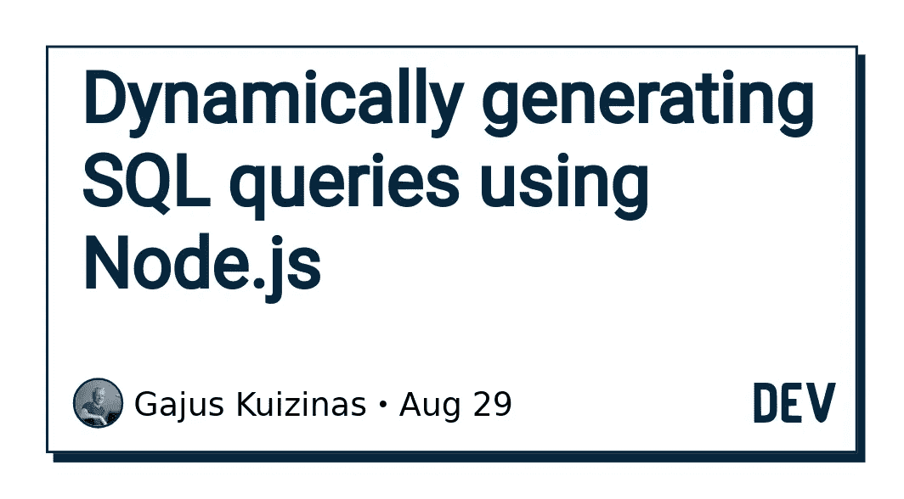

# 使用 Node.js 动态生成 SQL 查询

> 原文：<https://javascript.plainenglish.io/dynamically-generating-sql-queries-using-node-js-e89d69930fcb?source=collection_archive---------1----------------------->

自从我发布了[SLO Nik](https://github.com/gajus/slonik)(node . js 的 PostgreSQL 客户端)并写了一篇有争议的[停止使用 Knex.js](https://medium.com/@gajus/stop-using-knex-js-and-earn-30-bf410349856c) 文章(TL；dr；查询生成器被设计成 ORM 的构造块；当查询的大部分是静态的时，它们不会增加价值。)，我被问了很多—那么我如何生成动态查询呢？我将通过分享几个现实生活中的例子来回答这个问题。

本文中的所有查询都是真实业务中使用的真实查询，[赞成](http://applaudience.com/)严重依赖 PostgreSQL 。

免责声明:(1)所有例子只讨论 SQL 注入威胁。授权逻辑(例如，用户有权访问的白名单列)不在本文的讨论范围之内。(2)所有语句都假设 Slonik 实现中没有 bug。



This article can be also read (with better syntax highlighting) on [dev.to](https://dev.to/gajus/dynamically-generating-sql-queries-using-node-js-2c1g).

# 具有动态值绑定的静态查询

如果您的查询逻辑没有根据用户的输入而改变，那么只需使用`[sql](https://github.com/gajus/slonik#slonik-value-placeholders-tagged-template-literals)` [标记的模板文字](https://github.com/gajus/slonik#slonik-value-placeholders-tagged-template-literals)构造 SQL 查询，例如

```
sql`
  SELECT c1.country_id
  FROM cinema_movie_name cmn1
  INNER JOIN cinema c1 ON c1.id = cmn1.cinema_id
  WHERE cmn1.id = ${cinemaMovieNameId}
`;
```

如果您使用 Slonik，将值作为模板文字占位符传递是安全的。`sql`将解释所有占位符标记并构造最终的 SQL 查询。在这种情况下，查询的唯一动态部分是值绑定本身，因此最终查询是:

```
SELECT c1.country_id
FROM cinema_movie_name cmn1
INNER JOIN cinema c1 ON c1.id = cmn1.cinema_id
WHERE cmn1.id = $1
```

查询和绑定值将被分别发送到 PostgreSQL:没有 SQL 注入的风险。

# 绑定值列表

当您的查询输入是一个值列表时(例如，当检索匹配多个标识符的行时)，那么您*可以*使用`sql.valueList`，例如

```
sql`
  SELECT m1.*
  FROM movie m1
  WHERE m1.id IN (${sql.valueList(movieIds)})
`;
```

这将生成一个带有动态值绑定集的查询，即如果`movieIds`是`[1, 2, 3]`，发送到 PostgreSQL 的查询将是:

```
SELECT m1.*
FROM movie m1
WHERE m1.id IN ($1, $2, $3)
```

然而，尽管这是一种常见的模式，我不建议使用这种模式。相反，使用`sql.array`，例如

```
sql`
  SELECT m1.*
  FROM movie m1
  WHERE m1.id = ANY(${sql.array(movieIds, 'int4')})
`;
```

这将生成固定长度的查询，该查询不会基于其输入而改变，即

```
SELECT m1.*
FROM movie m1
WHERE m1.id = ANY($1::"int4"[])
```

继续阅读`[sql.array](https://github.com/gajus/slonik#sqlarray-vs-sqlvaluelist)` [vs](https://github.com/gajus/slonik#sqlarray-vs-sqlvaluelist) `[sql.valueList](https://github.com/gajus/slonik#sqlarray-vs-sqlvaluelist)`。

# 使用动态列的查询

如果您的查询结果引用了依赖于用户输入的列，那么使用`[sql.identifier](https://github.com/gajus/slonik#slonik-query-building-sql-identifier)`来生成标识这些列的 SQL，例如

(注意:不是业务中使用的实际查询。见下一段。)

```
sql`
  SELECT m1.id, ${sql.identifier(['m1', movieTableColumnName])}
  FROM movie m1
  WHERE
    m1.id = ${moveId}
`;
```

该查询将生成一个查询，该查询将恰好选择 1 个动态标识的列。不存在 SQL 注入的风险，也就是说，即使导致生成`movieTableColumnName`的逻辑受到某种损害，最糟糕的情况是查询攻击者将能够返回`m1`别名下的任何列，或者使用无效的列标识符值执行查询(这两种情况都有风险；业务逻辑不在本文讨论范围之内)。

只是因为你能做到这一点，你可能不应该这样做。当您的应用程序需要根据用户的查询返回不同的列时，最好选择业务逻辑范围内的所有列，并选择所需列的值，即如果后一个查询的目的是基于`movieTableColumnName`返回不同的电影标识符，那么最好编写一个静态查询:

```
sql`
  SELECT
    m1.id,
    m1.foreign_comscore_id,
    m1.foreign_imdb_id,
    m1.foreign_metacritic_id
    m1.foreign_rottentomatoes_id,
    m1.foreign_tmdb_id,
    m1.foreign_webedia_id
  FROM movie m1
  WHERE
    m1.id = ${moveId}
`;
```

后者在每次查询时都会返回一些多余的数据，但是它有几个优点:

1.  它降低了 SQL 注入的风险(不管您多么信任代码生成逻辑，静态代码总是比动态代码更安全)。
2.  它只生成一个条目`pg_stat_statements`。随着应用程序的扩展，您将学会在`pg_stat_statements`中尽可能少地使用查询。

# 具有多个动态列的查询

同上，不过`[sql.identifierList](https://github.com/gajus/slonik#slonik-query-building-sql-identifierlist)`。

# 嵌套动态 SQL 查询

`sql`标记的模板文字可以嵌套，例如

(注:业务中使用的实际查询的简化版本。)

```
const futureEventEventChangeSqlToken = sql`
  SELECT
    ec1.event_id,
    ec1.seat_count,
    ec1.seat_sold_count
  FROM event_change_future_event_view ec1
`;sql`
  SELECT
    event_id,
    seat_count,
    seat_sold_count
  FROM (
    ${futureEventEventChangeSqlToken}
  ) AS haystack
  WHERE ${paginatedWhereSqlToken}
  ORDER BY ${orderSqlToken}
  LIMIT ${limitSqlToken}
`
```

这允许在您的程序中以一等公民的身份传递预先绑定的 SQL 查询。当目的是隔离 SQL 生成逻辑以进行测试时，或者当大型 SQL 片段在查询之间共享时，或者当目的是简单地减少代码复杂性集中在一个地方时，这是很方便的。

# 注入动态 SQL 片段

`sql.raw`用于注入动态 SQL 片段，即

```
sql`
  SELECT ${sql.raw('foo bar baz')}
`
```

转换为(无效)查询:

```
SELECT foo bar baz
```

与前面使用`sql`标记模板的例子不同，`sql.raw`是不安全的——它允许使用用户输入创建动态 SQL。

没有已知的使用`sql.raw`生成查询的用例未被嵌套绑定`sql`表达式(在“嵌套动态 SQL 查询”中描述)或其他现有的[查询构建方法](https://github.com/gajus/slonik#slonik-query-building)覆盖。`sql.raw`作为一种机制存在，用于执行外部存储的*静态*(例如存储在文件中的查询)。

# 使用动态比较谓词成员或运算符进行查询

如果查询中出现的比较谓词的操作符是动态的，那么使用`[sql.comparisonPredicate](https://github.com/gajus/slonik#slonik-query-building-sql-comparisonpredicate)`，例如

(注意:不是业务中使用的实际查询。)

```
sql`
  SELECT
    c1.id,
    c1.nid,
    c1.name
  FROM cinema c1
  WHERE
    ${sql.comparisonPredicate(
      sql`c1.name`,
      nameComparisonOperator,
      nameComparisonValue
    )}
`;
```

`nameComparisonOperator`可以是`=`、`>`、`<`等值。假设`nameComparisonOperator`是“=”，那么结果查询将是:

```
SELECT
  c1.id,
  c1.nid,
  c1.name
FROM cinema c1
WHERE
  c1.name = $1
```

后者是极其罕见的用例，几乎完全用于构建更高级别的 SQL 抽象工具(比如 ORM)。这可能对“高级搜索”场景有用，但请继续阅读以熟悉替代模式(见`sql.booleanExpression`)。

# 具有动态 WHERE 子句成员的查询

如果`WHERE`子句成员的存在是动态的，那么使用`[sql.booleanExpression](https://github.com/gajus/slonik#sqlbooleanexpression)`。

```
const findCinemas = (root, parameters, context) => {
  const booleanExpressions = [
    sql`TRUE`,
  ]; if (parameters.input.query) {
    const query = parameters.input.query; if (query.countryId !== undefined) {
      booleanExpressions.push(
        sql`c2.id = ${query.countryId}`
      );
    } if (query.nid !== undefined) {
      booleanExpressions.push(
        sql`c1.nid % ${query.nid}`
      );
    } if (query.name !== undefined) {
      booleanExpressions.push(
        sql`c1.name % ${query.name}`
      );
    }
  } const whereSqlToken = sql.booleanExpression(
    booleanExpressions,
    'AND'
  ); return context.pool.any(sql`
    SELECT
      c1.id,
      c1.nid,
      c1.name,
      c2.code_alpha_2 country_code,
      c2.name country_name
    FROM cinema c1
    INNER JOIN country c2 ON c2.id = c1.country_id
    WHERE ${whereSqlToken}
  `);
},
```

`findCinemas`是一个 GraphQL 解析器的实现。查询的 WHERE 子句使用 3 个可能的布尔表达式的组合来构造。与 Slonik 中所有其他查询构建方法一样，所有表达式都可以嵌套:您可以将其他布尔表达式作为布尔表达式的成员，甚至可以使用`sql`标记的模板文字构建 SQL 表达式。

# 摘要

这些例子涵盖了每一个常见的动态 SQL 构建场景，并提供了足够的 Slonik 如何工作的知识，使读者能够继续熟悉 Slonik 提供的[其他查询构建方法。本文的主要目的是展示 Slonik 为构造 SQL 查询提供了一种安全的抽象，保持了查询的静态部分不变。](https://github.com/gajus/slonik#slonik-query-building)

最后，如果我错过了您希望我涵盖的用例场景，请在评论中提及，我会很乐意包括它。