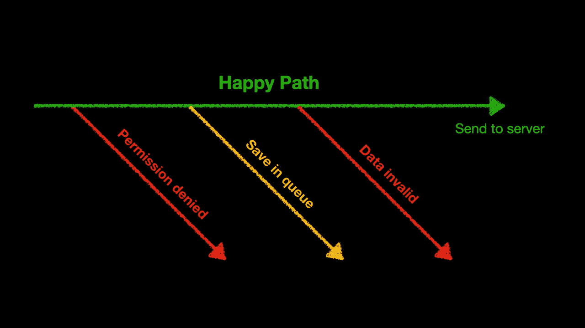

# JavaScript 中的早期返回/保护子句(和 React)

> 原文：<https://javascript.plainenglish.io/early-return-with-react-hooks-f96fa4a33124?source=collection_archive---------6----------------------->

## 什么是提前返回/保护子句，为什么应该使用它们，以及如何在 React 中使用的示例

# 议程

在本文中，我们将浏览以下部分:

*   提前回报的基本概念
*   使用提前退货的原因
*   将提前返回与 React 一起使用
*   使用带挂钩的提前返回

现在，让我们开始吧。

# 什么是提前归还？

早期返回是一种模式，它建议我们通过检查前提条件来避免嵌套的`if-else`语句，并尽可能早地返回或抛出。通常情况下，提前归还也被称为警卫条款或保镖模式。

这种模式的一个基本的虚构例子是转动下面的代码

…变成这样:

> 我想提一下，Swift(苹果发布的一种面向 iOS/MacOS 开发的现代语言)甚至把 guard 作为内置语言特性！

# 使用提前退货的原因

## 1.它使我们的代码可读和可理解

简单看一下上面的例子，早期返回版本在视觉上是扁平的，比深度嵌套版本更容易阅读和理解。

## 2.当处理复杂的情况时，它卸下了我们头脑中的负担

想象一下(或者回忆一下)在函数中有很多嵌套的`if-else`分支的情况，我们在编写逻辑时会有多经常迷路？

相比之下，如果我们能够尽早摆脱无效和特殊情况，我们将能够安心地专注于功能的“真实”主体。

# 我们如何在 React 中使用早期返回？

在 React 中，`Component`是组成我们的 UI 构建块的边界，在这个级别中很容易应用早期返回。例如，我们可以在数据加载时返回一个`Spinner`，在出现错误时返回一个`Alert`，在数据为空时返回一些消息，在数据准备就绪时返回“真正的”表示元素。

# 胡克呢？

上面代码中的`MyComponent`是一个表示性组件，我们可以将`useData`钩子*(想象一下我们在代码库中的某个地方有这个定制钩子)*放在它里面，让组件自己加载数据:

然而，有一件非常重要且令人沮丧的事情需要注意——如果我们打算在某些情况下在`return`语句后调用一个钩子，我们就不能提前返回。原因是 [React 要求我们每次组件渲染](https://reactjs.org/docs/hooks-rules.html)的时候都要按照相同的顺序调用钩子。

也就是说，下面的代码是**无效**，React 会为你记录错误和警告，因为`useData2`钩子和`React.useMemo`钩子并不总是被调用——调用钩子的顺序是变化的。

> 您可能会收到错误和警告，例如:“React 检测到 XXX 调用的钩子顺序发生了变化”和“渲染的钩子比之前渲染的多”

一个直接的解决方案是将空检查移到钩子内部:

显然，到处都是空检查真的很烦人，当我们有许多数据要加载，而它们又相互依赖，其中一些需要被有条件地调用时，情况会变得更糟*(当我使用来自多个来源的数据并聚集它们来构建报告时，我确实遇到过这种情况)*。

解决这个问题的一个可维护的方法是使用我们的老朋友——`render props`。

也就是说，我们可以分别编写加载`data1`和`data2`的组件。当数据未准备好时，这些组件不呈现任何内容，当数据准备好时，它们调用`children`函数来呈现实际的 dom。我把这些组件称为`DataGuard`

一旦我们有了这些`DataGuard`，我们就能像这样组合它们:

通过这样做，我们不再需要担心到处传播和复制空检查，这些`DataGuard`组件是高度可重用和可组合的——它们只是为它们的子组件提供数据，与 DOM emit 无关，因此它们可以在任何需要数据的地方使用，而不管数据应该如何呈现。

一个有趣的观察是，当使用`DataGuard`组件时，我们开始看到嵌套组件的金字塔。我认为这很好，因为在树中嵌套组件正是 React 的工作方式——如果我们问自己:我们如何使用组件？答案可能简单地变成“我们把它放在另一个组件里面”。一直到根组件都是如此——在`ReactDOM.render`函数中传递的那个。

感谢阅读:)

## **简明英语笔记**

你知道我们推出了一个 YouTube 频道吗？我们制作的每个视频都旨在教给你一些新的东西。点击此处 查看我们，并确保订阅该频道😎