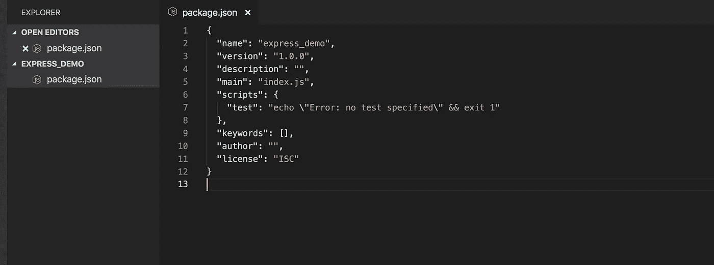
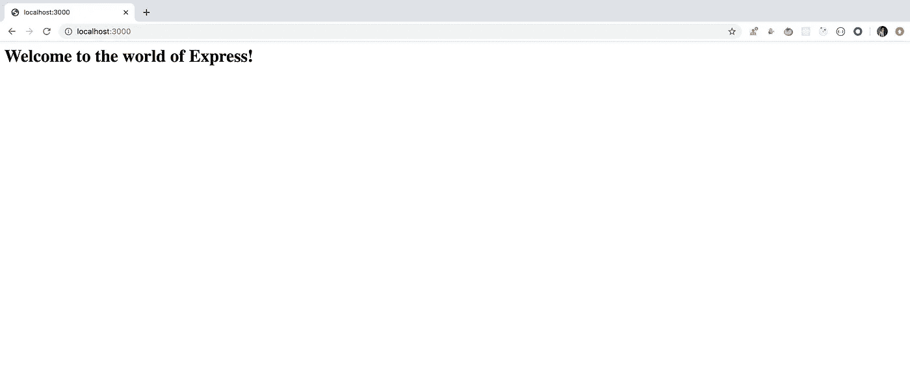
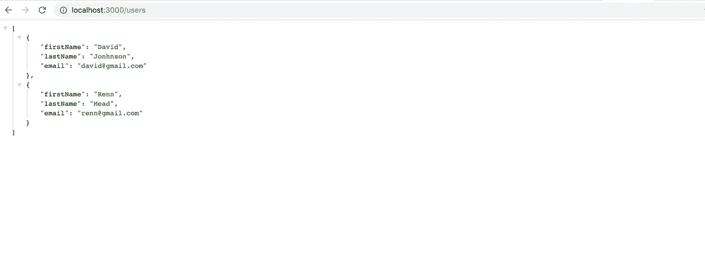
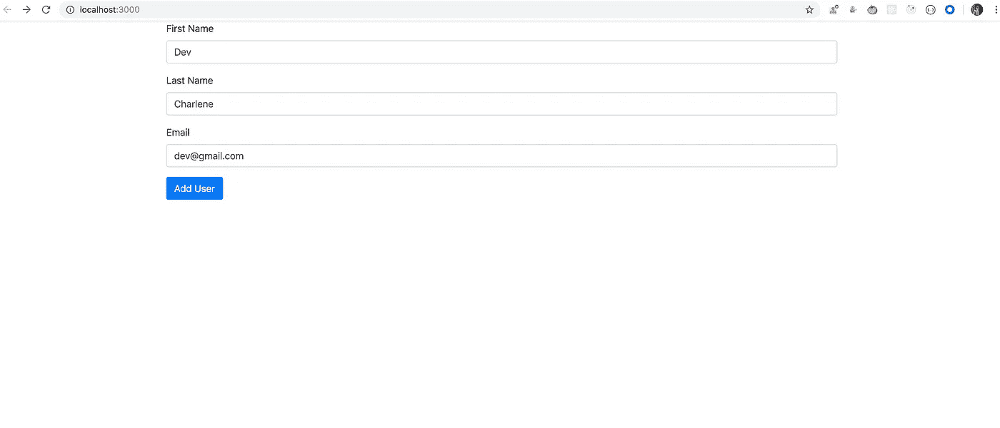

# 使用 Express 在 Node.js 中轻松创建 REST APIs

> 原文：<https://javascript.plainenglish.io/easily-create-rest-apis-in-nodejs-using-express-d9a0484b3d59?source=collection_archive---------5----------------------->

## Express 让创建 REST APIs 变得超级简单！


Photo by [Safar Safarov](https://unsplash.com/@codestorm?utm_source=medium&utm_medium=referral) on [Unsplash](https://unsplash.com?utm_source=medium&utm_medium=referral)

随着`Nodejs`的崛起，一切都变了。为浏览器编写 JavaScript 的前端开发人员现在能够运行服务器端代码和前端代码，而无需学习完全不同的语言。

所以使用 Nodejs 我们可以
1。访问文件系统 API 以读取、删除或修改文件
2。使用任何数据库，如`mysql`、`PostgreSQL`、`MongoDB`等
3。创建一个监听和服务传入请求的服务器
4。创建动态网页。创建 Rest API
6。这样的例子不胜枚举…

在本文中，我们将探索 express 如何使在 Nodejs 中创建 REST APIs 变得容易。

让我们深入研究一下。

Express 是最流行的 Nodejs 框架，它允许我们。创建服务器
2。创建 API
3。添加路由
4。提供静态文件

**安装:**

开始使用`express`最简单的方法是使用 npm 安装它

```
npm install express
```

让我们从创建一个新项目开始。

1.为名为`express_demo`的项目创建一个新目录。(你想怎么叫都行)
2。打开终端/命令提示符并导航至`express_demo`目录。
3。运行以下命令

```
npm init -y
```

这将创建一个类似这样的`package.json`文件



4.现在从终端执行以下命令

```
npm install express --save
```

通过将**保存**选项传递给 *npm 安装*命令，`Express`将被添加到`*package.json*` *的*依赖关系*部分。*

5.安装`nodemon`(这是可选的)

`Nodemon`不一定要运行应用程序，但是使用这个工具，我们可以检测代码中的变化，并在代码变化时自动重启服务器。

因此，通过运行以下命令来安装它

```
npm install nodemon --save-dev
```

这将把`nodemon`添加到`package.json` *的`devDependencies` 部分。* It 表示只需要开发，实际应用不需要运行在生产上。

6.现在创建一个名为`index.js`的新文件，并在其中添加以下代码。

让我们探索一下这里发生了什么。

1.在**第 1 节**中，我们正在导入`express`包，并使用`express`函数创建一个新的`Express`应用

2.在第 3 节的**中，我们启动了一个新的服务器，它将监听端口`3000`上的传入请求**

3.在**第 2 节**中，我们使用响应对象的 send 方法在访问应用程序时发回响应。

现在运行应用程序，将`package.json`的`scripts` 部分更改为如下所示:

现在从终端执行以下命令

```
npm run start
```

瞧，我们现在已经创建了一个服务器来监听我们的请求。

打开浏览器并导航至 [http://localhost:3000/](http://localhost:3000/)

您将看到如下所示的输出



Welcome Screen

现在，让我们开始实际创建 REST APIs。

我们使用了 HTTP GET 方法来获得上面的响应

```
app.get('/', (req, res) => { 
 res.send("<h1>Welcome to the world of Express!</h1>");
});
```

从上面可以看出，回调函数有两个参数。`request`和`response`对象。

*req* 是表示传入请求信息的对象，而 *res* 是提供将数据发送回用户的方法的对象。

express 还支持其他方法，有， **POST()** ， **PUT()** ， **DELETE()** ， **PATCH()** 等。

我们已经看到，如何通过传递给 send 方法来发送上面的 HTML 响应。

但是 send()也允许发送 JSON 响应，在响应中发送文件等。

**发送 JSON 响应:**

假设，我们有一个用户列表

当我们使用如下所示的 **/users** 路由发出 GET 请求时，我们可以发送这些数据作为响应。

```
app.get('/users', (req, res) => {
 res.send(users);
});
```

如果我们在代码中添加上述路由，并且当我们访问[http://localhost:3000/users](http://localhost:3000/users)时，我们会得到一个 JSON 响应形式的用户列表，如下所示



现在，假设我们想发出一个 POST 请求，向用户的数组中添加一个新用户。为此，我们需要创建一个 HTML 文件，允许在用户提交表单时发送用户详细信息。

为此，用下面的代码创建一个名为`public`的新目录，并在其中创建一个文件`index.html`

index.html inside public directory

要加载这个页面，当我们访问 [http://localhost:3000/](http://localhost:3000/)

您将看到一个添加新用户的表单



我们需要在`index.js`文件中做一些修改，以便从表单中获取数据。

我们需要安装一个名为 **body-parser** 的包

```
npm install body-parser
```

现在将下面一行添加到应用程序中。

```
app.use(express.static('public'));
```

现在我们可以从*公共目录加载 HTML 文件。在我们的例子中，index.html*通过访问 [http://localhost:3000/](http://localhost:3000/)

在`index.js`添加`body-parser`包

```
const bodyParser = require(‘body-parser’); ...app.use(bodyParser.urlencoded({ extended: true }));
```

`body-parser’s` `urlencoded`方法允许我们使用`application/x-www-form-urlencoded.`来处理表单提交发送的数据

现在，在文件中添加投递路线

现在，当我们提交表单时，这个 post 路由将被调用，从表单提交发送的数据将进入我们添加到`users`数组的`req.body`对象。因此，一旦提交表单，您将看到新用户被添加到了`users`列表中


因此最终的代码将如下所示

我们还可以在对 res.send 的调用中发送文件

**发送文件响应:**

为此，在`public`目录中添加一个名为`help.html`的新文件，其内容如下

所以，现在当你访问[http://localhost:3000/help . html，](http://localhost:3000/help.html,)你就能看到 help.html 的内容

完整源代码:【https://github.com/myogeshchavan97/express_demo 

本文到此为止。我希望它能帮助你开始使用 REST APIs。

**别忘了直接在你的收件箱** [**这里**](https://yogeshchavan.dev) **订阅我的每周时事通讯，里面有惊人的技巧、诀窍和文章。**