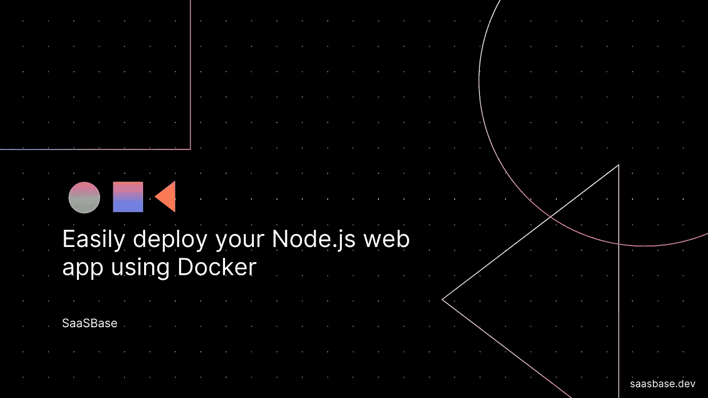

# 使用 Docker 轻松部署 Node.js web 应用程序

> 原文：<https://javascript.plainenglish.io/easily-deploy-your-node-js-web-app-using-docker-481959138d15?source=collection_archive---------8----------------------->

## 码头工人

## 将您的应用程序容器化，使开发更容易



应用程序依赖性很难跟踪。

Docker 解决了这个问题，它让我们将一个应用程序及其所有依赖项打包到一个映像中。然后，可以将该映像作为容器部署到一台新机器上，该机器具有完全配置好的环境。

在本教程中，我们将构建一个简单的`Hello World` Node.js web 应用程序。然后，我们将添加一个 docker 文件，让我们定义如何安装以及安装哪些依赖项才能使应用程序正常工作的说明。使用这个文件，我们将构建一个新的 Docker 映像，并将其作为一个容器部署在本地机器上。

# 先决条件

1.  [Node.js](https://nodejs.org/en/download/)
2.  码头工人

# 创建简单的 Node.js 应用程序

创建项目所在的目录。命名为`simple-nodejs-docker`。

创建一个名为`package.json`的新文件。该文件将包含对项目和所需依赖项的描述。

```
{
   "name": "simple-nodejs-docker",
   "version": "1.0.0",
   "main": "app.js",
   "dependencies": {
     "express": "^4.16.3"
   },
   "scripts": {
     "start": "node app.js"
   }
 }
```

创建一个新文件，`app.js`。使用 Express，我们将提供一个简单/端点，它将使用`Hello Docker's World!`进行响应。

```
const express = require("express");
const app = express();

app.get("/", (req, res) => res.send("Hello Docker's World!"));
	app.listen(3000, () => {
	console.log("Node.js app listening on port 3000!");
});
```

# 运行 web 应用程序

通过运行以下命令来安装依赖项，

```
npm install
```

启动应用程序。

该应用程序应在 [http://localhost:3000/](http://localhost:3000/) 上运行

不错！让我们继续前进。

# 将 web 应用程序归档

创建一个新文件，`Dockerfile`

```
FROM node:9-slim
WORKDIR /app
COPY package*.json ./
RUN npm install
COPY . .
CMD ["npm", "start"]
```

*   `FROM node:9-slim`:从 [DockerHub](https://hub.docker.com/_/node/) 中提取包含运行 Node.js 的最小包的基础映像。
*   `WORKDIR /app`:设置项目的工作目录。
*   `COPY package*.json /app`:将 package.json 和 package-lock.json 都复制到 app 目录下。注意，我们在不同的步骤中复制 package.json 和应用程序的其余部分。Docker 可以缓存现有的图像层，因此如果应用程序代码发生了变化，但 package.json 保持不变，node_modules 不会被重新安装。
*   `RUN npm install`:安装 package.json 中提到的包。
*   `COPY . /app`:将应用程序的其余部分复制到目录中。
*   `CMD ["npm", "start"]`:启动应用程序。

# 构建 Docker 映像

我们现在可以启动 Docker 并通过运行命令使用`DockerFile`构建一个映像，

```
docker build . -t sssaini/simple-docker
```

现在让我们通过运行命令将图像作为容器运行，

```
docker run -p 3001:3000 sssaini/simple-docker
```

如果一切顺利，我们的应用程序应该在 [http://localhost:3001](http://localhost:3001) 上运行。

# 后续步骤

在本教程中，我们创建了一个简单的 node.js web 应用程序，并将其封装成一个轻量级 Docker 映像。然后，我们将该映像作为容器部署在本地机器上。

在接下来的步骤中，我们可以将这个图像上传到 [Docker Hub 仓库](https://hub.docker.com/)供以后使用。

在[推特](https://twitter.com/sssaini_)上找到我，我们聊聊:)

*原载于 2020 年 3 月 8 日*[*https://SaaS base . dev*](https://saasbase.dev/deploy-your-node-js-web-using-docker/)*。*