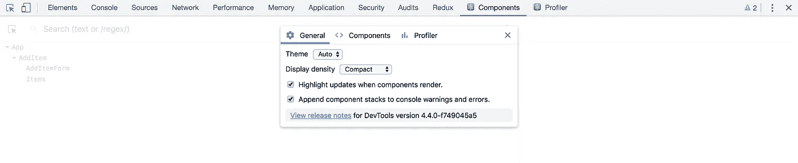
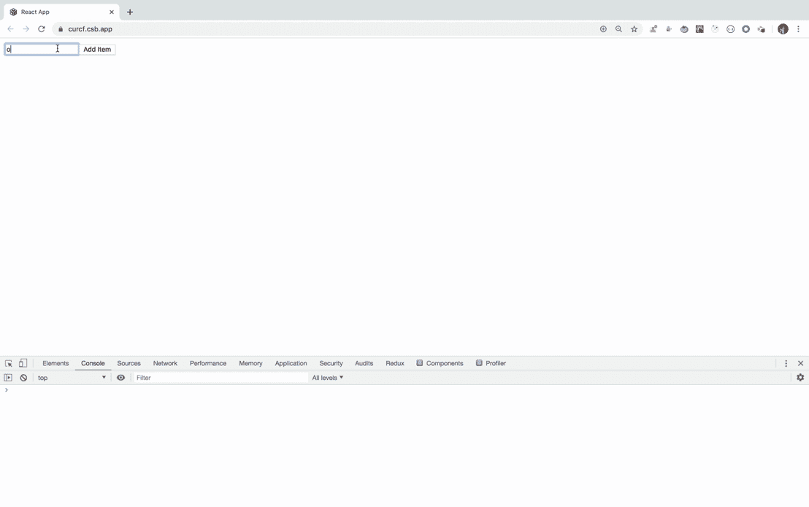
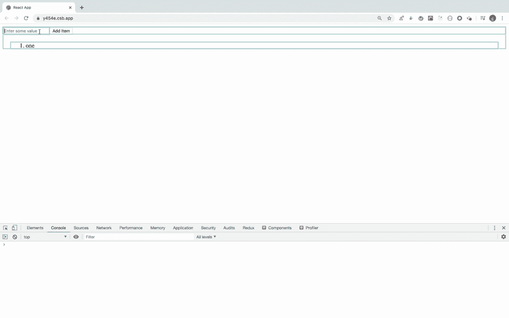

# 轻松提高 React 应用的性能

> 原文：<https://javascript.plainenglish.io/easily-improve-performance-of-your-react-app-afc22ffe1cae?source=collection_archive---------5----------------------->

## 了解什么是 PureComponents，以及如何使用它们来改进 React 应用程序


Photo by [Tudor Baciu](https://unsplash.com/@baciutudor?utm_source=medium&utm_medium=referral) on [Unsplash](https://unsplash.com?utm_source=medium&utm_medium=referral)

在本文中，我们将了解如何轻松提高 React 应用程序的性能。

所以让我们开始吧。

我们举一个简单的例子，向列表中添加一个项目，然后将所有添加的项目呈现在屏幕上。

为了视觉上的简单，我们将在一个文件中声明所有的组件，但是对于真正的应用程序，您应该在一个单独的文件中编写每个组件。

现场演示:[https://curcf.csb.app/](https://curcf.csb.app/)

让我们来理解代码。

1.在`AddItemForm`组件中，我们显示表单来接受用户输入。

2.在`Items`组件中，我们遍历所有输入值，并在`Item`组件中显示每个值

3.在`AddItem`组件中，我们维护存储用户输入值的全局状态，并呈现`AddItemForm`和`Items`组件

*如果您打开 react devtools，在“组件”选项卡中单击滚轮图标并选择“组件渲染时高亮显示更新”复选框，然后您将能够看到组件何时被重新渲染*



从[这里](https://chrome.google.com/webstore/detail/react-developer-tools/fmkadmapgofadopljbjfkapdkoienihi?hl=en)安装 chrome 的扩展，如果你没有安装的话。

现在，当您添加新项目时，您将看到对于添加的每个项目，整个项目列表都被重新呈现。



Image Describing Every item’s render

> 实际上，react 足够智能，因为我们已经为 Items 组件中的每个项目提供了唯一的键，react 不会重新创建每个元素，而只是调用每个元素的 render 方法

如您所见，对数组中的每个元素都调用了 render 方法。在这种情况下，这不是一个大的性能问题，因为我们只有几个项目，但如果我们显示 1k 或 10k 记录，那么这将是一个开销。

因此，为了提高应用程序的性能，我们可以在`Item`组件中实现`shouldComponentUpdate`生命周期方法

`shouldComponentUpdate`方法将`nextProps`和`nextState`作为它们的参数，并在`render`方法之前被调用，因此如果我们从`shouldComponentUpdate`返回 false，将不会调用`render`方法，也不会重新呈现组件。

为了实现生命周期方法，我们将把`Item`组件转换成基于类的组件。

```
class Item extends React.Component {
 shouldComponentUpdate(nextProps, nextState) {
  if (nextProps.item === this.props.item) {
    return false;
  }
 }

 render() {
  return <li>{this.props.item}</li>;
 }
}
```

这里，我们将添加的新值与项目的当前值进行比较。



正如您现在所看到的，所有项目都没有被重新渲染，只有新添加的项目会被渲染。您也可以通过在`Item`组件的`render`方法中添加`console.log(this.props.item);` 来验证它。

代号:[https://codesandbox.io/s/cold-rain-y454e](https://codesandbox.io/s/cold-rain-y454e)

现场演示:[https://y454e.csb.app/](https://y454e.csb.app/)

**几个改进:**

1.  由于我们只是在`shouldComponentUpdate`方法中比较`nextProp`值和当前属性值，我们可以通过扩展`React.PureComponent`而不是`React.Component`并删除`shouldComponentUpdate`方法来简化代码。

```
class Item extends React.PureComponent {
 render() {
  return <li>{this.props.item}</li>;
 }
}
```

`React.PureComponent`类似于`React.Component`。两者的区别在于，`React.Component`不实现`shouldComponentUpdate()`，而`React.PureComponent`用一个浅层的道具和状态比较来实现。

代号:[https://codesandbox.io/s/hungry-frog-0tuqd](https://codesandbox.io/s/hungry-frog-0tuqd)

现场演示:[https://0tuqd.csb.app/](https://0tuqd.csb.app/)

2.如果您的组件是一个功能组件，那么您可以通过将组件传递给`React.memo`方法，而不是将其转换为类组件来添加`shouldComponentUpdate` 方法，这将给出与`PureComponent`相同的结果，如下所示

```
const Item = React.memo(props => <li>{props.item}</li>);
```

今天到此为止。希望你今天学到了新东西。

**别忘了直接在你的收件箱** [**这里**](https://yogeshchavan.dev) **订阅我的每周时事通讯，里面有惊人的技巧、诀窍和文章。**

## 进一步阅读

[](/5-tools-practices-to-help-you-develop-faster-in-react-b884c1b20fc2) [## 帮助您在 React 中更快开发的 5 种工具和实践

### React 工具、技巧和最佳实践将帮助您更快地构建应用

javascript.plainenglish.io](/5-tools-practices-to-help-you-develop-faster-in-react-b884c1b20fc2) 

*更多内容请看*[***plain English . io***](https://plainenglish.io/)*。报名参加我们的* [***免费周报***](http://newsletter.plainenglish.io/) *。关注我们关于*[***Twitter***](https://twitter.com/inPlainEngHQ)[***LinkedIn***](https://www.linkedin.com/company/inplainenglish/)*[***YouTube***](https://www.youtube.com/channel/UCtipWUghju290NWcn8jhyAw)*[***不和***](https://discord.gg/GtDtUAvyhW) *。***