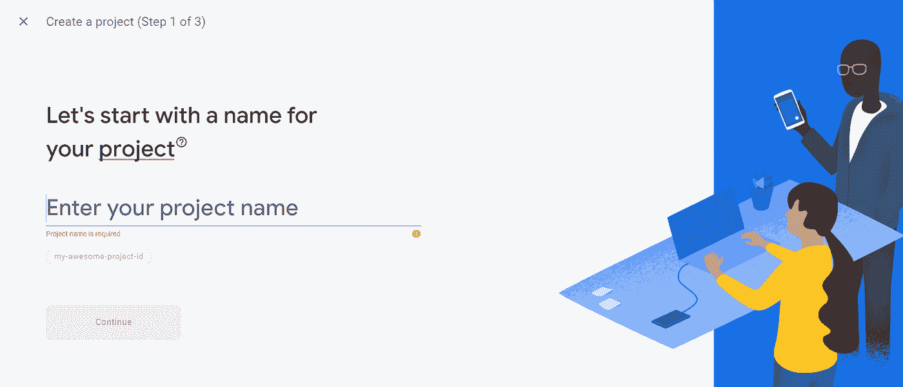
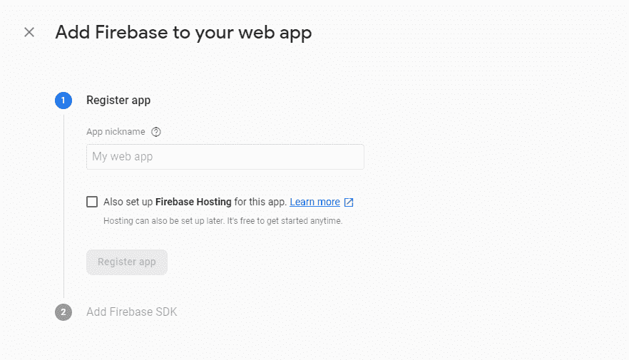
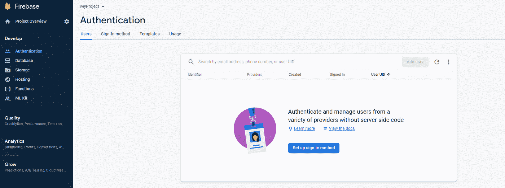
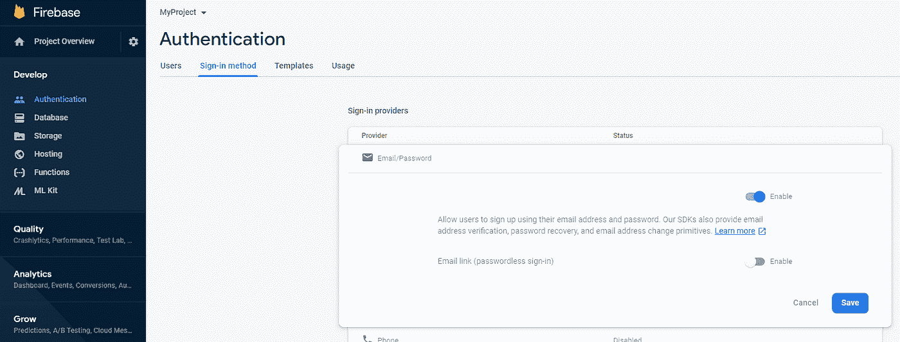
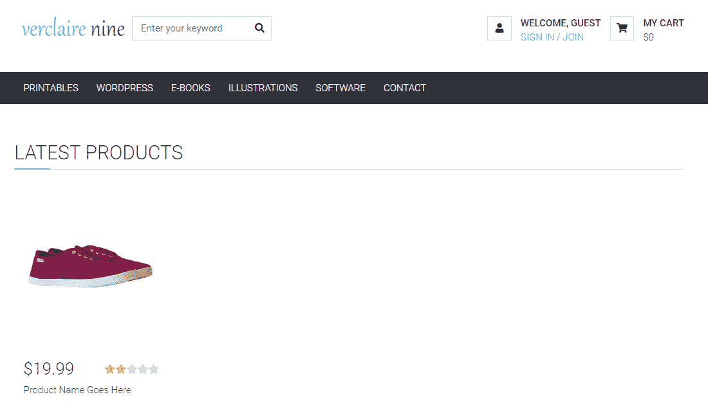
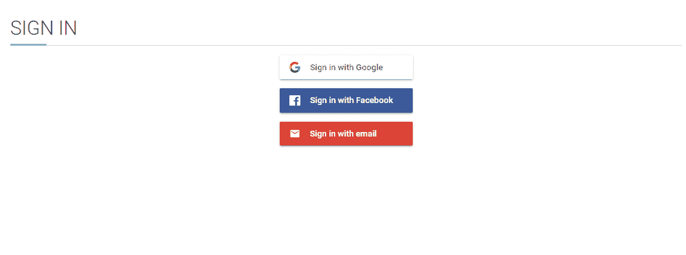
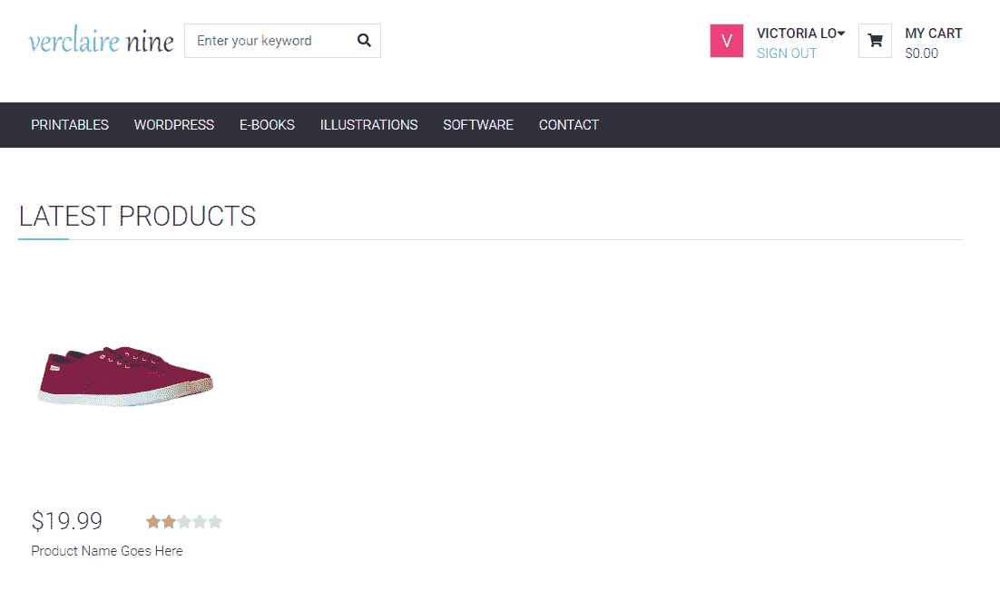

# 面向初学者的 React 和 Firebase 简易认证系统

> 原文：<https://javascript.plainenglish.io/easy-authentication-system-with-react-and-firebase-for-beginners-780cadc9d5e4?source=collection_archive---------3----------------------->


# 那么，什么是认证系统呢？

它用于识别用户，允许应用程序存储个人用户数据，并在用户的所有设备上提供个性化体验。想想任何需要您创建帐户的应用程序，如电子商务应用程序、生产力应用程序等。

如今，大多数应用程序都有一个认证系统，以便为用户提供个性化的独特体验。但是我们如何设计和实现一个好的认证系统呢？在本教程中，我们将使用 Firebase 身份验证和 React(用于前端)构建一个简单的身份验证系统。

# 步骤 1:建立 Firebase 项目

如果你没有 Firebase 账户，请点击[这里](https://firebase.google.com/)创建一个账户。

然后，创建一个新项目并填写详细信息:



使用谷歌分析完全取决于你:


接受条款并创建项目:


创建项目后，您将被带到项目仪表板。中间有 4 个圆形图标(iOS、Android、Web 和 Unity)。对于本教程，选择**网络图标**。


然后你必须注册应用程序。详细填写。我们现在可以跳过 Firebase 托管选项。



点击**‘注册应用’**后，会看到下面的画面。这些配置很重要，所以现在复制`var firebaseConfig = {...}`并保存在某个地方。我们稍后将回到这个问题。


# 设置 Firebase 身份验证

现在我们已经创建了我们的应用程序，让我们前往仪表板的左侧栏。在**开发**选项卡下，点击**认证**选项。


现在点击**设置登录方式**按钮开始。



然后让我们点击**电子邮件/密码**选项来启用它。搞定了。一旦我们将 Firebase 连接到我们的应用程序，我们的用户将能够使用他们的电子邮件和密码登录应用程序。本教程将不介绍如何设置其他登录方法，因为它需要更多的步骤。如果你想让我告诉你如何使用其他方法，请告诉我！



# 步骤 3:创建 React 应用程序

我们已经为我们的 React 应用程序设置了必要的 Firebase。因此，让我们现在创建应用程序！

在命令行中:

```
npx create-react-app myProject
```

然后运行:

```
npm install firebase
```

现在，检索您保存的`var firebaseConfig = {...}`，并将其复制到 **index.js** 中，如下所示:

```
const firebaseConfig = {
  apiKey: APP_API_KEY,
  authDomain: AUTH_DOMAIN,
  databaseURL: DATABASE_URL,
  projectId: PROJECT_ID,
  storageBucket: STORAGE_BUCKET,
  messagingSenderId: MESSAGING_SENDER_ID,
};firebase.initializeApp(firebaseConfig);
```

在顶部添加`import * as firebase from 'firebase'`,这就是它应该看起来的样子:

```
import React from 'react';
import ReactDOM from 'react-dom';
import './index.css';
import App from './App';
import * as firebase from 'firebase';const firebaseConfig = {
  apiKey: APP_API_KEY,
  authDomain: AUTH_DOMAIN,
  databaseURL: DATABASE_URL,
  projectId: PROJECT_ID,
  storageBucket: STORAGE_BUCKET,
  messagingSenderId: MESSAGING_SENDER_ID,
};firebase.initializeApp(firebaseConfig);
const auth = firebase.auth();ReactDOM.render(
    <App />
     document.getElementById('root')
);
```

# 第四步登录页面

这是我项目的主页。为了登录，用户将单击右上角的按钮，该按钮将打开 Firebase 身份验证 UI 进行登录。然后，用户将被重定向到一个个性化帐户页面的主页。让我们用代码来写吧！



首先，通过运行以下命令安装 Firebase UI:

```
npm install --save react-firebaseui
```

然后，创建 sign_in.js 以显示身份验证登录页面并设置登录选项:

```
this.uiConfig = {
              signInFlow: "popup",
                  signInOptions: [
                  firebase.auth.EmailAuthProvider.PROVIDER_ID
              ],
            callbacks: {
                  signInSuccessWithAuthResult: () => false
              }
          };
```

根据用户登录后您想要做的事情，配置将完全由您决定。详细信息请阅读[文档](https://firebase.google.com/docs/auth/web/firebaseui)。

然后，拥有一个跟踪用户是否登录的状态。然后，我们可以使用 firebase.auth()更新状态。onAuthStateChanged()函数:

```
componentDidMount() {
        firebase.auth().onAuthStateChanged(user => {
            this.setState({
                isSignedIn: !!user, 
            }, () => {this.props.setSignedIn(this.state.isSignedIn)
            }) 
        })
    }
```

要在用户登录后将页面重定向回主页，请运行:

```
npm install react-router-dom
```

在 sign_in.js 中设置它，它应该是这样的:

```
import React from 'react';
import '../App.css';
import { FirebaseAuth } from 'react-firebaseui';
import firebase from 'firebase';
import {Redirect} from 'react-router-dom';class SignIn extends React.Component {
    constructor(props) {
        super(props);
        this.uiConfig = {
              signInFlow: "popup",
                  signInOptions: [
                  firebase.auth.EmailAuthProvider.PROVIDER_ID
              ],
            callbacks: {
                  signInSuccessWithAuthResult: (result) => false
              }
          };
        this.state = {
            isSignedIn: false
        }
      }
    componentDidMount() {
        firebase.auth().onAuthStateChanged(user => {
            this.setState({
                isSignedIn: !!user,
            }
        })
    }
    render() {
      return (
          <div>
        {this.state.isSignedIn ? <Redirect to={{pathname: "/"}}/> : 
        <div className="section">
                <div className="container">
                    <div className="row">
                        <div className="col-md-12">
                            <div className="section-title">
                                <h2 className="title">Sign In</h2>
                            </div>
                            <FirebaseAuth uiConfig={this.uiConfig} firebaseAuth={firebase.auth()}/>
                        </div>
                    </div>
                </div>              
        </div>}
        </div>
      );
    }
  }
export default SignIn;
```

**祝贺你！**您的 Firebase Authentication React 应用应该可以使用了！如果一切正常，单击登录后，用户应该会看到:



# 第五步:下一步

这就是这篇长教程目前所能涵盖的内容的结尾。但是，这个身份验证系统的下一步是更新主页，如果用户登录更加个性化。(例如，用他们的姓名和个人资料图片替换右上角的普通图片)。我已经这样做了:



正如右上角所示，登录后，该应用程序知道我是谁，并显示我的姓名和个人资料图片。它还将“登录/加入”更改为“注销”。注销用户的一个简单方法是:

```
firebase.auth().signOut()
```

希望本教程对尝试处理 Firebase 认证和 React 的新程序员有所帮助。如果我能帮助解决任何关于本教程实施的问题，请随时问我问题。干杯！

# **用简单英语写的便条**

你知道我们有四份出版物和一个 YouTube 频道吗？你可以在我们的主页 [**plainenglish.io**](https://plainenglish.io/) 找到所有这些内容——关注我们的出版物并 [**订阅我们的 YouTube 频道**](https://www.youtube.com/channel/UCtipWUghju290NWcn8jhyAw) **来表达你的爱吧！**