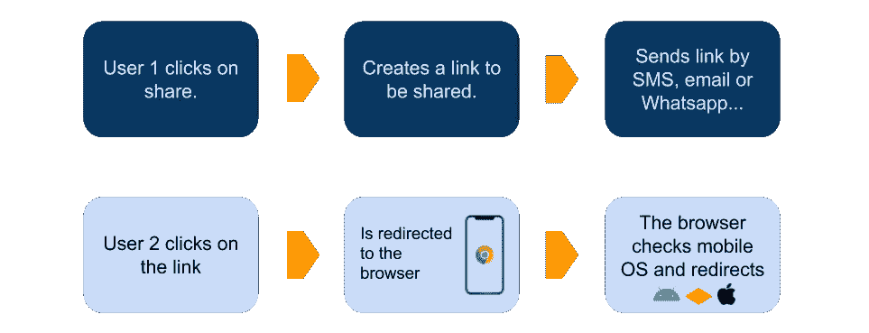

# 与 React Native 和 Expo 轻松深度链接

> 原文：<https://javascript.plainenglish.io/easy-deep-linking-with-react-native-and-expo-84e3c7b9d63e?source=collection_archive---------1----------------------->

## 如何为您的移动应用程序创建可共享的链接


Photo by [You X Ventures](https://unsplash.com/@youxventures?utm_source=unsplash&utm_medium=referral&utm_content=creditCopyText) on [Unsplash](https://unsplash.com/s/photos/sharing?utm_source=unsplash&utm_medium=referral&utm_content=creditCopyText)

我花了一段时间才弄明白如何轻松地将深度链接添加到我的移动应用程序中。没找到好的教程怎么做。

我希望这篇文章能填补这个空白。然而，这是一个非常具体的差距。这**仅**适用于使用以下功能的移动应用:

*   用世博反应本土
*   使用[反应导航](https://reactnavigation.org/)进行路由
*   有一个网站，他们可以用来作为深层链接的代理

# 什么是深度链接？

简单地说，它是一个将在特定屏幕中打开您的应用程序(而不是网站)的链接。

链接(在 iOS 中)看起来像这样:

```
instagram://user?username=wearehutt
```

不幸的是，它在 Android 中的工作方式不同。我们会到达那里的。

# 让我们开始教程

假设用户 1 想要与用户 2 共享一个链接，将他重定向到一个名为 [Hutt](https://www.hutt.app/) 的应用程序中的地图。

我很形象，所以做了一个小图来说明整个流程。



User 1 shares a link with User 2, User 2 clicks and it goes to the app (eventually)

有三个部分协同工作。我们将需要:

*   代码中的更改
*   应用程序配置的变化。进博会:`app.json`
*   网站中的页面

## 你的代码

这部分很简单。我们正在使用`react-navigation`

按照 [React 导航教程](https://reactnavigation.org/docs/en/deep-linking.html)进行深度链接。

总之，您需要向堆栈屏幕添加一个`path`属性。这类似于网站中页面的路径。

*本步骤的输出*

链接会是`app/map`。

## 在`app.json`的配置

这个比较隐晦。

**iOS**

对于 iOS，您只需将`schema`属性设置为应用程序的名称。

这是你深层链接的开始。这就是所谓的 *URL 方案*。

在前面的例子中是`instagram`。

**安卓**

在 Android 中，我们将使用一种叫做 Intent 的东西。更多关于[意图和意图过滤器](https://developer.android.com/guide/components/intents-filters)的 Android 文档。

具体来说是一个带有[动作视图](https://developer.android.com/reference/android/content/Intent.html#ACTION_VIEW)的意图。

在配置文件`app.json`中，我们需要以下内容:

```
"android": {
  //...
  "intentFilters": [
    {
      "action": "VIEW",
      "data": [{
        "scheme": "your-scheme"
      }],
      "category": [
        "BROWSABLE",
        "DEFAULT"
      ]
    }
  ]
}
```

*iOS 和 Android 的本步骤输出*

*   `schema``android.intentFilters`中`app.json`的变化
*   现在的链接是:`hutt://app/map`

## 最后的深层联系

在我的例子中，模式是`hutt`并且我想链接到另一个叫做`app`的屏幕里面的路径`map`。

*该步骤输出同上。*

```
hutt://app/map
```

## **可共享链接**

我们会将用户重定向到一个网站，以了解哪个移动操作系统可以对安卓和 iOS 执行不同的操作。

这意味着可共享链接需要指向一个网站。

然后，在我们的网站页面，我们将使用深度链接重定向到应用程序。

在你的代码中，我们需要在你的网站上创建一个路径链接。

*该步骤输出:*

这是用户 1 与用户 2 共享的实际链接。不是`hutt://app/map`。

```
[https://www.hutt.app/redirect-app-map](https://www.hutt.app/redirect-app-map.)
```

## **网站**

您的网站会检查用户的操作系统。

请记住，可共享链接不会是`hutt://app/map`，这是深度链接。

在这种情况下，您需要执行一个基于操作系统做不同事情的脚本。

**网站 iOS**

在 Javascript 中，当页面加载时执行以下操作

```
window.location.href = 'hutt://app/map';
```

如何检查 iOS 的示例:

```
const isIos = !!navigator.platform && /iPad|iPhone|iPod/.test(navigator.platform);
```

*本步骤输出*

```
window.location.href = 'hutt://app/map';
```

**安卓网站**

用户需要点击一个链接。您需要以下链接`href`

```
intent:#Intent;scheme=hutt://app/map;package=com.hutt.app;end
```

检查以上部分`package=com.hutt.app`。`package`这是您的包裹名称。也在你的`app.json`

```
"android": {
  //...
  "package": "your.package.name"
}
```

更新 12-04-2020:显然，在新的安卓更新中，你可以使用和 iOS 相同的`href`。更多信息请查看[此评论](https://medium.com/@guyavraham/thanks-for-the-clear-explanation-2d5ed0b066ea)。

**该步骤的输出**

```
<a href="intent:#Intent;scheme=hutt://app/map;package=com.hutt.app;end">Open Map</a>
```

# 结论

这是与上面相同的图表。


Sharing a Deep Link

如果我们将输出相加:

```
// Path to your screen
app/map// Add schema
hutt://app/map// Shareable Link to a page in your website
[https://www.hutt.app/redirect-app-map](https://www.hutt.app/redirect-app-map.)// Website JS for iOS
window.location.href = 'hutt://app/map';// Webiste HTML for Android
<a href="intent:#Intent;scheme=hutt://app/map;package=com.hutt.app;end">Open Map</a>
```

除此之外，别忘了:

*   使用[反应导航](https://reactnavigation.org/docs/en/deep-linking.html)更改您的路线。
*   `app.json`变更。`schema`、`intentFilters`。

感谢您的阅读，如果您有任何改进或问题，请与我们联系。

不要忘记，这仅适用于世博会和反应导航项目。

# 注意

现在还有一种叫做通用链接的东西(没有自定义方案)。这是一个`https`链接，它将打开你的应用程序，而不是你的网站。

本教程不包括这些。尽管我认为它们非常有趣，值得考虑。我发现通用链接上的[世博会文档相当不错。](https://docs.expo.io/versions/latest/workflow/linking/#universaldeep-links-without-a-custom-scheme)

# 参考资料:

*   [世博文件对接](https://docs.expo.io/versions/latest/workflow/linking/)
*   [深度链接上的反应导航](https://reactnavigation.org/docs/en/deep-linking.html)
*   [这个 stackoverflow 问题](https://stackoverflow.com/questions/25643272/redirect-to-android-app-from-a-website)

如果你喜欢这篇文章，可以考虑加入我在 GIMTEC 的时事通讯。

[](https://www.gimtec.io/) [## GIMTEC

### 训练营后教育。我希望在我完成训练营时就拥有的每周时事通讯和课程。

www.gimtec.io](https://www.gimtec.io/)