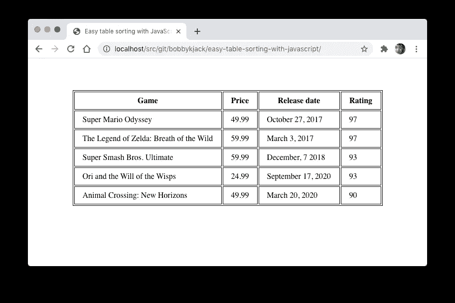
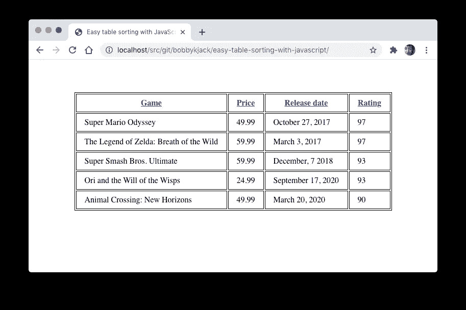
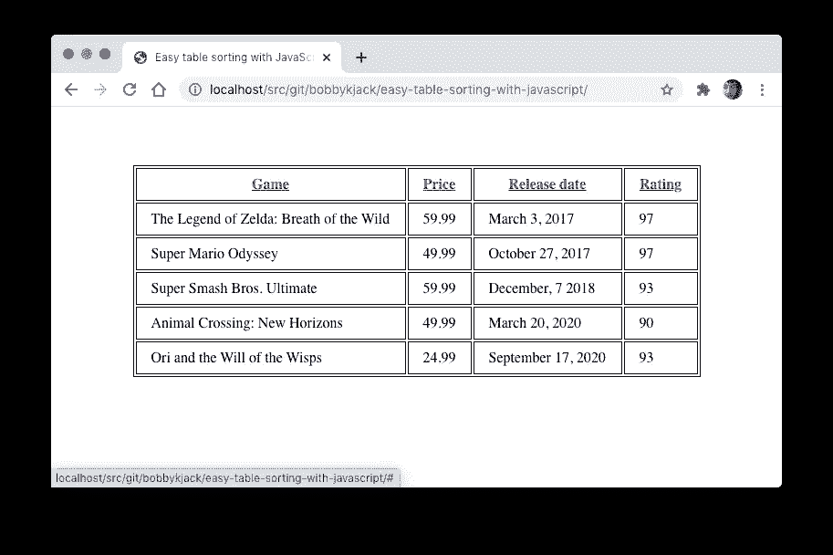

# 用 JavaScript 实现简单的表格排序

> 原文：<https://javascript.plainenglish.io/easy-table-sorting-with-javascript-370d8d97cad8?source=collection_archive---------0----------------------->

## 静态或动态站点的简单技术


Photo by [Jan Antonin Kolar](https://unsplash.com/@jankolar?utm_source=medium&utm_medium=referral) on [Unsplash](https://unsplash.com?utm_source=medium&utm_medium=referral)

改进你发布的任何数据的最简单的方法之一是利用 JavaScript 使其可排序。虽然这可以在服务器端使用动态架构来完成，但在那里不一定是最好的选择*，更不用说在我们别无选择的静态环境中了。*

# 渐进增强

我将展示一种使用[不引人注目的 JavaScript](https://en.wikipedia.org/wiki/Unobtrusive_JavaScript) 来增强现有内容的技术，如果可能的话使用*。对于没有 JavaScript 的读者来说，他们不会错过核心内容:无论我们展示的是什么数据。虽然他们不能对数据进行分类——对于一个静态网站来说，这是我们能提供的最好的选择——但他们仍然能够查看数据。*

*注意，在动态环境中，您仍然可以在服务器端排序回退的基础上使用这种技术。用于对每一列进行排序的链接可以在 URL 参数中发送不同的值，后端脚本使用这些值来生成适当排序的内容。这里介绍的 JavaScript 方法可以稍加修改，在 JavaScript 可用的地方，替换那些链接并使用客户端版本。唯一重大的挑战是确保后端和前端版本以完全相同的方式工作；如果使用类似于 [Node.js](https://nodejs.org/en/) 的东西会更容易。*

# *加价*

*我们希望对数据进行排序，所以这应该以最合适的形式呈现:a `table`。我们将尝试尽可能少的添加内容，以确保内容与功能的最大分离。*

*这里有一个基本的例子，你可以从附带的 GitHub 库下载:*

```
*<!doctype html>
<html lang="en">
<head>
    <meta charset="utf-8" />
    <title>Easy table sorting with JavaScript</title>
    <link rel="stylesheet" href="styles.css" />
</head>
<body>
    <table>
        <thead>
            <tr>
                <th>Game</th>
                <th>Price</th>
                <th>Release date</th>
                <th>Rating</th>
            </tr>
        </thead>
        <tbody>
            <tr>
                <td>Super Mario Odyssey</td>
                <td>49.99</td>
                <td>October 27, 2017</td>
                <td>97</td>
            </tr>
            *<!-- the actual examples includes more rows here -->*
       </tbody>
    </table>
    <script src="sort-table.js"></script>
</body>
</html>*
```

*注意，这个例子指定了 HTML5 中可选的`thead`和`tbody`元素。因为这些元素增加了结构，所以它们也增加了更精确或者更简单的实现的可能性。作为一个经验法则，包含元素通常是一个好主意，即使它们是可选的，如果它们添加了像这样有价值的结构。*

*没有任何额外的东西(和最少的样式)，基本表看起来像这样:*

**

*Initial data table before any alterations*

# *准备标记*

*为了保持内容和行为之间最严格的分离，保持标记尽可能干净是一个好习惯。为此，我们*可以*就此打住，但是当涉及到对我们文档中的表格(以及整个站点)进行排序时，我们不太可能希望*每个*表格都是可排序的。传达我们意图的最干净的方式是使用名为“sortable”的类。这允许在一个页面上有多个可排序的表，并且类名是完全语义化的，所以在文档上增加的“足迹”是最小的。*

```
*<table **class="sortable"**>
...
</table>*
```

*当涉及到对不同类型的数据进行排序时，我们将再次讨论这种方法。现在，我将详细介绍一下 JavaScript，`[sort-table.js](https://github.com/bobbykjack/sort-table-js/blob/8210606904ffc234aaa18e09cedb05158bd56489/sort-table.js)`。我建议在一个新窗口中打开那个链接，并和文章的其余部分一起查看。*

# *设置事件处理程序*

*对表格进行排序的标准方式——这也是我们的访问者最可能期望的——是单击相应的列标题。为了更加明显，我们将从在每个列标题周围注入超链接开始——单击标题的链接将对该列进行排序。*

*重要的是要确保我们的方法可以处理多个表，并按照预期对它们进行独立排序。虽然这个例子在一个页面上只使用了一个表，但是您可以通过创建第二个表来轻松地测试它。您还可以借此机会测试一个没有打开`sortable`类的表，以确认它保持不变。*

*设置事件处理程序包括从文档中获取所需的表、注入超链接以及添加事件侦听器来对相应的列进行排序。*

*首先使用`[querySelectorAll](https://developer.mozilla.org/en-US/docs/Web/API/Document/querySelectorAll)()`获取`table`元素:*

```
*var tables = document.querySelectorAll("table.sortable");*
```

*然后我们遍历集合，忽略任何没有`thead`元素的元素:*

```
*for (i = 0; i < tables.length; i++) {
    table = tables[i]; if (thead = table.querySelector("thead")) {*
```

*接下来，我们将每一列的标题文本包装在一个超链接中，并向其中添加一个事件侦听器:*

```
*headers = thead.querySelectorAll("th");for (j = 0; j < headers.length; j++) {
    headers[j].innerHTML = "<a href='#'>" + headers[j].innerText
        + "</a>";
}thead.addEventListener("click", sortTableFunction(table));*
```

*`sortTableFunction`是一个我们称之为函数的函数，它本身会产生一个函数。我们在主循环中将当前表的值传递给它；这种方法有助于避免一个常见错误，该错误会导致只有最终的表是可排序的:*

```
*function sortTableFunction(table) {
    return function(ev) {
        if (ev.target.tagName.toLowerCase() == 'a') {
            sortRows(table, siblingIndex(ev.target.parentNode));
            ev.preventDefault();
        }
    };
}*
```

*注意，我们检查它实际上是一个被点击的超链接，而不是列标题中围绕它的任何空白。如果你喜欢不同的行为，你可以改变这种方法。当一个链接被点击时，处理程序检查它的`parentNode`(`th`元素)，这样它就可以通过`[siblingIndex](https://github.com/bobbykjack/sort-table-js/blob/8210606904ffc234aaa18e09cedb05158bd56489/sort-table.js#L42)`函数找出哪一列被点击了。我不会在这里介绍这个函数；它只是为第一列返回`0`，为下一列返回`1`，依此类推。*

*现在，我们已经添加了指向列标题的链接，这些链接将标识它们的索引，并调用一个尚未编写的函数`sortRows`，传递要排序的表和列索引。*

**

*The same table with hyperlinks wrapped around column headers*

# *整理桌子*

*这里是所有真正工作发生的地方，在`sortRows`函数中。我们分三步进行:*

1.  *获取特定列中的所有值，并将它们存储在一个数组中。*
2.  *使用适当的函数对数组进行排序。*
3.  *使用新的顺序逐一定位表格中的行。*

## *第一步:获取值*

*该函数首先从表体中获取所有行，然后设置一个选择器，根据提供的`columnIndex`获取适当的表单元格(`td`):*

```
*function sortRows(table, columnIndex) {
    var rows = table.querySelectorAll("tbody tr"),
        sel2 = "td:nth-child(" + (columnIndex + 1) + ")",*
```

*然后循环遍历这组行，使用选择器获取每个`td`:*

```
*for (index = 0; index < rows.length; index++) {
    node = rows[index].querySelector(sel2);*
```

*一旦有了表格单元格，我们就可以获取其中的值:*

```
*val = node.innerText;*
```

*并将该值存储在一个`values`数组中，该数组将保存我们希望排序的所有行:*

```
*values.push({ value: val, row: rows[index] });*
```

*注意，我们正在构建一个对象数组，每个对象存储实际的`value`以及对`row`的引用，即`tr`节点本身。这将证明在第 3 步中对行进行重新排序时是有用的；我们将对`values`数组中的所有对象进行排序，每个对象都有一个现成的对`row`的引用，然后可以按顺序添加到最终的`table`。*

## *第二步:对数组进行排序*

*现在我们在`values`中有了一个对象数组，是时候对它们进行排序了。默认情况下，`Array.sort()`进行字符串比较，这可能适用于我们的“游戏”列，但实际上不适用于任何其他列，因为它们是数字。*

*实际上，默认的排序是区分大小写的，这几乎肯定不是我们想要的，即使对于简单的文本数据也是如此；不区分大小写的顺序更合适。*

*`Array.sort()`方法可以接受一个参数，该参数是用户定义的比较函数，形式如下:*

```
*function(a, b) {
         if (a is before b)     return -1;
    else if (a is after b)      return 1;
    else if (b and a are equal) return 0
}*
```

*事实上，-1 可以是任何小于 0 的值，1 可以是任何大于 0 的数。这非常有用，因为默认的数字排序函数非常简单:*

```
*function sortNumber(a, b) {
    return a - b;
}*
```

*我们在代码中使用这个函数，但是是间接的，因为正如第一步中解释的，我们排序的值是对象。*

```
*function sortNumberVal(a, b) {
    return sortNumber(a.value, b.value);
}*
```

*因此，如果我们对一列数字进行排序，调用看起来像这样:*

```
*values.sort(sortNumberVal);*
```

*完整的代码还提供了一个字符串排序函数`sortTextVal`，以及一个日期排序函数`sortDateVal`。他们每个人都做了少量的工作，首先将值转换成合适的值进行比较，然后进行实际的比较。*

*剩下的一部分我们还没有讨论，这有点复杂，就是类型的识别。在某种程度上，我们可以通过查看第一次获取时遇到的值来“猜测”我们看到的是数字、日期还是其他类型的值。但是这很容易出现问题，所以更健壮的方法是首选。*

*我在前面暗示过这个解决方案，它只是通过将数据包含在原始标记中来指示数据的类型，例如*

```
*<thead>
    <tr>
        <th>Game</th>
        <th>Price</th>
        <th **class="date"**>Release date</th>
        <th>Rating</th>
    </tr>
</thead>*
```

*然后，`sortRows`函数使用`[Element.classList](https://developer.mozilla.org/en-US/docs/Web/API/Element/classList)`方法来检查被要求排序的列中的数据类型，例如*

```
*if (classList.contains("date")) {*
```

## *第三步:定位行*

*一旦对`values`数组进行了排序，剩下的工作就是根据数组中对象的顺序对行进行排序。`[Node.appendChild()](https://developer.mozilla.org/en-US/docs/Web/API/Node/appendChild)`方法的一个有价值的特性是，它可以移动现有的节点，而不必担心它的当前位置:只需指定需要移动的内容(例如每行)和移动到哪里(表体的末尾):*

```
*for (var idx = 0; idx < values.length; idx++) {
    table.querySelector("tbody").appendChild(values[idx].row);
}*
```

**

*The table reordered, after the “Release date” column has been clicked*

# *摘要*

*尽管仅仅对表中的一些值进行排序看起来工作量很大，但我们现在有了一个解决方案，它可以跨整个站点、跨表中呈现的任何数据进行移植。只需将`sortable`类添加到任何现有的表中，包括脚本，就可以开始了。*

*一个普通的‘不引人注目的 JavaScript’方法应该产生高度可移植和可重用的代码。*

*你可以在我的网站上查看这个例子并与之互动，或者进一步探索 GitHub 上的知识库[。](https://github.com/bobbykjack/sort-table-js)*

## *进一步练习*

*要获得更完整的解决方案，请考虑以下一些增强功能:*

*   *处理更多类型:考虑每种类型的唯一类值和对该类型的值进行排序的独立函数*
*   *指示对哪一列进行了排序:单击时向标题添加一个类，使用 CSS 样式化该类*
*   *指示最初对哪一列进行了排序:使用与上一步相同的类，只需将它添加到标记中*
*   *满足反向排序顺序:当一个列被排序并且被第二次点击时，添加一个“反向”类，并在值被排序后使用`[Array.reverse()](https://developer.mozilla.org/en-US/docs/Web/JavaScript/Reference/Global_Objects/Array/reverse)`*

*喜欢这篇文章吗？如果有，通过 [**订阅解码获得更多类似内容，我们的 YouTube 频道**](https://www.youtube.com/channel/UCtipWUghju290NWcn8jhyAw) **！***