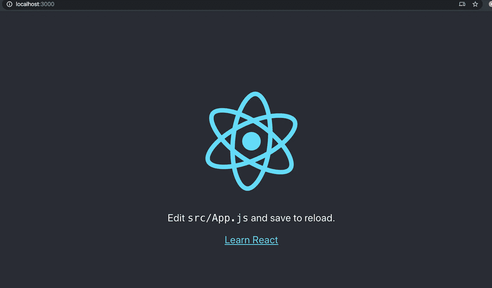
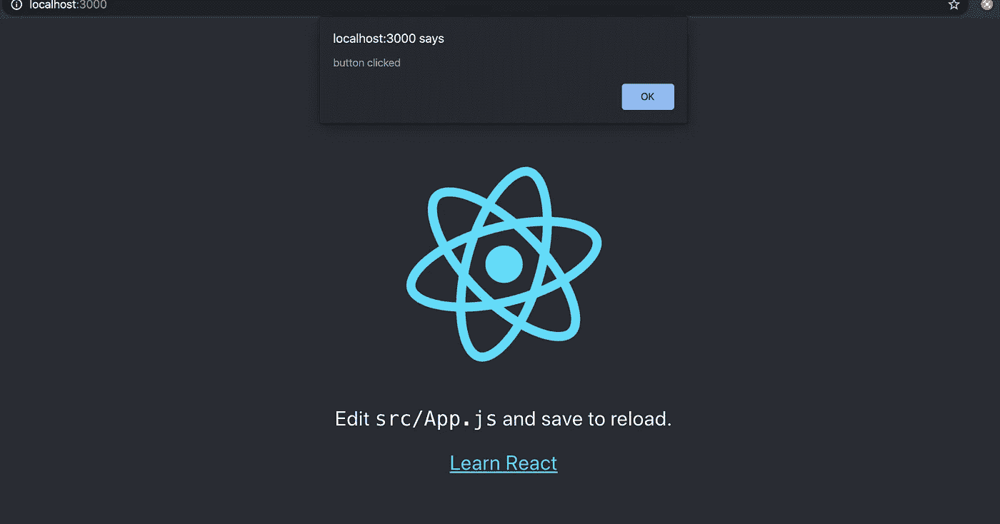
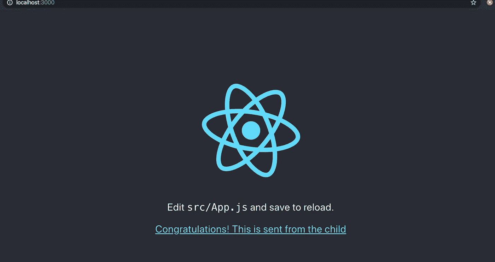

# 在 React 中处理回调

> 原文：<https://javascript.plainenglish.io/easy-tutorial-on-react-callbacks-fad6a51cc8f1?source=collection_archive---------2----------------------->

## 最近，我有机会在 React 上工作，几乎立刻就遇到了组件间通信的场景。

# 孩子与父母的交流

回调在处理从子组件到父组件的信息流时尤其重要。

先说 react 最流行的入门 app:[**create-react-app**](https://reactjs.org/docs/create-a-new-react-app.html)

打开终端，让我们创建一个新项目(注意:您需要在机器上安装节点来完成以下任务)

```
npx create-react-app callback-tut 
```

好吧，我们有了一个好的开始。我们的应用已经准备好了。导航到新创建的文件夹，并键入以下内容

```
npm start
```

这将启动一个本地开发服务器，并在 [*打开默认浏览器*](http://localhost:3000)



# 创建子组件

让我们创建一个新组件。

创建名为 Child.js 的新文件。

这是一个超级简单的组件

*   显示一个按钮
*   单击该按钮会显示一个警告

```
**import** * **as *React* from "react"**;

**const** *Child* = () => {

    **const** handleClick = () => {
        *alert*(**'button clicked'**);
    }

    **return** (
        <>
            <**button
                onClick=**{() => handleClick()}
            >
                Click me
            </**button**>
        </>
    );
}

**export default** *Child*;
```

# 将其添加到父项

让我们把它加到父节点上。修改 App.js，以便添加子组件。

```
**import *React* from 'react'**;
**import** logo **from './logo.svg'**;
**import './App.css'**;
**import** *Child* **from "./Child"**;

**function** *App*() {
  **return** (
    <**div className="App"**>
      <**header className="App-header"**>
        <**img src=**{logo} **className="App-logo" alt="logo"** />
        <**p**>
          Edit <**code**>src/App.js</**code**> and save to reload.
        </**p**>
        <**a
          className="App-link"
          href="https://reactjs.org"
          target="_blank"
          rel="noopener noreferrer"** >
          Learn React
        </**a**>
      </**header**>
      <**Child**/>
    </**div**>
  );
}

**export default** *App*;
```

您应该会在屏幕底部看到一个小按钮，让我们单击它来查看警告。



# 将功能传递给孩子

让我们在父类中创建一个函数，它可以明显地改变页面上的某些内容。

我们将使用 *useState* 来管理一个简单的状态变量。

```
**import *React***, {*useState*} **from 'react'**;
**import** logo **from './logo.svg'**;
**import './App.css'**;
**import** *Child* **from "./Child"**;

**function** *App*() {

    **const** [linkText, setLinkText] = *useState*(**'Learn React'**);
    **const** changeLinkText = (text) => {
        setLinkText(text);
    };

    **return** (
        <**div className="App"**>
            <**header className="App-header"**>
                <**img src=**{logo} **className="App-logo" alt="logo"**/>
                <**p**>
                    Edit <**code**>src/App.js</**code**> and save to reload.
                </**p**>
                <**a
                    className="App-link"
                    href="https://reactjs.org"
                    target="_blank"
                    rel="noopener noreferrer"** >
                    {linkText}
                </**a**>
            </**header**>
            <**Child changeLinkText=**{changeLinkText}/>
        </**div**>
    );
}

**export default** *App*;
```

你问我们加了什么？

*   我们在 App.js 的顶部添加了两行

```
**const** [linkText, setLinkText] = *useState*(**'Learn React'**);
```

我们没有显示“Learn React ”,而是有一个名为“linkText”的变量，它的初始值被设置为“Learn React”。

*   我们添加了一个函数，它接受一个值，并将其分配给上面定义的“链接文本”

```
**const** changeLinkText = (text) => {
        setLinkText(text);
    };
```

*   使用“linkText”变量，你猜对了，作为链接

```
 <**a
                    className="App-link"
                    href="https://reactjs.org"
                    target="_blank"
                    rel="noopener noreferrer"** >
                    {linkText}
                </**a**>
```

*   最后，让我们把功能传递给孩子

```
<**Child changeLinkText=**{changeLinkText}/>
```

# 在子进程中使用回调

让我们修改子对象以接收来自父对象的道具

```
**import** * **as *React* from "react"**;

**const** *Child* = (props) => {

    **const** handleClick = () => {
        props.**changeLinkText**(**'Congratulations! This is sent from the child'**);
    }

    **return** (
        <>
            <**button
                onClick=**{() => handleClick()}
            >
                Click me
            </**button**>
        </>
    );
}

**export default** *Child*;
```

注意，现在孩子接受了“(道具)”。

从父代传递的函数现在在子代中可用

```
**const** handleClick = () => {
        props.**changeLinkText**(**'Congratulations! This is sent from the child'**);
    }
```

# 最后

我们都准备好了。让我们导航到 [http://localhost:3000](http://localhost:3000) 并一直点击底部的按钮，嘣！！看看吧，我们刚刚将链接文本从子节点传递到了父节点，并在父节点中呈现了它！！

好样的。



# 结论

这是一个非常简短的教程，介绍了如何在 React 中实现子组件与父组件之间的通信。

如果你喜欢这个，请鼓掌并留下评论。

在下一篇文章中，我将做一个简单的教程，介绍如何在 React 中实现兄弟组件甚至无关组件之间的通信，敬请关注！