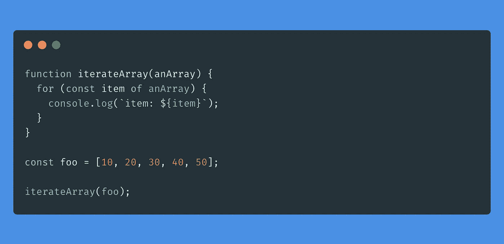
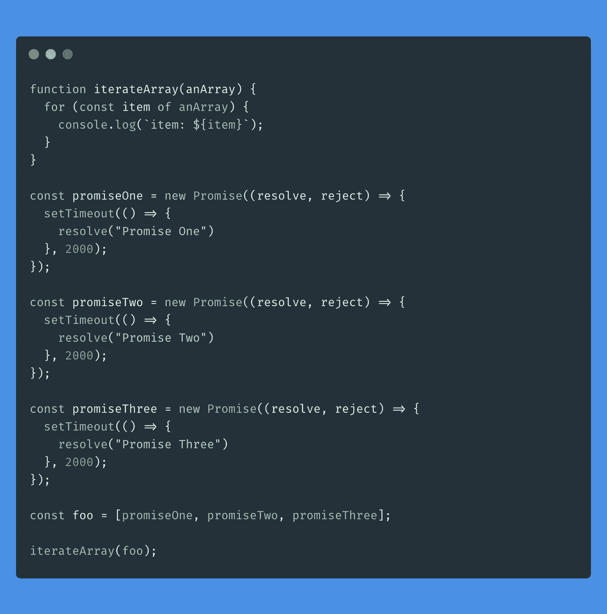
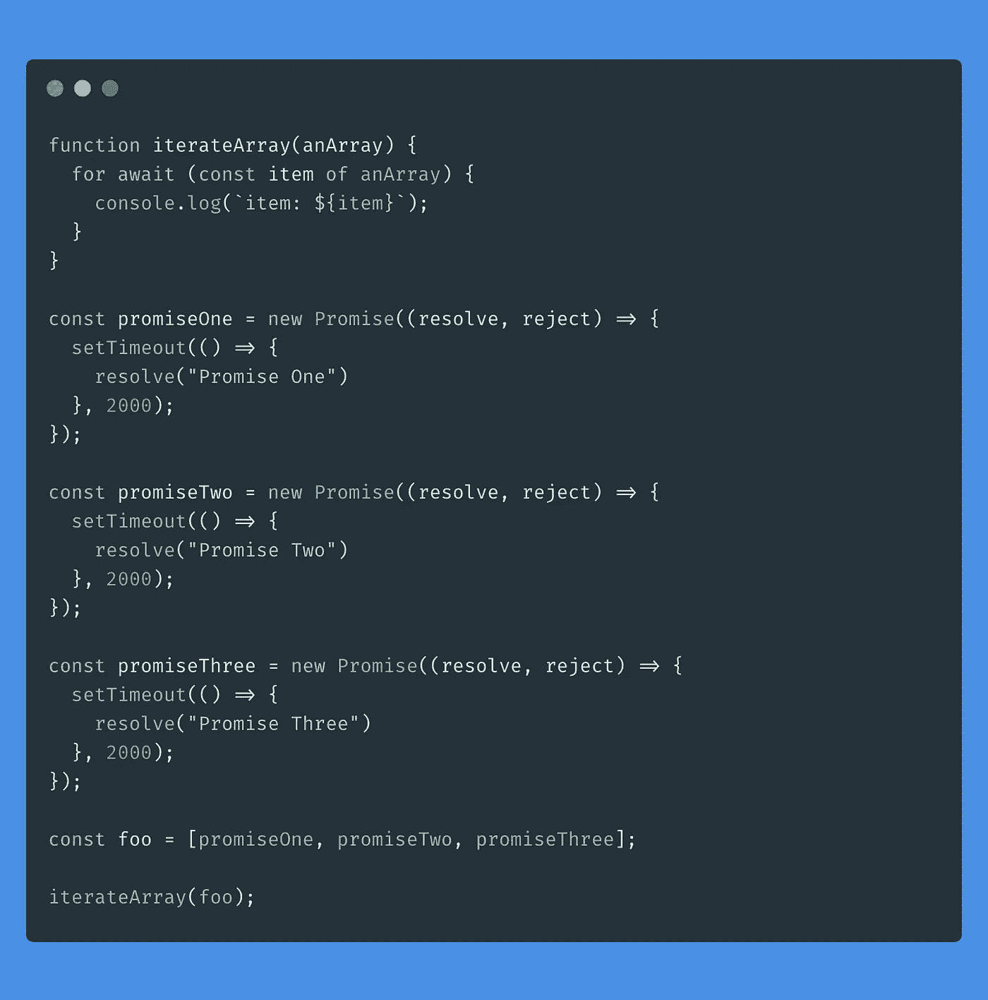
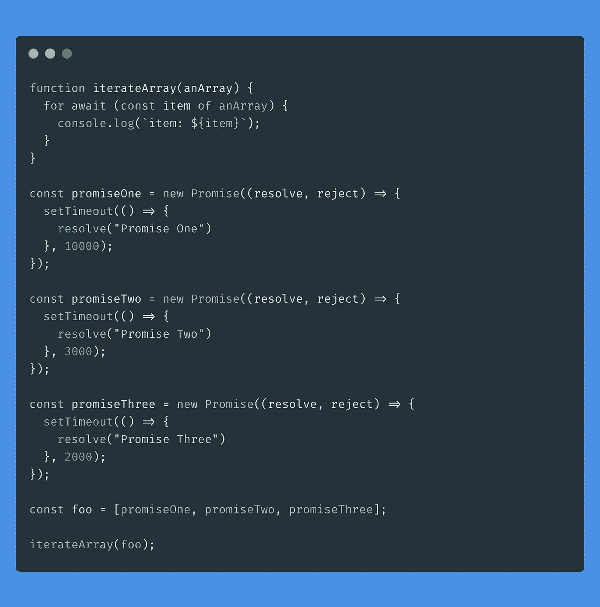

# ECMAScript 2019。使用“for-of”的异步迭代

> 原文：<https://javascript.plainenglish.io/ecmascript-2019-asynchronous-iteration-using-for-of-dc1893f99fd9?source=collection_archive---------1----------------------->

## 如何使用“for-of”循环异步迭代


在本文中，我想重点介绍 ECMAScript 2019 带来的另一个特性:**异步迭代**。这种类型的迭代基于`**for-of**` **循环**，它通常用于迭代数组中的一系列元素，从现在开始我们可以使用它来迭代异步元素，如`Promises`。

我们去看看吧！

# “for-of”循环

正如我在文章开头所评论的,`for-of`循环允许我们遍历数组中包含的元素列表。例如:



在这种情况下，iterateArray 函数通过在控制台上打印以下结果，将过去数组的元素作为参数进行同步迭代:

```
item 10
item 20
item 30
item 40
item 50
```

现在让我们看看，如果我们传递的不是一个数字数组，而是一个**承诺**数组，会发生什么:



在这种情况下，`for-of`遍历数组，但是我们在屏幕上看到的是列表中的每个`Promise`对象，而不是在其中解析的值。也就是说:

```
item: [object Promise]
item: [object Promise]
item: [object Promise]
```

这就是 **ECMAScript 2019** 的到来变得重要的地方，因为它将允许我们异步地使用`for-of`循环，正如我们将在下面看到的。

# 使用“for-of”异步迭代

正如我们在前面的例子中看到的，如果我们用`for-of`循环迭代一个`Promise`对象的数组，我们在每一步中得到的是未解析的对象，尽管一旦代码被异步执行，*希望*得到解析的值。

由于 ECMAScript 2019，这已经成为可能，因为从现在开始，可以在`for-of`循环中添加`await`关键字，以便异步迭代**承诺**的数组。这样，循环将在前进到下一个迭代之前等待迭代的承诺得到解决，从而允许我们使用解决的值:



由于在示例的`for-of`循环中使用了`await`，我们现在将在控制台中得到:

```
 Promise One
Promise Two
Promise Three 
```

因此，Javascript 的这一新特性在处理**承诺**列表时将非常有用，因为我们不需要为每个列表提供一个“*回调*”，但是我们可以使用`for-of`循环对它们进行迭代，并直接获得它们求解的值。

# 承诺在循环中以什么顺序执行？

使用`for-of`循环异步工作时，需要知道的另一件重要事情是迭代的承诺以什么顺序被解析。也就是说，它们是按顺序解析的，或者循环将它们全部抛出并返回，这取决于获得值的速度。我们来看一个例子:



如你所见，第一个承诺花了 10 秒，第二个 3 秒，最后一个 2 秒。但是，我们在每个控制台上得到的输出与它们花费相同时间解决时的输出相同，即:

```
 Promise One
Promise Two
Promise Three
```

因此，`for-of` **循环**异步工作时，它所做的是获得数组的第一个承诺，等待它解决，然后继续下一个**允许我们控制它们的执行顺序。**

# 结论

正如你所看到的，渐渐地 **Javascript** 为我们提供了更多的工具来改进异步函数的工作，就像在`for-of`循环中使用`await`一样。

如果你想了解更多关于 ECMAScript 2019 带来的新奇事物，我留下一篇我写的关于`Array.flat`函数的文章:

[](https://medium.com/@ger86/es2019-aplanar-arrays-en-javascript-con-array-flat-b9028a647734) [## ES2019。Javascript con Array.flat()中的平面数组

### “展平数组”感谢 es 2019 Hoy OS traigo an arti culo—receta sobre Javascript que de paso me servirápara…

medium.com](https://medium.com/@ger86/es2019-aplanar-arrays-en-javascript-con-array-flat-b9028a647734) 

# 你想收到更多这样的文章吗？

如果你喜欢这篇文章，我鼓励你订阅我每周日发送的时事通讯，里面有类似的出版物和更多的推荐内容:👇👇👇

[](https://eepurl.us20.list-manage.com/subscribe?u=c14cad2102bcf33bf216cc69e&id=2790da9378) [## 拿铁和代码

### 这是一份最新的时事通讯，代码是 recibirás cada domingo。——洛斯多斯乌尔蒂莫斯艺术博物馆……

eepurl.us20.list-manage.com](https://eepurl.us20.list-manage.com/subscribe?u=c14cad2102bcf33bf216cc69e&id=2790da9378)