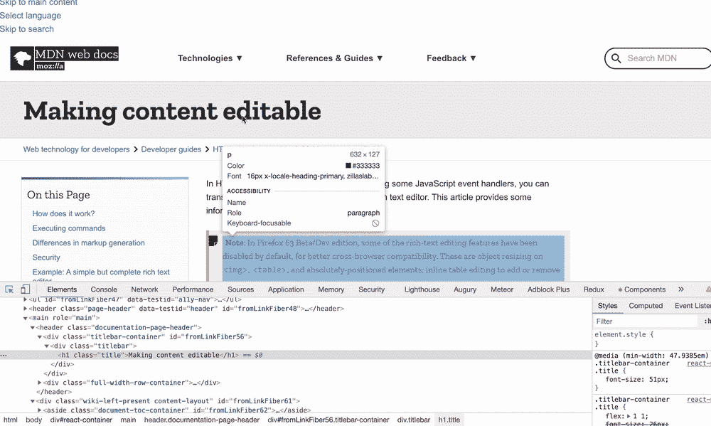

# 在 React 中创建可编辑的 HTML

> 原文：<https://javascript.plainenglish.io/editable-html-in-react-6dd67dd7e302?source=collection_archive---------0----------------------->


Photo by [Steven Su](https://unsplash.com/@xpsteven?utm_source=unsplash&utm_medium=referral&utm_content=creditCopyText) on [Unsplash](https://unsplash.com/s/photos/iran?utm_source=unsplash&utm_medium=referral&utm_content=creditCopyText)

我们正在为我们在[接触点](https://www.alida.com/alida-touchpoint)的构建器开发内联编辑器。作为内联编辑器的一部分，用户应该能够编辑组件的样式和文本。例如，改变一个按钮的颜色和文字，内嵌！

在过去的两个星期里，我一直在思考我们如何才能拥有一个可编辑的组件？🤔我总结了三个解决方案，我喜欢其中的一个，我想在这篇文章中与你分享。

# 使内容在 HTML 中可编辑

有一个 HTML 属性可以传递给任何 HTML 标签，使其可编辑。如果你为几乎所有的 HTML 标签设置了`contenteditable=true`，标签将会变成可编辑的！

这里你可以看到一个例子:



你可以在这里了解更多:[https://developer . Mozilla . org/en-US/docs/Web/Guide/HTML/Editable _ content](https://developer.mozilla.org/en-US/docs/Web/Guide/HTML/Editable_content)

# `contentEditable`道具在反应

在我们看如何在 React 中使用它之前，我想说的是，当你在 React 中使用它时，你应该非常小心。当你添加`contentEditable=true`到一个组件时，你会看到一个来自 React 的警告:*警告:一个组件是“内容可编辑的”并且包含 React 管理的“子组件”。现在，您有责任保证这些节点不会被意外修改或复制。这大概不是故意的。*

这个警告意味着从此 React 不再控制这些组件，并且可能会发生许多意想不到的错误。因此，确保我们正在做的事情没有任何副作用，不会给我们的应用程序的其余部分带来问题，这真的取决于我们。您可以在这个 [StackOverflow 问题](https://stackoverflow.com/questions/49639144/why-does-react-warn-against-an-contenteditable-component-having-children-managed)中了解更多关于此警告的信息。

要关闭该警告(假设我们知道自己在做什么并能控制它)，我们可以将`suppressContentEditableWarning=true`传递给我们的组件来关闭该警告。所以基本上像这样的组件在 React 中是可编辑的:

```
const EditableDiv = () => {
  return (
    <div contentEditable={true} suppressContentEditableWarning={true}>Awesome Div!</div> )}
```

# 更通用的解决方案

在我的理想世界中，我不想把道具添加到每个组件中，然后做所有的检查和逻辑来听变化，我想有一个更通用的解决方案，我可以在我们的应用程序中使用。
以下是我的解决方案:

```
const EditableElement = (props) => {
  const { onChange } = props;
  const element = useRef();
  let elements = React.Children.toArray(props.children);
  if (elements.length > 1) {
    throw Error("Can't have more than one child");
  }
  const onMouseUp = () => {
    const value = element.current?.value || element.current?.innerText;
    onChange(value);
  };
  useEffect(() => {
    const value = element.current?.value || element.current?.innerText;
    onChange(value);
  }, []);
  elements = React.cloneElement(elements[0], {
    contentEditable: true,
    suppressContentEditableWarning: true,
    ref: element,
    onKeyUp: onMouseUp
  });
  return elements;
};
```

基本上我想做的就是把我的组件包装在这个组件里面，然后准备好！

我们一起来复习一下代码。这个想法是我们传递一个`ref`给我们的包装组件，用一个事件监听器让`onKeyUp`监听任何键盘事件。有一个`onChange`道具，我们可以传递给这个组件，它作为一个回调函数工作，所以每次有变化它都会被调用。

有一些初始检查来确保我们没有接受一个以上的组件(也有一些方法来处理这种情况，但是对于我们的用例来说，一个组件就足够了)。(如果你不熟悉 React 顶级 API，你可以在文档的[这一部分找到更多细节)。](https://reactjs.org/docs/react-api.html)

这里我们使用了两个顶级 API:

**做出反应。children . to array(props . children):**它将`props.children`转换为一个数组。

**React.cloneElement:** 你可以传递一些新的道具给 React 组件。如果你感兴趣，你可以[阅读这篇文章了解更多信息](https://frontarm.com/james-k-nelson/passing-data-props-children/)。

***免责声明:*** *使用 React 定制钩子、高阶组件和所有这些工具，还有许多其他方法来实现这个功能。*

在确保我们只包装了一个孩子之后，我们将一个`ref`、`onKeyUp`和`contentEditable`传递给我们的组件，使其可编辑。

以下是如何使用该组件的示例:

```
export default function App() {
  const initialValue = "value";
  const [value, setValue] = useState(initialValue);
  const handleChange = (value) => {
    setValue(value);
  };
  return (
    <div className="App">
      <EditableElement onChange={handleChange}>
        <div style={{ outline: "none" }}>
          <p>{initialValue}</p>
        </div>
      </EditableElement>
      <label>{value}</label>
    </div>
  );
}
```

提醒您，当您在 React 中使用此组件或可编辑组件时，您应该小心，并确保不会给您的应用程序带来任何问题。例如，在我们的用例中，我们只将想要编辑其文本的组件包装在这个组件中。

下面是一个完整的例子:

我希望你喜欢这篇文章！我希望听到你的反馈，如果你有其他方法来实现这个功能，请在评论中分享！

注意安全！
[***莫斯塔法***](https://www.linkedin.com/in/mostafa-darehzereshki/)