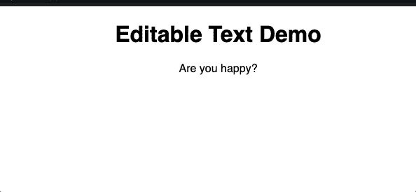

# 可编辑文本组件，具有使用 React 挂钩的单击外部关闭功能

> 原文：<https://javascript.plainenglish.io/editable-text-component-with-click-outside-to-close-feature-using-react-hooks-6cb6b704bd69?source=collection_archive---------2----------------------->

Photo by [Thomas Tastet](https://unsplash.com/@thomast_404?utm_source=unsplash&utm_medium=referral&utm_content=creditCopyText) on [Unsplash](https://unsplash.com/search/photos/react?utm_source=unsplash&utm_medium=referral&utm_content=creditCopyText)

每隔一段时间，这对于包含快速编辑的 ui 来说是很常见的事情，通过点击文本，编辑它，然后点击外部来保存文本。

我的任务是添加这个特性，我决定让它成为一个功能组件，这样我也可以在项目的其他部分使用它。

如果你不明白，这就是这个简单组件的样子。

Editable Text with  & <input>

使其功能化意味着我们不能使用 React 的内置`State`和`componentDidMount`以及`ref`来检测外部点击。然而，随着 React 钩子的引入，这变得更加容易和干净！

在这种情况下，我们将使用`useEffect`、`useState`和`useRef`来利用基于类的 React 组件的特性。

如果你不熟悉这些挂钩，这里有一个快速运行下来。

*   `useEffect`非常类似于典型的 React 的生命周期方法，比如`componentDidMount`。
*   `useState`和你平时在 React 类构造函数里写的**状态**一样。
*   `useRef`与在 DOM 元素中使用`ref`属性是一样的，除了在函数组件中我们不能容易地访问 DOM 的`ref`，所以这是一个 goto 方法，只要你想访问一个 DOM 元素。

更多的细节，你应该阅读[介绍反应钩子](https://reactjs.org/docs/hooks-intro.html)。

好的。所以我们已经掌握了关于反作用钩子的知识。我们如何在我们自己的组件中利用这些特性。

首先，我们将编写组件的 HTML 框架。

其次，我们将考虑我们的组件将如何实际工作。这是我的思维流程。

*   我们将`text` prop 从父组件传递到子组件。
*   让它有自己的状态名为`text`，这样我们可以自由地更新`<input>`中的文本以及更新``。
*   我们将有另一个名为`inputVisible`的状态来控制``和`<input />`之间的点击切换特性。
*   通过将`mousedown`事件附加到`document`对象，使用`<input>`的`ref`控制外部点击，并查看用户是否正在点击我们的`<input>`并在两个元素之间切换。

我不会解释完整代码的非常详细的方面，但我包括了一些有用的注释，所以你可以得到我如何在代码中安排思想流的要点。

EditableText.js

完整的工作演示

 [## 可编辑输入- CodeSandbox

### 为 web 应用程序定制的在线代码编辑器

codesandbox.io](https://codesandbox.io/s/lucid-tdd-l9dq8?fontsize=14) 

感谢阅读。我感谢所有的评论！