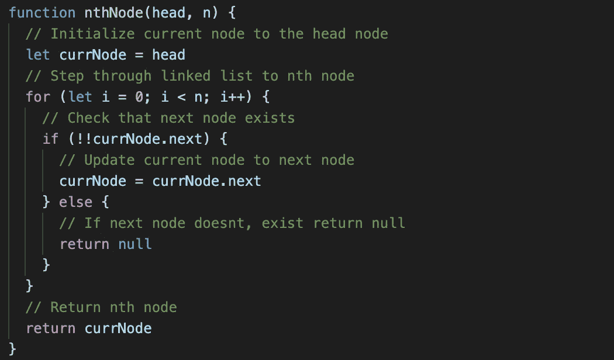
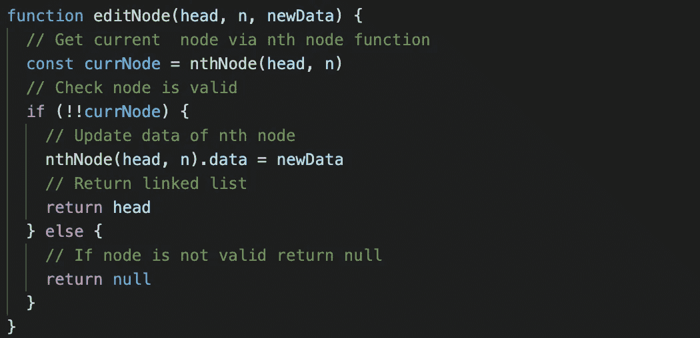
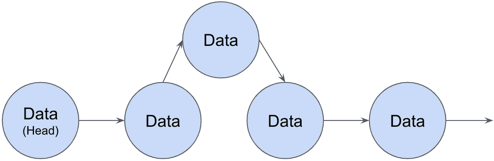
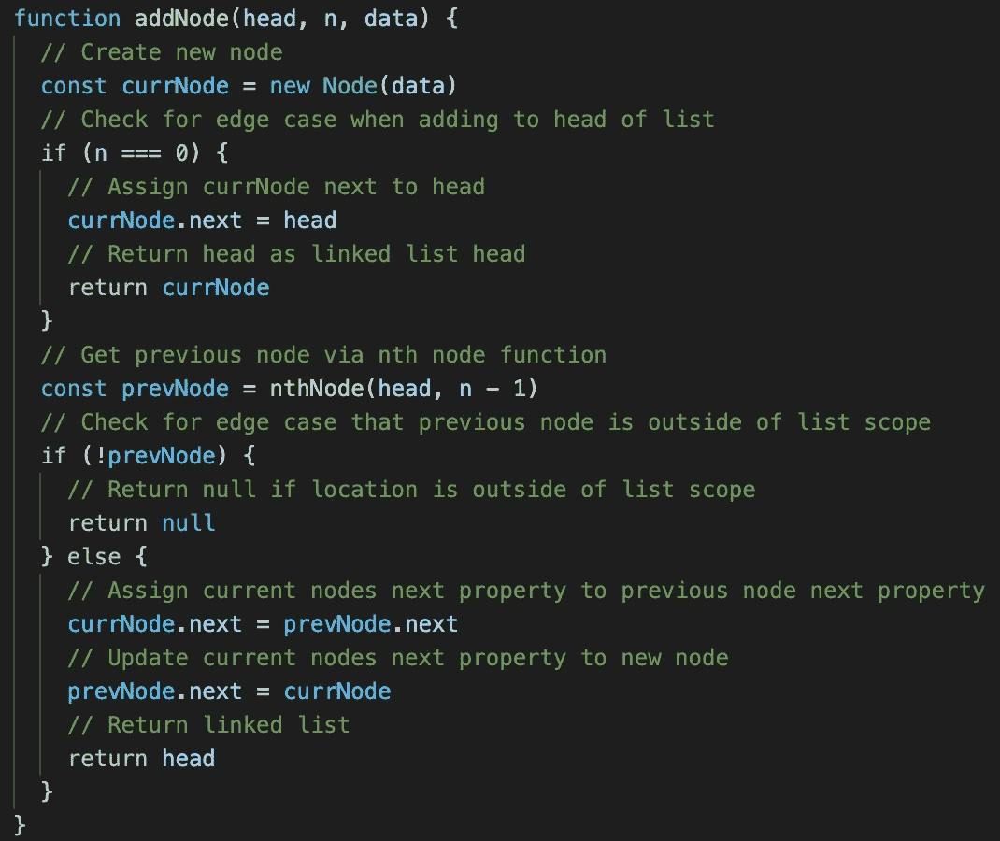
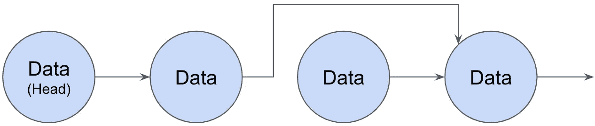
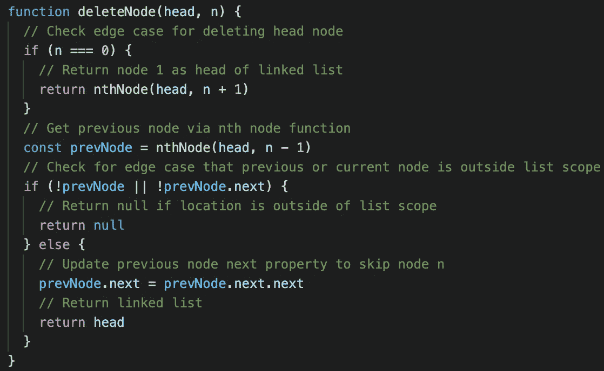

# 编辑单链表

> 原文：<https://javascript.plainenglish.io/editing-a-singly-linked-list-b243a2b6d428?source=collection_archive---------7----------------------->

## JavaScript 中的数据结构

Photo by [Jon Tyson](https://unsplash.com/@jontyson?utm_source=medium&utm_medium=referral) on [Unsplash](https://unsplash.com?utm_source=medium&utm_medium=referral)

在前面的“JavaScript 中的数据结构”讨论中，我们介绍了用于构建节点类的方法，该节点类表示链表“链”中的每个“链接”。从那里我们讨论了如何从一个数组中构造一个单链表。在前面讨论的基础上，我们现在将开始编辑单独链表。如果您不熟悉上一篇文章中涉及的代码和术语，建议您查看[构建单链表](https://medium.com/javascript-in-plain-english/building-a-singly-linked-list-86b777451119)。

对于链接列表，有三种方法可以编辑列表:更新节点数据属性、向列表中添加节点或从列表中删除节点。在所有这些情况下，我们都想访问单链表中的一个特定位置。根据具体情况，您可能希望从列表的开头编辑第 n 个节点，从列表的末尾编辑第 n 个节点，或者编辑具有特定数据值的节点。对于这个讨论，我们将假设我们有兴趣从列表的顶部编辑第 n 个节点。考虑到这一点，我们可以使用如图 1 所示的简单 for 循环，从头到尾遍历一个单独的链表。

Figure 1: Accessing the nth Node

## 编辑节点

当编辑一个节点时，我们只需要更新该节点的数据属性，这与图 1 中的代码是相对直接的。如图 2 所示，使用`nthNode`功能找到正确的节点，节点数据属性更新。

Figure 2: Editing the Data of the nth Node

## 添加节点

当向单链表插入一个新节点时，我们需要首先创建新节点，然后适当地连接它的下一个属性以及前一个节点的下一个属性。这听起来可能有点令人困惑，所以让我们画一个图表。

Figure 3: Adding a Node at n = 2

在图 3 中，在`n = 2`处添加了一个节点，首先创建该节点，使其下一个属性指向它后面的节点(`n = 3`)，然后在(`n=1`)之前更新该节点以指向新节点。将这个过程进行推广，得到图 4 所示的`addNode`函数。

Figure 4: Add Node at location n

除了将一个节点添加到单链表的中间，还有两种边缘情况:将一个节点添加到链表的开头，或者添加到链表现有范围之外的某个位置。要在列表的开头添加节点(`n = 0`)，只需要新节点的下一个属性指向旧的头部。现在，当在列表范围之外的位置添加一个节点时，因为先前的节点不存在，所以无法完成，所以代码简单地返回`null`。

## 删除节点

当从链表中删除一个节点时，没有实际的删除发生；而是更新前一个节点的下一个指针以跳过所选节点。这是另一个快速图表可以增加很多价值的例子。

Figure 5: Deleting Node at n = 2

在上图中，您可以看到，当在`n = 2`删除节点时，前一个节点的下一个指针(在本例中为`n = 1`)被更新，指向下一个节点(在本例中为`n = 3`)。被删除的节点不必更新，即使它的下一个属性指向链表上的一个节点。这是因为它永远不会被单链表引用。与添加节点的情况一样，代码需要考虑删除单链表头或列表范围之外的节点的边缘情况。

Figure 6: Delete nth Node

# 附加注释

虽然本文不讨论双向链表，但是添加和删除节点的过程需要适当地更新前面的属性。值得注意的是，`editNode`功能根本不需要改变。