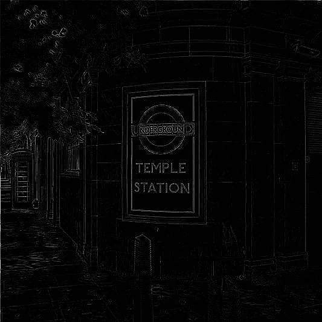

# 使用 Node.js 和 JIMP 编辑带有卷积矩阵的图像

> 原文：<https://javascript.plainenglish.io/editing-images-with-convolution-matrices-using-node-js-and-jimp-fa54f1e9a8b7?source=collection_archive---------13----------------------->

## 一种简单而强大的图像处理技术

Photo: Chris Webb

“卷积矩阵”这个短语听起来有点吓人，如果你不熟悉这个话题，但它实际上是一个非常简单的概念，理解起来非常强大。这个过程最好用图表来解释。

左边是代表数字图像一部分的像素网格，右边是中心像素的新值，两个中心网格显示了新值是如何计算的。

为了获得中心像素的新值，当前是 128，我们将网格中的每个值乘以其在核矩阵中的对应值。结果显示在产品矩阵中。然后将这九个值相加得到最终值，并对图像中的每个像素重复该过程。如果结果超出 0–255 范围，则使用 0 或 255。

为了简单起见，我使用了灰度，但是 RGB 图像以同样的方式工作，只是值多了三倍。

每个内核对图像都有一定的影响，例如锐化或模糊。我将在代码中展示几个众所周知的。

## 该项目

这个项目使用 JIMP npm 软件包，它提供了一种将卷积矩阵应用于图像的方法。在 https://www.npmjs.com/package/jimp[可以找到 JIMP 的完整文档，你可以安装它:](https://www.npmjs.com/package/jimp)

`npm install --save jimp`

卷积矩阵的 JIMP 实现非常简单，我正在为一个项目开发一个更加灵活的实现。但是，您仍然可以使用 JIMP 版本进行一些有用的增强，它也是学习该主题的理想工具。

该项目的源代码由一个简短的 JavaScript 文件组成，您可以从 [Github 库](https://github.com/CodeDrome/convolution-matrix-jimp)中克隆或下载该文件。上面我用于测试的图片包含在资源库中；如果你想使用自己的照片，只需在第 19 行编辑文件名。

这是清单。

首先，我创建了一个对象数组，每个对象都有一个`name`和一个`kernel`。这些名字暗示了每个特定内核对图像的影响。然后，这个数组在一个 for/of 循环中迭代，在这个循环中，我们打开原始图像，记录特定的内核细节，用`convolute`方法应用它，最后保存结果图像。

你可能会像我一样认为 convolute 方法会返回一个副本。它没有！它实际上编辑现有的图像，这就是为什么我每次都重新打开它。

现在让我们运行代码。

`node convolutionmatrix.js`

生成的图像如下所示。您可能已经注意到，文件名是原始文件名加上卷积矩阵名称的后缀。

Emboss

Edge detect. Check out the [Wikipedia article](https://en.wikipedia.org/wiki/Edge_detection) on the topic

Edge enhance. Again check out the [Wikipedia article](https://en.wikipedia.org/wiki/Edge_enhancement).

Blur. You don’t need Wikipedia to understand this one!

Sharpen. The effect is a bit excessive so you might like to experiment with other similar values.

我已经展示了一些众所周知的有用的卷积矩阵，当然还有无数可能的卷积矩阵。

范围很有趣。有没有任何尚未发现的矩阵具有有用的、奇异的或壮观的效果？