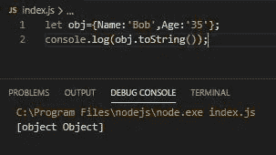
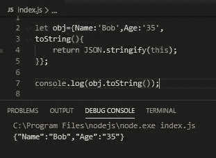
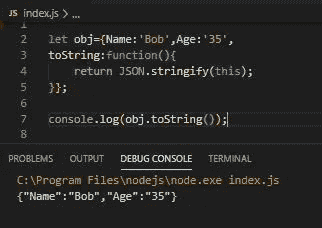
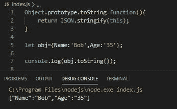

# 有效地覆盖了 JavaScript 的 toString()方法

> 原文：<https://javascript.plainenglish.io/effectively-overriding-javascripts-tostring-method-a0d9b7c97940?source=collection_archive---------3----------------------->

## 正在删除[对象对象]

Photo by Philip Estrada on [Unsplash](https://unsplash.com)

他的文章受到了[马扬克·古普塔](https://medium.com/u/48d9733edcba?source=post_page-----a0d9b7c97940--------------------------------)的文章的启发。我强烈建议你读一读。这里可以找到。

在他的文章中，他解释了**为什么**我们在使用 **alert(Object)** 或 **console.log(Object)** 语句时经常会得到【object Object】。

*【Object Object】的原因可以在*[*MDN*](https://developer.mozilla.org/en-US/docs/Web/JavaScript/Reference/Global_Objects/Object/toString)*以及文章作者* [*【马扬克】*](https://medium.com/u/48d9733edcba?source=post_page-----a0d9b7c97940--------------------------------) *和*[*symbol . tostring tag*](https://developer.mozilla.org/en-US/docs/Web/JavaScript/Reference/Global_Objects/Symbol/toStringTag)*中找到。*

> 我想做的是在我们的对象中覆盖 toString()方法，以允许我们实际上将对象的内容作为字符串来查看。

## 我们将研究两种解决方案。第二个我更喜欢(警告。)

1.  直接在对象中重写 toString()方法。(参见解决方案 1)
2.  覆盖对象。prototype.toString 带有自己的函数。(参见解决方案 2)

## 问题的快速再现

这是一个调用每个对象内置的 toString()方法的例子。这是在服务器端 node.js 中完成的，但也可以使用客户端的“alert()”来完成注意输出。

Output: [object Object]

> 在我看来，这令人失望，而且信息也不丰富。就个人而言，我至少希望看到对象的内容，例如键和值。

# 解决方案 1:

**直接在对象中覆盖 toString()方法(方法 1)**

继续我们的简单对象，让我们创建自己的 toString()方法，该方法在调用时显示对象的键和值。我们的 toString()方法覆盖了内置的 toString()。

**没有【对象对象】！**

我们现在有了键和值。

**注意**:如果需要，可以在下一张图片中写下如下。然而，**非常**重要的是在这种情况下使用一个**匿名函数** "function(){} "而不是一个**箭头函数"** ()= > {}"。

为什么？因为箭头函数的“this”关键字并不指向“this Object”箭头函数有一个[词法本](https://hackernoon.com/javascript-es6-arrow-functions-and-lexical-this-f2a3e2a5e8c4)。

**直接在对象中覆盖 toString()方法(方法 2)**

**没有【对象对象】！**

我们现在有了键和值。

# 解决方案 2

覆盖对象。prototype.toString 带有自己的函数。

> **警告**:覆盖本地对象的属性时要小心。你永远不知道对象什么时候会发生根本性的变化。

*同样，如果您计划使用“this”关键字，请不要使用箭头功能。*

**没有【对象对象】！**

我们现在有了键和值。

# 结论:

在这里，我们已经看到了覆盖内置 toString()方法的重要性以及几种方法。

这只是一个起点，然而，你可以让自定义的 toString()方法返回你喜欢的任何东西，*它不一定要使用 JSON.stringify()* 。

附带的好处是，我们了解了一点匿名函数和箭头函数之间的区别，特别是它们如何处理关键字“this”

## 感谢您的阅读和快乐编码！