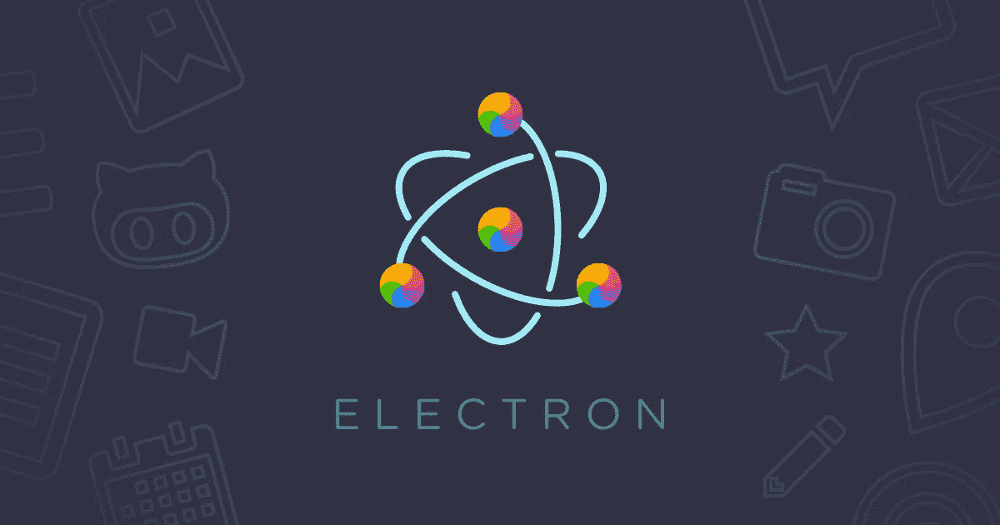

# 电子与 PWA:两种方法的利弊

> 原文：<https://javascript.plainenglish.io/electron-vs-pwa-the-pros-and-cons-of-both-approaches-b4ce172f0022?source=collection_archive---------0----------------------->

从一开始，网络就证明了自己是一个不可思议的平台。网络最大的好处是没有一家公司能够控制它的规范和实现。这就是为什么网络是软件开发人员实现软件的最佳平台。任何坐在任何地方的人都可以访问 Web 应用程序，但是他们的 web 应用体验可能会有很大的不同。特定于平台的 web 应用程序大多与两个关键词相关联，即可靠和丰富，它们甚至存在于桌面、浏览器和任务栏中，即使您的互联网连接很低。

同样，在使用 HTML、CSS 和 JavaScript 等编码语言创建 web 应用程序的帮助下，electronic 就是这样一个框架。然后，这些网络应用程序被设计成与 MAC、Windows 等操作系统兼容。

PWA 或 Progressive Web 应用也是为用户提供可靠性和用户友好性的 Web 应用。这些 web 应用程序是使用渐进式 API 设计的，可以到达任何地方的任何人，同时为用户提供增强的功能和可靠性。

要了解哪种跨平台桌面应用程序最好，您需要评估 Electron 与 PWA 的优缺点:

让我们从电子开始，一个负责开发桌面应用程序的框架，利用最先进的技术，如 HTML、CSS、JS 等。

# 电子

## 赞成的意见

以下是任何用户在使用电子创建跨平台桌面应用程序时都会体验到的一些好处:

*   使用 CSS、HTML、JS:

使用 electronic 最好的方法是通过实现 CSS、JS 和 HTML 等语言来构建桌面应用程序。因为这些语言非常容易学习，你会觉得使用它们很方便。

*   本地网络应用的最佳替代品:

电子的行为几乎像你的本地网络应用，所以你不会有任何困难去理解它们。虽然传统的网络应用程序只能从电脑上下载文件，但除了访问您电脑的文件系统，电子还可以读写数据。

*   用于开发用户界面的铬引擎；

使用铬进行用户界面显示是选择电子的好处之一。有了 chrome，可以访问 chrome 的所有嵌入功能。另一个特点是，即使在进行代码更改后，也不需要重新启动应用程序。这意味着它将立即重新加载，同时简化用户体验。在这种情况下，您不需要外部调试器，因为铬引擎可以检测内存泄漏和其他错误。

*   由大量 API 组成:

开发人员不必为找到实现的正确特性而感到压力。现在，您可以节省开发人员的时间，因为电子版的各种 API 可以很容易地集成到桌面应用程序中。

*   社区支持:

借助巨大的社区支持，您可以重用包并进一步开发它们，而无需从头开始。大量的软件包可以用来缩小开发过程的范围。

## 骗局

*   需要大空间:

如上所述，Electron 运行在 chromium 上，所以要使用每个 Electron 应用程序，你必须下载它的 Chromium 版本。所以 Chromium 包含了大约 2000 万行代码，它的大小和你的操作系统差不多。因此，你必须在现有的操作系统上安装另一个操作系统，才能运行一个应用程序。

*   缺少代码加密:

代码被盗的风险很高，但不幸的是，任何人都可以获得您代码的副本，因为安全性不够严格。

# PWAs

## 赞成的意见

既然你已经知道了电子的利与弊，让我们来看看它的对应物 PWA。

*   高度可访问性:

开发人员声称 PWA 是本机和 web 应用程序的融合，因为 PWA 可以随时在线访问。在互联网连接很强的情况下，pwa 在互联网连接很弱的情况下使用它在上次交互期间缓存的数据。因此，用户在访问 PWAs 时不会遇到任何问题，即使他们的互联网已经关闭。

*   预算友好:

由于 pwa 可以同时在多个平台上运行，因此开发应用程序的成本明显低于本地 web 应用程序。

*   方便的安装过程:

安装 PWAs 时，您不会被重定向到 app store，在安装原生应用程序时，您可能会遇到这种情况。而且这些 web 应用直接下载到你的手机上，安装过程超级快。由于 pwa 托管在云服务器上，它们在您的设备上只占用很少的空间，因此您以后不必面对存储问题。

*   推送通知包括:

您可能知道，推送通知是在您的移动设备上以短信形式弹出的警报，提醒您发生了一些事件。推送通知既可以更新你的任何应用信息，也可以提醒你任何即将发生的事件。PWA 的用户可以点击这些推送消息并直接进入 PWA。

## 骗局

*   高电池使用率:

pwa 是用高级代码编写的，所以你的智能手机必须努力准确地翻译代码。因此，优先考虑长电池寿命的用户通常不愿意使用这些网络应用程序。

*   对设备功能的有限访问:

PWAs 无法访问的设备功能，包括设备的蓝牙连接、NFC 等。

# 让我们看看电子和 pwa 在以下参数下的表现

## 有效性

如果您的设备有兼容 PWA 的浏览器，您可以随时访问 PWA，甚至无需连接到互联网。不幸的是，电子不能安装在任何设备上，因为它们是桌面应用程序的高级版本。

## **性能**

用户声称在加载期间使用 PWA 比使用 Electron 有更好的性能。这部分是因为大部分 javascript 开销被转移到了服务人员身上，减少了加载时间。

## 大小

你会发现没有重量小于 50 MB 的电子应用程序，而大多数 pwa 的大小要小得多，通常在 2Mb 左右。

## 安全性

电子是封闭在本地 web 应用层中的 web 应用，因此安全性并不先进，并且代码的保护也必须手动完成。另一方面，PWAs 的安全性更好，因为它完全依赖于 HTTPS，从浏览器端进行监管。

## 更新和集成

如果你曾经使用过本地应用程序，你会意识到每个人在安装和更新这些应用程序时所面临的麻烦，electronic 也不例外。但是，如果您使用 PWA，所有的更新都将发生在服务器端，并且您在集成更新时不会遇到任何问题。

# 结论

你可能已经注意到，PWA 是明显的赢家；然而，它不是所有业务领域的一体化解决方案。如果您想自由地使用 Node.js 功能进行开发，您应该选择 Electron 而不是 PWA。此外，Electron 允许您访问存储在操作系统中的所有 API，这意味着 Electron 运行在用户模式下，不像 PWA。如果你觉得你的应用程序需要本地应用程序所提供的独特的特性和功能，那么就选择电子版，但是在其他情况下最好坚持使用 PWA。