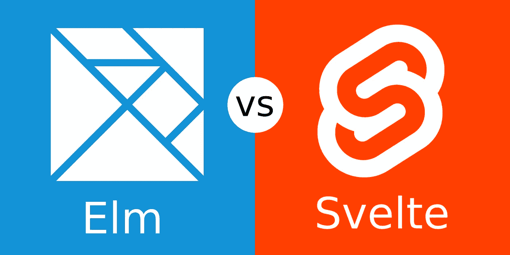
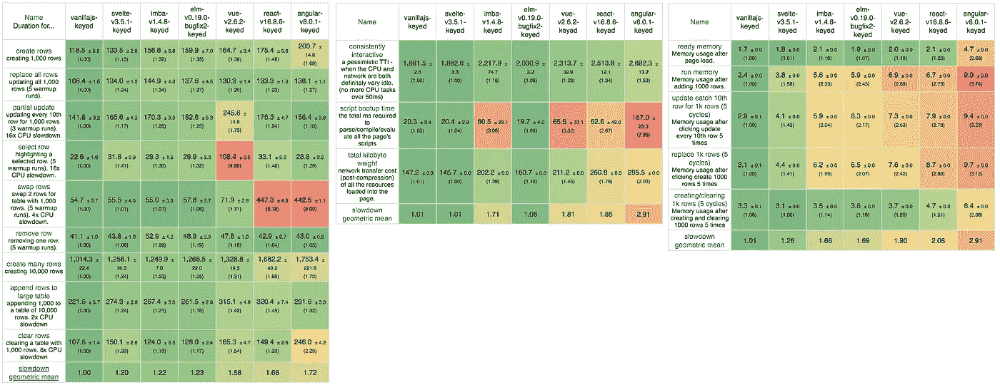

# 从 8 个角度看榆树 vs 苗条

> 原文：<https://javascript.plainenglish.io/elm-vs-svelte-d8e6f0abf667?source=collection_archive---------1----------------------->

## 两个编译成 JavaScript 的框架之间有偏见和肤浅的比较



写这篇关于榆树和苗条的文章(可能不是决定性的)让我很开心。Rich Harris，在 [*写更少的代码*](https://svelte.dev/blog/write-less-code) *，*展示了一个短小精悍的代码片段，作为写少量代码就能完成工作的例子。

我在 Elm 中写了同样的东西，并使用以下标准与 Svelte 进行了比较:

1.  代码大小
2.  演出
3.  建筑
4.  声明式编程与命令式编程
5.  静态与动态类型
6.  数据绑定
7.  真实的单一来源
8.  编译程序

# 1.代码大小

可以预见，Elm 有更多的代码。

## 苗条的版本

```
<script>
    let a = 1;
    let b = 2;
</script><input type="number" bind:value={a}>
<input type="number" bind:value={b}><p>{a} + {b} = {a + b}</p>
```

[工作演示](https://svelte.dev/repl/b18710774e8e45d3a1237e3837ce5f47?version=3.16.7)

## 榆树版本

## 代码字符(不包括空格):

```
Elm.....: 630 characters 
Svelte..: 127 characters
```

(*)我计算字符移除所有制表符/空格，复制到剪贴板，然后运行`pbpaste | wc -c`

## 缩小并拉上拉链

```
Elm.....:  ~27 KB
Svelte..:   ~3 KB
```

哇！这几乎大了一个数量级。

但是，等等，如果 Elm 从 630 个字符的代码中产生了 27 KB，我想它会添加额外的东西，这些东西以后会变得很方便。

让我们分析一下现实世界中的示例应用程序( [Elm](https://elm-spa-example.netlify.com/) 和 [Svelte](https://realworld.svelte.dev/) )的足迹:

```
Elm.....:  ~29 KB (  +2 KB)
Svelte..:  ~15 KB ( +12 KB)
```

是的，榆树的增量小于苗条的增量。这些数字会互换吗？我的意思是，有没有哪个应用的 Svelte build 比 Elm build 大(不使用代码拆分)？这是一个有趣的问题，我没有答案。

如果你想看其他更酷的代码更少的例子，你可以查看官方列表。特别喜欢 todo app 里的[动画。](https://svelte.dev/examples#animate)

# 2.演出

除非您创建的页面包含复杂的动画、视频游戏或显示大量数据，否则在现代硬件/浏览器中，性能不是问题。

但是对于上面提到的情况，斯维特和榆树的表现是一个档次的([这里](https://twitter.com/sveltejs/status/1138094066867089408)和[这里](https://krausest.github.io/js-framework-benchmark/current.html)和[这里](https://www.freecodecamp.org/news/a-realworld-comparison-of-front-end-frameworks-with-benchmarks-2019-update-4be0d3c78075/))。Svelte 直接与 DOM 交互，而 Elm 使用一个经过优化的虚拟 DOM，充分利用其纯度。你可以在这里和这里[找到关于这两种方法的有趣对话。](https://discourse.elm-lang.org/t/could-updating-the-dom-directly-instead-of-the-virtual-dom-get-any-advantage-for-elm-the-way-it-does-for-svelte/3995/10)

理论上，直接修改 DOM 的完美脚本可能具有最佳性能。基于虚拟 DOM 的系统需要做同样的事情，此外，它还需要管理虚拟 DOM。

在现实中，生成一个完美的脚本，可以在过多的情况下工作是不可能的，所以这就是为什么在榆树和苗条的情况下，性能是[并驾齐驱](https://twitter.com/sveltejs/status/1138094066867089408)。

这是 vanilla JavaScript、Svelte、Imba、Elm、Vue、React 和 Angular 的性能对比。越绿越好。



Comprehensive stats of performances, keyed version. The greener, the better. Elm and Svelte are neck and neck. From [https://krausest.github.io/js-framework-benchmark/current.html](https://krausest.github.io/js-framework-benchmark/current.html)

# 3.建筑

Elm 自带了内置的 Elm 架构。这是一种矫枉过正的做法，但是使用 Elm(或任何其他框架，就此而言)来开发这个小应用程序也是矫枉过正。Elm 解决方案是一个可以扩展的框架。有了 Elm，你就拥有了一种具有不变性、模式匹配、类型推理、静态类型等的声明式纯函数语言。有利有弊。

如果不熟悉纯函数的概念，就是“同输入，同输出”，没有副作用的函数。

所有的 Elm 函数都是这样的。这是 Elm 可靠且易于测试的部分原因。

我猜 Svelte 可以用类似于 Elm 架构的东西来写(Svelte 有“on:input”吗？).

# 4.声明式编程与命令式编程

比较这两个片段，Elm 版本似乎有更多的样板文件，Elm 更倾向于“如何做”,而不是简单明了的苗条版本，后者倾向于“做什么”。

我完全赞成声明性方法(“什么”而不是“如何”)，但是我们需要在两者之间保持良好的平衡，否则它就变成了魔术和混淆。

在这个小例子中，双向数据绑定隐藏了某种类型的强制，这种强制可能会产生意外的行为。

# 5.静态与动态类型

处理类型为`number`的输入字段相当困难。我之前在使用 Vue [和 React](https://medium.com/@l.mugnaini/things-that-can-go-wrong-without-a-strictly-typed-language-part-ii-8b239a85f35a) 时遇到过几个[问题。与他们相比，Svelte 在返回“未定义”方面做得非常好。要理解这个问题，请尝试在 number 类型的 type 字段中键入“ee”或任何非数字的内容。浏览器将返回一个空字符串。Svelte 使用了一些魔法来处理这个对开发者隐藏的问题。](https://itnext.io/things-that-can-go-wrong-without-a-strictly-typed-language-d91d418a53a1)

我猜神奇之处在于编译器生成的这个函数:

```
function to_number(value) {
    return value === '' ? undefined : +value;
}
```

在 Elm 示例中，在将结果打印到屏幕之前处理了同样的问题，代码如下:

```
Maybe.map2 (+) (String.toFloat model.a) (String.toFloat model.b)
```

对于不熟悉 Elm 的人来说，这一行类似于:

“我需要存储为字符串的两个浮点数的数学和(字符串是 HTML 输入字段的自然输出，当它们是类型`number`时也是如此)。所以首先我需要将这两个字符串转换成数字，但是转换可能会失败。如果两次转换中有任何一次失败，我也希望 sum 操作失败。”

那行代码的结果是一个`[Maybe Float](https://package.elm-lang.org/packages/elm/core/latest/Maybe#Maybe)`，其中`Maybe`是 Elm 中可能失败的东西的表示。一个`Maybe Float`类型的两个可能值是`Just Float`(耶！一切顺利，这里是你漂亮的浮点数)或者`Nothing`(呜呜，发生了不好的事情，不好意思，没有你的号)。

在没有数字的情况下，我们在屏幕上打印`undefined`,只是为了模仿这个简单的例子，因为实际上 Elm 中的`undefined`并不存在。而`null`也没有。

## JavaScript 咬

是的，bites，而不是 bytes，就像 JavaScript 类型系统在咬你的时候。

仍然与类型有关，如果您将`a`和`b`的类型更改为字符串，如

```
<script>
    let a = "1";
    let b = "2";
</script><input type="number" bind:value={a}>
<input type="number" bind:value={b}><p>{a} + {b} = {a + b}</p>
```

[工作演示](https://svelte.dev/repl/b18710774e8e45d3a1237e3837ce5f47?version=3.16.7)

浏览器会将其呈现为:“1 + 2 = 12”，因为 JavaScript 中的“+”可以处理任何东西，包括 string(它将它们串联起来)。Svelte 正在后台进行一些类型转换，但是在这种情况下，函数`to_number`在初始化期间没有运行。

在严格类型化的语言中不会出现这种情况。如果你将`a`或`b`初始化为字符串，编译器会报错，因为[“+”只接受数字](https://package.elm-lang.org/packages/elm/core/latest/Basics#+)。

一旦 Svelte 支持 Typescript，这些问题可能会得到解决。

## 类型灵活性

作为后续说明，虽然精简版将`a`和`b`定义为类型`number`，但在 Elm 中我们将它们定义为字符串:

```
init = { a = "1", b = "2" }
```

我决定使用字符串，因为这是 HTML 的自然产物。然后在添加它们之前，我把它们转换成浮点型。

如果我们想将它们存储为数字，我们应该使用

```
init = { a = Just 1, b = Just 2 }
```

考虑到字符串到数字转换过程中可能出现的故障。

# 6.数据绑定

Elm 没有自动双向数据绑定。在这个意义上，Elm 更类似于原始的 HTML。榆树代码是

```
input [ onInput ChangeA, value model.a, type_ "number" ] []
```

这在 HTML 中是类似的

```
<input oninput="...", value=model.a, type="number">
```

绑定是用`onInput`和值属性完成的，其中`"..."`是用消息`ChangeA`和模型调用`update`函数的东西，用伪代码:`update( [ "ChangeA", this.value ], model )`。

苗条地:

```
<input type="number" bind:value={a}>
```

与原`bind:`条款绑定。

这两种方法都有优点和缺点。Elm 方式需要更多的布线，并允许您在必要时修改流程。苗条的方法更简单，对你隐藏了心流。

# 7.真实的单一来源

在 Elm 中，按照设计，在应用程序的生命周期中只有一个“东西”(即`model`)可以修改。在这种情况下，我们选择了包含两个值 a 和 b 的记录。

在这个简单的例子中，有两个值被修改，它们是组件级别的状态。保持状态苗条有几种方法:`Stores`、`Context`、`Props`。`Stores`是保持组件外部状态的方式，可以是`writable`、`readable`、`derived`和`custom`类型。

同样，在 Elm 中，状态在应用程序级别只有一个。其他任何东西都不能有独立的国家。
事件 Elm 中的所有事件都被转换成消息，在这个简单的例子中我们使用了两条消息:

```
type Msg = ChangeA String | ChangeB String
```

一个用于更新输入字段`a`，一个用于更新输入字段`b`。我们可以只使用一条消息:

```
type Msg = Change InputField String
```

其中`InputField`是一个定制类型，或者更一般一点(但不是 Elm 中的最佳实践):

```
type Msg = Change String String
```

这不是一个好的做法，因为在 Elm 中，您希望编译器尽可能严格，以便在编译时而不是在执行时拦截 bug。有了 String，编译器就不会给你一个错误，例如，如果你传递一个既不是`a`也不是`b`的字符串。

# 8.编译程序

Elm 和 Svelte 都有编译器，并且都编译成 JavaScript。

[Elm 编译器](https://github.com/elm/compiler/tree/master/compiler/src)是 26K 行的 Haskell，而 [Svelte 编译器](https://github.com/sveltejs/svelte/tree/master/src/compiler)是 15K 行的 Typescript。

Elm 编译器生成一个大型 JavaScript 文件，该文件已经与 Elm 运行时捆绑在一起，随时可以使用。它有 3 种模式:正常、调试(打开时间旅行调试器)和优化(打开优化使代码更小更快)。

Svelte 编译器生成一个小的 JavaScript 文件，在第二步中，该文件与 [Svelte 运行时](https://github.com/sveltejs/svelte/tree/master/src/runtime)捆绑在一起。你可以在这里找到编译文件[的分析，在这里](https://dev.to/zev/how-does-svelte-actually-work-part-1-j9m)找到[的分析。](https://dev.to/zev/how-does-svelte-actually-work-part-2-3gbp)

Svelte 编译器有几种模式，最重要的是:服务器端渲染、开发、CSS(将 CSS 包含在 JavaScript 中并在运行时注入)、Hydratable、不可变(告诉编译器你承诺不改变任何对象)、Legacy(在 IE9 和 IE10 中工作)。

# 关于真实世界例子和性能的更多信息

现实世界中的例子可能已经过时或者没有很好的实现，所以对这些观察要有所保留。

我对现实世界的例子进行了一些简单的测试，但是我没有注意到任何相关的差异。在慢速网络连接上，苗条版本给出了更快的数字(它也使用了 Elm 中没有的[代码分割),但是视觉上 Elm 版本渲染得更快。细长版本显示文本“加载…”很长一段时间，这可能是由一些实现问题引起的。在苗条版本中，浏览器在 4 个槽中下载 7 个 JavaScript 块，页面的主要部分仅在第四个槽后下载。](https://elm-lang.org/news/small-assets-without-the-headache)

所有测试都是在“慢 3G”网络的 MacBook Pro 上使用 Chrome 79.0.3945.88 进行的。


Elm on the left, Svelte on the right. Performances are similar


Svelte — Assets are served as four slots for a total of seven chunks. While the fourth chunk is coming the page is still “Loading…”. An implementation issue?


Svelte — The last chunk


Elm —The first (and last) chunk

# 那么，谁是赢家？🏆

我们只是触及了这两项技术的表面，但我们能宣布赢家吗？

是的，谁为正确的任务选择正确的工具，谁就是赢家。

这篇文章强调了这两个框架之间的主要客观权衡之一。

> S velte 让你[接近 HTML/CSS/JavaScript](https://gist.github.com/Rich-Harris/0f910048478c2a6505d1c32185b61934) ，而 [Elm 和 elm-ui 让你离开它们](https://medium.com/@l.mugnaini/is-the-future-of-front-end-development-without-html-css-and-javascript-e7bb0877980e?)以换取一些好处，例如[无运行时异常](https://twitter.com/rtfeldman/status/961051166783213570)。

其他概念如学习曲线、逐步采用、性能、足迹大小都有待讨论。

我称赞 Svelte 为前端工程界带来了有趣的新想法，我将继续尝试它。污染是一件好事，我们应该永远学习(复制？)相互脱离。

与此同时，我将继续使用 Elm，因为我相信它最适合我正在构建的应用程序。我也是 elm-ui 的快乐用户，重新编写 CSS 的想法并不吸引人。

带有严格类型和类型推断的纯函数式编程的整个概念感觉像是一种更高形式的编程，它引起了我的共鸣。