# 使用 EmailJS 从 React 应用程序发送电子邮件

> 原文：<https://javascript.plainenglish.io/email-from-your-react-project-w-emailjs-d6af68fa5c17?source=collection_archive---------4----------------------->


今天我将实现一个真正有用的服务， [EmailJS](https://www.emailjs.com) 。这种第三方服务使向 React 项目添加电子邮件功能变得快速而简单。

上周我写了一个简单的指南，我们使用 React Hook Forms (RHF)在 React 项目中创建一个带有验证的表单。


simple form with validations.

今天，我们将使用 EmailJS 添加电子邮件功能。当用户点击`Submit`时，表格中输入的信息将通过电子邮件发送到我们指定的地址。

请随意复制上周的代码[并继续编码！](https://medium.com/javascript-in-plain-english/form-validations-react-hook-forms-df129fece668)

*本指南通过 EmailJS 将 React 项目连接到 Gmail。EmailJS 可以用于普通的 JS 项目和许多 JS 框架。它还可以连接到许多电子邮件服务，包括 iCloud 等个人帐户和 Mailgun 等交易帐户。* [*这些服务的设置说明请参考文档。*](https://www.emailjs.com/docs/tutorial/overview/)

# 创建一个 EmailJS 帐户。

在这里报名。

免费层足以让你开始。它允许每月多达 200 封电子邮件，每封请求高达 50kb。

登录新帐户后，您将被定向到控制面板。`[https://dashboard.emailjs.com/admin](https://dashboard.emailjs.com/admin)`

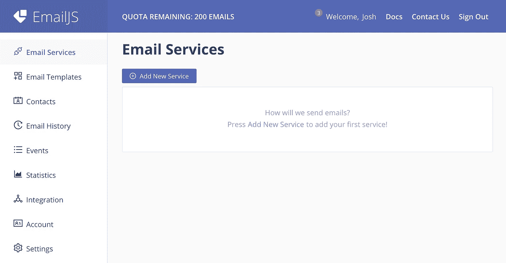

在`Email Services`部分，点击`Add New Service`。

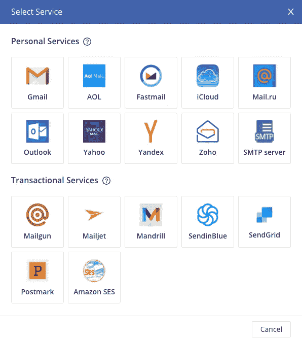

选择您想要连接的电子邮件服务。

**个人邮箱**一般有基本功能；电子邮件地址和收件箱。

交易型电子邮件被设计成向很多人发送大量的电子邮件。

对于这个项目，我们的联系表单需要将用户的消息发送给使用 Gmail 的网站所有者，因此我们将选择`Personal Services`部分下的`gmail`。

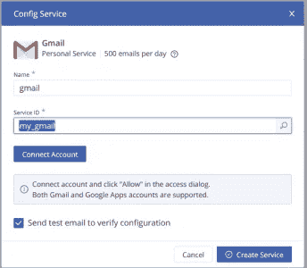

选择名称和服务 id。这些可以是你想要的任何名称，所以我建议选择描述性的名称。

*****记下服务 ID，稍后您将在您的 JavaScript 文件中使用它。***

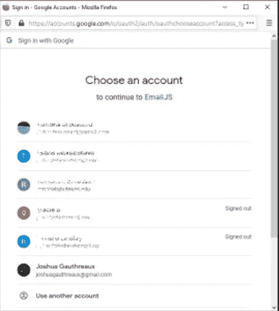

登录或从 Google 帐户弹出窗口中选择您的登录名。

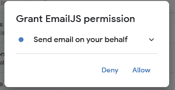

选择`Allow`。

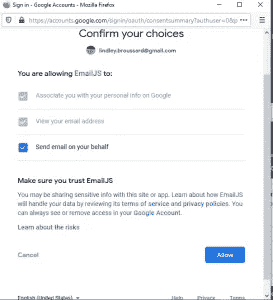

再次点击`Allow`确认。

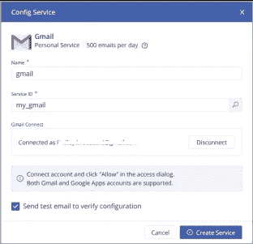

点击`Create Service`。

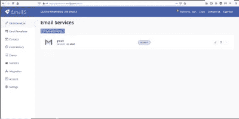

一切就绪！

# 创建模板。

EmailJS 中的模板规定了邮件应该发送到哪里、包含什么内容以及主题是什么。

有许多配置选项，所以请在这里随意探索您的选项[。](https://www.emailjs.com/docs/tutorial/creating-email-template/)

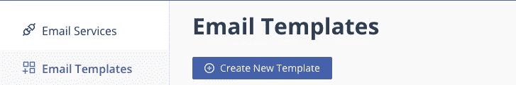

首先点击左边的`Email Templates`，然后点击`Create New Template`。

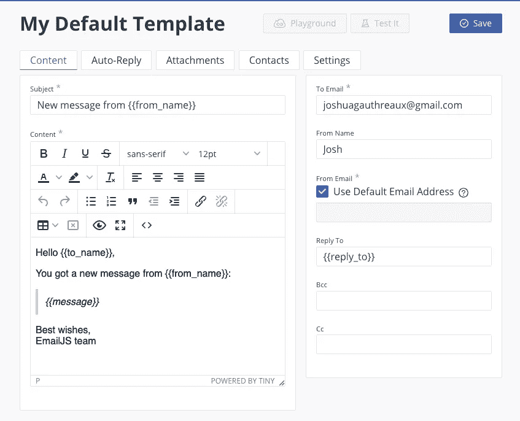

Creat New Template

上面显示的像`{{from_name}}`一样的双花括号是变量。当用户填写我们的表单时，我们将使用这些变量将信息传递给 EmailJS。

新模板填充了一些通用语言(如上图所示)。我们可以随心所欲地修改。下面是我们模板中每个可用字段的简要描述:

*   **收件人:**包含此邮件的目的地。在本指南中，它是我们的个人电子邮件地址。
*   **从名称**可选。文件没有明确说明这是干什么用的，所以我只输入了我的名字。
*   **发件人电子邮件:**发件人的电子邮件地址，它将显示给收件人。如果启用了默认电子邮件地址复选框，EmailJS 将使用与正在使用的电子邮件服务相关联的电子邮件地址。
*   **回复:**设置回复邮件应发送到的电子邮件地址。
*   **密件抄送和抄送:**用于向您列出的所有人发送邮件副本。我们不会在本指南中使用它们。
*   **主题:**保存你想要填充主题行的任何内容。
*   **内容:**邮件正文。我们将在这里传递用户消息、他们的姓名以及他们的回信地址。

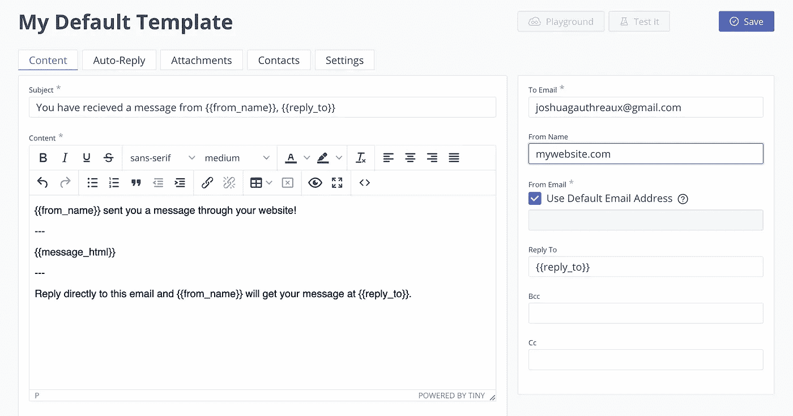

以你喜欢的任何方式填写表格，同时确保通过`{{}}`传递变量。您可以随意命名，但要确保它们与您的 JavaScript 文件相匹配。

点击`Save`。

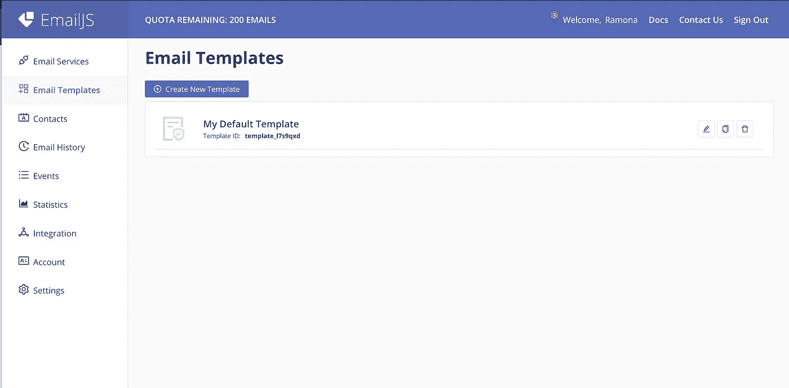

**记下** `**Template ID**` **。**

到目前为止，我们已经有了`Template ID`和`Service ID`，但我们还需要`User ID`。

在主页面上，点击`Integration`。滚动到底部的`API Keys`。**复制** `**User ID**` **。**

花点时间去欣赏莱昂纳尔·里奇带来的流畅氛围。你应得的！

# 连接到我们的 React 项目

打开我们上周创建的 React 项目。我们将继续处理 **Contact.js** 文件以及**index.html**文件。

我们将很快使用在 EmailJS 中创建模板时保存的`service ID`、`template ID`和`user ID`！

## 更新 index.html

下面的`<script>`标签将允许我们连接 EmailJS。将它们添加到`<head>`的任何地方。我已经删除了`<head>`标签中的所有内容，这样更容易阅读，但是你将保留它。

在第 10 行输入您自己的`User ID`来代替`user_xxxxxxxxxxxxxxxxxxx`。请确保将其作为字符串传递。

## 更新 Contact.js

这是我们上次留下的文件:

Contact.js

## 更新`onSubmit`

我们的`onSubmit`当前将我们的值打印到日志中，如下所示:

```
const onSubmit = values => console.log(values);
```

将其转换为一个函数，该函数将接收表单中提交的信息，并将其发送到 EmailJS:

snippet from Contact.js

下面是我们新的`onSubmit`函数的分解。

*   我们把`data`传给了`onSubmit`。`data`表示用户点击`Submit`时发送的表单内容。
*   我们传递了事件`r`，我们将用它来重置表单字段。
*   提醒让用户知道他们的消息已经发送。
*   我们设置两个常数:一个用于固定`template ID`，另一个用于固定`service ID`。
*   最后，我们调用了一个函数`sendFeedback()`(接下来我们将创建这个函数)并向它传递我们的 id 和表单数据。注意，我们对数据进行了析构，这样我们就可以将它转换成 EmailJS 可以识别的变量。

## 创建发送反馈()

该功能负责将您的用户数据发送到 EmailJS。

*   emailjs.send()是我们向 emailjs 发送数据的方式。我们从浏览器`window`中调用它，并传递传递到`sendFeedback()`中的 serviceID、templateID 和表单数据。
*   `.then()`接收响应并向控制台发送消息。如果有任何错误，它会将它们显示在控制台上，并给出一条很好的消息。(礼貌总是很重要的)。

## 一切就绪！

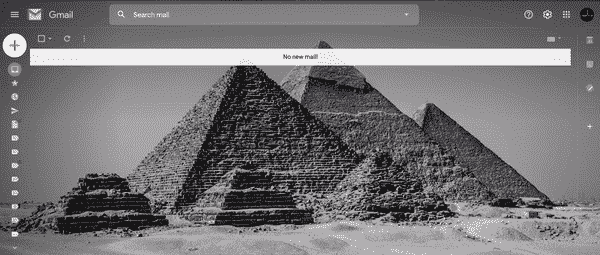

查看我的其他一些故事； [*CSS 重置*](https://medium.com/swlh/css-reset-2b4831d4664e) *，或者* [*反冲. js &简单全局状态*](https://medium.com/javascript-in-plain-english/recoil-js-simple-global-state-d84100b3d535?source=your_stories_page-------------------------------------) *。在 joshuagauthreaux@gmail.com 或通过*[*joshgotro.com*](https://www.joshgotro.com/)*联系我。*

感谢您的阅读，祝您身体健康！