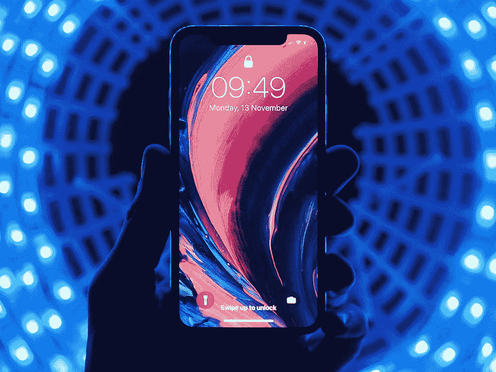

# 将二维码扫描仪和浏览器结合到您的下一个移动应用中

> 原文：<https://javascript.plainenglish.io/embed-a-qr-code-scanner-and-browser-into-your-next-mobile-app-42245cbdebf?source=collection_archive---------6----------------------->

[@youssefsarhan](https://unsplash.com/@youssefsarhan) — unsplash.com

## 如何在一个屏幕上创建无缝的二维码扫描仪和浏览器

# 介绍

在最近的一个自由职业项目中，我被要求提供嵌入独立移动 iOS 应用程序中的二维码扫描功能。我知道在节点包管理器上有二维码扫描包，但是在我的工作中从来不需要使用它们！

在博客和包装文档上的一些搜索向您展示了如何读取二维码并显示信息，但实际上并没有对这些信息做任何事情。这相对令人沮丧，因为二维码的目的是传递信息，通常是以浏览器链接的形式。

在本教程中，我将带您了解如何为我的 React Native iOS 应用程序创建嵌入式二维码扫描仪。在本教程结束时，您将很好地了解 React Native 相关的部分，包括状态，组件的生命周期。

# 你会学到什么

1.  反应类组件和函数组件之间的区别
2.  如何创建反应类组件
3.  如何更新反应类组件中的状态
4.  如何在我们的代码中使用条件渲染在相机和浏览器之间切换。
5.  关于不同的 React Native 内置核心组件

# 安装

我将假设您熟悉 React Native 安装程序。如果您是第一次接触 React Native，请在继续学习本教程之前查看此处进行设置！

我们必须安装以下软件包

1.  二维码扫描仪
2.  对本地网络视图做出反应
3.  反应本机摄像机

全新安装 React Native 后，在终端的应用程序目录中键入以下命令

`npm install --save react-native-camera`

`npm install --save react-native-webview`

`npm install --save react-native-qrcode-scanner`

现在别忘了

`cd ios && pod install`

# 设置二维码扫描仪导入

在我们开始之前，请确保您正在创建一个盲反应本机应用程序并使用 Xcode。这是因为我们希望能够允许我们的应用程序访问相机，这可以通过改变 Xcode 中的设置来实现。

让我们首先导入所有的包

注 1。我们正在从第一行的反应中导入扩展组件类。这是创建反应类组件所必需的。

2.我们需要一些内置的核心反应原生组件。视图，它是支持布局的容器。用于显示文本的文本和我们将创建的按钮的可触摸不透明度。样式表是创建基本样式选择所必需的。

3.我们导入了另一个名为 WebView 的 React Native 组件，以此来显示我们可以用于二维码扫描仪的浏览器。

4.我们进口二维码扫描仪和 RNCamera。二维码扫描仪包使用的是 RNCamera，因此导入它也很重要

作为设置的一部分，请务必遵循二维码扫描仪文档的启动说明[此处](https://github.com/moaazsidat/react-native-qrcode-scanner)为二维码扫描仪应用程序。您需要确保您允许您的应用程序有权限访问您手机上的摄像头，以便应用程序正常工作。

# 理解和创建 React 类组件

为了创建这个应用程序，我们将在代码中使用 React 类组件。这是因为类组件对于修改称为状态的东西很有用。你可能会问什么是状态？

state 是我们创建的一个对象，它可以改变 React 组件的值，从而改变 React 组件的渲染方式。如果我们更改状态值，这将重新呈现组件，为我们在屏幕上看到的输出提供更改。

一个类比可能有助于我们在这里巩固这一切意味着什么。水和冰的区别是什么？当然是温度啦！这个数字是热能的量度。改变这个数字会使水变成冰，反之亦然。这正是在改变 React 组件的状态时发生的事情。React 组件的输出将根据状态对象的变化而变化。

我们将使用状态的概念，通过改变状态对象在 QR 码阅读器和浏览器之间切换。这就是为什么我们要使用类组件！

类组件提供改变状态对象的功能，而功能组件被称为无状态组件。这是类反应组件和函数反应组件的根本区别。当您编写 React 和 React 本机应用程序时，请记住这一点。

解释完毕后，让我们看看应用程序的前几行代码。

因此，要创建 React 类组件，我们必须首先扩展 React 组件。React 组件是 React 最简单的构建块，在我们创建的任何类组件中都需要引用它。

带有两个键`webview`和`url`的状态对象。我们分别将它们设置为`false`和`''`。我们说键`webview`为假的原因是我们不希望 WebView 组件首先呈现。此外，我们目前还不知道二维码的网址是什么。为了将 WebView 组件定向到正确的 URL，我们需要能够在二维码扫描时更改该 URL。

[@aka_opex](https://unsplash.com/@aka_opex) — unsplash.com

# 二维码扫描仪

在课堂上，我们现在已经准备好学习二维码扫描仪的代码。

首先调用`render(){}`。这是类组件唯一必需的方法。这个方法将使我们的组件在网页上做一些事情，或者在我们的情况下，在移动应用程序上做一些事情。

我们将逻辑封装在 React Native 的内置核心组件中。这相当于`div` HTML 标签上的渲染。它们可以被样式化，在这种情况下，我们使用`flex:1`来样式化组件以填充整个屏幕。

接下来，我们在`View`标签内的花括号中提供了两段 JavaScript 代码。

我们可以通过`this.state.webview`访问状态对象键`webview`，我们知道在这个阶段这是假的。在这个表达式之后，您将首先注意到使用了`&&`操作符。这是因为我们正在使用条件渲染。也就是说，我们希望根据两个表达式来渲染组件。正是这一点让我们可以在浏览器和二维码扫描仪之间切换。

逻辑是这样的，我们用一个假值定义了状态键`webview`。因此，使用& &操作符，我们得到两个子表达式的短路计算，即整个语句为假。

现在`<WebView>`内置的核心组件是我们告诉 React Native 我们想要一个浏览器出现在屏幕上的方式。参数`source={{uri: this.state.url}`是我们如何定义我们想要提供给浏览器的 URL。我们给组件一个样式并缩放它以适合页面。

所以在这段 JavaScript 中，表达式是假的。也就是说，我们不希望 React Native 呈现 Webview 组件。直到我们改变 webview 状态。

在第二段 JavaScript 中，我们询问变量`webview`是否为假，右边的子表达式是否为真。右边的子表达式返回 true，很像 JavaScript 中除空字符串之外的任何字符串都被强制为 true。因此，整个表达式为真，QR 码扫描仪，因此，得到渲染。

QR 码扫描仪组件具有以下参数。`onread`是读取二维码时提供数据传输方式所必需的。在这种情况下，我们调用一个要定义的方法，我们绑定该方法，以允许我们在方法本身之外的类中访问该方法。这是允许我们将该方法用作 QR 码组件的一部分所必需的。

相应地设置`reactivate`和`reactivateTimeout`参数，以确保二维码扫描仪在第一次扫描后能够再次扫描。我们将在下一节中利用这一点！

因此，在该组件的默认呈现中，应该出现的是 QR 码扫描仪。

现在，当二维码扫描仪读取二维码时，我们希望能够使用这个功能做些什么？

扫描 QR 码时，我们希望将状态变量 URL 设置为相应的 URL，而不是在屏幕上显示 URL。

我们通过召唤`setState`来做到这一点。这允许我们改变我们在构造函数方法中定义的状态。setState 接受在状态上定义的键的对象，但是这一次我们要改变这些键的值。首先，我们从已读取的 QR 码中获取数据，这些数据被捆绑在变量`e.data`中，并为其设置 URL 键。然后我们将`webview`改为 true。

通过使用`setState`,组件自动获得更新状态的重新渲染。我们告诉 React 我们想要重新渲染组件。这一次，我们的条件呈现中使用的第一段花括号中的 JavaScript 现在为真，而不是第二段花括号中的 JavaScript。浏览器现在加载了来自二维码的 URL！

因此，在这些基本要素都不存在的情况下，你可能会很好地思考下一步是什么？从用户的角度考虑一下，我们现在可以在应用程序中浏览网站，但如果我们想扫描另一个二维码呢？我们想办法回到二维码扫描仪。

# 切换回二维码扫描仪

所以我们现在可能已经猜到我们是如何切换回来的了。当然是通过修改状态！在这种情况下，我们希望更新状态，使`webview`为假。这样，当我们重新渲染组件时，QR 码扫描仪就会被渲染。

这里我们提供了一个可以点击的按钮，带有一些样式。本质上，我们通过`alignItems`和`justifyContent`将内容居中。我们正在制作一个有一些不透明度的圆形按钮。然后，我们将它绝对放置在屏幕的右下角。如果你熟悉 CSS，那么这应该对你来说很熟悉！

现在有了按钮，当我们按下按钮时，我们可以使用参数`onPress`来传递函数或函数调用。在本例中，我们提供了一个将`webview`的状态更新为 false 的函数。然后，这将重新呈现 React 组件，这就是我们如何切换 QR 码扫描仪再次出现。

文本内置组件允许我们交流按钮的功能，并确保文本居中对齐。

现在，我们有了一个功能齐全的二维码扫描仪和一个嵌入式浏览器！

如果你想看完整的代码示例，请点击查看[。](https://gist.github.com/medic-code/f95004863480bc6552fab53c8fe7fc6e)

# 试映

请参见[这里的](https://coding-medic.com/example/)预览上述代码。

# 检查你的理解的问题

1.  什么是 React 组件？
2.  为什么在 React Native 中使用类组件而不是函数组件？
3.  什么是状态？
4.  什么是条件渲染？

# 结论

在本教程中，您已经学习了使用类组件的基本原理。我们还介绍了如何使用状态和条件呈现的概念来动态改变移动应用程序的屏幕。在本例中，我们展示了如何在同一屏幕上切换二维码阅读器和浏览器，并在完成浏览后切换回摄像头！多酷啊。

## 关于作者

我是一名执业医师和教育家，也是一名网站开发者。请看[这里](http://www.coding-medic.com/)关于我在我的博客和其他帖子上关于项目的更多细节。如果你想和我联系，请点击这里