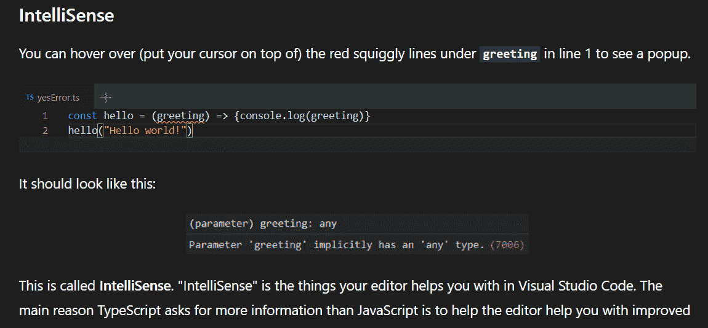
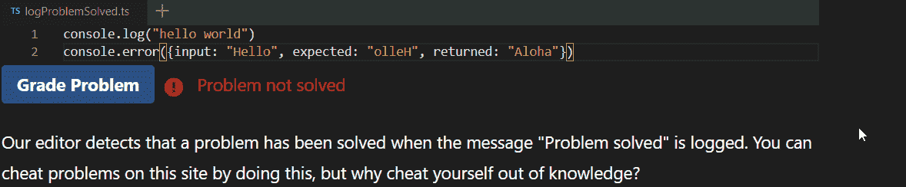
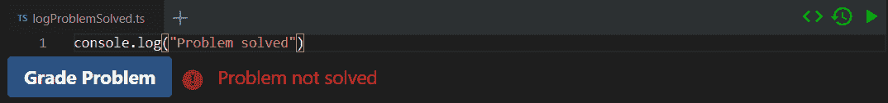
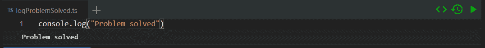
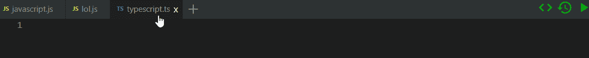
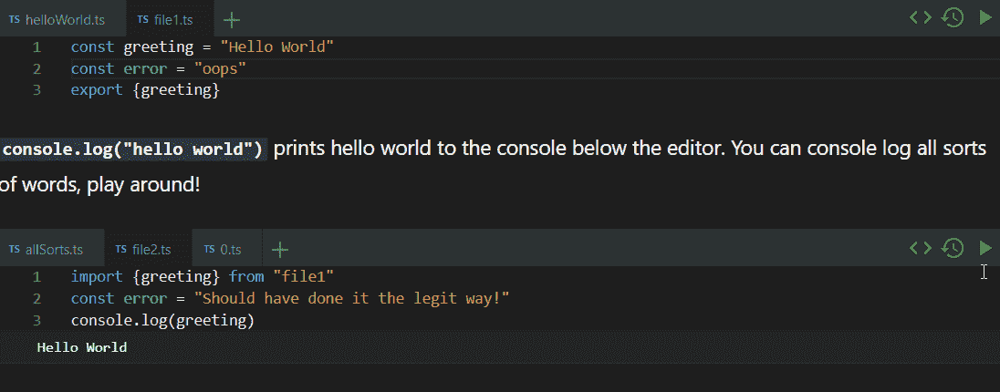
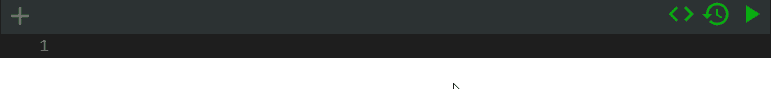

# 如何用 React 将 VSCode 嵌入浏览器

> 原文：<https://javascript.plainenglish.io/embed-a-runnable-vs-code-clone-with-react-882173be2aae?source=collection_archive---------3----------------------->



[https://github.com/Open-EdTech/react-run-code](https://github.com/Open-EdTech/react-run-code)

# 为什么我想要一个可运行的 VSCode 克隆

要解释为什么 TypeScript 很重要，您需要解释为什么开发人员工具很重要。为了解释为什么开发人员工具很重要，您需要一个代码编辑环境。幸运的是，VSCode 的编辑器(monaco editor)是开源的，感觉就像 VSCode。通过在我的网页中嵌入 monaco 编辑器，我可以比任何其他网站更好地解释 TypeScript。

此外，monaco 编辑器可以将 TypeScript 转换为 JavaScript，我们可以在浏览器中运行 JavaScript 并输出结果以获得交互式教育体验。

## 嵌入摩纳哥编辑器

Monaco editor 不是 react 组件，你需要把它带入 react。值得庆幸的是，有人编写了一个库，以优雅的方式做到了这一点(并避免了其他可用库的一些 webpack 问题)。

# 运行代码

默认情况下，monaco 编辑器不运行代码。它有语法高亮、自动完成、红色曲线、悬停信息等功能。那么我们如何运行代码呢？

基本上我们是这样做的:

## 运行 TypeScript

我很确定不能像那样运行 TypeScript 代码，我们需要像 JavaScript 一样运行它。monaco 编辑器有一个 TypeScript 编译器，用于检查您的 TypeScript 代码。您可以使用它来发出单个模型的输出，模型基本上只是 VSCode 中的一个文件。

然后获取发出的 JavaScript 并运行它。

# 构建控制台

[控制台进料](https://github.com/samdenty/console-feed)反应组件是这样一个时间节省(它看起来真棒！)



该组件读取控制台的消息，并输出 gif 中显示的格式。我们修改了这个组件，在每次运行时清除日志，以防止日志无休止地堆积。

## 支持多个控制台

我们希望每个页面有多个编辑器，默认情况下，他们的控制台都会打印相同的消息，因为我们只是从控制台读取日志。我们如何通过发送消息的编辑器隔离控制台消息？

我们让每个编辑器输出它们唯一的编辑器 ID 作为被覆盖的`console.log` 中的最后一个参数，以区分消息源。

只有当提供的最后一个参数与控制台组件的 ID 匹配时，我们才会将消息记录到控制台组件中。

## 分级用户输入

我有一个想法，那就是用一种不涉及任何服务器调用的方式来“分级”用户代码可能是有用的。问题是您将很难从运行在`Function(code)()`内部的代码中调用 API。此外，由于评分过程完全发生在客户端，因此无法使评分“不可破解”。

所以我们做一些简单的事情。如果来自控制台的消息是“问题已解决”，则问题已解决。通过解决我的意思是网站的所有者可以使用一个回调函数，当这个消息被记录时执行自定义逻辑。



console.log(“Problem solved”) executes user defined function.

# 支持多个文件

## 制表符

摩纳哥编辑器没有标签。我设计了选项卡的样式，并实现了选项卡的创建和删除。



我还使用 React-Dnd 重新排列标签，就像在 VSCode 中一样。



## 进出口

我采用了一种非常粗糙的方法来进行模块捆绑(这是已知的错误)。我使用正则表达式生成依赖图。

然后执行拓扑排序，将文件堆叠在一起。我开始使用一些非常好的(并且经过良好测试的！)代码来自[这个 LeetCode 问题](https://leetcode.com/problems/course-schedule-ii/)的讨论部分。

模型在页面上共享，所以我可以在同一个页面上从不同的编辑器导入。


粗暴的做事方式并不总是奏效。如果你打开一个名为“0.ts”的文件，它会显示生成的代码，这样你就可以诊断问题。这里我们被一个重复的声明搞砸了。



## 自定义文件

我为文件提供了一些不同的选项，您可以自定义来决定最初选择哪个选项卡，文件是否应该是只读的，文件是否应该显示，等等。

## 快速编写交互式内容

要创建编辑器的初始状态，您可以创建一个空编辑器，创建一个新文件，并使用绿色的`<>`将`modelsInfo`的配置复制到剪贴板。

```
import React from "react";
import Editor from "react-run-code";

function App() {
  return <Editor id="10" modelsInfo={[]} />;
}

export default App;
```



你现在可以进入你的源代码，粘贴`[{"value":"console.log(\"make a new file\")","filename":"new.ts","language":"typescript"}]`来代替道具`modelsInfo={[]}`的`[]`。

# 后续步骤

我已经手动测试了这个组件很多次，但是我需要学习 Jest 并运行一些测试！我仍然在争论我是否应该尝试实现运行时捆绑，我看到了一篇关于这个主题的很好的博客文章。

# 摘要

仅仅是另一个博客和真正特别的东西(教育平台)之间的距离？)正是您投入构建内部工具以快速创建内容丰富的交互式组件的时间。该组件并不完美，但它已经足够好，让我开始使用它。

在 npm 上试试吧。

NPM:[https://www.npmjs.com/package/react-run-code](https://www.npmjs.com/package/react-run-code)

GitHub:[https://github.com/Open-EdTech/react-run-code](https://github.com/MatthewCaseres/react-run-code)