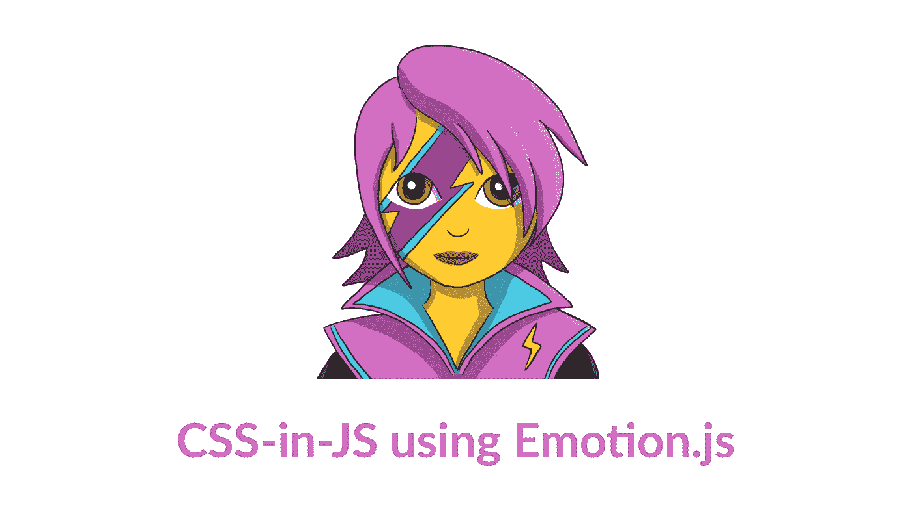

# 如何用情感来塑造你的反应组件

> 原文：<https://javascript.plainenglish.io/emotion-the-next-generation-of-css-in-js-5cdf4a07987f?source=collection_archive---------6----------------------->

## 下一代 CSS-in-JS



Emotion 是一个为用 JavaScript 编写 css 样式而设计的库。除了使用诸如源地图、标签和测试实用程序等功能提供出色的开发人员体验之外，它还提供了强大且可预测的样式组合。字符串和对象样式都受支持。

# 快速启动

只需一次导入即可启动并运行。

```
npm install --save @emotion/core
```

# 示例代码

```
/** @jsx jsx */
import { jsx } from '@emotion/core'

let SomeComponent = props => {
  return (
    <div
      css={{
        color: 'hotpink'
      }}
      {...props}
    />
  )
}
```

# 演示沙盒

[演示代码沙盒](https://codesandbox.io/s/pk1qjqpw67)

# 例子

*   [情感网站](https://github.com/emotion-js/emotion/blob/master/site) [ [在这里演示](https://emotion.sh/)
*   [下一步-hnpwa-guide-kit](https://github.com/tkh44/next-hnpwa-guide-kit) [ [在此演示](https://hnpwa.life/)
*   [reactivesearch](https://github.com/appbaseio/reactivesearch) ，一个用于 Elasticsearch [ [网站](https://opensource.appbase.io/reactivesearch/) ]的 react UI 库
*   [circuit-ui](https://github.com/sumup/circuit-ui) ，一个在 SumUp 上构建的 react 组件库 [Storybook](https://sumup.github.io/circuit-ui/)

# 文档

经常查看的文档:

*   [简介](https://emotion.sh/docs/introduction)
*   [安装](https://emotion.sh/docs/install)
*   [CSS 道具](https://emotion.sh/docs/css-prop)
*   [样式组件](https://emotion.sh/docs/styled)
*   [构图](https://emotion.sh/docs/composition)
*   [嵌套选择器](https://emotion.sh/docs/nested)
*   [媒体查询](https://emotion.sh/docs/media-queries)

# 开源代码库

[](https://github.com/emotion-js/emotion) [## emotion-js/情感

### 下一代 CSS-in-JS 需要支持升级到 Emotion 10？看迁移引导情绪是一种表演…

github.com](https://github.com/emotion-js/emotion)