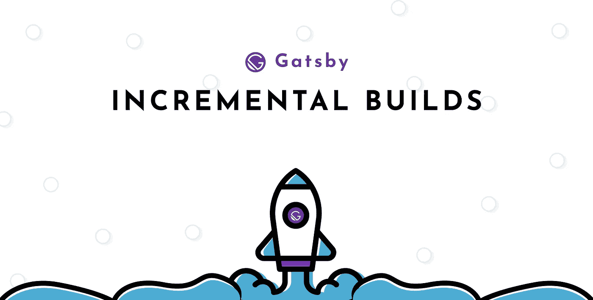
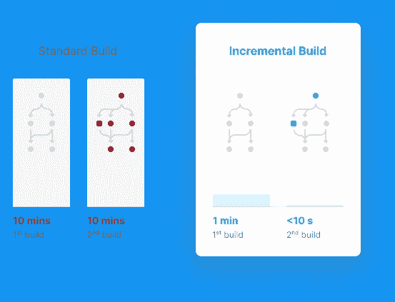
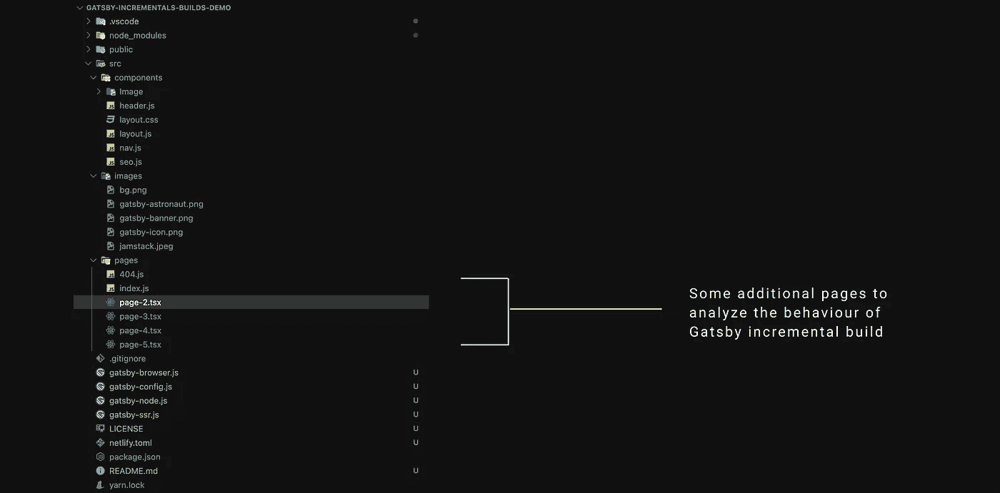
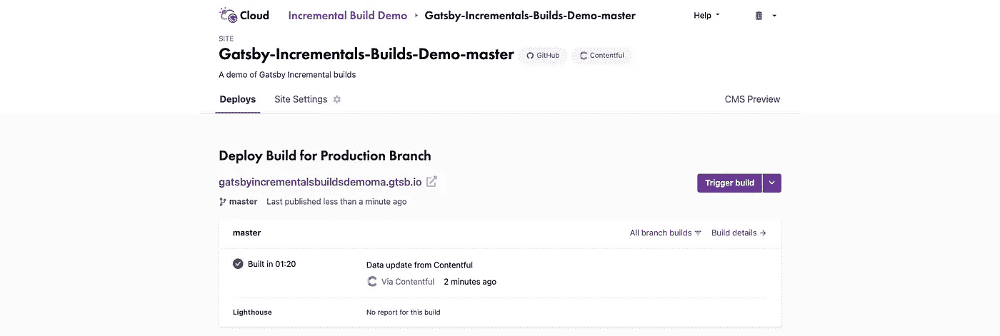

# 通过增量构建实现惊人的 Gatsby 构建时间

> 原文：<https://javascript.plainenglish.io/enable-blazing-gatsby-build-time-with-incremental-builds-6f93935b05c2?source=collection_archive---------8----------------------->

## Gatsby 团队最近在他们的框架中引入了一个新特性，叫做增量构建，它显著地减少了构建时间。这里将实验它的实现。



创建静态网站或设置 JAM(Javascript、API 和标记)应用程序 Gatsby 对于这两者来说都是一个令人惊叹的工具包。我们可以利用大量的插件来增强 Gatsby 的功能。在我们的网站或个人项目中使用 Gatsby 没有太大问题。它可以很好地处理大量的博客文章，因为较小的站点会导致较少的构建时间。

但是当处理一个有大量博客文章的站点并扩大其规模时，使用 Gatsby 的主要缺点。这可能导致**长的构建时间**。纠正一个错别字需要的时间和第一次重建网站的时间是一样的。但是，情况不再是这样了。Gatsby 团队最近在 4 月份宣布了 Gatsby cloud 增量构建的新功能发布——使我们的构建速度提高了 1000 倍。 [**也就是说平均建造时间为< 10 秒！**](https://www.gatsbyjs.com/blog/2020-04-22-announcing-incremental-builds/) **。有了这个功能，Gatsby Cloud 的提高了预览和发布速度，因为它只构建实际上发生了变化的内容。**

# 盖茨比云？

盖茨比云是一个运行我们盖茨比网站的在线平台。它经过全面优化，有助于扩展 Gatsby 站点的速度限制和附加功能。它是卡特创建的，旨在消除启动新项目的一些标准工作，并帮助用户轻松设置应用程序。

借助定制的云基础设施，您的 Gatsby 站点在缓存和真正的增量构建方面拥有更多超能力，将速度和性能提升到一个全新的水平。



[Incremental builds up to 1000x faster](https://www.gatsbyjs.com/cloud/)

# 增量构建

运行在盖茨比云上的盖茨比网站快得惊人。这背后的原因是真正的增量构建需要粒度缓存和在并发进程之间分割工作。这只能发生在高度专业化的 CI/CD 管道中。这正是盖茨比云被创造出来的原因。Gatsby 用户现在可以获得尽可能好的体验，而不需要依赖必须支持各种项目的通用构建服务。盖茨比云还针对盖茨比网站和应用进行了全面优化。

**在 Gatsby Cloud 上使用增量构建，我们可以在 10 秒内完成数据编辑。**这通常是现有构建解决方案的 1000 倍改进，在现有构建解决方案中，即使是最小的数据更改也必须重新构建整个站点。

由于 Gatsby 的由 GraphQL 支持的复杂数据引擎，这在没有任何配置和任何数据源的情况下都会自动发生。Gatsby 的数据引擎自动跟踪页面和数据之间的依赖关系，并在数据发生变化时，安排更新网站所需的最小工作量。

# 什么触发了增量构建？

在 Gatsby Cloud 上，可以触发增量构建。当在我们的 CMS 中检测到内容更改或任何数据更改时，它会触发增量构建。

但是，对实际代码库的更改也会触发完全重建。Gatsby 团队正致力于在不久的将来支持基于代码更改的增量构建，但是由于这些发生的频率比数据更改(即内容编辑)低得多，所以他们决定首先处理内容问题。这些构建是在我们将 CMS 和 GitHub 与 Gatsby Cloud 集成后自动触发的。

# 演示

在这里，我们将采取步骤来启用增量构建特性。我们将从头开始创建一个应用程序并探索

## 步骤 1:项目设置

首先，您需要在本地机器上安装 Node 和 Gatsby CLI。运行以下命令在您的本地计算机上安装 Gatsby CLI。

> Gatsby 在版本 2.20.4 中引入了增量构建，所以请确保将您的 Gatsby 站点升级到最新版本。将 Gatsby 升级到 v2.20.4 或更高版本。

```
yarn add gatsby-cli
```

现在，完成后，我们将继续创建一个全新的项目来试验这一特性。我们将把我们的项目命名为 ***盖茨比-增量-构建-演示***

```
gatsby new gatsby-incrementals-builds-demo
```

该命令将在执行该命令的目录中创建一个文件夹。我们现在可以去里面的网站文件夹。启动我们的本地开发服务器。

```
cd gatsby-incrementals-builds-demo
gatsby develop
```

## 步骤 2:添加一些页面

在我们的文件夹目录中，我们现在可以看到没有多少页面。让我们在里面添加一些页面。我们将制作几页来试验这个特性。



这里我们添加了多达五个页面，其中我们添加了一些图片作为内容和导航来导航到所有页面。一旦添加了页面和图像，我们就可以继续实现增量构建了。

## 步骤 2:激活增量构建

这是我们目前所做的所有实验的核心部分。为了激活这个特定的特性支持，我们在 build 命令中使用了以下环境变量。


package.json

我们在这里添加了可选指示符，这样我们就可以看到 Gatsby 每次运行都构建了什么。如果您不想看到额外的日志，请不要犹豫，把它放在一边。`--log-pages`

这就是我们项目中增量构建的全部实现。因此，我们将继续进行项目的部署，以测试我们的构建性能。

## 步骤 3: Gatsby 云部署

我们去访问页面部署我们的项目， [**盖茨比云**](https://www.gatsbyjs.com/get-started/) **。**


Gatsby Cloud

公开测试版中提供了增量版本。因此，所有 Gatsby Cloud 用户都可以享受 14 天的免费试用。但是我们仍然可以用[网络部署](https://www.netlify.com/blog/2020/04/23/enable-gatsby-incremental-builds-on-netlify/)免费**试验它。**



我们已经成功部署了我们的站点。它可以在我们的仪表板中生成的 URL 中找到。现在。增量构建将在我们的项目中自动激活。这意味着从无头 CMS 进行的更改只会导致重新生成受修改数据影响的页面。

## 步骤 4:结果

查看当前的报告，其中我修改并添加了新的模式字段和图像，并进行了一些小的更改。它让我们知道不同构建的日志。


从上面的截图中，我们可以看到触发因素以及构建流程所花费的时间。最初花了将近一分钟，但是后来改进了，我们现在的构建时间大约是几秒钟。这的确是一项伟大的成就。这可以在具有大量内容的庞大网站的构建过程中反映出来。

这样我们节省了大量的时间和资源。

任务成功。

# 结论

因此很高兴看到增量构建时间消耗的显著减少。现在，我们终于可以构建包含大量页面的静态网站，而无需为每次更改花费大量构建时间！

但是要注意的一点是，增量构建只对数据变更有效。如果代码发生变化(业务逻辑、布局……)，仍然需要重新构建网站，尽管有缓存，这可能需要更长时间。

你也可以在我的库[这里](https://github.com/ishan-me/Gatsby-Incrementals-Builds-Demo)找到代码参考。

*注意:增量版本在公测中可用。因此，所有 Gatsby Cloud 用户都可以享受 14 天的免费试用。如果你想免费试用，我建议你选择 Netlify 选项链接* [*这里*](https://www.netlify.com/blog/2020/04/23/enable-gatsby-incremental-builds-on-netlify/?utm_source=twitter&utm_medium=gatsby-inc-builds-jl&utm_campaign=devex) *。*

— — — — — — —祝你黑客生涯愉快！- — — — — — — — — — —

[](https://www.netlify.com/blog/2020/04/23/enable-gatsby-incremental-builds-on-netlify/?utm_source=blog&utm_medium=gatsby-perf-jl&utm_campaign=devex) [## 在 Netlify 上启用 Gatsby 增量构建

### Gatsby 最近发布了增量构建，这一改进减少了构建 Gatsby 所需的工作量…

www.netlify.com](https://www.netlify.com/blog/2020/04/23/enable-gatsby-incremental-builds-on-netlify/?utm_source=blog&utm_medium=gatsby-perf-jl&utm_campaign=devex) [](https://www.netlify.com/blog/2020/06/11/5-optimizations-for-faster-gatsby-builds/) [## 5 项优化加快了 Gatsby 的构建速度

### Gatsby 是快速构建复杂网站的一个极其强大的工具。它允许我们从任何地方获取数据…

www.netlify.com](https://www.netlify.com/blog/2020/06/11/5-optimizations-for-faster-gatsby-builds/) [](https://www.gatsbyjs.com/blog/2020-04-22-announcing-incremental-builds/) [## 什么是 Gatsby 增量构建？

### 今天，我很高兴地宣布 Gatsby Cloud 增量版的发布。一月份我们宣布了盖茨比…

www.gatsbyjs.com](https://www.gatsbyjs.com/blog/2020-04-22-announcing-incremental-builds/)