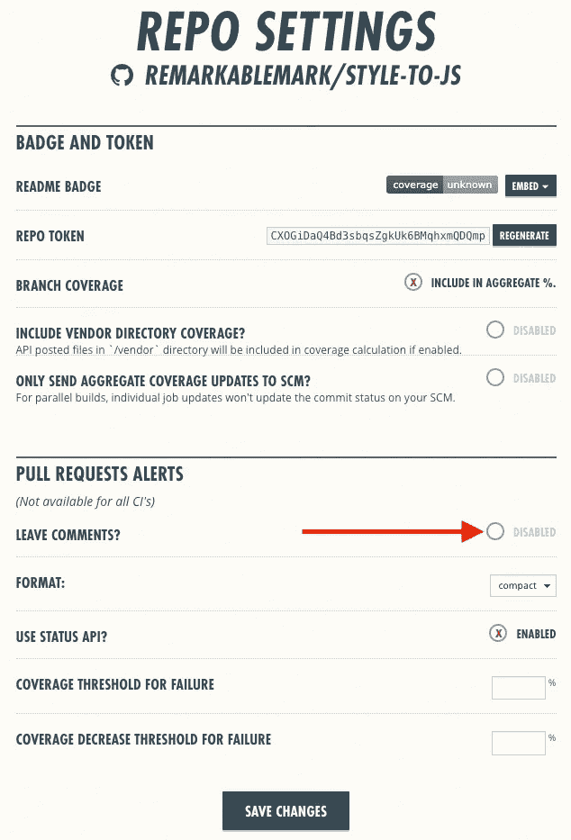
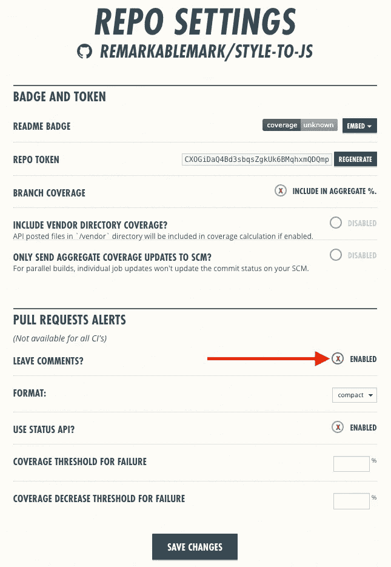
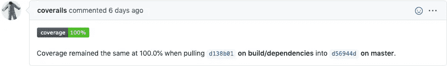

# 允许工作服在 PR 上留下评论

> 原文：<https://javascript.plainenglish.io/enable-coveralls-to-leave-comments-on-prs-4c88fbeee363?source=collection_archive---------9----------------------->

[Coveralls.io](https://b.remarkabl.org/coveralls)

# 问题

我注意到[工作服](https://b.remarkabl.org/coveralls)机器人没有对我的新存储库的请求留下评论。

我发现这个[问题](https://github.com/lemurheavy/coveralls-public/issues/1313)，但它描述了[如何将机器人添加到私人回购](https://docs.coveralls.io/coveralls-notifications)。

# 解决办法

去我的工作服报告设置，我注意到`Leave Comments?`被禁用:

启用`Leave Comments?`并保存更改后:

工作服机器人开始给我的 GitHub 公关添加评论:

[*本文原载于 2020 年 12 月 2 日《remarkablemark.org》。*](https://b.remarkabl.org/3mE34Ry)