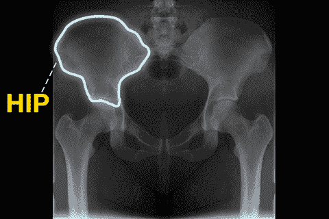

# 增强离子-🦴添加骨骼到您的离子 5 应用程序💀

> 原文：<https://javascript.plainenglish.io/enhance-ionic-adding-bones-to-your-ionic-5-app-92b25c9131a7?source=collection_archive---------4----------------------->


Photo by [Luke Southern](https://unsplash.com/@lukesouthern?utm_source=unsplash&utm_medium=referral&utm_content=creditCopyText) on [Unsplash](https://unsplash.com/s/photos/bones?utm_source=unsplash&utm_medium=referral&utm_content=creditCopyText)

当你点击这篇文章时，你可能会想“他将会谈论如何构建你的 Ionic 应用程序，以及在构建它时要考虑什么”或“我打赌他会谈论添加一个关于你的骨骼系统或营养的 API。”

很遗憾地说，这次不会了。今天，我想向你展示一个简单的方法来消除用户看不到任何东西，并且必须等待信息加载才能知道应用程序没有崩溃的问题。我们这样做的方法是使用一个叫做框架文本的组件。

什么是框架文本？框架文本允许你在页面上添加 gif 来显示文本在加载时的位置。我相信你已经在许多广泛使用的应用程序中见过它，如脸书、Instagram，甚至 LinkedIn(如下所示)。


[Source](https://codeburst.io/achieve-skeleton-loading-with-react-a12404678030)

[](https://medium.com/swlh/use-your-404-pages-to-be-as-influential-as-amazon-in-ionic-5-a9ed3be3c93d) [## 用你的 404 页在 Ionic 5 中像亚马逊一样有影响力

### 每个人都做过。你输入一个网站，然后停下来盯着屏幕上的 404 页面。你问…

medium.com](https://medium.com/swlh/use-your-404-pages-to-be-as-influential-as-amazon-in-ionic-5-a9ed3be3c93d) 

# 我们为什么想要这个？

根据 Kissmetrics 的数据，47%的访问者希望他们所在的网站在 2 秒钟内加载完毕。如果网页加载时间超过 3 秒，40%的访问者会离开网站。

骨架文本如何改进这一指标？它给用户一种他们在控制的感觉。下面，你会发现在访客动作和应用程序响应之间的延迟期间出现的 [3 个重要时间限制](http://www.nngroup.com/articles/response-times-3-important-limits/):

*   ⌛ 0.1 秒:如果应用程序在用户动作的 0.1 秒内做出响应，它就给人一种直接操作的感觉。这意味着它让访问者认为结果是由他们的行为产生的，而不是由计算机产生的。
*   ⌛ 1 秒:如果应用程序在 1 秒内响应，访问者会注意到并感觉到是应用程序而不是他们在生成结果。但是，他们会更专注于自己的思路。
*   ⌛ 10 秒钟:一旦你到了这一步，游客不再感到受控制，他们的思想会开始转移到他们当天需要做的其他事情上。这通常意味着离开网站。

因此，如果我们整合一个可视化表示，向访问者显示“嘿，我们注意到你点击了，正在获取你的结果。”而不是访问者想知道应用程序是否已经冻结或崩溃。

# 其他选项

至于其他选项，我很确定我们都见过这些不同的“加载”方式

## 圆形图案


GIF provided by [Eddy Gann](https://dribbble.com/shots/2165720-FREE-Loading-Spinners)

圆形图案是当今应用中最常用的装载滤网类型。这为应用程序提供了一个在后台显示的封面，它填充了所有数据。

## 自定义模式

随着计算能力和技能的提高，我们已经开始看到自定义加载屏幕。现在，什么是自定义加载屏幕？他们加载公司或组织特意制作的与其使命相关的 GIF 模式，不仅给网站带来了更好的品牌效应，也让用户保持了更高的兴趣率。

举个例子，这个可以用来添加到一个关于太空旅行的网站上:


GIF Provided by [Petr Had](https://dribbble.com/shots/1297289-SurveyPlanet-app-Loader-GIF)

或者这个可以用来做钓鱼网站:


GIF Provided by [UI8](https://dribbble.com/shots/1901531-Loading)

## 一点也没有

在列出的所有选项中，这可能是最差的选项，但也是最快实现的。只有当我在构建一个只属于我自己的应用程序，并且我知道它需要多长时间才能加载时，我才会这么做。

[](https://medium.com/swlh/heres-a-list-of-ideas-to-get-started-learning-ionic-5-1bd2ce0a689a) [## 这里有一个开始学习 Ionic 5 的想法列表！

### 我们都经历过…学习一门新的编程语言(甚至是你的第一门编程语言),你都…

medium.com](https://medium.com/swlh/heres-a-list-of-ideas-to-get-started-learning-ionic-5-1bd2ce0a689a) 

# 让我们开始派对吧！🎉

要开始将“骨骼”添加到您的应用程序中，您首先需要一个具有组件的应用程序，该组件需要加载一些待定数据。对于这一部分，我已经建立了一个项目供您使用，以了解如何使用骨架文本！要获得该项目，请单击下面的链接:

[](https://github.com/thethomaswgeorge/bonesIonicProject) [## 托马斯·乔治/骨头项目

### 此时您不能执行该操作。您已使用另一个标签页或窗口登录。您已在另一个选项卡中注销，或者…

github.com](https://github.com/thethomaswgeorge/bonesIonicProject) 

在这个项目中，为了测试框架文本功能，我们将使用显示实际数据的定时延迟。如果你在没有 Github 项目的情况下这样做，在 Ionic 中创建一个新页面，并将下面的所有代码添加到项目中。或者，如果您已经有一个需要框架文本的项目，只添加您需要的内容。

## new.page.ts

```
*import* { Component} *from* '@angular/core';

@Component({
  selector: 'app-new',
  templateUrl: './new.page.html',
  styleUrls: ['./new.page.scss'],
})
*export cla*ss HomePage{ *constructor*() { }

}
```

## new.page.html

```
<ion-header>
  <ion-toolbar>
    <ion-title>Skeleton Text</ion-title>
  </ion-toolbar>
</ion-header>

<ion-content>

</ion-content>
```

如果您要独自进入该项目，这是您将创建的新页面的基本模板。

# 添加有趣的部分🍑

现在我们开始进入项目的实质性部分。将我们在本文前一部分中谈到的所有主题付诸实践。

首先要添加的是 div 元素，用于保存将用于来回切换的按钮，以及用于装载数据和框架显示的容器。

```
<ion-header>
  <ion-toolbar>
    <ion-title>Skeleton Text</ion-title>
  </ion-toolbar>
</ion-header>

<ion-content>
 **<div *id*="buttons">
  </div>
  <div *id*="skeleton">
  </div>
  <div *id*="info">
  </div>**
</ion-content>
```

接下来，我们需要添加这些元素的实际内容:

```
<ion-header>
  <ion-toolbar>
    <ion-title>Skeleton Text</ion-title>
  </ion-toolbar>
</ion-header>

<ion-content>
  <div *id*="buttons">
 **<ion-button **ngIf*="isLoaded" *expand*="block" *class*="ion-margin" *(click)*="update()">Skeleton</ion-button>
      <ion-button **ngIf*="!isLoaded" *expand*="block" *class*="ion-margin" *(click)*="update()">Info</ion-button>**
  </div>
  <div *id*="skeleton">
  **  <ion-item **ngFor*="*let* article of articles">
      <ion-label>
        <h1>
          <ion-skeleton-text *animated style*="width: 50%"></ion-skeleton-text>
        </h1>
        <p *class*="ion-padding-vertical">
          <ion-skeleton-text *animated style*="width: 80%"></ion-skeleton-text>
        </p>
        <ion-skeleton-text *style*="width: 100%; height: 300px"></ion-skeleton-text>
      </ion-label>
     </ion-item>**
  </div>
  <div *id*="info">
 **<div **ngFor*="*let* article of articles" *class*="ion-padding">
      <h1>{{ article.name }}</h1>
      <p **ngIf*="article.desc">{{ article.desc }}</p>
      
    </div>**
  </div>
</ion-content>
```

正如您所看到的，这个 HTML 将会动态生成，并且只在按钮是否被按下时才会显示。

现在唯一要添加的是该页面的逻辑:

```
*import* { Component } *from* '@angular/core';

@Component({
  selector: 'app-home',
  templateUrl: 'home.page.html',
  styleUrls: ['home.page.scss'],
})
*export class* HomePage {
 ***public* isLoaded = *false*;

  *public* articles = [{
    name: 'Article 1',
    desc: 'This is the article description',
  },{
    name: 'Article 2',
    desc: 'This is ANOTHER article description but with an image',
    image: 'https://static.wikia.nocookie.net/youtubepoop/images/c/c1/SmittyWerbenjagermanjensen.jpg/revision/latest?cb=20150728025502'
  },{
    name: 'Article 3',
    image: 'https://external-content.duckduckgo.com/iu/?u=http%3A%2F%2F28.media.tumblr.com%2Ftumblr_lqxh7iK9mM1qeolyto1_500.jpg&f=1&nofb=1'
  }];

  *constructor*() {}

  *public* update() {
    *this*.isLoaded = !*this*.isLoaded;
  }**
}
```

[](https://medium.com/swlh/adding-badge-notifications-with-ionic-4-and-angular-f42c4be2ff9b) [## 使用 Ionic 5 和 Angular 添加徽章通知

### 所以你有一个已经开发了一段时间的应用程序，你可以想象下一步要添加的完美项目。…的方法

medium.com](https://medium.com/swlh/adding-badge-notifications-with-ionic-4-and-angular-f42c4be2ff9b) 

# 部署！

您现在可以部署此应用程序了！您可以通过在终端中键入以下命令，在本地计算机上运行它:

```
ionic serve
```

如果您想将您的应用程序部署到网站上，[单击此处](https://ionicframework.com/blog/heroku-ionic/)逐步演示如何将您的应用程序添加到 [Heroku](https://www.heroku.com/) 。如果您想将您的应用部署到 app store，Android 的[点击此处](https://ionicframework.com/docs/deployment/play-store)，iOS 的[点击此处](https://ionicframework.com/docs/deployment/app-store)。

如果您想了解该应用在不同移动设备上的外观，只需运行:

```
ionic serve --lab
```

这个命令将调出同一个本地托管的测试站点，但不仅显示它在 iOS 和 Android 上的样子，还显示它在 Windows mobile 设备上的样子。关于这个命令的更多信息，[点击这里](https://ionicframework.com/blog/ionic-lab/)！



# 🎉完成🎉

我们终于完成了应用程序！万岁！如果你已经读过这篇文章，但不想为了自己创作而重读，请点击这里！在该报告中，我已经添加了我在撰写本文时输入的所有代码。我挑战你下载代码，运行它，看看你是否能在不直接看代码的情况下找到复活节彩蛋！

***本文视频即将发布！***

如果你想看我以前写的文章或与我联系，请点击[访问我的网站！](http://www.thethomasgeorge.com/)