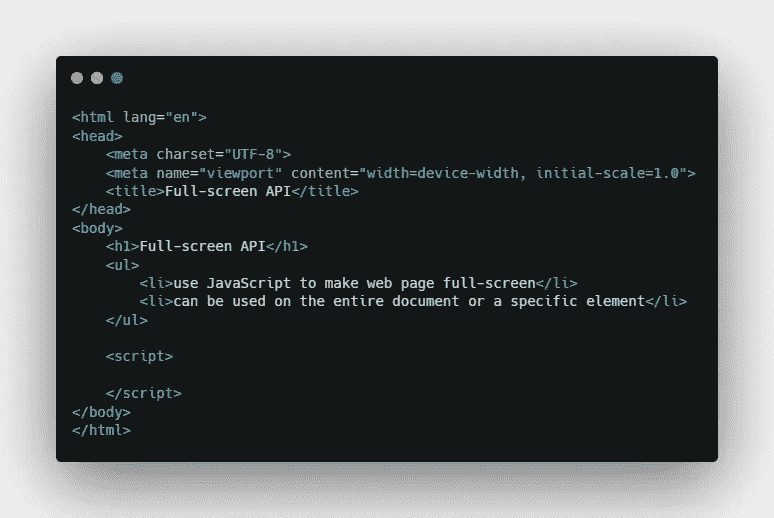
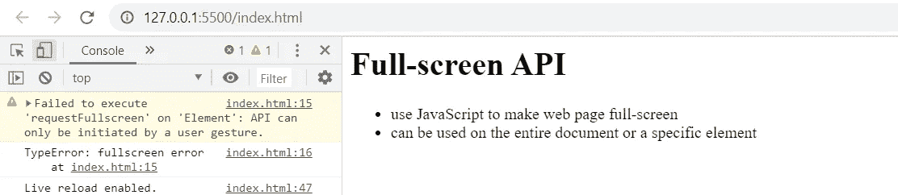
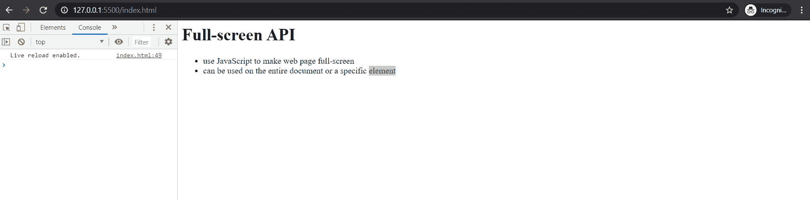
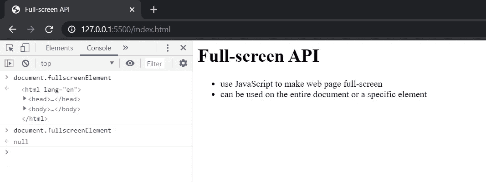
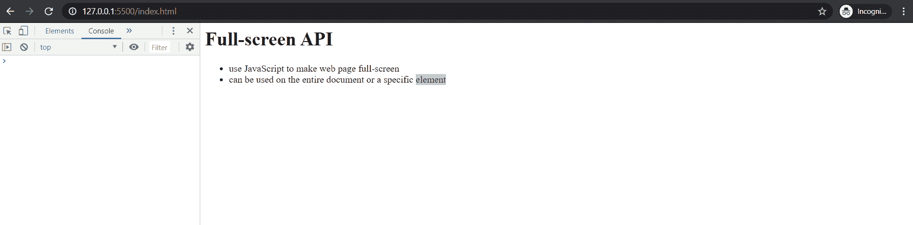
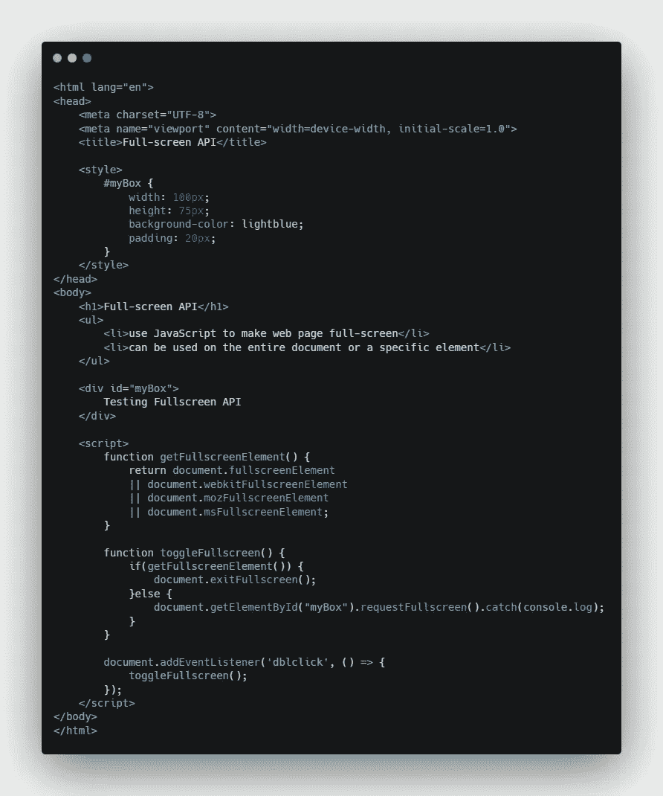
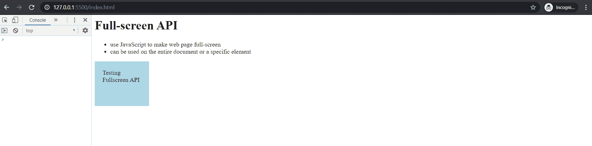

# 使用 JavaScript 进入全屏模式

> 原文：<https://javascript.plainenglish.io/enter-full-screen-mode-with-javascript-a8a782d96dc?source=collection_archive---------5----------------------->

## 如何使用 JavaScript 全屏应用编程接口


Photo by [Oğuzhan Akdoğan](https://unsplash.com/@jeffgry?utm_source=medium&utm_medium=referral) on [Unsplash](https://unsplash.com?utm_source=medium&utm_medium=referral)

基本上，全屏 API 允许您使用 JavaScript 代码将网页转换为全屏模式。它也可以用于整个文档，甚至一个特定的元素，无论哪种方式都很容易使用。

让我们跳到文本编辑器中，使用 JavaScript 使文档全屏显示。

# 开始

下面是一个示例代码。



# 全屏幕显示整个文档

在 JavaScript 部分，添加以下代码。

```
<script>
   document.documentElement.requestFullscreen().catch((e) => {
      console.log(e);
   });
</script>
```

这里的`requestFullscreen()`功能将把文档转换成全屏模式，因为我们在`documentElement`上调用它。然后，使用`catch`，通过 **e** 参数抓取错误对象，并使用`console.log`显示。

如果成功，它将进入全屏模式，如果不成功，它将在 web 控制台中显示错误消息。



当您签入 web 控制台时，将会出现这种错误。这意味着您只能使用全屏 API，并在用户交互时以编程方式进入全屏模式。

所以我们需要某种事件监听器，比如双击，然后我们就可以全屏显示了。

# 添加事件侦听器

我们将在前面的事件侦听器中包装我们的代码。

```
<script>
   document.addEventListener('dblclick', () => {
      document.documentElement.requestFullscreen().catch((e) => {
         console.log(e);
      });
   });
</script>
```

结果



Full-screen Result

双击，现在它的工作。

# 全屏模式下的访问元素

为了获得全屏模式中的元素，我们可以简单地在 web 控制台中运行下面的代码。

```
document.fullscreenElement
```



第一次执行是在全屏模式下，第二次执行是在您退出全屏模式时。这对于切换全屏模式很重要。

# 切换全屏模式

更新我们的脚本代码如下。

```
<script>
   function getFullscreenElement() {
      return document.fullscreenElement   //standard property
      || document.webkitFullscreenElement //safari/opera support
      || document.mozFullscreenElement    //firefox support
      || document.msFullscreenElement;    //ie/edge support
   }

   function toggleFullscreen() {
      if(getFullscreenElement()) {
         document.exitFullscreen();
      }else {
    document.documentElement.requestFullscreen().catch(console.log);
      }
   } document.addEventListener('dblclick', () => {
      toggleFullscreen();
   });
</script>
```

在`toggleFullscreen()`函数中，我们添加了一个简单的条件来检查我们是否有 fullscreenElement。如果没有全屏元素，我们将请求进入全屏模式。

结果



Toggle Full-screen Mode

# 特定元素全屏显示

现在，我们将对一个单独的 HTML 元素调用全屏 API。我们首先需要创造一个新的元素。



我们添加了一个以 **myBox** 作为 ID 的元素。我们需要改变的只是`toggleFullscreen()`功能。将`document.documentElement`更改为`document.getElementById`。就这样。

结果



## **来自 JavaScript 的普通英语注释**

我们已经推出了三种新的出版物！请关注我们的新出版物:[**AI in Plain English**](https://medium.com/ai-in-plain-english)[**UX in Plain English**](https://medium.com/ux-in-plain-english)[**Python in Plain English**](https://medium.com/python-in-plain-english)**——谢谢，继续学习！**

**我们也一直有兴趣帮助推广高质量的内容。如果您有一篇文章想要提交给我们的任何出版物，请发送电子邮件至[**submissions @ plain English . io**](mailto:submissions@plainenglish.io)**，并附上您的 Medium 用户名，我们会将您添加为作者。另外，请让我们知道您想加入哪个/哪些出版物。****