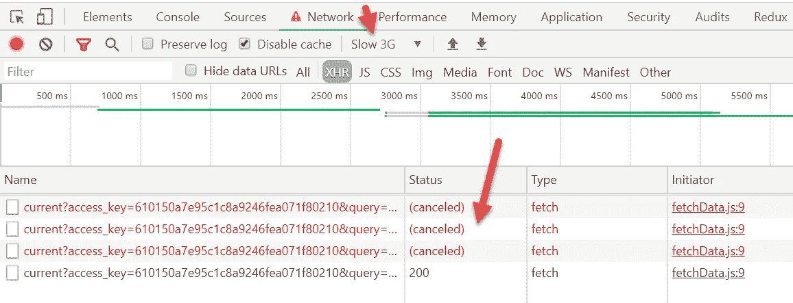

# 企业在 2020 年做出反应

> 原文：<https://javascript.plainenglish.io/enterprise-react-in-2020-78155bc99259?source=collection_archive---------2----------------------->


在我大约一年前发表的前一篇文章中，我展示了 React 技术栈，我称之为 Enterprise React。它是一组自以为是的库和技术方法，用于在 React 中快速构建可伸缩的企业级应用程序。它还附带了一个小的演示应用程序，可以用作一个引导工具包。它包括了所有提到的库，所以你可以看到它们是如何一起工作的。

自那时以来，React 生态系统已经发展了很多，今天我将展示更新的企业 React 2020，它还带有更新的演示应用程序。我将主要关注自去年以来发生的变化。如果你是新手，先阅读一下[以前的文章](https://medium.com/@viacheslavlushchinskiy/enterprise-react-in-2018-2019-ae6c80c03f1)是有意义的。

**TL；博士**

在深入讨论细节之前，让我们快速浏览一下当前的堆栈。

我们仍然使用**[**Create React App**](https://github.com/facebook/create-react-app)(CRA)来引导一个新项目。 [Next.js](https://nextjs.org/) 是服务器端渲染(SSR)应用的替代品，但脸书承诺有一天会在 CRA 中包含 SSR，所以除非你今天需要 SSR，否则我会等待。**

**[**Duck 应用程序结构**](https://medium.com/@scbarrus/the-ducks-file-structure-for-redux-d63c41b7035c) 仍然是最受欢迎的一个，并且很可能在未来几年都是如此。**

**库列表如下所示:**

****主要模块****

**[Redux](https://redux.js.org/) —状态管理**

**[Formik](https://jaredpalmer.com/formik) —处理表单(取代[还原表单](https://redux-form.com/))**

**[Redux-Saga](https://redux-saga.js.org/) — REST 和 WebSocket API**

**[反应路由器](https://reacttraining.com/react-router/) —客户端路由**

**[i18 下一个](https://react.i18next.com/) —翻译**

**[Material-UI](https://material-ui.com/)——样式化和使用 CSS(除非你想建立自己的设计系统)**

****实用程序****

**[Redux devtools](http://extension.remotedev.io/) —状态和动作监控**

**[Lodash](https://lodash.com/) —数据处理工具包**

**[查询字符串](https://github.com/sindresorhus/query-string) —查询字符串解析器**

**[日期-fns](https://date-fns.org/) —日期和时间管理**

**测试— [Jest](https://jestjs.io/) + [酶](https://airbnb.io/enzyme/)**

**我已经移除了[重新组合](https://github.com/acdlite/recompose)，现在你可以使用 redux 库中的‘组合’功能了。此外，去年提到的[重新选择](https://github.com/reduxjs/reselect)在很多情况下并不必要。**

***演示*——[https://slava-lu.github.io/enterprise-react-2020/](https://slava-lu.github.io/enterprise-react-2020/)**

***回购【https://github.com/slava-lu/enterprise-react-2020】——[回购](https://github.com/slava-lu/enterprise-react-2020)***

**现在，让我们更深入地了解一下新的技术体系。**

**CRA 本身已经得到了改进，现在在建造后会产生更小的包。主要是因为移除了对旧浏览器的支持。**

**React 生态系统的主要变化是 React 库本身的变化，引入了**钩子**。钩子是你如何处理本地状态、主要生命周期方法和其他一些东西的全新方式。在我以前的文章中，我推荐使用类来获得更好的可伸缩性。现在，我已经用功能组件和钩子重构了我的演示应用程序。它们更方便，并且在转换后产生更少的 JavaScript 代码。**

**Redux 仍然是主要的状态管理解决方案。它太方便了，我不认为它会很快消失，尽管有人试图让它变得多余。**

**与去年的 Enterprise React stack 相比，最大的变化之一是用 **Formik** 替换了 Redux 表单库。长期以来，人们一直认为 Redux 格式有点笨重，解决方案过于复杂。甚至这个库的作者也创造了一个新的叫做[的最终形式](https://final-form.org/react)来作为替代。但是他在“可观察”模式上的赌注没有成功，另一个 Redux 表单替换库 Formik 成为表单管理库的领导者。**

****Redux-Saga** 仍然是管理 REST API 最通用的库。该库的一个有用的特性是用名为 *takeLatest* 的辅助函数(effect)轻松取消正在运行的函数(sagas)。如果您使用这种效果，并且用户多次单击该按钮，则只有最后一次单击才会实现。直到最近它还不是很有用，因为取消 API 功能不会导致网络呼叫本身的取消，但是使用新的[**abort controller API**](https://developer.mozilla.org/en-US/docs/Web/API/AbortController)您现在可以非常容易地取消网络呼叫。实现细节见演示 app。**

**要在演示应用程序中查看取消获取的操作，请更改 chrome dev 工具以模拟缓慢的 3G 网络，单击几次“获取天气”按钮并查看网络选项卡。您将看到取消的网络请求，如下所示:**

****

**为了进一步改善用户体验，我还为 fetch 调用添加了一个超时，这样在 REST API 调用挂起的情况下就不会有旋转的 spinners。如果超时，fetch 网络调用也被取消，就像上面的例子一样。您可以通过在 *src/config/consts.js* 中将 FETCH_TIMEOUT 参数设置为几毫秒来测试它**

**下面是添加超时获取的代码片段:**

```
**const** timeoutPromise = timeout =>
  **new *Promise***((resolve, reject) => *setTimeout*(() =>
  reject(**new *Error***(**'Network timeout'**)), 1000))**const** fetchResult = **await *Promise***.race([
  *fetch*(url, options),
  timeoutPromise(***FETCH_TIMEOUT***)
])
```

****React 路由器**多年来一直是添加客户端路由的标准解决方案。现在，您不仅可以使用它来模拟标准的服务器端路由体验，还可以有效地将代码分割成块。您不再需要第三方库来完成这项工作，因为它现在是 React 中的内置特性。如果你想在 SSR 中实现代码拆分，你仍然需要第三方库。代码分割现在是任何企业应用程序的“必备”功能，因为你的应用程序的性能和响应能力在 SEO 评分和谷歌对你的应用程序的排名中起着更大的作用。**

**翻译库 **I18next** 从去年开始彻底改变了 API。我仍然推荐使用这个库，因为它正在开发中，并且非常容易实现。**

**你自己的设计会让你的网站脱颖而出，但是创造独特的设计并不便宜。Material-UI 框架帮助你迈出创建自己身份的第一步。它可以很好地平衡自创和无聊的模板。即使你决定推出自己的设计，一些来自 Material-UI 的想法和方法肯定是有帮助的，值得学习。如果你想尝试一些其他的 UI 框架，那么[可以看看这里的](https://designsystemsrepo.com/design-systems/ )不同的选项。**

**至于文章开头提到的实用程序库，它们是不言自明的。我想提的唯一一件事是，从 create-react-app 3.3.0 开始，你可能不再需要 lodash 的 *get* 助手，因为现在支持名为“可选链接”的新功能。为了清晰起见，我个人更喜欢 lodash 语法，但是你可以开始使用 [**可选链接**](https://github.com/tc39/proposal-optional-chaining) *:***

```
**const** lastUpdated = weather.**currentWeather**?.**dt** ?? **' '**instead of**const** lastUpdated = *get*(weather, [**'currentWeather'**, **'dt'**], **' '**
```

**今年，我在新的演示应用程序中引入了两个全新的东西。它们是测试和错误管理。**

**我上次省略它们的原因是，有数百万种不同的方法可以实现它们，所以没有一种解决方案可以被称为主流解决方案。但是由于这两件事是任何生产应用程序的“必备”，所以我包括了我最喜欢的方法，这样你至少可以有一些开始。**

****测试**。你可以测试很多东西，但是在我看来，测试经常被滥用来达到 100%的代码覆盖率，而不是提高应用程序的质量。因此，在我的演示应用中，我只展示了非常重要的测试示例:**

*   **测试表单提交将导致正确的操作创建者调用。类似的事情是测试点击按钮是否会导致预期的动作创建者调用。**
*   **测试 Redux-Saga。测试 redux-saga 的通常方法是模拟 redux 存储和分派功能，然后看看运行 saga 时是否调用了预期的动作创建器。redux-saga 文档中也推荐这种方法。我个人更喜欢使用真实的商店并检查，如果 saga 电话导致商店的新的预期状态。这是一个更加综合和有用的测试。毕竟，你并不关心行动创建者，而是关心商店是否有正确的信息。**
*   **另一个流行的选项是快照测试，您可以测试您的组件自上次测试以来没有被更改过。没有多少人觉得快照测试非常有用，但它仍然很受欢迎，所以我包括了一个快照测试。**

****错误管理**。错误管理可以用不同的方式来完成。您需要决定是显示一般的错误信息，还是显示从失败的函数中收到的错误信息。使用最后一个选项，如果您同时收到一个以上的错误，这可能会很棘手。如果您有一些集中的日志记录，例如使用 [**哨兵**](https://sentry.io/) 库，那么一般错误消息可能是一个首选选项，这样您仍然可以检查客户端的真正错误是什么。**

**因为我还没有在我的演示应用程序中实现 Sentry，所以我显示了最后一个真正的错误消息。要查看它的运行情况，您可以在 *src/config/consts.js* 中将 *FETCH_TIMEOUT* 参数更改为 20，然后单击按钮。您应该会看到“*网络超时*”错误消息。**

**我也从 AirBnb 林挺的[规则切换到了林挺的**规则，因为 AirBnb 的规则对我来说太过严格和固执己见，我不得不添加许多例外。**](https://github.com/airbnb/javascript/tree/master/packages/eslint-config-airbnb)**

**我已经创建了一个干净的 [**演示应用**](https://slava-lu.github.io/enterprise-react-2020/) ，它有最少的代码，但使用了所有上述的库和工具。这里可以看到 [**源代码**](https://github.com/slava-lu/enterprise-react-2020) 。欢迎在评论中提问。**

**接下来的一年也将会非常精彩。我们将会看到脸书如何将 SSR 引入 CRA。目前处于测试阶段的**并发模式**应该会显著改善大型应用程序的用户体验，但我们需要等到脸书和其他库作者发布支持它的版本。**

**如果你不想错过它的发生，请继续关注。**