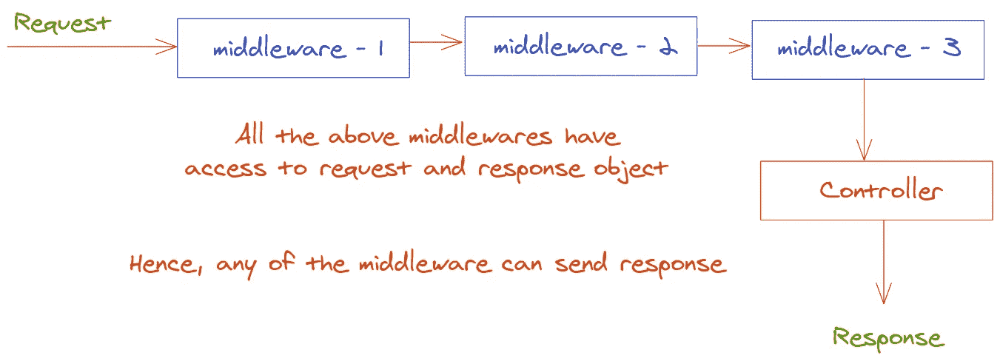
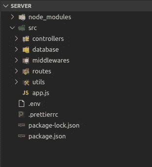

# Express.js 应用程序中的错误处理

> 原文：<https://javascript.plainenglish.io/error-handling-for-express-js-applications-a26a3002ef82?source=collection_archive---------10----------------------->

## 在 express 应用程序中处理错误可能比构建 web 应用程序和 API 更具挑战性

用 express.js 构建 web 应用或 API 在我看来并不难。我认为更难的是正确处理错误、错误状态码和错误消息。下面，我将列出一些我在 express.js 应用程序中处理错误的技巧。

如果你想应用我将要建议的技术，我们需要理解中间件来处理错误。简单地说，express 中的中间件是一种可以访问特定路由的请求和响应对象的功能。此外，它们接受一个参数 **next** ，这是一个在中间件功能执行后被调用的功能。

Middleware example

在上面的例子中，如果你发送一个 get 请求给*/some route*route‘请求已发出’将被记录在控制台上。

## 控制器和中间件

Controllers and Middlewares

上图解释了什么是控制器，什么是中间件。当在特定路由上接收到请求时，在调用该路由的控制器之前，中间件 1、2 和 3 被调用。控制器然后可以发送响应。但是，中间件功能也可以访问响应对象，中间件也可以发送响应并关闭请求。所以，你可以假设任何中间件都是控制器，任何控制器都是中间件。

例如，可以创建一个验证 jwt 的中间件功能。中间件将验证令牌是否有效。如果无效，中间件将向客户端发回错误响应并关闭请求。在这种情况下，JWT 验证中间件之后的中间件/控制器将不会被调用。

## 项目结构

Express 是一个非个人化的 web 框架，用于使用 Node.JS 构建 web 应用程序。因为它是一个非个人化的 web 框架，所以框架创建者并不严格推荐用于组织项目的目录结构。下面，我将向您展示我的项目结构的截图，您可以按照它来组织您的项目，但是，如果感觉合适，您也可以按照您自己的结构来组织。

Project Structure

## 函数来创建错误对象

在 *utils/createError.js* 文件中，我有一个函数，它接受两件事:一个状态代码和一个错误消息，并返回一个错误对象。

**utils/createError.js**

# app.js 中的集中式错误处理程序

这是这个故事的主要部分。我们将创建一个中间件函数，它可以接受错误对象，如果收到错误，它可以向发出请求的客户端发送错误响应。为此，我们将创建两个中间件功能。如果上面的路由都没有被调用，一个中间件将被触发，如果任何一个中间件/控制器出错，另一个将被触发。

我们的 app.js 的结构如下所示。

Middleware functions

一般来说，所有的错误都有一个消息属性，所以你可以相信在我们的错误处理中间件中会有一个包含错误对象的消息。如果没有，那么默认情况下“将发送内部服务器错误”

## 如何利用我们的集中式错误处理程序触发错误？

假设您有一个让用户登录应用程序的控制器。这里的示例将展示一个高级实现示例。在这个故事的底部，我将添加一个快速应用程序的 GitHub 库，其中将包括所有这些应用于一个真实项目。

Login and error handling example

这就是在 express.js 应用程序中应用错误处理实践的方法。

如果你想看一个应用了所有这些的项目，去这个 [GitHub 库](https://github.com/prashantacharya/idea-submission)看看代码的运行。

感谢您的阅读。我也为我自己的网站[写内容。你可以订阅我的时事通讯。](https://bigomega.dev.)

# **用简单英语写的便条**

你知道我们有四份出版物和一个 YouTube 频道吗？你可以在我们的主页 [**plainenglish.io**](https://plainenglish.io/) 找到所有这些内容——关注我们的出版物并 [**订阅我们的 YouTube 频道**](https://www.youtube.com/channel/UCtipWUghju290NWcn8jhyAw) **来表达你的爱吧！**