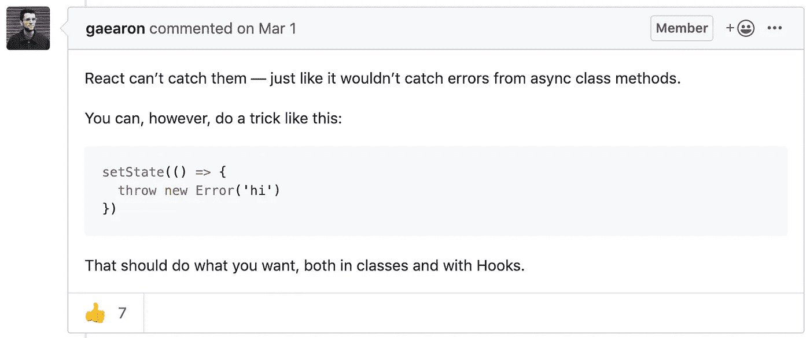

# React 中使用错误边界的错误处理

> 原文：<https://javascript.plainenglish.io/error-handling-using-error-boundaries-in-react-e7c8f27d778e?source=collection_archive---------7----------------------->

## 一种处理 React 组件内部错误而不使应用崩溃的方法

Photo by [Glenn Carstens-Peters](https://unsplash.com/@glenncarstenspeters?utm_source=unsplash&utm_medium=referral&utm_content=creditCopyText) on [Unsplash](https://unsplash.com/s/photos/computer?utm_source=unsplash&utm_medium=referral&utm_content=creditCopyText)

# **使用试抓法**

当你使用异步函数或者一个可能抛出错误的函数时，你如何处理这个错误？我们主要通过使用 try-catch 块来处理执行过程中的错误。try 块是异常发生的地方，catch 块是捕获错误并处理它的地方。

A simple try-catch block inside a function

在 React 中，您可能会考虑编写类似如下的语法。

The implementation of try-catch block inside a React component

不幸的是，上面的代码将无法工作。Try-catch 仅适用于命令式代码，而 React 组件是声明式的，并指定应该呈现什么样的。如果你对声明性代码和命令性代码有疑问，你可以在这里阅读伊恩·蒙迪的一篇文章。

 [## 声明式编程与命令式编程

### 或者错误的反应方式

codeburst.io](https://codeburst.io/declarative-vs-imperative-programming-a8a7c93d9ad2) 

您可以使用下面的 try-catch 块来查看错误处理。

A example implementation of using try-catch inside render method

如上图所示，应该显示的`FailedComponent`没有正确显示( ***默认情况下，在开发模式下，React 会显示错误堆栈的叠加。这在生产模式下不会显示。只需点击右上角*** 的‘x’按钮即可移除。这是试捕法所不能达到的。

# 使用误差边界

> UI 某个部分的 JavaScript 错误不应该破坏整个应用程序。

有了上述概念，在 React 16 中，它引入了错误处理新概念，称为错误边界。基于 React 文档，下面是错误边界的定义。

> 错误边界是 React 组件，**捕捉子组件树中任何地方的 JavaScript 错误，记录这些错误，并显示回退 UI** 而不是崩溃的组件树。错误边界在渲染期间、在生命周期方法中以及在它们下面的整个树的构造函数中捕捉错误。

下面是一个错误边界代码的例子。

然后，该组件捕获所有由其子组件抛出的错误，而不会破坏应用程序。下面是我们如何使用误差边界的例子。

上面的代码没有分解应用程序。错误边界捕捉由其子组件引发的错误，并显示回退组件。在上面的例子中，`WorkedComponent`抛出一个错误并被`ErrorBoundaries`捕获，然后显示一个带有`FailedComponent`的回退。这要好得多，因为我们的应用程序不会崩溃。

# 误差边界应该放在哪里

正如文件所说，

> 错误边界的粒度由您决定。您可以包装顶级路由组件以向用户显示“出错”消息，就像服务器端框架通常处理崩溃一样。您还可以将单个小部件封装在一个错误边界中，以防止它们破坏应用程序的其余部分。

有了这个想法，我们可以简单地创建一个错误边界，并将其作为所有组件的包装器，或者在每个组件上创建它。这带来了一个好处，我们可以让我们的应用程序仍然运行，即使应用程序的某些部分崩溃/抛出一个错误。我们可以看到下面的实现。

An example of placing Error Boundaries on each component

太好了。我们的 React 应用程序现在仍然可以运行，即使有一个组件抛出错误。

# 异步错误处理

好了，我们已经学习了如何使用错误边界来处理错误，那么我们完成了吗？还没有。React 文档中的错误边界状态为:

> 错误边界**不**捕捉错误:
> 
> 事件处理程序(了解更多)
> 
> **异步代码**(如`setTimeout`或`requestAnimationFrame`回调)
> 
> 服务器端渲染
> 
> 在错误边界本身(而不是其子代)中引发的错误

正如我们所见，异步代码是错误边界无法处理的代码。那么，我们还能使用那个组件来处理我们的错误吗？是的，的确如此。这里的问题是**异步运行在渲染方法**之外。如果你想知道这里的问题是什么，让我从错误边界文档中提醒你(它也在上面陈述)。

> 错误边界在渲染期间、在生命周期方法中以及在它们下面的整个树的构造函数中捕捉错误。

那么，当异步块在渲染之外运行时，我们如何在异步块中抛出错误，并且仍然被错误边界组件捕获呢？丹·阿布拉莫夫在这里提出了一个小技巧。

A trick that Dan Abramov suggest on “Throwing Error from hook not caught in error boundary” github issue [https://github.com/facebook/react/issues/14981](https://github.com/facebook/react/issues/14981)

这样，我们仍然可以在异步函数中抛出错误。这适用于类和函数组件。

An example of the component that thrown an error inside an async function

为了直接展示给你们看，这里是沙盒。

太好了。我们的误差边界现在同时支持同步和异步功能。我们可以使用这个组件将特定情况下的错误处理集中到一个组件中，如网络问题、失败的惰性导入和需要对所有组件进行相同行为捕捉的异步进程等等。

# 警告

虽然错误边界是强大的，但仍有一些方面需要记住。

*   未被错误边界捕获的错误仍然会导致组件反应树被卸载。(参见文档)
*   在撰写本文时，错误边界只能使用类组件来创建，因为`componentDidCatch`只能在类组件内部创建。
*   你应该记住所有边界不能捕捉的错误。

 [## 错误边界-反应

### 过去，组件内部的 JavaScript 错误会破坏 React 的内部状态，导致它发出神秘的…

reactjs.org](https://reactjs.org/docs/error-boundaries.html)