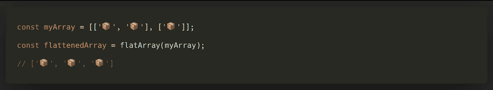
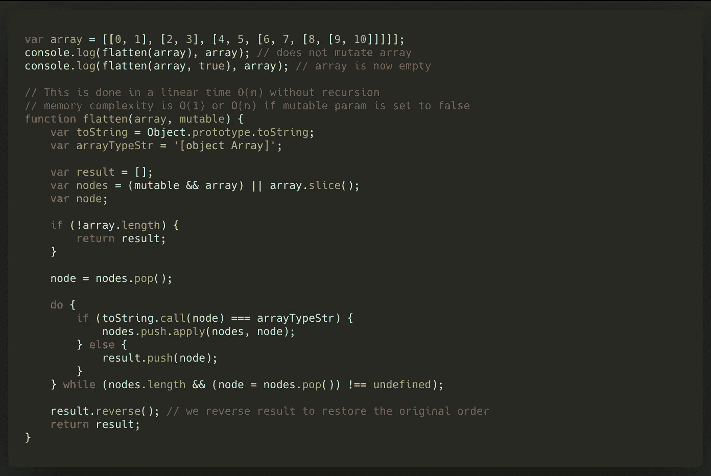
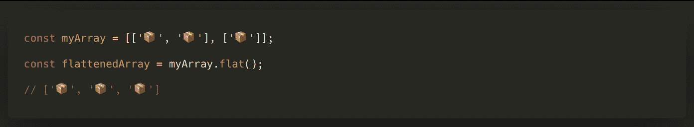
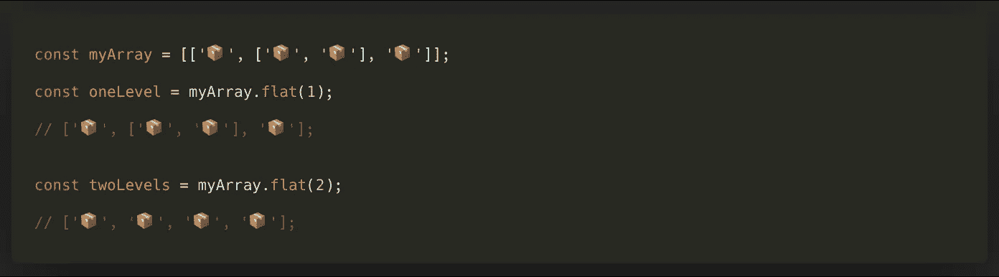
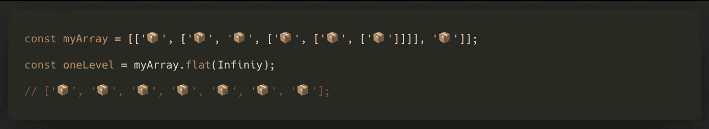
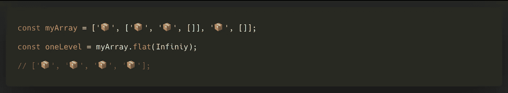

# ES2019。用 Array.flat()在 Javascript 中展平数组

> 原文：<https://javascript.plainenglish.io/es2019-flatten-arrays-in-javascript-with-array-flat-aaf28eea5c43?source=collection_archive---------4----------------------->

## 由于新提案 ES2019,“扁平化阵列”


今天，我给大家带来了一篇文章——关于 **Javascript** 的诀窍，它将帮助我开始谈论 **ES2019** 将带来的消息，在这篇文章中，我将重点关注我们如何通过 Javascript“扁平化”数组。

所以不用娱乐太多，让我们看看吧！

# 但是扁平化是怎么回事呢？

展平数组是一种非常有用的操作，可以执行以下操作:



也就是说，通过传递一个数组的数组，它所做的是把它转换成一个一维的数组。

然而，这个操作不是在 Javascript 中实现的，所以有必要使用一些想象力(或者 Stackoverflow😋)来获得任何可能的实现。

# 一些 flatArray()实现

通过简单的谷歌搜索，你会发现许多`flatArray`实现。例如，我们有以下内容:

```
const merged = [].concat.apply([], arrays);
```

但是，它不适用于多层阵列，例如:

```
const myArray = [[‘📦’, ‘📦’], [‘📦’, [‘📦’, [‘📦’]]]];
```

或者从 Stackoverflow 中提取一个更复杂的东西[，如下所示:](https://stackoverflow.com/a/27282907/258863)



# 在 ES2019 中展平阵列

随着 ES2019 的到来，平整阵列已成为一项微不足道的任务，例如:



多亏了`**Array.prototype.flat()**`,我们可以在不使用前一节提到的任何“助手”的情况下，自然地展平必要深度的数组。

此外，它与浏览器的兼容性开始变得相当广泛，正如你在网上看到的那样[caniuse.com](https://caniuse.com/#search=Array.prototype.flat)所以在我们的应用程序中添加相应的“polyfill”来使用这个功能就足够了。

# 它是如何工作的？

正如您在[定义](https://developer.mozilla.org/es/docs/Web/JavaScript/Referencia/Objetos_globales/Array/flat)中看到的，`**Array.prototype.flat()**`可以接收一个名为`depth`的可选参数，该参数指定数组应该展平多少层:



默认情况下，这个参数的值是`1` **，非常有趣的是，如果我们不知道数组的深度级别，我们可以通过** `Infinity`来确保我们得到的结果是一个一维数组:



另一方面，`**array.flat()**`还负责在执行操作的过程中消除空数组:



因此，通过这种实现，该提案的开发者已经涵盖了所有情况。为他们鼓掌:

# 你想收到更多这样的文章吗？

如果你喜欢这篇文章，我鼓励你订阅我每周日发送的时事通讯，里面有类似的出版物和更多的推荐内容:👇👇👇

[](https://eepurl.us20.list-manage.com/subscribe?u=c14cad2102bcf33bf216cc69e&id=2790da9378) [## 拿铁和代码

### 这是一份最新的时事通讯，代码是 recibirás cada domingo。——洛斯多斯乌尔蒂莫斯艺术博物馆……

eepurl.us20.list-manage.com](https://eepurl.us20.list-manage.com/subscribe?u=c14cad2102bcf33bf216cc69e&id=2790da9378)