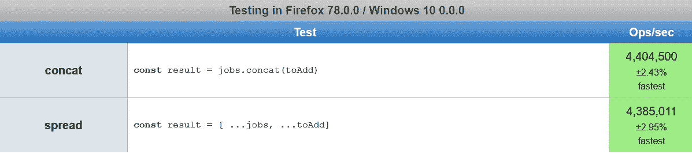
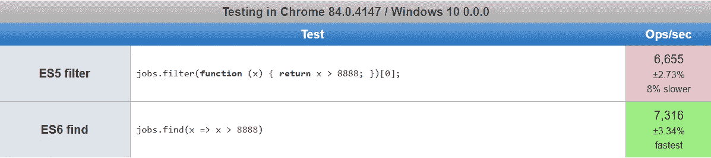

# ES5 与 ES6+ JavaScript 性能比较

> 原文：<https://javascript.plainenglish.io/es5-vs-es6-performance-comparisons-c3606a241633?source=collection_archive---------0----------------------->

## 使用 ES5 和 ES6+比较一些常见的对象、数组、函数和字符串功能


Photo by [Jp Valery](https://unsplash.com/@jpvalery?utm_source=medium&utm_medium=referral) on [Unsplash](https://unsplash.com?utm_source=medium&utm_medium=referral)

## 在接下来的几周里，我将调查我们的 Angular 应用程序最近遇到的一些性能问题。

在今天简单浏览了一下代码并对 RxJS 做了一些调整后，我注意到一些普通的旧 JavaScript(嗯，是 TypeScript)可以做一些修饰。

现在，作为一个前端应用程序，大部分的速度下降可能更多地与太多太频繁的重新渲染有关，但我想用一些统计数据来武装自己，看看对我们的 JavaScript 代码的改进会带来多大的不同，特别是从 [ES5](https://es5.github.io/) 风格代码迁移到 [ES6](http://es6-features.org/#Constants) +。

下面，我们将比较 Chrome 和 Firefox 中使用 ES5 和 ES6+的一些常见操作。

由于 [Chrome](https://www.google.com/intl/en_au/chrome/) 使用 [V8 JavaScript 引擎](https://v8.dev/)，其结果可能会被转移到新的 [Edge](https://www.microsoft.com/en-us/edge) 浏览器，以及 [Node.js](https://nodejs.org/en/) ，因为它们使用相同的引擎。

火狐使用了[蜘蛛猴](https://developer.mozilla.org/en-US/docs/Mozilla/Projects/SpiderMonkey) JavaScript 运行时引擎。

现在做一些测试。

## 多个“如果”条件与可选链接

对象:

```
**const** job = {
  "summary": {
    "total_actions": 4,
    "finished_actions": 4
  },
  "updated_at": "2020-07-15T10:24:42.364000000Z",
  "job_id": "4b1733e7-c8e0-4fdd-a7f1-13d3ab725c92",
  "description": "Job from our export",
  "created_at": "2020-07-15T10:24:40.975000000Z",
  "status": "finished",
  "tags": {
    "export_id": [
      "8848c5d8-fd44-43c0-b7f2-1428d0f4891a" 
    ]
  }
}
```

现在，在我的特定场景中，`tags`可能不在那里，即使在那里，`tags`中的`export_id`也是可选的。我想检查我感兴趣的导出 ID 是否在我们从服务器接收的作业的`export_id`属性中。

让我们将此分为两个比较:

1.  检查`job.tags`是否存在，随后`job.tags.export_id`是否存在
2.  检查`job.tags.export_id`是否包含我们感兴趣的出口 ID

竞争者:

```
**if** (job.tags && job.tags.export_id) {
    // do nothing
}vs.**if** (job.tags?.export_id) {
    // do nothing
}
```

结果是:


测试这里:[https://jsperf.com/if-statements-vs-optional-chaining](https://jsperf.com/if-statements-vs-optional-chaining)

Firefox 略有不同，但 Chrome 大同小异。让我们看看当我们使用`indexOf`和`includes`时会发生什么。

竞争者:

```
**if** (job.tags && job.tags.export_id && job.tags.export_id.indexOf("8848c5d8-fd44-43c0-b7f2-1428d0f4891a") > -1) {
    // do nothing
}vs.**if** (job.tags?.export_id?.includes("8848c5d8-fd44-43c0-b7f2-1428d0f4891a")) {
    // do nothing
}
```

结果是:


测试这里:[https://jsperf.com/indexof-versus-includes](https://jsperf.com/indexof-versus-includes)

有意思。在这种情况下，情况正好相反。Firefox 和 Chrome 的实现非常相似，但是 Chrome 更喜欢 ES6 的 T2 功能。

鉴于搭载 V8 JavaScript 引擎的 Chrome 要快得多，这种转变绝对值得。

实际上，`includes` *应该比*表现得更好，因为它的功能比`indexOf`少，因为你不知道你要搜索的项目的索引。

## 检查一个项目是否存在于一个大的基元数组中

阵列:

```
**let** jobs = [];**for** (let i = 0; i < 10000; i++) {
  jobs.push(i)
}
```

竞争者:

```
jobs.indexOf(8888) > -1versusjobs.includes(8888)
```

结果是:


在此测试:[https://jsperf . com/item-exists-in-a-large-array-of-primitives](https://jsperf.com/item-exists-in-a-large-array-of-primitives)

正如所料，包括两种浏览器中的 wins。让我们来测试一下，如果我们测试更靠近数组开头的东西，会有什么不同。


在此测试:[https://jsperf . com/item-exists-in-a-large-array-of-primitives-early-find](https://jsperf.com/item-exists-in-a-large-array-of-primitives-early-find)

在带有 V8 引擎的 Chrome 中，当项目在数组的开头被找到时，`includes`销毁`indexOf`。不过，它在 Firefox 和 Spidermonkey 中只是稍微快了一点。

如果数组不包含我们的项目呢？


在此测试:[https://jsperf . com/item-do-not-exist-in-a-large-array-of-primitives](https://jsperf.com/item-does-not-exist-in-a-large-array-of-primitives)

在两个引擎中，这两种方法的时间非常相似，当使用 includes 在整个原语数组中搜索数组中不存在的数字时，Firefox 的性能稍好一些。

## 小对象的浅层复制

为了不变性，你经常想要复制或“克隆”对象，这样你就不会修改原始对象。JavaScript 不提供本机“深度”克隆，所以我们将使用新旧 JavaScript 语法执行一些测试，制作一些小的和大的对象的浅层副本。

对象:

```
**const** job = {
  "updated_at": "2020-07-15T10:24:42.364000000Z",
  "job_id": "4b1733e7-c8e0-4fdd-a7f1-13d3ab725c92",
  "description": "Job from our export",
  "created_at": "2020-07-15T10:24:40.975000000Z",
  "status": "finished",
}
```

竞争者:

```
**const** newJob = Object.assign({}, job);vs.**const** newJob = { ... job }
```

结果是:


测试这里:[https://jsperf.com/object-assign-versus-spread](https://jsperf.com/object-assign-versus-spread)

Chrome 比 Firefox 有更大的不同，但更现代的语法在两种浏览器中都明显更快。

## 较大对象的浅层复制

让我们用一个更大的物体试试。

对象:

```
Large randomly generated object, contains some nested properties and arrays
```

竞争者:

```
**const** newJob = Object.assign({}, job);vs.**const** newJob = { ... job }
```

结果是:


在这里测试:[https://jsperf . com/shallow-copy-large-object-object-assign-vs-spread](https://jsperf.com/shallow-copy-larger-object-object-assign-vs-spread)

结果类似于浅拷贝一个小对象。Chrome 及其 V8 引擎似乎通过 spread 运算符进行了大规模优化。

## 小基元数组的浅层复制

阵列:

```
**const** job = [1, 2, 3, 4, 5]
```

竞争者:

```
**const** newJob = job.slice();vs.**const** newJob = [ ... job ]
```

结果是:


测试这里:[https://jsperf.com/shallow-copy-slice-vs-spread/3](https://jsperf.com/shallow-copy-slice-vs-spread/3)

好吧，很明显谁会赢得这场比赛。使用`slice`的老方法比 Chrome 和 Firefox 中的新方法要快得多。

## 较大基元数组的浅层复制

阵列:

```
Array containing a mixture of 20000 primitives
```

竞争者:

```
**const** newJob = job.slice();vs.**const** newJob = [ ... job ]
```

结果是:


测试这里:[https://jsperf.com/shallow-copy-large-array-slice-vs-spread](https://jsperf.com/shallow-copy-large-array-slice-vs-spread)

好的，这里有几件事需要注意。对于更大的数组来说，`slice`和新的`spread`操作符之间的比较是一样的，因为新的操作符在两种浏览器中都大打折扣。这种差异在 Firefox 中更加明显，无论使用哪种方法，Firefox 在处理大型数组的浅层复制时都显得力不从心。

## 小型对象数组的浅层复制

阵列:

```
**const** job = [
  {
    "updated_at": "2020-07-15T10:24:42.364000000Z",
    "job_id": "4b1733e7-c8e0-4fdd-a7f1-13d3ab725c92",
    "description": "Job from our export",
    "created_at": "2020-07-15T10:24:40.975000000Z",
    "status": "finished",
  },
  {
    "updated_at": "2020-07-15T10:24:42.364000000Z",
    "job_id": "4b1733e7-c8e0-4fdd-a7f1-13d3ab725c92",
    "description": "Job from our export",
    "created_at": "2020-07-15T10:24:40.975000000Z",
    "status": "finished",
  },
  {
    "updated_at": "2020-07-15T10:24:42.364000000Z",
    "job_id": "4b1733e7-c8e0-4fdd-a7f1-13d3ab725c92",
    "description": "Job from our export",
    "created_at": "2020-07-15T10:24:40.975000000Z",
    "status": "finished",
  },
  {
    "updated_at": "2020-07-15T10:24:42.364000000Z",
    "job_id": "4b1733e7-c8e0-4fdd-a7f1-13d3ab725c92",
    "description": "Job from our export",
    "created_at": "2020-07-15T10:24:40.975000000Z",
    "status": "finished",
  },
  {
    "updated_at": "2020-07-15T10:24:42.364000000Z",
    "job_id": "4b1733e7-c8e0-4fdd-a7f1-13d3ab725c92",
    "description": "Job from our export",
    "created_at": "2020-07-15T10:24:40.975000000Z",
    "status": "finished",
  }

]
```

竞争者:

```
**const** newJob = job.slice();vs.**const** newJob = [ ... job ]
```

结果是:


在这里测试:[https://jsperf . com/shallow-array-copy-small-array-of-objects](https://jsperf.com/shallow-array-copying-small-array-of-objects)

类似于复制小数组图元的结果，只是 Chrome 中两种方法之间的差异没有那么明显。

## 大型对象数组的浅层复制

阵列:

```
Array containing 10000 of the following objects:{
    "updated_at": "2020-07-15T10:24:42.364000000Z",
    "job_id": "4b1733e7-c8e0-4fdd-a7f1-13d3ab725c92",
    "description": "Job from our export",
    "created_at": "2020-07-15T10:24:40.975000000Z",
    "status": "finished",
}
```

竞争者:

```
**const** newJob = job.slice();vs.**const** newJob = [ ... job ]
```

结果是:


在此测试:[https://jsperf . com/shallow-copy-of-large-array-of-objects](https://jsperf.com/shallow-copying-of-large-array-of-objects)

有趣的是，在 Chrome 中浅层复制大量对象的情况下，`slice`的效率似乎下降了，而`spread`的效率似乎提高了。

## 浅层复制大数组并追加对象

阵列:

```
Array containing 10000 of the following objects:{
    "updated_at": "2020-07-15T10:24:42.364000000Z",
    "job_id": "4b1733e7-c8e0-4fdd-a7f1-13d3ab725c92",
    "description": "Job from our export",
    "created_at": "2020-07-15T10:24:40.975000000Z",
    "status": "finished",
}
```

竞争者:

```
**const** newJob = job.slice().push({
      "updated_at": "2020-07-15T10:24:42.364000000Z",
      "job_id": "4b1733e7-c8e0-4fdd-a7f1-13d3ab725c92",
      "description": "Job from our export",
      "created_at": "2020-07-15T10:24:40.975000000Z",
      "status": "finished",
})versus**const** newJob = [ ... job, {
      "updated_at": "2020-07-15T10:24:42.364000000Z",
      "job_id": "4b1733e7-c8e0-4fdd-a7f1-13d3ab725c92",
      "description": "Job from our export",
      "created_at": "2020-07-15T10:24:40.975000000Z",
      "status": "finished",
}]
```

结果是:


在此测试:[https://jsperf . com/shallow-copy-of-large-array-of-objects-and-push](https://jsperf.com/shallow-copying-of-large-array-of-objects-and-push)

再次，`slice`和`push`在两个浏览器中都把奖杯带回家。

## 浅层复制大数组和前置对象

阵列:

```
Array containing 10000 of the following objects:{
    "updated_at": "2020-07-15T10:24:42.364000000Z",
    "job_id": "4b1733e7-c8e0-4fdd-a7f1-13d3ab725c92",
    "description": "Job from our export",
    "created_at": "2020-07-15T10:24:40.975000000Z",
    "status": "finished",
}
```

竞争者:

```
**const** newJob = job.slice().unshift({
      "updated_at": "2020-07-15T10:24:42.364000000Z",
      "job_id": "4b1733e7-c8e0-4fdd-a7f1-13d3ab725c92",
      "description": "Job from our export",
      "created_at": "2020-07-15T10:24:40.975000000Z",
      "status": "finished",
})versus**const** newJob = [ {
      "updated_at": "2020-07-15T10:24:42.364000000Z",
      "job_id": "4b1733e7-c8e0-4fdd-a7f1-13d3ab725c92",
      "description": "Job from our export",
      "created_at": "2020-07-15T10:24:40.975000000Z",
      "status": "finished",
}, ... job ]
```

结果是:


在此测试:[https://jsperf . com/shallow-copy-of-large-array-of-objects-and-un shift](https://jsperf.com/shallow-copying-of-large-array-of-objects-and-unshift)

ES5 的`slice`和`unshift`也比 ES6 的`spread`语法在将一个对象添加到一个大的对象数组中时表现得更好。

## 连接两个小型基元数组

阵列:

```
**const** job = [1, 2, 3, 4, 5]
**const** toAdd = [6, 7, 8, 9, 10]
```

竞争者:

```
**const** result = job.concat(toAdd)versus **const** result = [ ...job, ...toAdd]
```

结果是:


在这里测试:[https://jsperf . com/concatenating-two-small-arrays-of-primitives](https://jsperf.com/concatenating-two-small-arrays-of-primitives)

ES6 `spread`在 Chrome 中速度更快，只有一个小数组(5 个元素)。

## 连接两个大型基元数组

阵列:

```
**let** jobs = [];
**let** toAdd = []**for** (let i = 0; i < 10000; i++) {
  jobs.push(i)
  toAdd.push(i)
}
```

竞争者:

```
**const** result = jobs.concat(toAdd)versus**const** result = [ ...jobs, ...toAdd]
```

结果是:


## 连接两个小的对象数组

阵列:

```
**let** jobs = [];
**let** toAdd = []**for** (let i = 0; i < 5; i++) {
  jobs.push({
    "updated_at": "2020-07-15T10:24:42.364000000Z",
    "job_id": "4b1733e7-c8e0-4fdd-a7f1-13d3ab725c92",
    "description": "Job from our export",
    "created_at": "2020-07-15T10:24:40.975000000Z",
    "status": "finished",
  }) toAdd.push({
    "updated_at": "2020-07-15T10:24:42.364000000Z",
    "job_id": "4b1733e7-c8e0-4fdd-a7f1-13d3ab725c92",
    "description": "Job from our export",
    "created_at": "2020-07-15T10:24:40.975000000Z",
    "status": "finished",
  })
}
```

竞争者:

```
**const** result = jobs.concat(toAdd)versus**const** result = [ ...jobs, ...toAdd]
```

结果是:



ES6 `spread`在 Chrome 中有一个小的对象数组(5 个元素)更快。

## 连接两个大型对象数组

阵列

```
**let** jobs = [];
**let** toAdd = []**for** (let i = 0; i < 10000; i++) {
  jobs.push({
    "updated_at": "2020-07-15T10:24:42.364000000Z",
    "job_id": "4b1733e7-c8e0-4fdd-a7f1-13d3ab725c92",
    "description": "Job from our export",
    "created_at": "2020-07-15T10:24:40.975000000Z",
    "status": "finished",
  }) toAdd.push({
    "updated_at": "2020-07-15T10:24:42.364000000Z",
    "job_id": "4b1733e7-c8e0-4fdd-a7f1-13d3ab725c92",
    "description": "Job from our export",
    "created_at": "2020-07-15T10:24:40.975000000Z",
    "status": "finished",
  })
}
```


在这里测试:[https://jsperf . com/concatenating-two-large-arrays-of-objects](https://jsperf.com/concatenating-two-large-arrays-of-objects)

当处理更大的对象数组时，ES5 的`concat`比 ES6 的`spread`快得多。

## 在一个小的基元数组中查找元素

ES6 引入了`find`方法来搜索数组中想要的元素。对于 ES5，我们必须使用 filter 并获得结果的第 0 个元素。让我们比较一下这两者的性能。

竞争者:

```
[1, 2, 3, 4, 5].filter(**function** (x) { return x > 3; })[0];versus[1, 2, 3, 4, 5].find(x => x > 3)
```

结果是:


在这里测试:[https://jsperf . com/finding-an-element-in-a-small-array-of-primitives/2](https://jsperf.com/finding-an-element-in-a-small-array-of-primitives/2)

ES6 `find`比使用`filter`并返回第 0 个找到的元素要快得多并不奇怪，因为`find`一旦找到一个元素就会短路，而`filter`会返回*所有符合条件的*元素。

## 在大量图元中查找元素

让我们用一个更大的数组来试试上面的方法。

阵列:

```
**let** jobs = [];

**for** (**let** i = 0; i < 10000; i++) {
   jobs.push(i)
}
```

竞争者:

```
jobs.filter(**function** (x) { return x > 8888; })[0];versusjobs.find(x => x > 8888)
```

结果是:



在这里测试:[https://jsperf . com/finding-an-element-in-a-large-array-of-primitives](https://jsperf.com/finding-an-element-in-a-large-array-of-primitives)

ES6 `find`在两种浏览器中都更快，但是当我们在寻找数组末尾的东西时，对于更大的数组，速度没有那么快。

## 串联小字符串

这里有一个非常常见的场景，我们使用的任何解决方案都不太可能是昂贵的，但是比较使用在每个单词之间添加+的“旧”语法和模板文字会很有趣。

要连接的变量:

```
**const** dog = 'dog';
**const** fox = 'fox';
```

竞争者:

```
**const** expression = 'The quick brown ' + fox + ' jumped over the lazy ' + dog + '.'versus**const** expression = `The quick brown ${fox} jumped over the lazy ${dog}.`
```

结果是:


在这里测试:[https://jsperf . com/concating-strings-plus-vs-template-literal](https://jsperf.com/concatenating-strings-plus-vs-template-literal)

有点令人惊讶的是，Chrome 和 V8 引擎在模板文字方面做得不好，但每秒 6800 万次操作不太可能在大多数应用程序中产生影响。

## 串联大字符串

让我们尝试将相同的变量插入到更大的字符串中。

要连接的变量:

```
**const** dog = 'dog';
**const** fox = 'fox';
```

逻辑是:

```
Insert the two variables 'dog' and 'fox' at the same places into a 32000 long string
```

结果是:

太大无法张贴，见此链接[https://jsperf.com/concatenating-large-strings](https://jsperf.com/concatenating-large-strings)

测试这里:[https://jsperf.com/concatenating-large-strings](https://jsperf.com/concatenating-large-strings)

大型字符串的性能与小型字符串几乎相同，Chrome 的 V8 引擎更倾向于使用+来连接，而 Firefox 的 Spidermonkey 引擎两者都不喜欢。

## 默认功能参数值基本功能

ES6 增加了在函数签名本身中指定默认函数参数值的能力。让我们来看看一个基本函数的性能比较。

函数调用:

```
squareNumber(undefined);
```

竞争者:

```
**function** squareNumber(numberToSquare) {
    if (numberToSquare == undefined || numberToSquare == null) {
        numberToSquare = 1; 
    }

    return numberToSquare * numberToSquare;
}versus**function** squareNumber(numberToSquare = 1) { return numberToSquare * numberToSquare;}
```

结果是:


在这里测试:[https://jsperf . com/default-function-parameter-values-basic-function/2](https://jsperf.com/default-function-parameter-values-basic-function/2)

在任一浏览器中，这两种解决方案几乎没有区别。

## 用小对象解构对象赋值

有时我们想从一个对象的单个属性中创建变量。ES6 为此引入了一些新的语法糖。

对象:

```
**function** getJob() {
     **return** {
      "updated_at": "2020-07-15T10:24:42.364000000Z",
      "job_id": "4b1733e7-c8e0-4fdd-a7f1-13d3ab725c92",
      "description": "Job from our export",
      "created_at": "2020-07-15T10:24:40.975000000Z",
      "status": "finished",
    }
}
```

竞争者:

```
**var** job = getJob();
**var** updated_at = job.updated_at;
**var** job_id = job.job_id;
**var** description = job.description;
**var** created_at = job.created_at;
**var** status = job.status;versus **var** { updated_at, job_id, description, created_at, status } = getJob();
```

结果是:


此处测试:[https://jsperf.com/destructuring-assignment-object](https://jsperf.com/destructuring-assignment-object)

Chrome 的性能非常相似，但是 Firefox 的 ES6 语法要快一些。也许额外变量(`job`)的创建会稍微减慢它的速度。

## 用小对象深度解构对象赋值

让我们看看上面是如何处理一些更深层次的属性的。

对象:

```
**function** getJob() {
     **return** {
        metadata: {
          "updated_at": "2020-07-15T10:24:42.364000000Z",
          "job_id": "4b1733e7-c8e0-4fdd-a7f1-13d3ab725c92",
          "description": "Job from our export",
          "created_at": "2020-07-15T10:24:40.975000000Z",
          "status": "finished"
        }
    }
  }
```

竞争者:

```
**var** job = getJob();
**var** updated_at = job.metadata.updated_at;
**var** job_id = job.metadata.job_id;
**var** description = job.metadata.description;
**var** created_at = job.metadata.created_at;
**var** status = job.metadata.status;versus**var** { 
  metadata: { updated_at, job_id, description, created_at, status },
} = getJob();
```

结果是:


在这里测试:[https://jsperf.com/destructuring-assignment-object-deep](https://jsperf.com/destructuring-assignment-object-deep)

这里没有太多内容，但是随着我们越来越深入，我们在 Firefox 中的速度可能会变慢。

## 用小对象进行非常深的析构对象赋值

让我们试着从一个嵌套很深的对象中获取一个属性。

对象:

```
**function** getJob() {
    **return** {
        "castle": {
            "recently": {
                "name": {
                    "brain": {
                        "parent": "every"
                    }
                }
            }
        }
    }
}
```

竞争者:

```
**var** parent = getJob().castle.recently.name.brain.parent;versus**var** { 
     castle: { recently: { name: { brain: { parent } } } } 
} = getJob();
```

结果是:


在这里测试:[https://jsperf . com/variable-assignment-vs-es6-速记-深度-对象](https://jsperf.com/variable-assignment-vs-es6-shorthand-deep-object)

当提取*一个*属性时，使用深度析构的速记语法在两种浏览器中都稍微快了一些。

## 具有小对象的非常深的析构对象赋值—多个属性

让我们用一个类似于上面的对象来试一下，只是检索多个属性。

对象:

```
**function** getJob() {
    **return** {
        "castle": {
            "recently": {
                "name": {
                    "brain": {
                        "parent": "every", "foo": "bar", "javascript": "isFun"
                    }
                }
            }
        }
    }
}
```

竞争者:

```
**var** job = getJob();
**var** parent = job.castle.recently.name.brain.parent;
**var** foo = job.castle.recently.name.brain.foo;
**var** javascript = job.castle.recently.name.brain.javascript;versus**var** { 
     castle: { recently: { name: { brain: { parent, foo, javascript } } } } 
} = getJob();
```

结果是:


在这里测试:[https://jsperf . com/variable-assignments-vs-es6-速记-深度-对象](https://jsperf.com/variable-assignments-vs-es6-shorthand-deep-object)

当从一个深层对象中提取多个变量时，结果还是一样的。

# 外卖食品

1.  当搜索大小数组数字时，ES6 的`includes`胜过`indexOf`，随着 [Chrome 的 V8 JavaScript 引擎](https://v8.dev/)(与 [Node.js](https://nodejs.org/en/) 使用的引擎相同)性能大大提高，我们搜索的数字越接近数组的开始
2.  当使用 ES6 扩展时，浅层复制小和大的*对象*在两个引擎中都更快(Chrome 的 V8， [Firefox 的 Spidermonkey](https://developer.mozilla.org/en-US/docs/Mozilla/Projects/SpiderMonkey) ),即`var myNewObject = { ...myObject }`超过`myNewObject = Object.assign({}, myObject)`
3.  在 Chrome 和 Firefox 中，使用 [slice](https://developer.mozilla.org/en-US/docs/Web/JavaScript/Reference/Global_Objects/Array/slice) 即`var myNewArray = myArray.slice()` over [spread](https://developer.mozilla.org/en-US/docs/Web/JavaScript/Reference/Operators/Spread_syntax) `var myNewArray = [ ...myArray ]`来浅层复制小型和大型*数组*原语和小型对象数组要快得多。然而，在 Chrome 中浅层复制一个包含 10000 个小对象的数组，这两种方法的效果是一样的。火狐还是比较喜欢`slice`
4.  当处理大型对象数组(10000 个元素)时，`myArray.slice().push`和`myArray.slice.unshift()`在两种浏览器中的表现都比它们的 ES6 对手`[ ...myArray, newObject ]`和`[ newObject, ...myArray]`要好
5.  在 Chrome 中，使用`[ ...myArray, ...mySecondArray ]`连接对象的小数组和原语的小数组(5 个元素)要比使用`myArray.concat(mySecondArray)`快得多，在 Firefox 中也是如此
6.  在两种浏览器中，使用`[ ...myArray, ...mySecondArray ]`连接大型对象数组和大型原语数组(10000 个元素)要比使用`myArray.concat(mySecondArray)`慢得多
7.  *使用 ES6 的`find`代替 ES5 的`filter`并返回找到的第 0 个元素对于大数组和小数组来说要快得多*
8.  *与在字符串和变量之间使用+相比，Chrome 在使用模板文字语法连接字符串时速度较慢*

*感谢您的阅读，我希望这能让您对 ES5 和 ES6+在执行类似功能时的性能有所了解。*

*如果您对如何改进上述测试有任何建议，或者您希望我测试一些不同的场景，请留下评论。*

*干杯，*

*抢劫*

*参考资料:*

1.  *用 jsPerf 完成的所有测试—[https://jsperf.com/browse/robertdempsey](https://jsperf.com/browse/robertdempsey)*
2.  *[V8 JavaScript 引擎](https://v8.dev/)*
3.  *[蜘蛛猴 JavaScript 引擎](https://developer.mozilla.org/en-US/docs/Mozilla/Projects/SpiderMonkey)*
4.  *[此处发现的 ES6 特性](http://es6-features.org/#Constants)*

## *简单英语的 JavaScript*

*喜欢这篇文章吗？如果是这样，通过 [**订阅解码获得更多类似内容，我们的 YouTube 频道**](https://www.youtube.com/channel/UCtipWUghju290NWcn8jhyAw) **！***