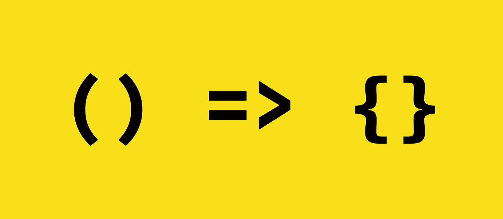
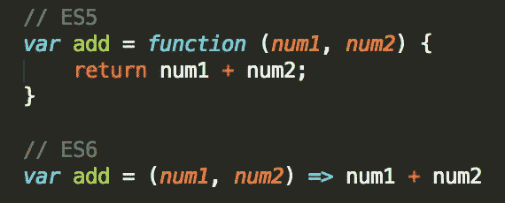

# ES6:箭头功能

> 原文：<https://javascript.plainenglish.io/es6-arrow-function-784f8848d271?source=collection_archive---------0----------------------->



Arrow Function Syntax

如果你想写一个简短的函数语法，没有比箭头函数更好的方法了，在这篇文章中我们将通过一个最流行的 ES6 特性=> ***箭头函数*** ，让我们开始吧！

*让我们探索一下语法，以及它与普通函数语法的区别:*

```
function helloWorld(){
   console.log("Hello World"); // Hello World
}
```

如上例所示，这是我们过去看到的常规函数的语法，但是箭头函数有不同的语法:

```
()=> console.log("Hello World"); //Hello World 
```

Arrow 函数是用最短最简单的方法来写函数的，如图所示，它是一个匿名函数，这意味着它可以是一个未命名的函数，它有一个括号来直接传递参数，然后这个函数在 arrow 之后返回什么。它有一个隐式的 return，所以不需要写 return 关键字。

```
var incrementOne = [1,2,3,4,5].map(num => num +1) ; 
console.log(incrementOne); // [2,3,4,5,6]
```

这是一个单行箭头函数，用于映射数组，并将其元素递增 1， ***就这么简单！***



ES5 function VS ES6 function ( Arrow Function )

> Arrow 函数可以是一行函数，带参数和返回语句，简单明了！

箭头函数的另一个好处是箭头函数中的*这个*范围:

" *this* 有时会引用函数的父级，即" *window* "，所以需要将 this 绑定到这个函数的作用域，但是在 **arrow 函数**中使用的每个" *this* 都会引用这个函数的作用域，而不是引用父级。

> 在 ES5 中

```
var obj = {
id : 42 ,
timer: function timer() {
setTimeOut( function () {
console.log(this);
console.log(this.id);
},1000);
};
obj.timer() ; // this will return window object
```

如图所示，当使用一个常规函数时，该函数内的 *this* 返回的是函数作用域的父对象 *window，*所以需要绑定*this**。*

> 在 ES6 中

```
var obj = {
id : 42 ,
timer: function timer() {
setTimeOut(() => {
console.log(this);
console.log(this.id);
},1000);
};
obj.timer() ; // this will return obj object where this scope and id defined within this scope .
```

***汇总***

*   它们的语法比常规函数短，可以是单行函数。
*   它们可以是匿名的，并具有隐式的 return 语句。
*   "*当箭头函数用作内部函数时，此*范围仍在方法中声明。

这就是你需要知道的关于*箭头功能*的全部内容，希望你喜欢并且学到了。

> 不要只是阅读它，试一试！

快乐学习..