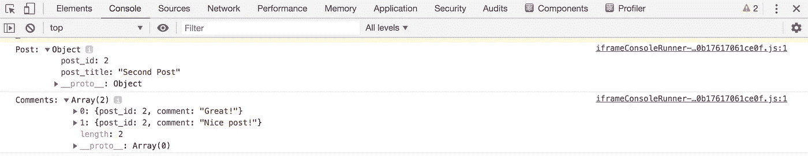
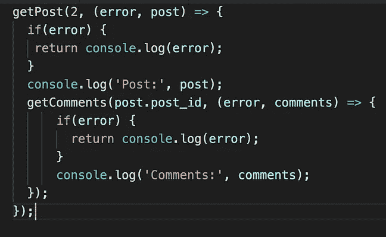
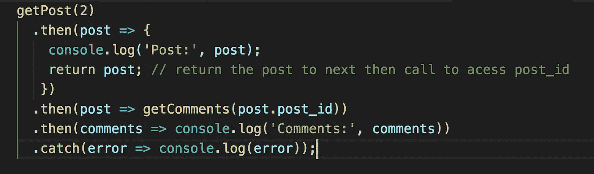

# ES6 承诺:处理回调的更好方式

> 原文：<https://javascript.plainenglish.io/es6-promises-a-better-way-of-handling-callbacks-fe9ecb847ad1?source=collection_archive---------0----------------------->

## 使用承诺编写更易管理的代码


ES6 引入了 promises 作为本机实现。在 ES6 之前，我们使用回调来处理异步操作。

我们来了解一下什么是回拨，什么与回拨相关的问题是通过承诺来解决的。

考虑一下，我们有一个帖子列表和他们各自的评论。

```
const posts = [
  { post_id: 1, post_title: 'First Post' },
  { post_id: 2, post_title: 'Second Post' },
  { post_id: 3, post_title: 'Third Post' },
];

const comments = [
  { post_id: 2, comment: 'Great Post!'},
  { post_id: 2, comment: 'Nice Post!'},
  { post_id: 3, comment: 'Awesome Post!'},
];
```

我们将编写一个函数，通过传递帖子 id 来获取帖子，如果找到帖子，我们将获得与该帖子相关的评论

```
const getPost = (id, callback) => {
 const post = posts.find( post => post.post_id === id);
 if(post) {
   callback(null, post);
 } else {
   callback("No such post", undefined);
 }
};const getComments = (post_id, callback) => {
 const result = comments.filter( comment => comment.post_id === post_id);
 if(result) {
   callback(null, result);
 } else {
   callback("No comments found", undefined);
 }
}
```

在上面的`getPost`和`getComments`函数中，如果有错误，我们将把它作为第一个参数传递，如果我们得到了结果，我们将调用回调函数，把结果作为第二个参数传递。

如果您熟悉 Nodejs，那么您会知道这是每个 Nodejs 回调函数中使用的一种非常常见的做法。

现在让我们使用这些函数

```
getPost(2, (error, post) => {
    if(error) {
     return console.log(error);
    }
    console.log('Post:', post);
    getComments(post.post_id, (error, comments) => {
        if(error) {
          return console.log(error);
        }
        console.log('Comments:', comments);
    });
});
```

执行上述代码后，您将看到以下输出



演示:[https://codepen.io/myogeshchavan97/pen/PoweVgR?editors=0011#0](https://codepen.io/myogeshchavan97/pen/PoweVgR?editors=0011#0)

如你所见，我们在`getPost`回调函数中嵌套了`getComments`函数。想象一下，如果我们也想找到注释之类的东西，那么它们也会嵌套在`getComments`回调函数中，这样会产生更多的嵌套，这会使代码难以理解。

回调的这种嵌套被称为回调地狱。

此外，您可以看到错误处理条件不断重复，这产生了不好的重复代码。

因此，为了解决这个问题，承诺被引入。

**为了创建一个新的承诺，我们使用了承诺构造函数**

```
const promise = new Promise((resolve, reject) => {});
```

Promise 构造函数接受一个函数作为第一个参数。

resolve 和 reject 是自动传递给函数的函数。

这个承诺经历了三个阶段。

a)待定
b)完成
c)拒绝

当我们创建一个承诺时，它处于**待定**状态，当我们调用 resolve 函数时，它进入**已履行**状态，如果我们调用 reject，它将进入**已拒绝**状态。

我们在传递给 Promise 构造函数的函数中执行异步操作，当我们得到异步操作的响应并且响应是 ok 时，我们调用 resolve 函数，如果有错误，我们调用 reject 函数。

```
const resolvedPromise = () => {
  return new Promise((resolve, reject) => {
    resolve('worked!');
  });
};
```

为了访问已解析承诺的值，我们需要附加**然后是**处理程序，当承诺被解析时将调用该处理程序。

```
resolvedPromise().then((result) => {
  console.log(result); // worked!
});
```

当承诺被拒绝时， **catch** 处理程序将被执行

```
const rejectedPromise = () => {
  return new Promise((resolve, reject) => {
    reject('something went wrong!');
  });
};

rejectedPromise().catch((error) => {
  console.log('Error', error); // Error something went wrong!
});
```

**注意，我们可以只传递一个值来解析和拒绝函数。**

看看下面的代码

```
const multiply = number => {
  if(number > 0) {
    return number * number;
  } else {
    return "Error while multiplying";
  }
};

const getPromise = value => {
  return new Promise((resolve, reject) => {
    const result = multiply(value);
    if(typeof result === "number") {
      resolve(result);
    } else {
      reject(result)
    }
  });
};

getPromise(4)
 .then(result => console.log(result)) // 16
 .catch(error => console.log(error));

getPromise(-5)
 .then(result => console.log(result))
 .catch(error => console.log(error)); // Error while multiplying
```

这里，在 getPromise 函数中，我们传递一些值。如果该值是一个数字，那么我们返回该数字与其自身的乘积，否则返回一个错误。

演示:【https://codepen.io/myogeshchavan97/pen/PowaYBO?editors=0011 

*我们也可以附加多个 then 处理程序*

```
getPromise(4)
 .then(result => {
   return getPromise(result);
  })
 .then(output => console.log('result', output))
 .catch(error => console.log('error', error));
```

从第一个**然后**调用返回的值将被传递给第二个**然后**调用，依此类推。
这种附加多个**然后**调用的方式被称为**承诺链**。

演示:[https://codepen.io/myogeshchavan97/pen/eYmKYZN?editors=0011](https://codepen.io/myogeshchavan97/pen/eYmKYZN?editors=0011)

*如果承诺链中的任何一个承诺被拒绝，则链中的下一个承诺将不会被执行，而是在那里停止执行，并执行 catch 处理程序。*

```
const multiply = number => {
  if(number > 0) {
    return number * number;
  } else {
    return "Error while multiplying";
  }
};const getPromise = value => {
  return new Promise((resolve, reject) => {
    const result = multiply(value);
    if(typeof result === "number") {
      resolve(result);
    } else {
      reject(result)
    }
  });
};getPromise(4)
 .then(result => {
   console.log('first');
   return getPromise(result);
  })
 .then(result => {
   console.log('second');
   return getPromise(-5); // passing negative value will call reject
  })
 .then(result => { // this will not be executed
   console.log('third');
   return getPromise(2);
  })
 .then(output => console.log('last:', output))
 .catch(error => console.log('error:', error));
```

演示:[https://codepen.io/myogeshchavan97/pen/rNaKNWx?editors=0011](https://codepen.io/myogeshchavan97/pen/rNaKNWx?editors=0011)

正如您在这里看到的，只有第一个和第二个**然后是**块被执行，第三个被跳过，因为承诺由于乘法函数中的负值检查而被拒绝。

现在，您对承诺和承诺链有了很好的理解，让我们看看如何使用承诺链解决第一个帖子和评论示例的回调问题。

```
const posts = [
  { post_id: 1, post_title: 'First Post' },
  { post_id: 2, post_title: 'Second Post' },
  { post_id: 3, post_title: 'Third Post' },
];const comments = [
  { post_id: 2, comment_id: 1, comment: 'Great Post!'},
  { post_id: 2, comment_id: 2, comment: 'Nice Post!'},
  { post_id: 3, comment_id: 3, comment: 'Awesome Post!'},
];const getPost = (id) => {
 return new Promise((resolve, reject) => {
   const post = posts.find( post => post.post_id === id);
   if(post) {
     resolve(post);
   } else {
     reject("No such post");
   }
 });
};const getComments = (post_id) => {
   return new Promise((resolve, reject) => {
     const result = comments.filter( comment => comment.post_id === post_id);
     if(result) {
       resolve(result);
     } else {
       reject("No comments found");
     }
   });
}getPost(2)
  .then(post => {
    console.log('Post:', post);
    return post; // return the post to next then call to acess post_id
   })
  .then(post => getComments(post.post_id))
  .then(comments => console.log('Comments:', comments))
  .catch(error => console.log(error));
```

演示:[https://codepen.io/myogeshchavan97/pen/YzPvzVe?editors=0011](https://codepen.io/myogeshchavan97/pen/YzPvzVe?editors=0011)

如果您比较回调和承诺的代码，您可以看到如下所示的差异



这里，我们将回调函数调用更改为根据响应进行解析或拒绝，并使用承诺链来避免函数调用的嵌套。我们还避免了仅使用一个 catch 处理程序进行重复的错误条件检查。

今天到此为止。希望你今天学到了新东西。

**别忘了直接在你的收件箱** [**这里**](https://yogeshchavan.dev) **订阅我的每周时事通讯，里面有惊人的技巧、诀窍和文章。**