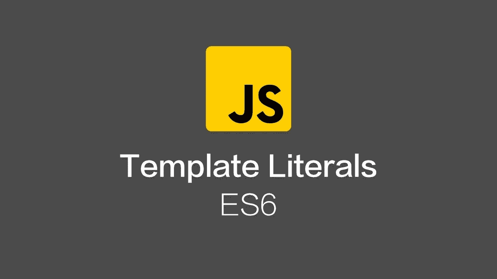
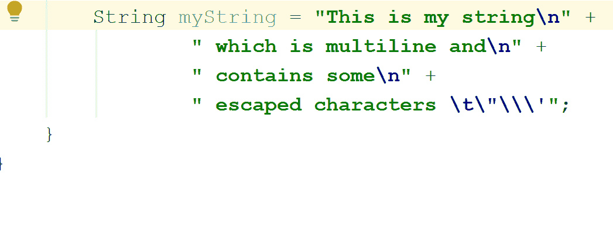

# ES6:模板文字

> 原文：<https://javascript.plainenglish.io/es6-template-literals-5ffe0e7a692a?source=collection_archive---------2----------------------->



ES6 : Template Literals

一种新的快速处理字符串的方法是**模板文字，**我们将在本文中发现**——让我们开始吧！**

## **我们之前是如何处理字符串的？**

**以前我们常常看到单引号或双引号之间的字符串，如下所示:**

```
var name = "Marina" ;
var hello = "Hello "+ name ;
console.log(hello); //Hello Marina
```

**到目前为止，它是好的，但是当你试图创建一个多行模板，试图连接变量和表达式，然后在字符串中添加一个引号，这样你就需要在单引号和双引号之间交替使用，问题就出现了..仅仅为了生成一个字符串就要这么多！**

**ES6 带来了一个伟大的解决方案来拯救你，欢迎**模板字面量。****

## **什么是模板文字？**

**正如我们之前提到的，这是一种处理字符串，特别是动态字符串的方法；所以你不需要再多想下一个用“单还是双”的引号是什么了！！**

## **如何使用模板文字？**

**它使用一个“反勾号”在里面写字符串，所以你可以写单引号和双引号，而不用考虑它们之间的交替，它们会在你写的时候显示出来。**

```
var template = `Hello from "template literals" article , check previous one 'arrow functions'.` ;
console.log(template) // Hello from "template literals" article , check previous one 'arrow functions'.
```

**此外，它解决了多行模板，所以不需要使用\n 或\t 与'反勾号'**

****

**Thanks to Vojtech Ruzicka’s Programming Blog for GIF**

**最后，对于要连接到字符串的变量和表达式，而不是使用+来连接，您将使用＄{ variable or expression }在花括号中定义变量或表达式，例如:**

**变量:**

```
let name = "Marina" ;
let hello = ` Hello ${name} .`
console.log(hello); // Hello Marina .
```

**表情:**

```
let isWorld = true ;
let welcome = ` Hello ${ isWorld ? "World" : "me" } ! ` ;
console.log(welcome); // Hello World ! 
```

*****汇总*****

*   **模板文字是处理字符串的一种方式。**
*   **模板文本使用“反斜杠”在其中写入字符串。**
*   **更好地使用模板有多行，连接变量和表达式。**

**这就是你需要知道的关于**模板字面量**的所有内容，我希望你喜欢并且学到了。**

> **阅读是好的，但阅读与实施是伟大的！**

**快乐学习..**