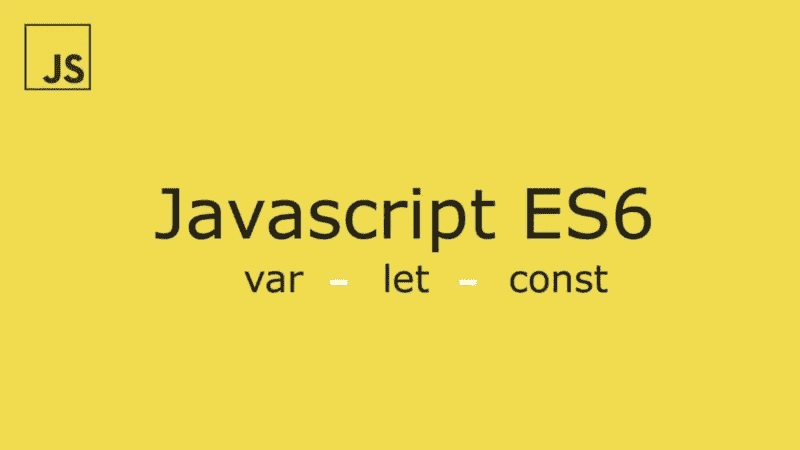

# ES6:假设和常数

> 原文：<https://javascript.plainenglish.io/es6-variable-definition-feature-using-let-and-const-14eb143f799e?source=collection_archive---------0----------------------->



在本文中，我们将探索 ES6 引入的新特性— *let* 和 *const* 对抗 *var。*

> **var，let，const 有什么区别？**

简单地说，它们是在 javaScript 中声明一个新变量的三种方法，有些细微的区别我们将在本文中讨论。

# var:

这是在 javaScript 中声明新变量的主要且唯一的方法。但是它有一些问题:

1-具有*功能范围。*

> 函数作用域:意味着变量将在定义它的函数内部可用，否则它将属于全局作用域(窗口对象)。

2-它可以在同一个项目中声明多次。

3-您可以随时重新分配变量值。

4-最后一个问题是*提升，*我们不会在本文中过多讨论提升，而只是简单地说:javaScript 区分变量赋值和声明，然后在代码顶部提升所有声明。

```
var myVar = 10; 
var myVar; // this is declaration 
myVar = 10; // this is assignment
```

# 让:

跟 *var* 关键字挺像的，不同的是它有 ***块范围*** *。*

> Block scope:是花括号{ }之间的任何东西，比如:函数、if 语句、循环或者任何东西。在块范围内声明的变量只在这个范围内可用。

下面是你在使用 ***让*** 关键词时得到的一些好处:

1-您可以随时重新分配变量值。

2-你不能多次声明这个变量。

# 常数:

它还有 ***块范围*** 像 let 关键字。

它拥有 ***让*** 关键字拥有的所有好处，除了一点:

1-不能再次重新分配变量值。

> 使用 ***常量*** 关键字时，处理*数组*和*对象*时要小心:

1-当你使用 const 关键字声明一个新数组时，你可以改变数组中任何元素的值，但是你不能改变整个数组的值。

2-对于对象，你可以改变对象中任何属性的值，但是你不能改变整个对象的值，你也可以在对象中添加更多的键。

> 关于吊装的注意事项:

根据吊装情况，左、常被吊装。var，let 和 const 在吊点的区别是**初始化。** var 用 **undefined** 进行初始化，但是 let 和 const 保持**未初始化**，这导致当你试图在声明之前访问它们时 **ReferenceError** 。

希望你喜欢阅读我的文章，并了解新的功能，任何意见都是如此欢迎。