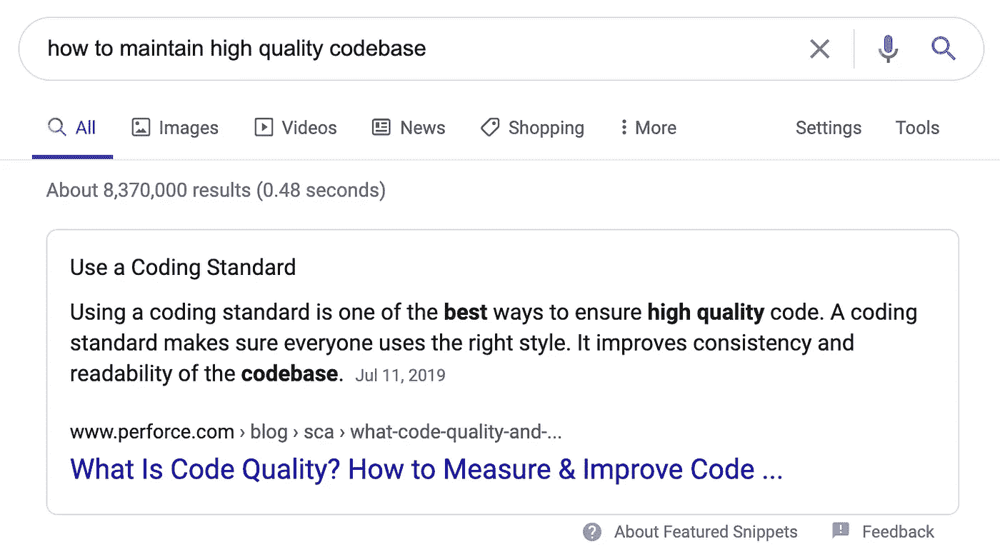

# ESLint——您代码的校对者

> 原文：<https://javascript.plainenglish.io/eslint-a-proofreader-for-your-code-cd7e56ae391f?source=collection_archive---------6----------------------->

## 设置和使用 ESLint 的实用指南



How to Maintain a High Quality Codebase?

# 我的旅程

我不断地问自己，我如何维护一个高质量的代码库？很明显，答案很简单——维护一个好的编码标准。然而，不那么简单的是什么应该是这个标准的一部分，以及我如何执行这个标准。

我没有一个好的答案。我尽力想出了自己的标准，并试图在代码评审中强制执行这个标准。但这还不够。我的“标准”是不断变化的，事情不断地滑过代码审查。当我了解到 ESLint 后，这一切都改变了。

# 埃斯林特

[ESLint](https://eslint.org/) 是 Javascript 的 linter。它的工作原理是分析您的代码，并在违反任何配置规则时向您发出警告。这些规则可以检测可疑的或关于编码质量或格式的问题。它类似于 Google Doc 或 Microsoft Word 的拼写和语法检查——本质上是对代码的自动校对！这正是我所需要的。我可以从 ESLint 的大量规则中创建一个编码标准，并让 ESLint 执行它们。

事实证明，我已经在使用 ESLint 了——只是不是以一种有效的方式。 [Create React App](https://github.com/facebook/create-react-app) 附带原生 ESLint 配置，但非常基础。我需要更新这个配置，这样我的自动校对程序可以让我成为一个更好的开发人员。

# 设置

首先，ESLint 提供了一个方便的设置工具。运行`npx eslint --init`，你将被询问一系列问题，这些问题将帮助 ESLint 创建你的初始设置。

> 您希望如何使用 ESLint？仅检查语法、检查语法并查找问题，或者检查语法、查找问题并强制代码样式。

我推荐选择*检查语法，发现问题，并执行代码风格*来充分利用 ESLint。

> 你的项目使用什么类型的模块？JavaScript 模块(导入/导出)，CommonJS(要求/导出)，或者都不是。
> 
> 你的项目使用哪个框架？React，Vue.js，或者都不是。
> 
> 您的项目使用 TypeScript 吗？是或不是。
> 
> 你的代码在哪里运行？浏览器、节点或两者。

这些将取决于您的代码库。

> 您希望如何定义项目的样式？使用流行的风格指南，或者回答关于你的风格的问题，或者检查你的 JavaScript 文件。

我建议使用流行的风格指南。这将使您能够利用专家花费数千小时构建的风格指南。你可以免费得到它！

> 你想遵循哪种风格指南？ [Airbnb](https://github.com/airbnb/javascript) ， [Standard](https://github.com/standard/standard) ，或者 [Google](https://github.com/google/eslint-config-google) 。

我强烈推荐使用 Airbnb。据我所知，这是最流行的风格指南，我认为它是 Javascript 社区事实上的标准。

> 您希望您的配置文件采用什么格式？JavaScript、YAML 或 JSON。

这取决于你，但是请记住——我们是 Javascript 开发者！

一旦问卷完成，ESLint 将安装所有必要的依赖项，并在`.eslintrc.js`中创建您的基本配置。

# 配置

现在我们有了一个基本配置，让我们来了解它的功能。三个主要部分是[规则](#2d54)、[插件](#3a02)和[扩展](#e6de)。

# 规则

在配置的`rules`部分定义的规则决定了 ESLint 校对程序在你的代码中寻找什么。ESLint 为[提供了数百条帮助维护代码质量的规则。这些规则可以设置为`off`、`warn`或`error`。`off`什么都不做，`warn`将记录错误，`error`将记录错误并返回 1 退出代码，因此集成(如连续集成)将失败。](https://eslint.org/docs/rules/)

```
module.exports = {
  rules: {
    'no-underscore-dangle': 'off',
    'no-console': 'warn',
    'no-empty': 'error',
  },
}
```

有些规则还允许您使用附加配置选项来自定义规则，这样您就不必关闭整个规则。

```
module.exports = {
  rules: {
    'no-empty': ['error', { allowEmptyCatch: true }],
  },
}
```

# 插件

但规则远不止这些。ESLint 还提供插件，定义在配置的`plugins`部分，允许第三方自己开发规则。大多数已建立的框架，如 [React](https://www.npmjs.com/package/eslint-plugin-react) 、 [Jest](https://www.npmjs.com/package/eslint-plugin-jest) 和[测试库](https://www.npmjs.com/package/eslint-plugin-testing-library)，利用这一点并扩展 ESLint 的本地规则。事实上，我通常通过检查一个框架是否有自己的 ESLint 规则来评估它的成熟度！

```
module.exports = {
  plugins: ['react'],
  rules: {
    'react/no-deprecated': 'error',
  },
};
```

# 扩展ˌ扩张

总的来说，有成千上万的 ESLint 规则。如果不花费数周时间去理解所有规则，您怎么可能决定启用哪些规则呢？你不需要——在配置的`extends`部分定义的扩展会为你处理。像 [Airbnb 的 ESLint 配置、](https://www.npmjs.com/package/eslint-config-airbnb)ESLint 设置工具提供的一些扩展，如果你选择了 Airbnb 的风格指南，已经启用了数百个规则；如果您使用它们的扩展，也会为您启用这些规则。

以下是常见 Javascript 框架中一些值得注意的 ESLint 配置:

*   `[airbnb](https://www.npmjs.com/package/eslint-config-airbnb)` — Airbnb 的 ESLint 配置，用于其 Javascript 风格指南
*   `[plugin:react-hooks/recommended](https://www.npmjs.com/package/eslint-plugin-react-hooks)` —推荐用于[反应钩](https://reactjs.org/docs/hooks-intro.html)的 ESLint 配置
*   `[plugin:react/recommended](https://www.npmjs.com/package/eslint-plugin-react)` —为 [React](https://reactjs.org/) 推荐的 ESLint 配置
*   `[plugin:react-redux/recommended](https://github.com/DianaSuvorova/eslint-plugin-react-redux)` —推荐用于 [React Redux](https://www.npmjs.com/package/react-redux) 的 ESLint 配置
*   `[plugin:jest/recommended](https://www.npmjs.com/package/eslint-plugin-jest)` —为 [Jest](https://jestjs.io/) 推荐的 ESLint 配置
*   `[plugin:testing-library/r](https://www.npmjs.com/package/eslint-plugin-testing-library)eact`—[React 测试库](https://testing-library.com/)的推荐 ESLint 配置

# 覆盖+禁用

使用扩展的一个副作用是您可能不喜欢它们的所有规则。幸运的是，您可以在`rules`部分定制或关闭这些规则。

```
module.exports = {
  extends: ['airbnb', 'plugin:react/recommended'],
  rules: {
    'no-empty': ['error', { allowEmptyCatch: true }],
    'react/jsx-filename-extension': [
      'error',
      { extensions: ['.js', '.jsx'] }
    ],
  },
};
```

即使喜欢一个规则，有时候也会遇到想暂时禁用的情况。您可以使用注释来实现这一点。

*   `/* eslint-disable */`:禁用下面所有行的 ESLint
*   `/* eslint-disable-line */`:禁用当前行的 ESLint
*   `/* eslint-disable-next-line */`:禁用下一行的 ESLint

您还可以在禁用注释后指定(逗号分隔)规则，以专门禁用这些规则，而不是禁用所有规则。

```
import React from 'react';
import PropTypes from 'prop-types';*/* eslint-disable */*
import ReactDom from 'react-dom';
*/* eslint-enable */**/* eslint-disable-line arrow-body-style */* const App = () => {
  return <h1>ESLint Demo</h1>;
};
App.propTypes = {
  */* eslint-disable-next-line react/no-unused-prop-types, react-redux/no-unused-prop-types */*
  unused: PropTypes.string.isRequired,
};export default App;
```

当然，如果您发现自己一遍又一遍地禁用同一个规则，您可能要考虑永久禁用它。

# 运转

现在我们已经有了想要的配置，终于到了运行 ESLint 的时候了。为此，将以下内容添加到您的`package.json`中。

```
{
  "scripts": {
    "lint": "eslint . ",
    "lint:fix": "eslint . --fix",
  },
}
```

`npm run lint`将运行 ESLint，任何错误和警告都将打印到控制台。修复并重复。`npm run lint:fix`也会运行 ESLint，但也会尝试并自动修复任何违反的规则。任何无法自动修复的规则都将被打印到控制台。

# 最后的想法

现在，您应该已经开始使用 ESLint 了。下一步是修复任何违规— [我不得不自己处理超过 30，000 个错误](https://medium.com/javascript-in-plain-english/how-i-dealt-with-over-30-000-eslint-errors-640472eecc0)！但我认为从长远来看这是值得的。ESLint 监督并指导我创建和维护高质量的代码库，这样我就不必纠结于小细节。相反，我可以专注于创造更好的产品。

# 资源

*   [官方 ESLint 文档](https://eslint.org/)
*   [本文 Github 回购](https://github.com/mjchang/medium/tree/master/eslint)
*   [本文的 code sandbox](https://codesandbox.io/s/github/mjchang/medium/tree/master/eslint)