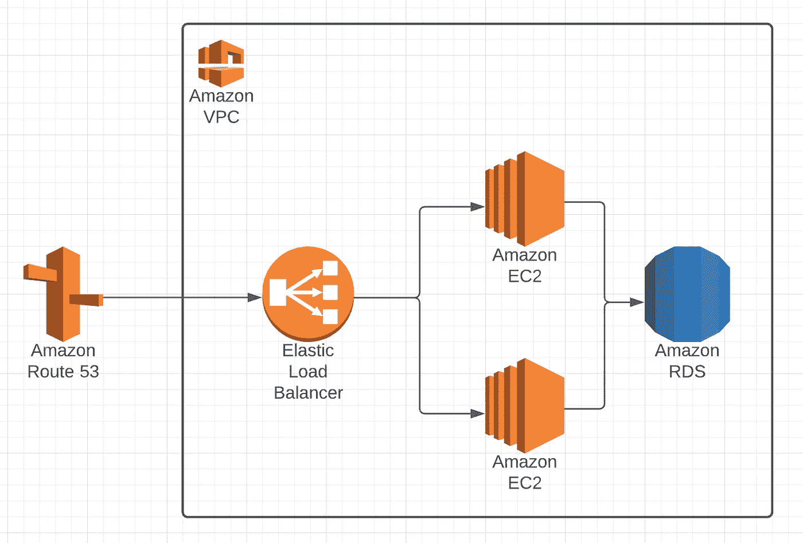
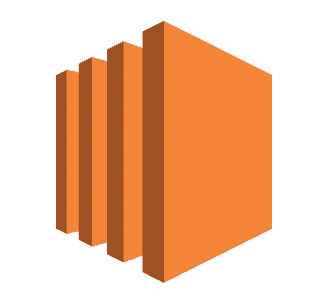
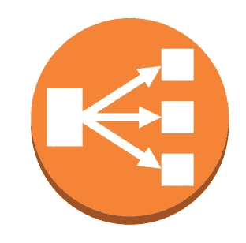
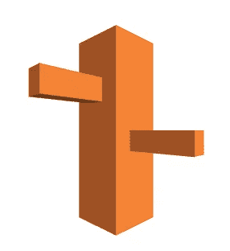
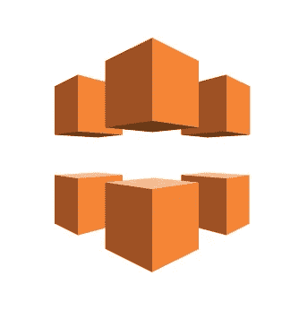
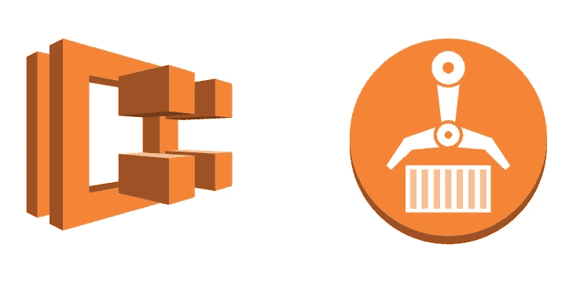

# 全栈工程师应该了解的基本 AWS 服务

> 原文：<https://javascript.plainenglish.io/essential-aws-services-a-full-stack-engineer-should-be-aware-of-5155f25ce7e3?source=collection_archive---------4----------------------->

An EC2 setup with a load balancer and a database

在花了几个月的时间使用 AWS 并使用它开发 web 应用程序之后，我想描述一下我发现自己使用最多的顶级服务。

当然，这篇文章不是 AWS 服务的详细指南，因为它旨在成为一篇关于 AWS 世界的介绍性文章，由全栈开发人员为所有其他全栈工程师编写🌎。

这个名单*可以*和*应该*被认为是主观的。然而，如果你在 web 开发行业，你很有可能会使用大多数下面的 Amazon 服务。所以，让我们开始吧！🔥

# Amazon EC2(虚拟机——后端应用的地方)

EC2 ，也被称为弹性计算云，是亚马逊提供的一项基本服务。你可以直接使用它，或者通过另一个 AWS 服务使用它，但是你不能从它那里运行*。*

EC2 是简单的虚拟机**。它们有各种尺寸，从基本的机器到难以置信的动力装置。然而，如果你是一个 web 开发人员，你的应用程序不能吸引数百万用户，你将主要使用低端或中端的应用程序。**

ec2 对于任何有后端组件的 web 应用程序都是至关重要的(想想任何用 Java、JavaScript on Node、Go、Python 等编写的后端服务)。你需要在某个地方运行这些应用程序*。*这正是 EC2 虚拟机的用处所在。

The EC2 symbol

# **负载平衡器(与后端应用程序的接触点)**

让我们假设您已经将后端应用程序设置为在 EC2 机器上运行。太好了！但是，通常您不应该公开 EC2 机器。前面再有一层*层*就好了。这就是**负载平衡器**发挥作用的地方。

顾名思义，负载平衡器…平衡负载，对吗？这里的*负载*是来自*客户端*的请求，即来自前端(或*前端*)的调用——React、Vue、Angular、Android TV、另一个后端服务、iOS 应用、你的智能冰箱等等。

平衡负载意味着*分割*它，或者*路由*它到多台机器，所以没有一台机器会不堪重负。

现在有趣的部分来了。您将**而不是**使用一个负载均衡器来进行负载均衡。在许多情况下，您将只使用一台**EC2 机器的负载平衡器。为什么？因为负载平衡器提供的不仅仅是负载平衡。**

负载平衡器可以很容易地与通过 AWS 购买的 **HTTPS** 证书集成。因此，只需一次点击，使您的域名安全。

此外，很容易设置健康检查来监控 LB 路由到的 EC2 实例的状态。

此外，配置自定义域名指向您的负载均衡器真的很容易，因为**route 53**(AWS 的 DNS 服务)可以与负载均衡器顺利集成。

AWS 的负载平衡器被称为**弹性负载平衡器**。

The Elastic Load Balancer symbol

# Route53 (DNS 服务-这是人们找到你的应用的方式)

**AWS Route53** (很好地参考了美国 66 号公路)是亚马逊提供的 DNS 服务。

您可以很容易地配置您的定制域应该指向哪里(可能是一个弹性负载平衡器、EC2 实例、CloudFront 分布、S3 桶等等)。

也可以通过 Route53 购买自定义域名。AWS 的 DNS 服务只是一个要知道的必备服务。

The Route53 symbol

# S3(你的前端和其他资产的地方)

亚马逊的简单存储服务(S3)是其核心服务之一。

本质上，它是一个简单的文件存储服务，使用术语*桶*来描述不同的文件组(*桶*)。

您可以存储图片、视频、文档——基本上是您的业务逻辑需要的任何类型的资产。

这些文件可以保持私有(只能从后端服务访问),也可以公开(可以从前端访问)。

一个 S3 桶也能够托管和服务你的**前端**项目，这实际上是托管你的面向客户端的 web 应用的首选方法。你应该**永远不要**从 EC2 实例为你的前端服务，这不需要服务器端的处理，因为它**效率非常低**(从*速度*和*价格*的角度来看)。

然而，如果你使用 **SSR** (服务器端渲染)，那么不幸的是，你也需要使用一个处理服务(比如 EC2 机器或 AWS Lambda)。

The symbol for an S3 bucket

# CloudFront(CDN——您的前端和资产的快速去处)

一个**内容交付网络**(或 CDN)，比如 CloudFront，为你的前端(和资产)更快地**服务于你的客户，因为它由来自世界各地的多个*分布式系统*组成，在尽可能短的时间内为客户服务。**

在 CloudFront 上托管您的前端的高级步骤如下:

1.  建立你的前端(缩小资产，捆绑文件等。)
2.  将构建推至 S3 桶
3.  配置一个 *CloudFront 发行版*来提供您的 S3 存储桶中的文件
4.  让您的客户享受超快的加载速度🚀

The CloudFront symbol

# RDS(存储关系数据)

许多应用程序需要关系数据库。

亚马逊的**RDS——关系数据库服务**是一个简单的托管服务，它提供各种数据库引擎供选择，如 MySQL、Oracle DB、PostgreSQL。

它易于配置和扩展。这绝对是你必须知道的 AWS 的一项服务。

如果您的数据模型需要，AWS 还提供 NoSQL 解决方案。AWS 的 DynamoDB 和 DocumentDB 就是为了让这一切成为现实。

The RDS symbol

# ECS + ECR = ❤️(运行你的容器化应用)

以容器化的方式运行后端应用程序是非常优雅的。这使得构建一个实例(或 100 个)变得绝对容易。

这就是**ECS—****弹性集装箱服务**发挥作用的地方。ECS 允许您在容器中运行应用程序。只需给 ECS Docker 映像来运行，剩下的事情就交给它了。

**ECR——弹性容器注册表**是一个可以存储 Docker 图像的地方，这些图像在 ECS 中运行(但是也可以使用任何其他的图像注册表/ artifactory)。

有两种方法可以运行容器。您可以使用 EC2 机器作为 ECS 运行容器的基础设施，或者您可以告诉 AWS“嘿，我需要*这么多的* CPU 能力和*这么多的* ram 用于这个容器”，AWS 将负责这个基础设施。这个特性是由一个名为 **AWS Fargate** 的独立 AWS 服务(与 ECS 紧密集成)实现的。

The ECS + ECR symbols

# 要记住的其他服务

## AWS IAM(身份和访问管理)

如果您想授予团队成员访问您的 AWS 服务的权限，您需要创建一个帐户并授予使用某些服务的权限。这是通过 AWS 的 IAM 实现的。

此外，如果您想要集成一个 CI/CD 管道，例如，将另一个 Docker 映像推送到 **ECR** 并将其加载到 **ECS** (容器服务)中，那么您将需要创建一个程序化的 **IAM** 帐户，这样管道就可以访问您的 AWS 服务。

## AWS 弹性豆茎

Amazon 的 Elastic Beanstalk 是一个很棒的服务，它抽象出了将 web 应用程序部署到 AWS 背后的复杂性。

它实际上支持代码上传，也就是说，您可以上传您的项目，它将负责基础设施和所需的 AWS 服务(如数据库、EC2 机器等)。

如果你想加深对 AWS 服务的了解，我建议你不要使用这项服务。获得实际操作、较低级别的 AWS 经验是最重要的。

## AWS SQS 和 SNS

亚马逊的**简单队列服务**和**简单通知服务**对于应用集成至关重要。

如果您有多个后端应用程序需要就某些事件相互通信或通知，那么记住这两个服务是很重要的。

举个例子，我以前在一个应用程序中使用过 **SQS &社交网站**，这个应用程序有一个基于一些数据生成 PDF 文档的独立服务。

所有创建 pdf 的任务都放在**SQS**T2 队列中。PDF generator 应用程序将从这个队列中读取数据，并以自己的速度生成文档。当一个 PDF 准备好了，一个通知通过 **SNS** 发送给 PDF 请求应用程序(T4 消费者)。

这是应用程序解耦的一个很好的例子。PDF exporter 异步处理导出作业，因此没有应用程序被同步阻止和等待。此外，PDF 文档存储在 S3 桶😉。

## AWS CloudWatch 日志

日志在应用程序中非常有用。有许多 SaaS 公司提供测井解决方案。我也试过 AWS 的，集成在 CloudWatch 里。

您可以轻松地设置日志组，编写并分析日志。

## AWS Kubernetes 服务

显然，在我们现在的日子里，有一种“Kubernetes”式的炒作正在进行。

老实说，我认为大多数项目都不需要 Kubernetes，除非它们规模很大，有大量融资。这显然是一项受欢迎的技术，但我们不应该仅仅为了受欢迎或炒作而使用技术。

也就是说，AWS 也提供 Kubernetes 服务，叫做**EKS——弹性 Kubernetes 服务**。

## 自动气象站λ

**FaaS** (功能即服务)产品也越来越受欢迎。 ***无服务器*** 模式允许开发者运行他们的代码，而不必管理底层基础设施(听起来很熟悉吧？带有 Fargate 的 ECS 做了同样的事情)。

有趣的是，只需用 JavaScript 编写一个函数，将它推送到 AWS Lambda，并在任何时候看到它执行，例如，一个 HTTP 请求命中它。而且你只为执行时间付费💰。

总而言之，像 AWS Lambda 这样的 FaaS 解决方案非常值得探索，但可能很难在中小型项目中找到合适的用例，因为它们具有某些潜在的缺点，如 [*冷启动*](https://www.serverless.com/blog/keep-your-lambdas-warm) 。

# 最后

谢谢你一路看完这篇文章！

我希望它给了你足够的信息，让你可以开始或继续探索巨大而美丽的亚马逊网络服务世界。

# 进一步阅读

1.  [https://AWS . Amazon . com/getting-started/hands-on/deploy-nodejs-we b-app/](https://aws.amazon.com/getting-started/hands-on/deploy-nodejs-web-app/)
2.  [https://aws.amazon.com/blogs/aws/](https://aws.amazon.com/blogs/aws/)
3.  [https://aws.amazon.com/ec2/](https://aws.amazon.com/ec2/)
4.  https://www.serverless.com/blog/

*感谢*[*Lucidchart*](https://app.lucidchart.com)*为符号。*

## **简单英语的 JavaScript**

你知道我们有三份出版物和一个 YouTube 频道吗？在[**plain English . io**](https://plainenglish.io/)找到所有内容的链接！