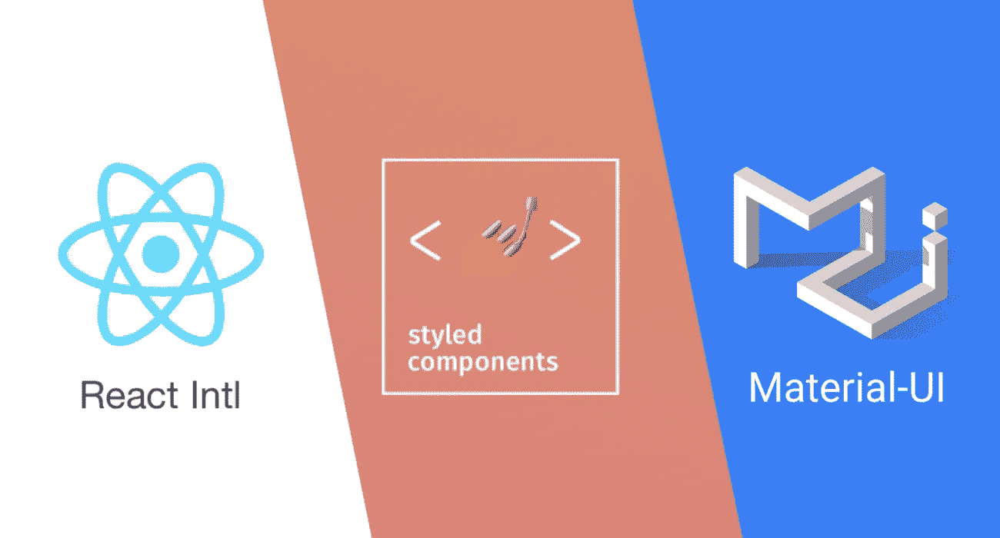

# 构建您的应用程序的基本 React 库

> 原文：<https://javascript.plainenglish.io/essential-react-libraries-to-create-your-app-132993263d58?source=collection_archive---------7----------------------->

如果您正在使用 React 构建一个应用程序，您肯定会需要一组库，这样您就不需要重新发明轮子，而是依靠由全球大型社区支持的健壮的、记录良好的库(是的，地球不是平的)。

# 锅炉钢板

让我们速战速决，create-react-app 是一个完美的开始，但是如果你想继续做一些更复杂更大的事情，我推荐两个包:

*   如果你正在 React 中构建一个静态内容
*   Next.js:对于服务器端渲染 React

# 反应路由器

React 路由器是 React 中的标准路由库。它使应用程序界面与浏览器 URL 同步。

React Router 允许您干净地路由您的应用程序，并通过您的不同屏幕传递数据。

这里有一个快速演示:[https://codesandbox.io/s/nn8x24vm60?from-embed](https://codesandbox.io/s/nn8x24vm60?from-embed)

# 格式化(保持代码整洁)

## [更漂亮](https://prettier.io/)

漂亮是一个代码格式化程序。它扫描您的文件的风格问题，并自动重新格式化您的代码，以确保一致的规则，缩进，间距，分号，单引号对双引号，等等。

## [ESlint](https://www.npmjs.com/package/eslint-plugin-react)

一个 linter，它自动扫描你的 JavaScript 文件中常见的语法和风格错误。

# UI 组件

web 开发中有许多组件，每次开始实现一个新的应用程序时，您都不想从头开始实现。这些东西就像日期选择器、下拉菜单、表格或导航栏。这就是为什么有一些 UI 库与 React 和 Angular 等库紧密合作的原因。

我个人用的是 [**语义 UI**](https://react.semantic-ui.com) ，不过你也可以用其他库比如 [**材质 UI**](https://material-ui.com/fr/) ，如果你是材质设计的爱好者的话。

为了明智地定制你的组件，你可以依靠[风格的组件库](https://www.styled-components.com/docs/basics)

# 测试应用程序

你旅程中的一个重要的生命周期，如果你没有测试你的应用程序，你将不得不在交付一个错误的，不可维护的代码片段后付出代价。

本主题中的建议是单元/集成/快照测试: [Jest](https://jestjs.io/docs/en/tutorial-react) + [Enzyme](https://airbnb.io/enzyme/docs/guides/jest.html) (我在这里介绍了一些核心概念)

# 国际化，走向世界🌎

React Intl 打破了 ReactJS 使用的边界。该工具为您提供了各种用于编辑日期和数字的 React 组件。它有助于处理字符串。

这个库有几个显著的特性，包括演示带分隔符的数字和标签的多元化。此外，Intl 对于处理日期非常有用，它可以纠正可能的错误。

# 类型检查

你的应用程序越来越大，错误也随之增加，你真的不想经历类型检查。

我将留给你脸书的建议，使用 [PropTypes](https://reactjs.org/docs/typechecking-with-proptypes.html) 或 [Flow](https://flow.org/)