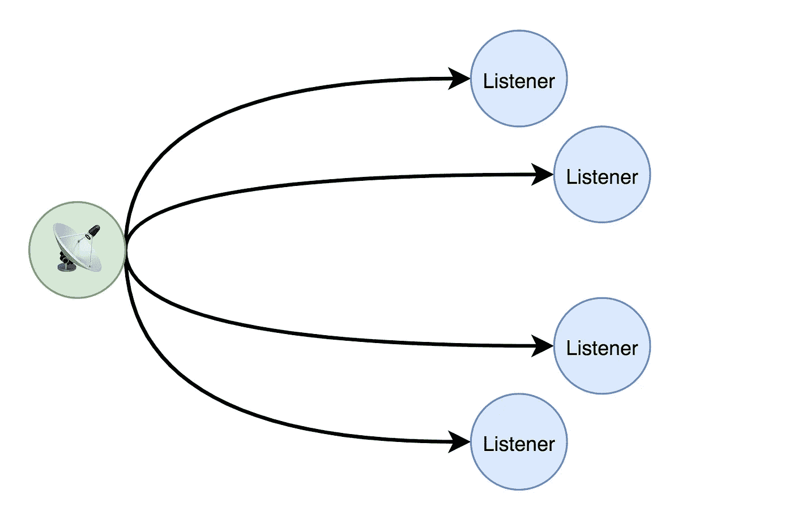
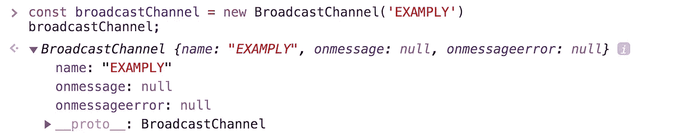
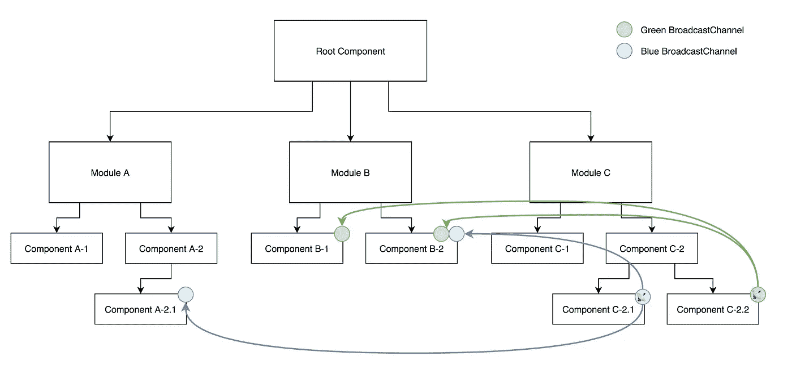
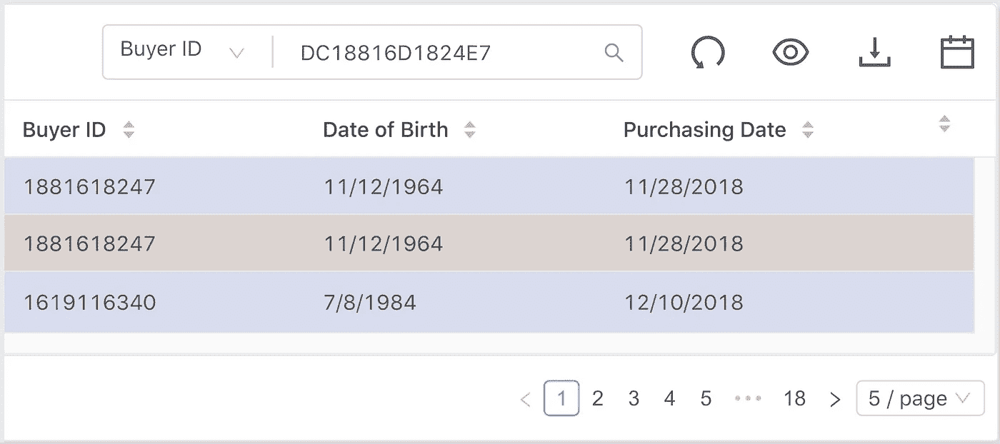
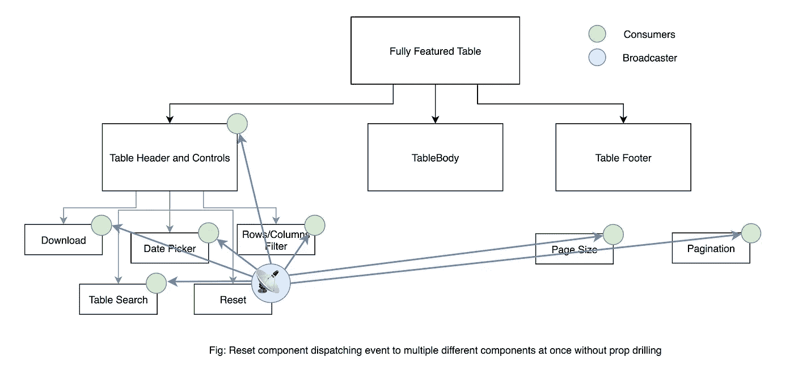
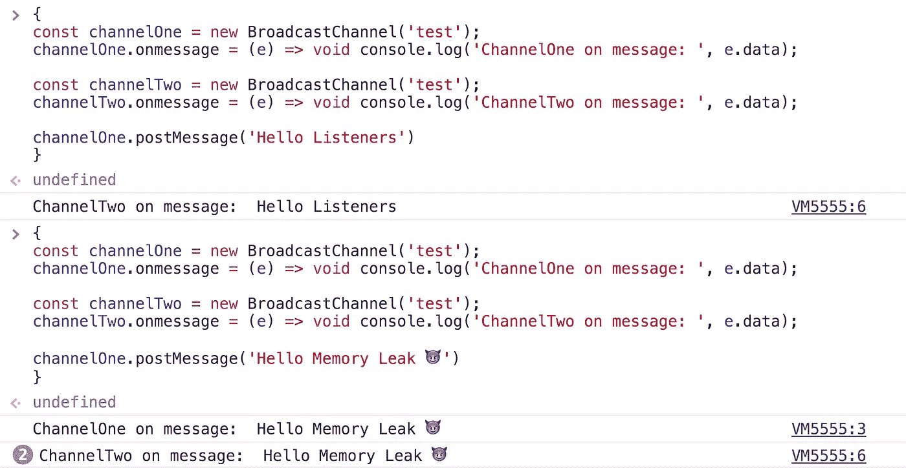
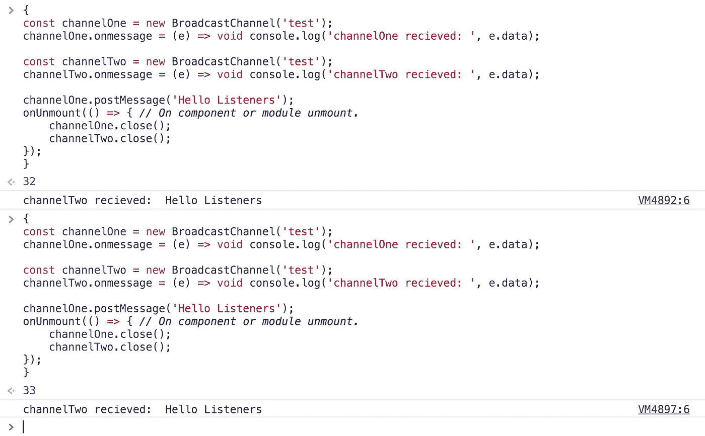

# 在组件驱动架构中建立广播通道📡

> 原文：<https://javascript.plainenglish.io/establishing-broadcasting-channel-in-components-driven-architecture-d3d56c20fdbe?source=collection_archive---------11----------------------->

## 介绍 BroadcastChannel API 和使用 BroadcastChannel 的跨组件/模块通信

广播仅仅意味着向观众或听众传递信息。

A broadcasting node dispatching information to multiple listeners.

软件工程世界中几乎所有的概念都是从现实世界中抄袭来的。同样的，*广播频道*就像它听起来的那样，它向听众广播信息。

深入到 WebAPI 本身，一个*广播频道*也是一个消息频道，就像 *postMessage* 频道一样，除了一些我们将讨论的差异。

Wait！在继续阅读之前，如果你不知道 MessageChannel 或 postMessage，请先阅读我关于[***message channel***](https://medium.com/@itssaadabbasi/message-channels-f94de3488b1a)**的文章，然后再继续**

*所以，我们在谈论*广播频道*是一种差异很小的沟通渠道:*

*   *它有一个频道名，听众或其他消费者可以通过它订阅。*
*   *与 *MessageChannel 不同，*你可以拥有任意多的听众。*

*让我们看看我写代码是什么意思。*

**

*嗯，看到了吗？这与 *postMessage* 通道具有相同的接口，除了它具有名为 **name** 的附加属性。因此，这里的问题是“它在功能上与*邮件后*频道有何不同”*

*嗯， *postMessage* 渠道建立在两个消费者之间，其中一个发布消息，另一个监听，这种沟通在消费者之间来回进行。但是在广播频道，你可以注册任意多的听众，但是他们必须有相同的名字。*

**

*所以，这里需要注意一些事情:*

*   *我们将我们的通道命名为“examply”，您可以用 string 或 string complaint 来命名它，但这里要注意的一点是，您想要注册到特定通道的所有侦听器必须具有相同的名称。在上面的例子中 *listenerOne* 和 *listenerTwo* 具有完全相同的名称‘示例’,但是 *listenerThree* 具有名称‘示例，不是示例’,它也有一个监听器，但是它没有被触发；其他两个有。*
*   *我们在注册了所有的听众之后发布了消息，不像 *postMessage* 频道； *broadcastChannel* 不缓冲注册监听器之前发布或广播的事件或消息。*

*如果我们读过关于 [*消息通道*](https://medium.com/@itssaadabbasi/message-channels-f94de3488b1a) 的文章，因为这个 WebAPI 的工作方式有些类似；我不会浪费太多时间来重复我们已经学到的东西。
让我们直接进入在我们的应用程序中我们可以在哪里以及如何使用它。*

**

*如果我们试图通过钻柱或任何其他手工编写的设计模式来实现这一点，请考虑这个场景。这实际上会给你带来大量的代码需要维护，但代价是严重的性能损失(如果处理不当)。有了 BroadcastChannel，一切都变得简单而直截了当:没有道具训练，没有观察者/可观察的模式，没有发射者/消费者，只是简单而美好。*

*另一个很好的例子是下表*

**

*这是一个具有多种功能的表，如搜索、排序、下载配置、日期范围选择器和切换列可见性选择器、分页和页面大小选择。嗯，配置很多，对吧？如果我要求你实现一个功能“重置”，点击重置每个功能为默认！那将是低音的痛苦，不是吗？*

**

*因此，我们可以通过在不同组件之间建立一个名为“reset-table”的广播通道来实现这一点，并使 *ResetComponent* 能够向所有其他侦听器组件发布消息，以便它们能够做出相应的反应。*

*更好的一点是，如果一个侦听器组件不活动(在视图中是呈现的)或者稍后可能被延迟加载，这也没有问题。一旦它将延迟加载，如果它具有正确频道名称，它将只是挂钩到广播频道。*

*但是也有不好的一面，如果你不注意取消订阅，它可能会引入一些内存泄漏。让我们看看如何通过引入内存泄漏☢️*

**

*每次执行这段代码时，侦听器的数量都会不断增加。为了防止内存泄漏，只需在您完成监听或卸载模块或组件后关闭通道，方法是在您想要关闭的通道上调用 *close* 方法。*

**

*我们刚刚修好了，但是，请注意！一旦通道被关闭，你就不能通过它发送或接收信息，这应该是显而易见的，但无论如何还是要提到它。*

*嗯，是的，redux 也可以做到这一点，忽略样板文件，所有的复杂性，所有你必须改变的文件，以及随之而来的额外代码；这个问题是基于事件的问题，redux 是一个状态容器，仅仅因为我们可以适应它，并不意味着我们应该适应它。我发现*广播频道*更加干净和直接。*

*这应该足以让你产生好奇心，在你的应用程序中尝试一次，但遗憾的是，目前在浏览器上还没有太多的支持——只有 Chrome 和 Firefox🙁
嗯，*广播频道*能做的远不止这些。当涉及到跨上下文交流时，它基本上还有一点要探索，但是保持这篇文章的简洁并专注于本文的主题，**我们可以到此为止。***

*我希望你能从这篇文章中学到一些东西。**干杯🍻***

## ***用简单英语写的 JavaScript 笔记***

*我们已经推出了三种新的出版物！请关注我们的新出版物，表达对它们的喜爱:[**AI in Plain English**](https://medium.com/ai-in-plain-english)，[**UX in Plain English**](https://medium.com/ux-in-plain-english)，[**Python in Plain English**](https://medium.com/python-in-plain-english)**——谢谢，继续学习！***

***我们也一直有兴趣帮助推广高质量的内容。如果您有一篇文章想要提交给我们的任何出版物，请发送电子邮件至[**submissions @ plain English . io**](mailto:submissions@plainenglish.io)**，并附上您的 Medium 用户名，我们会将您添加为作者。另外，请让我们知道您想加入哪个/哪些出版物。*****