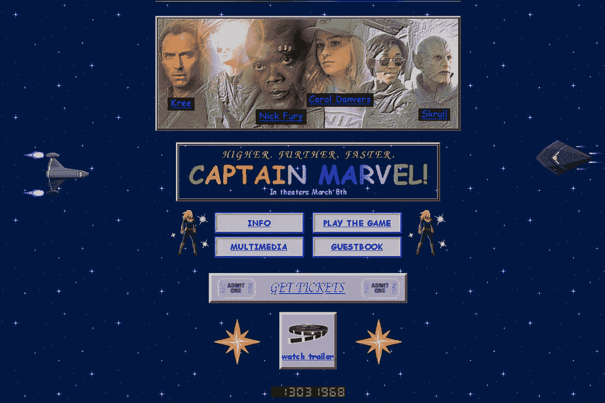

# 甚至更多(13)有趣的 API 来构建项目！

> 原文：<https://javascript.plainenglish.io/even-more-13-fun-apis-to-build-projects-with-2a6ebb4ceed1?source=collection_archive---------3----------------------->

## 在受到这个博客的启发后，我想我应该写一篇后续文章，添加更多免费和愚蠢的 API 来帮助你构建这个项目，这个项目不一定会让世界变得更好，但肯定会很有趣。

## 1.随机狗图片

https://dog.ceo/dog-api/

## 2.变装皇后

【https://drag-race-api.readme.io/docs/get-all-queens 

## 3.随机用户

[https://randomuser.me/api/](https://randomuser.me/api/)

## 4.爸爸开玩笑

[https://icanhazdadjoke.com/api#fetch-a-random-dad-joke](https://icanhazdadjoke.com/api#fetch-a-random-dad-joke)

## 5.电影台词

[http://movie-quotes-app.herokuapp.com/api/](http://movie-quotes-app.herokuapp.com/api/)

## 6.文本输入的情感分析

(这个需要注册但是超级酷！)

 [## 音调分析器

### 理解情感、社会倾向和感知的写作风格。

www.ibm.com](https://www.ibm.com/watson/services/tone-analyzer/) 

## 7.现在太空中的人

[http://open-notify.org/Open-Notify-API/People-In-Space/](http://open-notify.org/Open-Notify-API/People-In-Space/)

## 8.星际迷航

[http://stapi.co/api-overview](http://stapi.co/api-overview)

## 9.随机坎耶报价

[https://api.kanye.rest/](https://api.kanye.rest/)

## 10.Futurama

 [## Futurama API

### 编辑描述

futuramaapi.herokuapp.com](https://futuramaapi.herokuapp.com/) 

## 11.引用

[https://theysaidso.com/api/#qod](https://theysaidso.com/api/#qod)

## 12.罗恩·斯旺森引用

 [## 詹姆斯·肖恩赖特/罗恩·斯旺森-报价

### 因为罗恩·斯旺森是个英雄。只是一个简单得可笑的 Node.js 服务器…

github.com](https://github.com/jamesseanwright/ron-swanson-quotes) 

## 13.是或否

[https://yesno.wtf/api/](https://yesno.wtf/api/)

编码快乐！如果你用过，请拍我一下，如果有什么不能用了，请告诉我。不要忘了在评论区添加我遗漏的任何其他 API！🤖