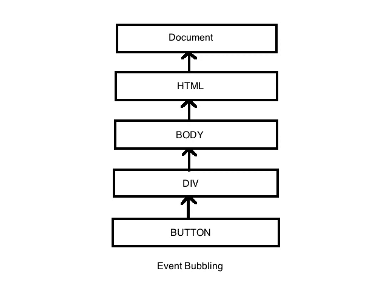
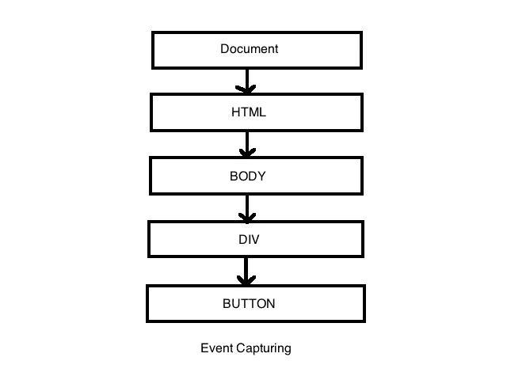

# JavaScript 中的事件冒泡和事件捕获是什么？

> 原文：<https://javascript.plainenglish.io/event-bubbling-and-capturing-in-javascript-661af681bb29?source=collection_archive---------12----------------------->

## 理解 JavaScript 中的事件冒泡和捕获

Photo by [Diana Orey](https://unsplash.com/@photographyurway?utm_source=medium&utm_medium=referral) on [Unsplash](https://unsplash.com?utm_source=medium&utm_medium=referral)

# 什么是事件冒泡？

现实生活中的冒泡是指气泡从玻璃杯底部到顶部。当你把苏打水放进杯子里，你会看到气泡从底部到顶部。但是在 JavaScript 编程语言中，**事件冒泡**发生在网页元素上有事件的时候。该事件的执行从最低的元素开始到最高的元素。因此**事件冒泡**是从我们添加事件的元素开始执行文档对象模型事件的过程，直到我们到达顶部父元素。

Photo by [Florian Olivo](https://unsplash.com/@florianolv?utm_source=medium&utm_medium=referral) on [Unsplash](https://unsplash.com?utm_source=medium&utm_medium=referral)

## 事件冒泡示例

假设我们有一个 HTML `<body>`元素，它包含一个内部带有`<button>` 的`
`。当您单击按钮时，首先会在按钮上发生一个 click 事件，然后它会移动到 div 和主体。这就是我们所说的**事件冒泡，**它从下往上开始。看看下面的例子。

Event Bubbling in JavaScript.

# 什么是事件捕获？

**事件捕获**是事件从顶部元素开始执行到底部元素。所有现代浏览器都不支持捕获阶段，它们默认有一个冒泡阶段。但是你可以选择你想用哪个阶段。看看下面的例子。

Event Capturing.

# 结论

理解事件冒泡和事件捕获非常重要，尤其是当您在 JavaScript 中操作文档对象模型时，因为您将不得不处理事件。这只是对事件冒泡和事件捕获的简单介绍，请确保您从其他资源中了解了更多关于这个主题的信息。