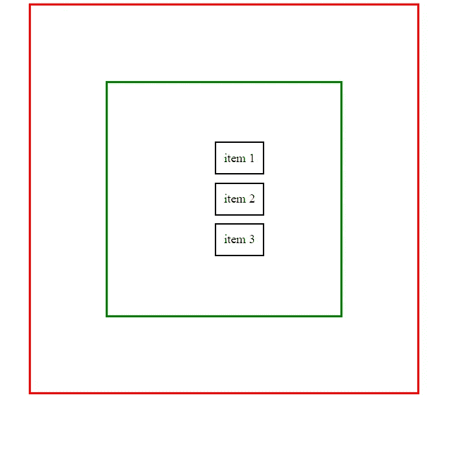
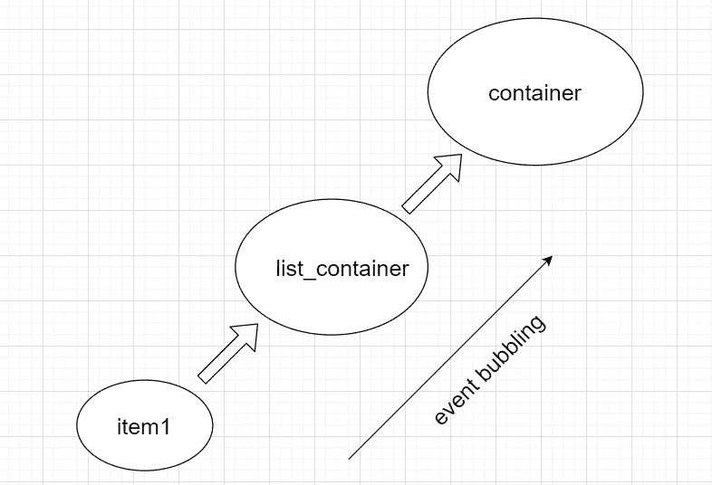
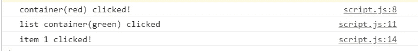

# 您需要理解 JavaScript 中的事件冒泡和捕获

> 原文：<https://javascript.plainenglish.io/event-bubbling-and-capturing-in-javascript-cdc6bf9788bb?source=collection_archive---------7----------------------->

**事件冒泡和捕获**是非常重要的概念，如果你想控制在 DOM 中触发的事件，就要知道这些概念！

## JavaScript 中的事件传播分三个阶段进行:

1.  事件捕获
2.  目标
3.  事件冒泡(默认阶段)

一步一步，我们将详细了解这些阶段中的每一个。

假设我们有一些嵌套的 DOM 元素，例如，像这样的东西，

我们在所有 DOM 元素上都附加了 click 事件监听器。

我们有这样的东西。

现在，每当我们单击 item 1 时，我们可以看到附加到 item 1 上面的元素的所有事件侦听器(`list_container`和`container`)也被执行。

我们可以在控制台中看到，伴随着附加在`item1`上的事件，附加在它上面的其他元素上的事件也被执行！

## 这无非是**事件冒泡**！

就像一个**气泡**从玻璃杯的底部在玻璃杯的顶部冒泡一样，在一个网页中，事件执行以类似的方式从最低的元素到最高的元素发生！

# 事件捕获

**事件捕获**与事件冒泡正好相反！

在事件捕获中，事件是从 DOM 树的顶部到底部触发的。

每当我们点击`item1`时，连接到容器的事件监听器被执行，然后事件监听器连接到`list_container`，最后是目标(即`item1`)。

捕捉功能可以简单地通过在`addEventListener`中传递一个名为`‘true’`的参数来实现。

## 停止繁殖

我们还可以通过使用`stopPropagation()`功能来控制传播。

停止传播，直到它被声明的地方。

将`stopPropagation()`与`list_container`一起使用后，我们得到以下输出:

因此，正如我们所看到的，事件执行在 list_container 的事件侦听器之后停止。

这都是关于事件冒泡和捕获！

希望这篇文章有所帮助！

快乐学习！😃