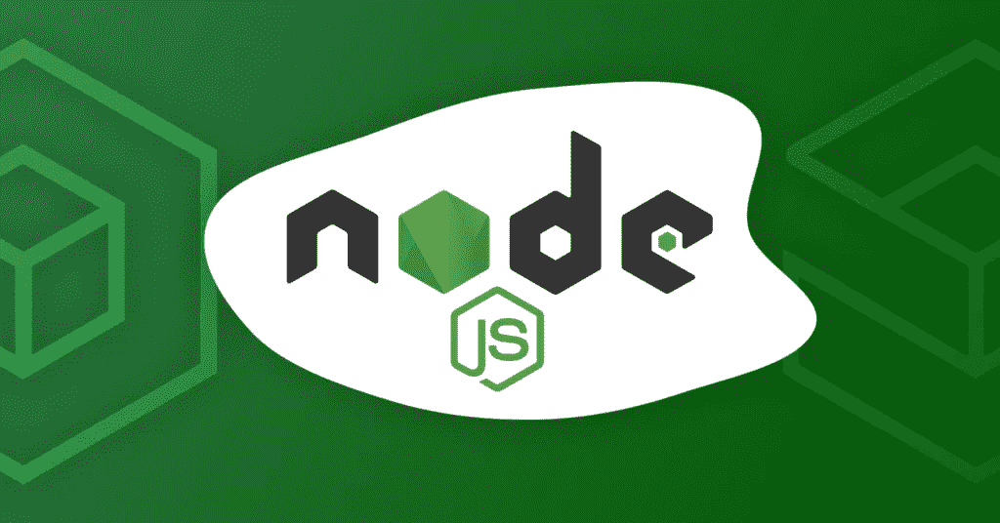

# 关于最新 Node.js 版本| Node.js 15 的一切

> 原文：<https://javascript.plainenglish.io/everything-about-the-latest-node-js-release-node-js-15-ad934e0dd9f4?source=collection_archive---------5----------------------->

## Node.js v15 来了！



但是等等，我刚刚把我的项目升级到 Node 12，而你告诉我一个新版本已经发布了！我甚至还没有把我的项目升级到节点 14！我现在应该直接上 note 15 吗？但是等等，有哪些突破性的变化？还有，有什么新功能？甚至升级有什么好处吗？我应该想到它吗？

如果你曾经有过这些问题，不要担心，因为我在这里告诉你你需要知道的关于 node.js 最新版本的一切，如果你需要升级到它，有什么突破性的变化，有什么新功能。

# 主要变化概述:

1.  中止控制器:这基本上是一个实验性的实现，但是非常有用。它基本上帮助我们拒绝或放弃任何基于承诺的 API
2.  **npm 7:** 有一个新的 Npm 主版本发布，它在 package-lock.json 格式上有一些变化，还引入了 Npm 工作区。
3.  **V8 8.6:** v8 javascript 引擎已经升级到 8.6。对于那些不知道 8.4 已经在 note 14 中发布的人。
    -promise . any()
    -aggregate error
    -string . prototype . replace all()
    -&&=，||= and？？=
4.  **突变变化**

> 让我首先解决房间里的大象:您需要将您的项目升级到节点 15 吗？简单的回答是不！不要惊讶，因为这是一个奇数编号的发布线，节点 js 15 不会被提升到 LTS(长期支持)。

每当 Node.js 发布奇数版本时，它不会被提升到 LTS；每当它发布偶数版本时，这才是您真正应该升级应用程序的版本，因为它将获得长期支持，并且会持续很长时间。

# 堕胎控制员

> 这基本上是一个新的实验性实现，允许我们取消任何基于承诺的 API。

这很酷，因为在此之前，我们只能取消订阅我们已经发出的 API 调用，但我们并没有真正中止它们，它们仍然在执行，我们只是没有听到响应。使用 AbortController，我们实际上可以中止任何类型的 API 请求:它可以是响应体类型，甚至可以是流(比如下载视频)。

```
var controller = new AbortController();
var signal = controller.signal;

var downloadBtn = document.querySelector('.download');
var abortBtn = document.querySelector('.abort');

downloadBtn.addEventListener('click', fetchVideo);

abortBtn.addEventListener('click', function() {
  controller.abort();
  console.log('Download aborted');
});

function fetchVideo() {
  ...
  fetch(url, {signal}).then(function(response) {
    ...
  }).catch(function(e) {
    reports.textContent = 'Download error: ' + e.message;
  })
}
```

让我们快速浏览一下基本代码，以便真正理解幕后发生了什么。

因此，首先我们需要使用中止控制器构造函数创建一个控制器，然后使用 controller.signal 属性获取对其关联信号的引用。

现在我们在 HTML 中有两个按钮，基本上是一个下载按钮和一个中止按钮。在 download 按钮上，我们添加了一个事件，它基本上监听一个点击事件，每当点击事件发生时，它就开始获取视频。另一方面，中止按钮也侦听点击事件，但它实际上中止了控制器，然后它记录“下载中止”。

> 我相信你至少了解了一点，因为我说过它仍然是实验性的，所以我不建议你在生产应用中开始使用它。

点击阅读更多关于堕胎控制者[的信息。](https://developer.mozilla.org/en-US/docs/Web/API/AbortController)

[堕胎控制员实例](https://mdn.github.io/dom-examples/abort-api/)

# NPM 7

我们不会深入研究这一变化，因为这实际上需要一篇单独的文章。我只是给你一个简单的概述，有什么变化，有什么新功能！

对于那些不知道什么是 NPM 的人来说:它被数百万开发者使用，它有数百万个库，它每月有大约 750 亿次下载，所以你真的需要去看看。

## 新功能:

1.  **工作区:**一个工作区，现在可以帮助我们管理单个顶层包中的多个项目。
2.  **自动安装对等依赖关系:**现在自动安装对等依赖关系。从 NPM 7 开发人员将需要管理他们自己的对等依赖。对于一些应用程序来说，这可能是一个突破性的变化。如果你正在思考什么是对等依赖，我强烈建议你浏览一下文档，但是我会给你一个简单的概述:假设你有一个库或者你有一个已经发布的 NPM 包，它有一些对等依赖。在这个版本之前，您的包不需要安装任何对等依赖项。任何使用您的软件包的应用程序或服务都需要安装它。

# Promise.any()和 AggregateError

Promise.any()基本上接受许多承诺，一旦其中一个承诺完成，它就解析。

> *与 promise.all()完全相反。*

在 promised.all()中，我们过去常常传递一些承诺，但只有当我们传递的每一个承诺都得到解决时，它才用于解决。另一方面，在这种情况下，我们等待它们中的任何一个解决，所以它与 promised.all()正好相反

现在你一定在想，如果我们传递给 promise.any()的所有承诺都失败了，会发生什么！在这种情况下，它将返回一个 **AggregateError** ，这是一个新的 Error 子类，也是在 v8 8.6 中发布的。

```
const promise1 = Promise.reject(0);
const promise2 = new Promise((resolve) => setTimeout(resolve, 100, 'quick'));
const promise3 = new Promise((resolve) => setTimeout(resolve, 500, 'slow'));const promises = [promise1, promise2, promise3];Promise.any(promises).then((value) => console.log(value));// expected output: "quick"
```

在这个例子中，我们有三个承诺。如你所见，第一个被拒绝。第二个在 100 毫秒内解决，第三个在 500 毫秒内解决。

现在，我们将它们按数组分组，然后传递并承诺。任何()第一个承诺一旦解决，它就会解决，并向我们返回第一个解决的承诺的价值，因此当我们运行它时，您可以看到它打印为“快速”。

所以基本上，它没有等待有 500 毫秒延迟的承诺，也没有拒绝，因为其中一个承诺被拒绝了。它基本上给了我们成功完成的第一个承诺的价值。

# String.prototype.replaceAll()

**replaceAll()** 方法返回一个新字符串，其中模式的所有匹配项都被替换项替换。模式可以是字符串或正则表达式。原始字符串保持不变。

```
const p = 'The quick brown fox jumps over the lazy dog.';console.log(p.replaceAll('dog', 'monkey'));// expected output: "The quick brown fox jumps over the lazy monkey."
```

正如你在这个例子中看到的，我们这里有一个字符串，我们想用“猴”替换所有的“狗”。

最后，Node.js 已经与我们合作了 10 多年，他们除了提高自己之外什么也没做，他们计划在未来 10 年也这样做，他们已经为未来 10 年制定了路线图。他们已经把它提升到了一个全新的水平，这一次他们开始对投稿人进行调查，并开始考虑最需要的特性的变化。

我希望本文能帮助您理解最新的 Node.js 版本。

谢谢你的阅读。如果您有任何问题，请随时留言回应。

# 资源

1.  [https://nodejs.org/en/blog/release/v15.0.0](https://nodejs.org/en/blog/release/v15.0.0)
2.  [https://developer . Mozilla . org/en-US/docs/Web/API/abort controller](https://developer.mozilla.org/en-US/docs/Web/API/AbortController)
3.  [https://git hub . blog/2020-10-13-presentation-V7-0-0-of-NPM-CLI/](https://github.blog/2020-10-13-presenting-v7-0-0-of-the-npm-cli/)
4.  [https://developer . Mozilla . org/en-US/docs/Web/JavaScript/Reference/Global _ Objects/Promise/any](https://developer.mozilla.org/en-US/docs/Web/JavaScript/Reference/Global_Objects/Promise/any)
5.  [https://developer . Mozilla . org/en-US/docs/Web/JavaScript/Reference/Global _ Objects/AggregateError](https://developer.mozilla.org/en-US/docs/Web/JavaScript/Reference/Global_Objects/AggregateError)
6.  [https://developer . Mozilla . org/en-US/docs/Web/JavaScript/Reference/Global _ Objects/String/replace all](https://developer.mozilla.org/en-US/docs/Web/JavaScript/Reference/Global_Objects/String/replaceAll)