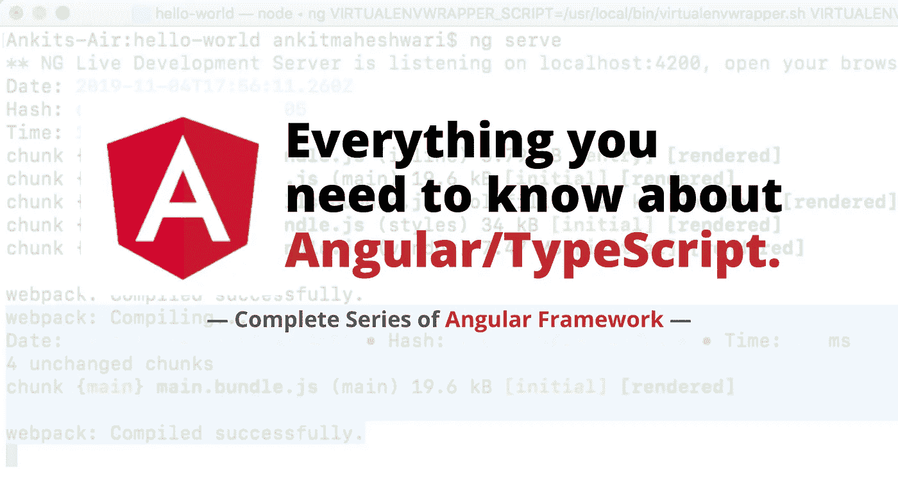

# 关于 Angular 框架和 TypeScript 您需要知道的一切

> 原文：<https://javascript.plainenglish.io/everything-you-need-to-know-about-angular-framework-typescript-10049b858ae0?source=collection_archive---------7----------------------->

## **完整的角度系列** —什么是角度/打字稿？为什么我们需要棱角？使用 Angular 的好处。棱角分明的建筑。如何使用 Angular 框架开始构建？

**Keep following the links below**👇

# 第一部分

## 什么是有角？

*让我们从什么是棱角开始。为什么我们需要棱角？它的好处是什么，它的架构是什么，我们如何设置开发环境？*

[**点击这里**](https://medium.com/@AnkitMaheshwariIn/what-angular-is-5d27bffb1fb1) **阅读本文:**

 [## 什么是有角的

### 什么是角(第一部分)

javascript.plainenglish.io](/what-angular-is-5d27bffb1fb1) 

# 第二部分

## 构建和运行角度项目

*如何跑 Angular 项目，了解 Angular 项目的结构。*

[**点击这里**](https://medium.com/@AnkitMaheshwariIn/what-angular-is-part-2-550954552d89) **阅读本文:**

 [## 构建和运行角度项目

### 什么是角(第二部分)

javascript.plainenglish.io](/what-angular-is-part-2-550954552d89) 

# 第三部分

## WebPack 在 Angular

Angular CLI 使用一个名为***web pack****的工具，这是一个构建自动化工具。它获取我们所有的脚本和样式表，将它们组合成一个包，然后缩小这个包。*

[**点击这里**](https://medium.com/@AnkitMaheshwariIn/role-of-webpack-in-angular-part-3-of-series-what-angular-is-5058d445e45c) **阅读本文:**

 [## Webpack 在 Angular

### 什么是有角？(第三部分)

javascript.plainenglish.io](/role-of-webpack-in-angular-part-3-of-series-what-angular-is-5058d445e45c) 

# 第四部分

## 角度模板语法(指令、插值、属性绑定、事件绑定)

*Angular 的模板语法扩展了 HTML 和 JavaScript 的语法。*

[**点击这里**](https://medium.com/@AnkitMaheshwariIn/angular-template-syntax-directive-interpolation-property-binding-event-binding-part-4-547e2512d8fe) **阅读本文:**

 [## 角度模板语法:指令、插值、属性绑定、事件绑定

### 什么是有角？(第四部分)

javascript.plainenglish.io](/angular-template-syntax-directive-interpolation-property-binding-event-binding-part-4-547e2512d8fe) 

# 第五部分

## AngularJS，Angular 2，Angular 4 的区别(还有 Angular 3 怎么了)？

*AngularJS 于 2010 年推出，作为构建客户端应用的 JavaScript 框架。很快，它变得流行起来，Angular 团队开始添加新功能。但是这个框架不是为今天的应用程序的需要而设计的；此外，它过于复杂，因此 Angular 团队决定使用 TypeScript 重写原始框架，结果，Angular 2 在 2016 年年中问世。*

[**点击这里**](https://medium.com/@AnkitMaheshwariIn/angular-version-history-difference-between-angularjs-angular-2-and-angular-4-part-5-of-8ff9913f2964) **阅读本文:**

 [## AngularJS，Angular 2，Angular 4 的区别，Angular 3 怎么了？

### 什么是有角？(第五部分)

javascript.plainenglish.io](/angular-version-history-difference-between-angularjs-angular-2-and-angular-4-part-5-of-8ff9913f2964) 

> ***TypeScript*** *是一种编译成 JavaScript 的语言。当使用 Angular 时，TypeScript 是非常常用的—因为即使 Angular 也是用 TypeScript 编写的。*
> 
> *在接下来的几篇文章中，我们将学习一些关于* Typescript 的知识。

# 第 6.1 部分

## TypeScript 的基础—类型注释。什么是 TypeScript？

TypeScript 并不是一种全新的语言；它是 JavaScript 的超集，这意味着任何有效的 JavaScript 代码也是有效的 TypeScript 代码，但是 TypeScript 具有当前版本的 JavaScript 中不存在的附加特性。

[**点击这里**](https://medium.com/@AnkitMaheshwariIn/type-annotations-fundamentals-of-typescript-part-6-1-823ab6f62ead) **阅读本文:**

 [## 类型注释—类型脚本的基础

### 什么是有角？(第 6.1 部分)/什么是 TypeScript？

javascript.plainenglish.io](/type-annotations-fundamentals-of-typescript-part-6-1-823ab6f62ead) 

# 第 6.2 部分

## TypeScript/Angular 中的箭头函数

这种声明函数的模式不需要函数关键字来声明。

[**点击这里**](https://medium.com/@AnkitMaheshwariIn/arrow-functions-in-typescript-part-6-2-of-series-what-angular-is-%EF%B8%8F-what-typescript-is-d4584d87d01b) **阅读本文:**

 [## TypeScript/Angular 中的箭头函数

### 什么是有角？(第 6.2 部分)/什么是 TypeScript？

javascript.plainenglish.io](/arrow-functions-in-typescript-part-6-2-of-series-what-angular-is-️-what-typescript-is-d4584d87d01b) 

# 第 6.3 部分

## TypeScript/Angular 中的接口和类

*接口是一组描述对象的相关属性和方法，但既不提供实现也不提供初始化。*

[**点击这里**](https://medium.com/@AnkitMaheshwariIn/interfaces-and-classes-in-typescript-part-6-3-7fee77b7518b) **阅读本文:**

 [## TypeScript/Angular 中的接口和类

### 什么是 Angular(第 6.3 部分)/什么是 TypeScript？

javascript.plainenglish.io](/interfaces-and-classes-in-typescript-part-6-3-7fee77b7518b) 

# 第 6.4 部分

## TypeScript/Angular 中的构造函数和访问修饰符

构造函数基本上是一个当我们创建类的实例时自动调用的方法。访问修饰符是一个关键字，我们可以将它应用于一个类的成员，以从外部控制它的访问。

[**点击这里**](https://medium.com/@AnkitMaheshwariIn/constructors-and-access-modifiers-in-typescript-22a2d6188780) **阅读本文:**

 [## TypeScript/Angular 中的构造函数和访问修饰符

### 什么是 Angular(第 6.4 部分)/什么是 TypeScript？

javascript.plainenglish.io](/constructors-and-access-modifiers-in-typescript-22a2d6188780) 

# 第 6.5 部分

## TypeScript/Angular 中的属性和模块

属性允许我们使用 get 关键字和 set 关键字或者 getter()和 setter()方法访问类外部的私有成员。

[**点击这里**](https://medium.com/@AnkitMaheshwariIn/properties-and-modules-in-typescript-angular-a86ee23f12aa) **阅读本文:**

 [## TypeScript/Angular 中的属性和模块

### 什么是 Angular(第 6.5 部分)/什么是 TypeScript？

javascript.plainenglish.io](/properties-and-modules-in-typescript-angular-a86ee23f12aa) 

# 第七部分

## Angular 中的组件和模块是什么？

***组件*** *是一个****Angular****app 最基本的 UI 积木。一个* ***角度*** *app 包含一个* ***角度组件*** *的树。组件封装了视图的数据、逻辑和 HTML 这意味着用户在屏幕上看到的一切。*

***模块是一组相关组件的容器。*** *每个 Angular app 都至少有一个模块叫 app 模块。*

[**点击这里**](https://medium.com/@AnkitMaheshwariIn/what-is-components-and-modules-in-angular-f473c386f717) **阅读本文:**

 [## Angular 中的组件和模块是什么？

### 什么是有角？(第 7 部分)/理解角度中分量的概念，了解角度模。

javascript.plainenglish.io](/what-is-components-and-modules-in-angular-f473c386f717) 

> ***敬请期待更多文章:***[*https://medium.com/@AnkitMaheshwariIn*](https://medium.com/@AnkitMaheshwariIn)

如果这篇文章是有帮助的，如果你不介意给它一些掌声，我会非常感激👏 👏 :)

帮别人找到文章，这样就能帮到他们！

一直鼓掌。

*更多内容请看*[***plain English . io***](https://plainenglish.io/)*。报名参加我们的* [***免费周报***](http://newsletter.plainenglish.io/) *。关注我们关于*[***Twitter***](https://twitter.com/inPlainEngHQ)*和*[***LinkedIn***](https://www.linkedin.com/company/inplainenglish/)*。加入我们的* [***社区不和谐***](https://discord.gg/GtDtUAvyhW) *。*