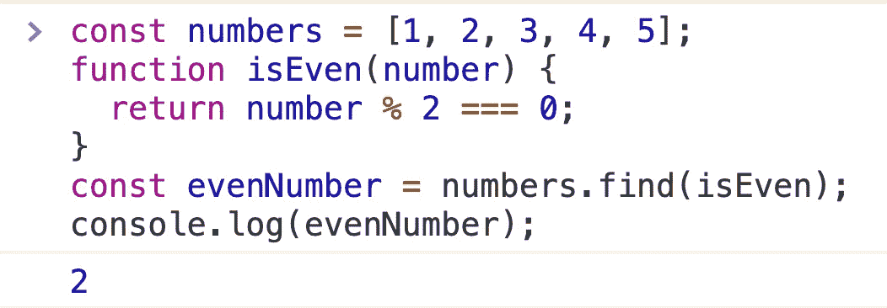

# JavaScript 中数组方法的终极指南

> 原文：<https://javascript.plainenglish.io/everything-you-need-to-know-about-array-methods-in-javascript-97899e85163c?source=collection_archive---------12----------------------->

## 可以添加到收藏夹中的代码指南


Photo by [Paweł Czerwiński](https://unsplash.com/@pawel_czerwinski?utm_source=medium&utm_medium=referral) on [Unsplash](https://unsplash.com?utm_source=medium&utm_medium=referral)

数组是 JavaScript 中最重要的数据结构之一。您可以在数组上执行的操作(迭代、插入项、删除项等)数量很大。数组对象提供了大量有用的方法，比如`array.forEach()`、`array.map()`等等。

我经常发现自己被数组上可能的操作数量和相应的实现所淹没。你可能也会遇到同样的情况。

所以我总结了相关知识点，希望这能对你我有所帮助。

## 目录

1.  重复
2.  地图
3.  减少
4.  串联
5.  薄片
6.  克隆
7.  搜索
8.  询问
9.  过滤器
10.  插入
11.  去除
12.  空的
13.  充满
14.  变平
15.  分类

# 1:迭代

遍历数组可能是我们对数组做的最多的操作。你知道有多少种方法可以循环数组吗？

## 1.1:对于..关于

`for(const item of items)`循环迭代数组项。

让我们遍历一个`colors`列表:

```
const colors = ['blue', 'green', 'white'];for (const color of colors) {
  console.log(color);
}
```


在每次迭代中，变量`color`被赋予迭代项。

小贴士:

*   您可以使用`break`语句随时停止迭代。

## 1.2:用于循环

`for(let i; i < array.length; i++)`使用递增的索引变量循环遍历数组项。

`for`通常需要在每个周期递增的`index`变量:

```
const colors = ['blue', 'green', 'white'];for (let index = 0; index < colors.length; index++) {
  const color = colors[index];
  console.log(color);
}
```


`index`变量从`0`到`colors.length - 1`递增。该变量用于通过索引访问项目:`colors[index]`。

小贴士:

*   您可以使用`break`语句随时停止迭代。

## 1.3: array.forEach()方法

`array.forEach(callback)`方法通过在每个数组项上调用`callback`函数来迭代数组项。

在每次迭代中，使用参数调用`callback(item [, index [, array]])`:迭代项、索引和数组本身。

让我们迭代`colors`数组:

```
const colors = ['blue', 'green', 'white'];colors.forEach(function callback(value, index) {
  console.log(value, index);
});
```


`array.forEach(callback)`对数组中的每一项调用`callback` 3 次:`'blue'`、`'green'`和`'white'`。

小贴士:

*   您不能中断`array.forEach()`迭代。

# 2:地图

## 2.1: array.map()方法

`array.map(callback)`方法通过对每个数组项使用`callback`调用结果来创建一个新数组。

在每次迭代中，`callback(item[, index[, array]])`被带参数调用:当前项，`index`和数组本身。它应该返回新的项目。

让我们递增数组的编号:

```
const numbers = [0, 2, 4];const newNumbers = numbers.map(function increment(number) {
  return number + 1;
});console.log(newNumbers);
```


`numbers.map(increment)`通过递增每个数组项从`numbers`创建一个新数组。

小贴士:

*   创建一个新的映射数组，不改变原来的数组。

## 2.2: Array.from()函数

`Array.from(arrayLike[, callback])`方法通过对每个数组项使用`callback`调用结果来创建一个新数组。

在每一次迭代中，`callback(item[, index[, array]])`被调用，并带有参数:当前项、索引和数组本身。它应该返回新的项目。

让我们递增数组的编号:

```
const numbers = [0, 2, 4];const newNumbers = Array.from(numbers,
  function increment(number) {
    return number + 1;
  }
);console.log(newNumbers);
```


`Array.from(numbers, increment)`通过递增每个数组项，从`numbers`创建一个新数组。

小贴士:

*   `Array.from()`创建新的映射数组，而不改变原始数组
*   `Array.from()`更适合从[阵列状物体](https://dmitripavlutin.com/javascript-array-from-applications/#2-transform-array-like-into-an-array)映射。

# 3:减少

## 3.1: array.reduce()方法

`array.reduce(callback[, initialValue])`通过调用`callback`函数作为缩减器，将数组缩减为一个值。

在每一次迭代中，`callback(accumulator, item[, index[, array]])`被带参数调用:累加器、当前项、索引和数组本身。它应该返回累加器。

经典的例子是对一组数字求和:

```
const numbers = [2, 0, 4];function summarize(accumulator, number) {
  return accumulator + number;
}const sum = numbers.reduce(summarize, 0);console.log(sum);
```


在第一步`accumulator`用`0`初始化。然后在每个数组项上调用`summarize`函数，累加数字的和。

小贴士:

*   如果跳过`initialValue`参数，第一个数组项将成为初始值。

# 4:串联

## 4.1: array.concat()方法

`array.concat(array1[, array2, ...])`将一个或多个数组连接到原始数组。

让我们连接两个名称数组:

```
const heroes = ['Batman', 'Robin'];
const villains = ['Joker', 'Bane'];const everyone = heroes.concat(villains);console.log(everyone);
```


`heroes.concat(villains)`通过连接`heroes`和`villains`数组创建一个新数组。

小贴士:

*   创建一个新数组，而不改变原来的数组
*   `array.concat(array1[, array2, ...])`接受多个数组进行连接。

## 4.2:扩展运算符

您可以使用带有数组文字的 spread 运算符来连接数组:`[...array1, ...array2]`。

让我们连接两个名称数组:

```
const heroes = ['Batman', 'Catwoman'];
const villains = ['Joker', 'Bane'];const names = [...heroes, ...villains];console.log(names);
```


`[...heroes, ...villains]`展开`heroes`和`villains`项，然后创建一个包含所有展开项的新数组。

*   使用 spread 运算符，您可以连接任意数量的数组。

# 5:切片

## 5.1: array.slice()方法

`array.slice([fromIndex[, toIndex]])`返回从`fromIndex`开始到`toIndex`结束的数组切片(不包括`toIndex`本身)。`fromIndex`可选参数默认为`0`，`toIndex`可选参数默认为`array.length`。

让我们来看一些数组切片:

```
const names = ['Batman', 'Catwoman', 'Joker', 'Bane'];const heroes = names.slice(0, 2);
const villains = names.slice(2);console.log(heroes);
console.log(villains);
```


`names.slice(0, 2)`从`names`数组返回 2 个项目的切片。

`names.slice(2)`返回 2 个项目的切片。`end`参数默认为`names.length`。

小贴士:

*   创建一个新数组，而不改变原来的数组。

# 6:克隆

## 6.1:扩展运算符

克隆数组的一个简单方法是使用 spread 操作符:`const clone = [...array]`；

让我们克隆一个数组`colors`:

```
const colors = ['white', 'black', 'gray'];const clone = [...colors];console.log(clone); 
console.log(colors === clone);
```


`[...colors]`创建一个`colors`数组的克隆。

小贴士:

*   创建一个浅拷贝。

## 6.2: array.concat()方法

`[].concat(array)`是关于如何克隆`array`的另一种方法。

```
const colors = ['white', 'black', 'gray'];const clone = [].concat(colors);console.log(clone); 
console.log(colors === clone);
```


`[].concat(colors)`创建`colors`数组的克隆。

小贴士:

*   创建一个浅拷贝。

## 6.3: array.slice()方法

`array.slice()`是关于如何克隆`array`的另一种方法。

```
const colors = ['white', 'black', 'gray'];const clone = colors.slice();console.log(clone); 
console.log(colors === clone);
```


`colors.slice()`创建一个`colors`数组的克隆。

小贴士:

*   `colors.slice()`创建一个肤浅的副本。

# 7:搜索

## 7.1: array.includes()方法

`array.includes(itemToSearch[, fromIndex])`返回一个布尔值`array`是否包含`itemToSearch`。可选参数`fromIndex`，默认为`0`，指示开始搜索的索引。

让我们确定`2`和`99`是否存在于数字数组中:

```
const numbers = [1, 2, 3, 4, 5];numbers.includes(2);
numbers.includes(99);
```


`numbers.includes(2)`返回`true`，因为`2`存在于`numbers`数组中。

然而`numbers.includes(99)`是`false`，因为`numbers`不包含`99`。

## 7.2: array.find()方法

`array.find(predicate)`方法返回满足`predicate`函数的第一个数组项。

在每一次迭代中，调用函数的参数是:迭代项、索引和数组本身。

例如，让我们找到第一个偶数:

```
const numbers = [1, 2, 3, 4, 5];function isEven(number) {
  return number % 2 === 0;
}const evenNumber = numbers.find(isEven);console.log(evenNumber);
```



`numbers.find(isEven)`返回`numbers`内的第一个偶数，即`2`。

小贴士:

*   如果没有项目满足谓词，则`array.find()`返回`undefined`。

## 7.3: array.indexOf()方法

`array.indexOf(itemToSearch[, fromIndex])`返回`array`中第一次出现`itemToSearch`的索引。可选参数`fromIndex`，默认为`0`，是开始搜索的索引。

让我们找到`'Joker'`的索引:

```
const names = ['Batman', 'Catwoman', 'Joker', 'Bane'];const index = names.indexOf('Joker');console.log(index);
```


`names`内`'Joker'`的索引为`2`。

小贴士:

*   `array.indexOf(itemToSearch)`如果没有找到物品，返回`-1`
*   `array.findIndex(predicate)`是使用谓词函数查找索引的替代方法。

# 8:查询

## 8.1: array.every()方法

如果每一项都通过了`predicate`检查，则`array.every(predicate)`方法返回`true`。

在每次迭代`predicate(item[, index[, array]])`中，谓词函数通过参数调用:迭代项、索引和数组本身。

让我们确定数组`evens`和`mix`是否只包含偶数:

```
const evens = [0, 2, 4, 6];
const numbers = [0, 1, 4, 6];function isEven(number) {
  return number % 2 === 0;
}evens.every(isEven);
numbers.every(isEven);
```


`evens.every(isEven)`之所以是`true`是因为`evens`中的*都是偶数。*

然而，`numbers.every(isEven)`评估为`false`，因为`numbers`包含奇数`1`。

## 8.2: array.some()方法

如果至少有一个项目通过了`predicate`检查，则`array.some(predicate)`方法返回`true`。
在每次迭代中`predicate(item[, index[, array]])`函数被参数调用:迭代项、索引和数组本身。

让我们确定数组是否包含至少一个偶数:

```
const numbers = [1, 5, 7, 10];
const odds = [1, 3, 3, 3];function isEven(number) {
  return number % 2 === 0;
}numbers.some(isEven); // => true
odds.some(isEven);   // => false
```


`numbers.some(isEven)`是`true`，因为`numbers`中至少存在一个偶数`10`。

但是`odds.some(isEven)`是`false`，因为`odds`只包含奇数。

# 9:过滤器

## 9.1: array.filter()

`array.filter(predicate)`方法返回一个包含通过`predicate`检查的项目的新数组。

在每一次迭代中，函数被参数调用:迭代项、索引和数组本身。

让我们过滤一个只有偶数的数组:

```
const numbers = [1, 5, 7, 10];function isEven(number) {
  return number % 2 === 0;
}const evens = numbers.filter(isEven);evens; // => [10]
```


`numbers.filter(isEven)`通过过滤`numbers`创建一个新的数组`evens`，使其只包含偶数。

小贴士:

*   创建一个新数组，而不改变原来的数组。

# 10:插入

## 10.1: array.push()方法

`array.push(item1[..., itemN])`方法将一个或多个项追加到数组的末尾，返回新的长度。

让我们将`'Joker'`追加到`names`数组的末尾:

```
const names = ['Batman'];names.push('Joker');names; // ['Batman', 'Joker']
```


`names.push('Joker')`在`names`数组的末尾插入一个新项目`'Joker'`。

小贴士:

*   `array.push()`原地变异阵列
*   `array.push(item1, item2, ..., itemN)`可以推送多个项目。

## 10.2: array.unshift()方法

方法将一个或多个项目追加到数组的开头，返回数组的新长度。

让我们在`names`数组的开头追加`'Catwoman'`:

```
const names = ['Batman'];names.unshift('Catwoman');names; // ['Catwoman', 'Batman']
```


`names.unshift('Catwoman')`在`names`数组的开头插入一个新项目`'Catwoman'`。

小贴士:

*   `array.unshift()`就地变异数组。
*   `array.unshift(item1, item2, ..., itemN)`可以插入多个项目。

## 10.3:扩展运算符

通过将 spread 运算符与数组文字相结合，可以以不可变的方式在数组中插入项。

在数组的*末端追加一个项目:*

```
const names = ['Joker', 'Bane'];const names2 = [
  ...names,
  'Batman',
];names2; // => ['Joker', 'Bane', 'Batman'];
```


在数组的*开头追加一个项目:*

```
const names = ['Joker', 'Bane'];const names2 = [
  'Batman',
  ...names
];names2; // => ['Batman', 'Joker', 'Bane'];
```


在任一索引处插入一个项目*:*

```
const names = ['Joker', 'Bane'];
const indexToInsert = 1;const names2 = [
  ...names.slice(0, indexToInsert),
  'Batman',
  ...names.slice(indexToInsert)
];names2; // => ['Joker', 'Batman', 'Bane'];
```


# 11:移除

## 11.1: array.pop()方法

`array.pop()`方法从数组中移除最后一项，然后返回该项。

例如，让我们删除`colors`数组的最后一个元素:

```
const colors = ['blue', 'green', 'black'];const lastColor = colors.pop();console.log(lastColor);
console.log(colors);
```


`colors.pop()`删除`colors`的最后一个元素并返回。

小贴士:

*   `array.pop()`就地变异数组。

## 11.2: array.shift()方法

`array.shift()`方法从数组中移除第一项，然后返回该项。

例如，让我们删除`colors`数组的第一个元素:

```
const colors = ['blue', 'green', 'black'];const firstColor = colors.shift();console.log(firstColor);
console.log(colors);
```


`colors.shift()`删除`colors`的第一个元素`'blue'`并返回。

小贴士:

*   `array.shift()`原地变异阵列
*   `array.shift()`具有 O(n)复杂度。

## 11.3: array.splice()方法

从数组中删除项目，并插入新项目。

例如，让我们从索引`1`中删除 2 项:

```
const names = ['Batman', 'Catwoman', 'Joker', 'Bane'];names.splice(1, 2);names; // => ['Batman', 'Bane']
```


`names.splice(1, 2)`删除`'Catwoman'`和`'Joker'`元素。

`names.splice()`可以插入新的项目来代替已删除的项目。让我们替换索引`1`中的 2 个项目，并插入一个新项目`'Alfred'`:

```
const names = ['Batman', 'Catwoman', 'Joker', 'Bane'];names.splice(1, 2, 'Alfred');names; // => ['Batman', 'Alfred' ,'Bane']
```


小贴士:

*   `array.splice()`就地变异阵列。

## 11.4:扩展运算符

通过将 spread 运算符与数组文字相结合，可以以不可变的方式从数组中移除项。

让我们删除一些项目:

```
const names = ['Batman', 'Catwoman', 'Joker', 'Bane'];
const fromIndex = 1;
const removeCount = 2;const newNames = [
  ...names.slice(0, fromIndex),
  ...names.slice(fromIndex + removeCount)
];newNames; // => ['Batman', 'Bane']
```


`newNames`包含`names`的项目，但没有被删除的 2 个。

# 12:空

## 12.1:数组长度属性

`array.length`是保存数组长度的属性。不止如此，`array.length`是可写的。

如果你写一个小于当前长度的`array.length = newLength`，多余的元素将从数组中移除。

让我们使用`array.length = 0`来移除数组中的所有元素:

```
const colors = ['blue', 'green', 'black'];colors.length = 0;colors; // []
```


`colors.length = 0`从`colors`数组中删除所有项目。

## 12.2: array.splice()方法

`array.splice(fromIndex[, removeCount[, item1[, item2[, ...]]]])`从数组中删除项目并插入新项目。

如果省略了`removeCount`参数，那么`array.splice()`将删除从`fromIndex`开始的数组的所有元素。

让我们用它来删除数组中的所有元素:

```
const colors = ['blue', 'green', 'black'];colors.splice(0);colors; // []
```


`colors.splice(0)`删除`colors`数组的所有元素。

# 13:填充

## 13.1: array.fill()方法

`array.fill(value[, fromIndex[, toIndex]])`用`value`填充数组，从`fromIndex`开始直到`toIndex`(不包括`toIndex`本身)。`fromIndex`可选参数默认为`0`，`toIndex`可选参数默认为`array.length`。

例如，让我们用零值填充一个数组:

```
const numbers = [1, 2, 3, 4];numbers.fill(0);numbers; // => [0, 0, 0, 0]
```


用零填充数组。

不仅如此，您还可以使用`Array(length).fill(initial)`初始化特定长度和初始值的数组:

```
const length = 3;
const zeros = Array(length).fill(0);zeros; // [0, 0, 0]
```


创建一个由 3 个零组成的数组。

小贴士:

*   `array.fill()`原地变异阵列。

## 13.2: Array.from()函数

`Array.from()`用对象初始化一定长度的数组非常有用:

```
const length = 4;
const emptyObjects = Array.from(Array(length), function() {
  return {};
});emptyObjects; // [{}, {}, {}, {}]
```


`emptyObjects`是用空对象的不同实例初始化的数组。

# 14:拉平

## 14.1: array.flat()方法

`array.flat([depth])`通过递归展开数组中的项目来创建一个新的数组，直到确定`depth`。`depth`可选参数默认为`1`。

让我们展平一组数组:

```
const arrays = [0, [1, 3, 5], [2, 4, 6]];const flatArray = arrays.flat();flatArray; // [0, 1, 3, 5, 2, 4, 6]
```


`arrays`包含数字和数字数组的混合。`arrays.flat()`平铺数组，使其只包含数字。

提示:

*   `array.flat()`创建新数组，不改变原数组。

# 15:排序

## 15.1: array.sort()方法

`array.sort([compare])`方法对数组中的项目进行排序。当省略 compare 函数时，该方法将项目转换为字符串，然后按 UTF-16 代码单位值升序排列。

可选参数`compare(item1, item2)`是一个定制项目顺序的回调函数。如果`compare(item1, item2)`返回:

*   `-1`则`item1`将跟随在`item2`之后
*   `1`则`item2`将跟随在`item1`之后
*   `0`则项目的位置不变

让我们对一系列字母进行排序:

```
const letters = ['B', 'C', 'A'];letters.sort();letters; // => ['A', 'B', 'C']
```


`letters.sort()`将字母按升序排列。

让我们使用 compare 函数，使偶数后跟奇数:

```
const numbers = [4, 3, 1, 2];function compare(n1, n2) {
  if (n1 % 2 === 0 && n2 % 2 !== 0) {
    return -1;
  }
  if (n1 % 2 !== 0 && n2 % 2 === 0) {
    return -1;
  }
  return 0;
}numbers.sort(compare);numbers;
```


`numbers.sort(compare)`使用自定义比较函数，先对偶数进行排序。

提示:

*   `array.sort()`变异阵就位。

## **简明英语团队备注**

你知道我们有四种出版物吗？给他们一句话来表达爱意:JavaScript 简单明了 、[、 **AI 简单明了**、](https://medium.com/ai-in-plain-english)、[、 **UX 简单明了**、](https://medium.com/ux-in-plain-english)、[、 **Python 简单明了**、](https://medium.com/python-in-plain-english)、**、**——谢谢你，继续学习吧！

此外，我们总是有兴趣帮助推广好的内容。如果您有一篇文章想要提交给我们的任何出版物，请发送电子邮件至[**submissions @ plain English . io**](mailto:submissions@plainenglish.io)**，附上您的媒体用户名和您感兴趣的内容，我们将会回复您！**