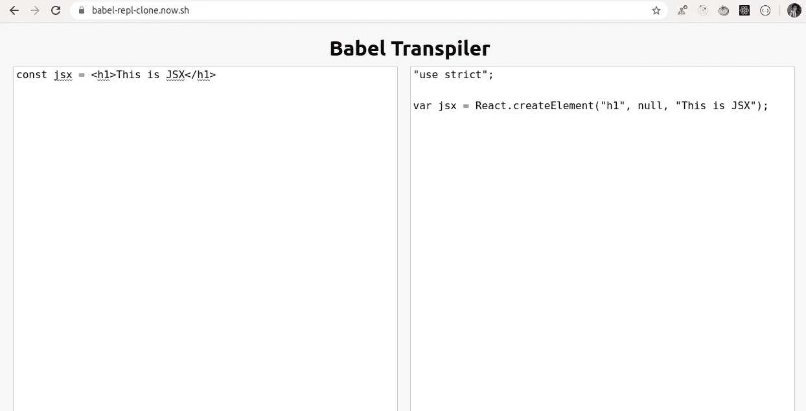
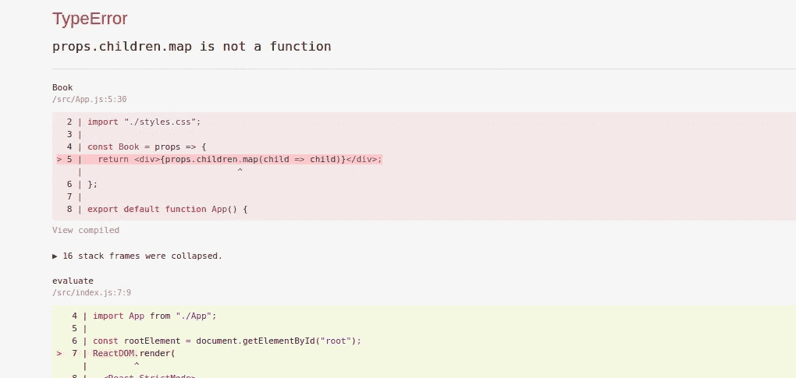
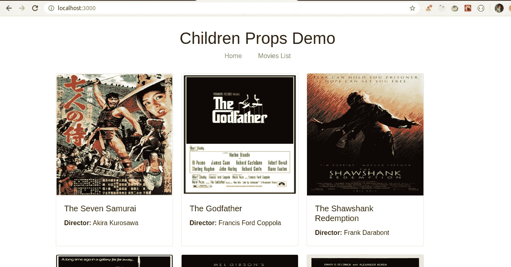
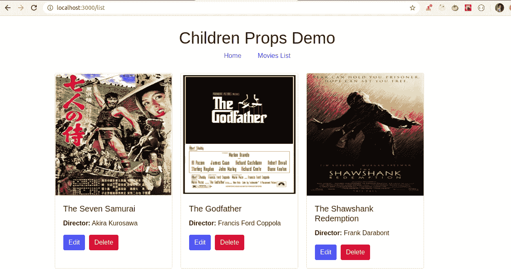

# 你需要知道的关于儿童道具的一切

> 原文：<https://javascript.plainenglish.io/everything-you-need-to-know-about-children-prop-in-react-9c0e0913f5a2?source=collection_archive---------2----------------------->

## 通过构建实际应用程序来学习


Photo by [Filiberto Santillán](https://unsplash.com/@filijs?utm_source=medium&utm_medium=referral) on [Unsplash](https://unsplash.com?utm_source=medium&utm_medium=referral)

在本文中，我们将看到`children`道具的重要性。
那么让我们开始吧。

当我们渲染任何 JSX 时，React 会将那个 JSX 转换成`React.createElement` 调用。

```
const jsx = <h1>This is JSX</h1>
```

上面的代码将被转换为

```
var jsx = React.createElement("h1", null, "This is JSX");
```

你可以通过粘贴我们在本文[中创建的 JSX 代码](https://levelup.gitconnected.com/create-a-clone-of-babel-repl-site-to-convert-es6-react-code-to-es5-93cdc9ad98ea?source=friends_link&sk=517cfac3dfc4b451610eb298f36a428c)[来验证这一点。](https://babel-repl-clone.now.sh/)



`React.createElement`调用被进一步转换成一个对象表示，如

```
{ 
 type: 'h1', 
 props: { 
  children: 'This is JSX' 
 }
}
```

如果您将 JSX 登录到控制台，就可以看到这一点

如果我们添加更多的元素，`children`将成为一个数组

```
<div>
 <h1>This is a heading</h1>
 <h2>This is another heading</h2>
</div>
```

将被转换为

要了解更多这方面的内容，请查看这篇文章。

当我们在开始和结束组件标签之间声明任何 JSX 时，React 提供了一种方法，使用一个叫做`children`的特殊道具来访问它

假设，我们有这样使用的`Book`组件

```
<Book>
 <h1>This is book content</h1>
</Book>
```

我们可以像访问`props.children`一样访问`Book`组件中的 h1 标签

```
const Book = props => {
 return <div>{props.children}</div>;
};
```

演示:[https://codesandbox.io/s/black-tdd-r5li5](https://codesandbox.io/s/black-tdd-r5li5)

如果我们在开始和结束的`Book`标签中有多个元素，比如

```
<Book>
 <h2>Name: Harry Potter and the Half-Blood Prince</h2>
 <p>- J.K.Rowling</p>
</Book>
```

并且我们想要循环通过孩子的，我们可以这样做

```
const Book = props => {
 return <div>{props.children.map(child => child)}</div>;
};
```

演示:[https://codesandbox.io/s/vigorous-antonelli-dfkle](https://codesandbox.io/s/vigorous-antonelli-dfkle)

如果有多个子元素，这将很好地工作，但是如果只有一个子元素，那么 map 方法将会失败，因为如开始所见，如果只有一个元素，那么`props.children`将是一个字符串而不是一个数组。

演示:[https://codesandbox.io/s/festive-glitter-9e0u5](https://codesandbox.io/s/festive-glitter-9e0u5)



因此 React 使用`React.Children`提供了一个 API 来处理这个场景

1.  **做出反应。Children.map:**

演示:[https://codesandbox.io/s/mystifying-morning-ssjz2](https://codesandbox.io/s/mystifying-morning-ssjz2)

所以现在，`React.Children.map`将工作，即使在`props.children`中只有一个元素，它也不会抛出错误。

2.**做出反应。Children.forEach:**

它允许我们遍历 children 的，但是它不返回任何东西。

3.**做出反应。Children.count:**

它让我们能够计算孩子的数量。

```
const Book = props => {
 return <div>{React.Children.count(props.children)}</div>;
};
```

演示:[https://codesandbox.io/s/billowing-dream-sifjc](https://codesandbox.io/s/billowing-dream-sifjc)

4.**做出反应。儿童专用:**

它验证 children 只有一个孩子，并返回它。如果有多个子节点，那么它将抛出一个错误。

```
const Book = props => {
 return <div>{React.Children.only(props.children)}</div>;
};
```

演示:[https://codesandbox.io/s/angry-driscoll-7yg0x](https://codesandbox.io/s/angry-driscoll-7yg0x)

5.**做出反应。Children.toArray:**

它返回带有附加键的子级的数组表示形式。如果您想要移除一些子组件或更改子组件的顺序以将其传递给其他组件，此方法非常有用。

```
const Book = props => {
 return <div>{React.Children.toArray(props.children).slice(0, 2)}</div>;
};
```

演示:[https://codesandbox.io/s/heuristic-glade-wb84j](https://codesandbox.io/s/heuristic-glade-wb84j)

现在，让我们来看一个实际应用，了解如何在实际应用中使用儿童道具。

我们将有两个路线，一个主页和一个列表页面。

在两个页面上，我们将以卡片格式显示电影列表，但在主页上，我们将只显示选定数量的电影，在列表页面上，我们将显示所有电影，每个电影都有一个编辑和删除电影的按钮。



Home Page



List Page

演示:[https://codesandbox.io/s/children-prop-demo-enp51](https://codesandbox.io/s/children-prop-demo-enp51)

如您所见，两个页面上的 UI 完全相同，因此我们将使用 children prop 来避免同步两个页面上的更改，而不是将相同的代码复制到两个单独的文件中，一个用于主页，另一个用于列表页面。

Home Page

Movie Item Page

`MovieItem.js`将是我们展示每张电影卡的主要部分。

List Page

List Item Page

如你所见，我们不是直接从`ListPage`组件调用`MovieItem`组件，而是调用`ListItem`组件。

在`ListItem`组件中，我们刚刚添加了`edit`和`delete`按钮，这些按钮在`MovieItem`组件和`MovieItem`组件中作为子按钮传递，我们正在从道具中析构子道具并显示它。

通过这种方式，我们为列表页面和主页使用相同的`MovieItem`组件，而无需在每个组件中复制代码。

**注意:**没有添加实际的`edit`和`delete`功能，因为它只是用来展示如何使用`props.children`

你可以在这里找到完整的源代码[，在这里](https://github.com/myogeshchavan97/children-props-demo)找到现场演示

今天到此为止。我希望你学到了新东西。

**别忘了订阅我的每周简讯，里面有惊人的技巧、诀窍和文章，直接在这里的收件箱** [**订阅。**](https://yogeshchavan.dev/)